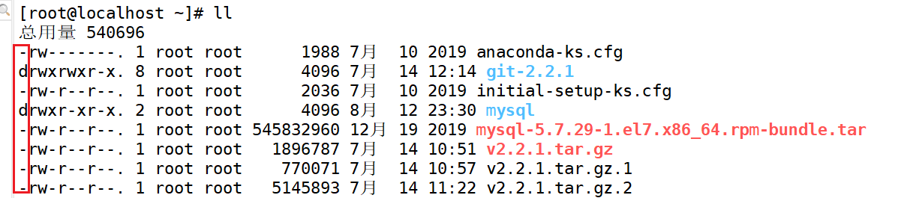

## 1. 常用

### 帮助手册

查看帮助手册：

- `man ls ` 命令详解
- `ls –-help ` 命令参数

### cd目录切换

- `cd ..` 返回上级目录
- `cd /` 返回至 /
- `cd` 返回主目录
- `cd /etc/syscinfig` 绝对路径访问
- `cd ./syscinf` 相对路径访问
- `cd -` 返回上一次所在目录
- `cd ~` 返回home

<br>

## 2. ~文件目录

### pwd

**显示当前目录的绝对路径**（print working directory）

<br>

### ls

**列出目录下所有的子目录和文件。（不包含.开头的文件）**

- `-a` 显示所有文件及目录 (隐藏文件不会列出)
- `-l` 除文件名称外，亦将文件型态、权限、拥有者、文件大小等资讯详细列出
- `-r` 将文件以相反次序显示
- `-t` 将文件依建立时间之先后次序列出
- `-R` 若子目录下有文件，也列出

#### ll [ ls  -l ]

文件夹大小不显示，默认`4kb`

```java
<类型><权限>  <子目录数>  <所属人>  <所属组>  <大小>  <建立时间>  <文件名>
```



- `d`为目录，`-`为文件

> `ll`是`ls -l`的别名，系统默认了`ll`命令的快捷键为`ls -alF`
>
> - `ll`会显示隐藏文件
> - `ls -l`不会显示隐藏文件

#### ll /etc

- `ll /etc` 列出指定目录下的文件
- `ll /etc | grep conf` 列出 - 指定目录下的 - 指定文件（文件名包含的指定内容`conf`）

<br>

### mkdir

`mkdir Java ` 创建新目录

`mkdir -p aa/bb/cc` 创建多级子目录

<br>

### rmdir

`rmdir Java` 删除**空目录**

<br>

### touch

`touch Test.java` 创建文件

<br>

### rm

`rm -rf xxx` <font color =red>斩立决，无提示！递归删除该目录下所有文件</font>

`rm -rf /*`  <font color =red>提示，递归删除更目录下文件</font>

<br>

### cp

`cp` 【要复制的文件】 【到哪里】

`cp -r` 递归复制整个文件夹

`cp -v` 复制过程中显示文件列表

<mv>

### mv

`mv` 【当前目录下文件】【目标区域】文件剪切

`mv /tmp/a /targerFolder`

<br>

### 文件内容查看

**cat**：查看文件内容，文件合并查看

- 适合少量文件内容

`cat 文件名`

-----------------

**more**：查看较长文件内容，空格键翻页

**less**：查看较长文件内容，上下键翻页

**tail**：从尾部开始查看文件，适合**日志查看，可以查看当前最新日志**

- `tail -n20` 查看倒数前20行内容

<br>

### echo

打印信息，区分大小写

- 相当于print，打印环境变量

<br>

## 3. 搜索查找

### find

`find /home/etc -name '*.txt'` 按文件名查找

### locate

建立索引的查询，效率更高

- `updatedb` 先建立索引（临时目录不会建立）

### grep

配合显示内容的命令，指定搜索

`ll /etc | grep xxx`


## 4. 压缩解压缩

压缩包格式`.tar.gz`

### 压缩文件-c

```shell
tar -zcvf XXX.tar.gz n1.txt
```

- `-z` 通过gzip过滤归档
- `-c` 创建新归档
- `-v` 显示详细信息
- `-f` 指定压缩后的文件名

### 解压缩-x

```shell
tar -zxvf XXX.tar.gz n1.txt
```

`zip`文件

```shell
zip package.zip

unzip package.zip
```


## 5.磁盘

**查看分区**

`lsblk`：查看磁盘分区

<br>

**分区**

`fdisk /dec/sdb`  ：将 /dec/sdb 磁盘分区

<br>

**格式化**

`mkfs -t ext4 /dev/sdb`

- ext4是分区类型
- /dev/sdb是磁盘区号

<br>

**查看磁盘使用情况**

`df -h`

<br>

**临时挂载**

【临时挂载，重启失效】

- `mount /dec/sdb /folder` 某个磁盘地址挂载到该文件夹下

- `umount /folder ` 卸载挂载点

<br>

**永久挂载**

- 先修改`etc/fstab `实现挂载
- `mount -a`立即生效


## 6. ~网络 + 进程

### 查看ip

`ifconfig` 

`service network restart` 重启网卡

<br>

### 进程

`ps -aux` 查看进程

`ps -ef | grep xxx` 全格式显示当前所有进程

- UID：用户ID
- PID：进程ID
- PPID：父进程ID

`kill -9 进程id ` 强制杀死进程

`killall name` 杀死指定名称的进程


```shell
lsof -i:8080   查看8080端口占用
```

```shell
netstat -ntlp   //查看当前所有tcp端口
netstat -ntulp | grep 80   //查看所有80端口使用情况
netstat -ntulp | grep 3306   //查看所有3306端口使用情况
```


### 开启服务

`systemctl start 服务名[xxx.service]`

- restart
- stop


## 用户

**用户是否存在** `id username`

**新增用户** `useradd name`

**添加密码** `password xxx`

**查看当前用户名** `who am i`

**删除用户** `userdel`

**用户修改** `usermod`


## 文件权限

### chmod

改变文件或者目录权限


```powershell
drwxr-xr-x. 3 iqqcode iqqcode 30 8月  29 2020 Code
drwxr-xr-x. 2 iqqcode iqqcode  6 8月  29 2020 公共
drwxr-xr-x. 2 iqqcode iqqcode  6 8月  29 2020 模板
drwxr-xr-x. 2 iqqcode iqqcode  6 8月  29 2020 视频
drwxr-xr-x. 2 iqqcode iqqcode  6 8月  29 2020 图片
drwxr-xr-x. 2 iqqcode iqqcode  6 8月  29 2020 文档
drwxr-xr-x. 2 iqqcode iqqcode  6 8月  29 2020 下载
drwxr-xr-x. 2 iqqcode iqqcode  6 8月  29 2020 音乐
drwxr-xr-x. 2 iqqcode iqqcode 65 8月  29 2020 桌面
```

【文件】

- `-r` 查看
- `-w` 修改
- `-x` 执行

【目录】

- `-r` 查看文1件
- `-w` 在文件夹下删除创建
- `-x` 进入目录

**权限修改，通过`+` `-`修改**

```powershell
chmod u=rwx, g=rx, o=x  文件目录名

chmod o+w  文件目录名

chmod a-x  文件目录名
```

> 删除的前提是有写权限

### chgrp

更换所属组