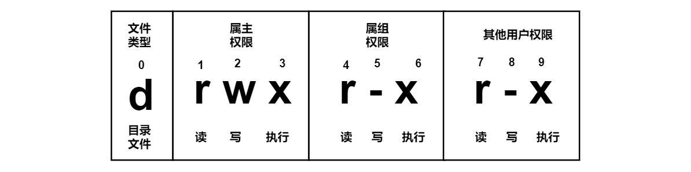

### 用户

**用户是否存在** `id username`

**新增用户** `useradd name`

**添加密码** `password xxx`

**查看当前用户名** `who am i`

**删除用户** `userdel`

**用户修改** `usermod`


### 文件权限

### chmod

改变文件或者目录权限



```powershell
drwxr-xr-x. 3 iqqcode iqqcode 30 8月  29 2020 Code
drwxr-xr-x. 2 iqqcode iqqcode  6 8月  29 2020 公共
drwxr-xr-x. 2 iqqcode iqqcode  6 8月  29 2020 模板
drwxr-xr-x. 2 iqqcode iqqcode  6 8月  29 2020 视频
drwxr-xr-x. 2 iqqcode iqqcode  6 8月  29 2020 图片
drwxr-xr-x. 2 iqqcode iqqcode  6 8月  29 2020 文档
drwxr-xr-x. 2 iqqcode iqqcode  6 8月  29 2020 下载
drwxr-xr-x. 2 iqqcode iqqcode  6 8月  29 2020 音乐
drwxr-xr-x. 2 iqqcode iqqcode 65 8月  29 2020 桌面
```

【文件】

- `-r` 查看
- `-w` 修改
- `-x` 执行

【目录】

- `-r` 查看文1件
- `-w` 在文件夹下删除创建
- `-x` 进入目录

**权限修改，通过`+` `-`修改**

```powershell
chmod u=rwx, g=rx, o=x  文件目录名

chmod o+w  文件目录名

chmod a-x  文件目录名
```

> 删除的前提是有写权限

### chgrp

更换所属组