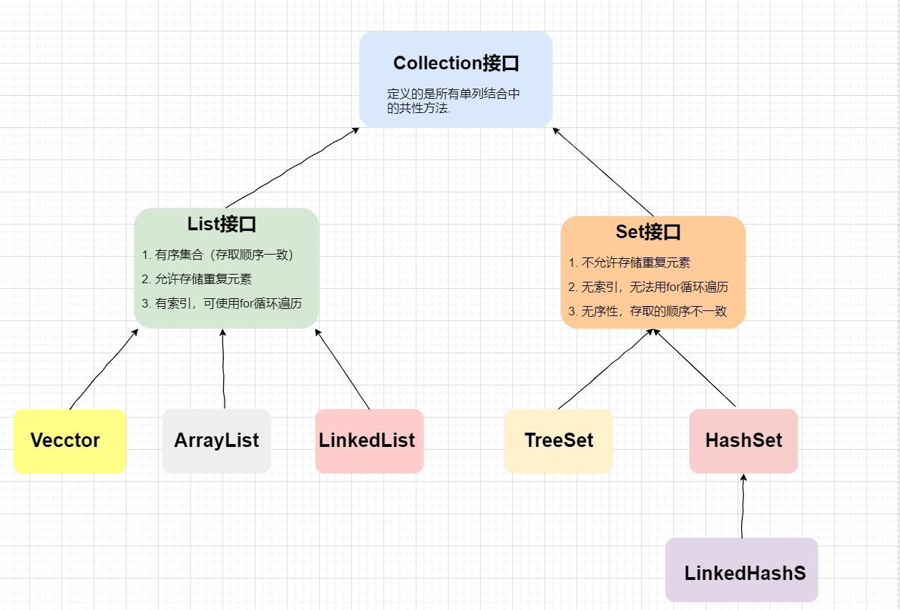

## 1. Java集合类

集合类实际上就属于动态对象数组，在实际开发之中，数组的使用出现的几率并不高，因为数组本身有一个最大的缺陷：数组长度是固定的。由于此问题的存在，从JDK1.2开始，Java为了解决这种数组长度问题，提供了动态的对象数组实现框架--Java集合类框架。Java集合类框架实际上就是Java针对于数据结构的一种实现

## 2. Collection集合

在Java的类集里面(java.util包)提供了两个最为核心的接口：Collection、Map接口。其中Collection接口的操作形式与之前编写链表的操作形式类似，每一次进行数据操作的时候只能够对单个对象进行处理

**Collection是单个集合保存的最大父接口**



Collection共性方法抽取：


## 3. Iterator接口

**迭代：** Collection集合元素的通用获取方式。在取出元素之前先要判断集合中有没有元素，如果有，就把这个元素取出来，继续再判断，如果还有就再继续取出来。一直把集合中的所有元素全部取出，这种取出方式称为迭代。

Iterator接口的常用方法

- `public E next()`：返回迭代的下一个元素

- `public boolean hasnext()`：仍有元素可迭代，返回true

Iterator接口使用

```java
public static void main(String[] args) {
    Collection<String> coll = new ArrayList<>();
    coll.add("Java");
    coll.add("Python");
    coll.add("C++");
    coll.add("GoLang");
    Iterator<String> it = coll.iterator();
    while (it.hasNext()) {
        String msg = it.next();
        System.out.println(msg);
    }
}
```

默认开始之前，`next`指针指向迭代器的-1位置，指向为空；

然后进入循环，指向下一个位置，判断是否有元素；

- 有则取出元素，并且把指针移动到下一位置；

- 没有则退出循环

增强的`for-each`循环专门用来遍历集合（只能进行遍历，不能增删），其实就是迭代器的简化写法

## 4. ArrayList


## 5. LinkedList

## 6. Vector

Vector底层是用数组实现的List，相关的方法都加了`synchronized`同步标记检查，因此“**线程安全，效率低**”。


如何选用 ArrayList、 LinkedList、 Vector？

1. 需要线程安全时，用 Vector

2. 不存在线程安全问题时，并且查找较多用 ArrayList（一般使用它）

3. 不存在线程安全问题时，增加或删除元素较多用 LinkedList
