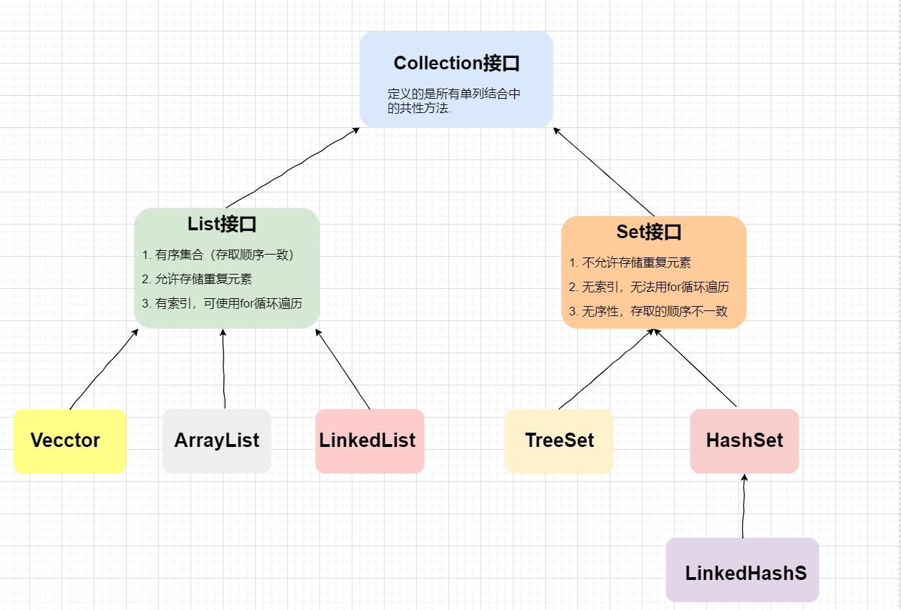

## 1. Set接口



**【特点】**

1. 不允许存储重复元素

2. 无索引，迭代器遍历


HashSet的底层原理，就是简化的HashMap。插入的数据就是放到了HashMap的`key`上，因为hashMap的`key`不允许重复。

### Set中元素存取不一致

Set中元素存入和取出的顺序**不一致**，但**不等于随机性**。在底层根据`hash`值来存入哈希表中

### Set保证元素不重复

**Set集合存储元素不重复的前提：存储的元素必须重写 hashCode方法和equals方法**

Set集合在调用`add()`的时候，`add()`会自动调用`hashCode()`和`equals()`来判断待插入的元素是否重复

- hash值相同，调用equals比较
  
   - equals比较相同，元素重复，不能插入
   
   - equals比较不同，元素不存在，可以插入

- hash值不同，元素不存在，可以插入

【实例说明】


> [a, 重地, 通话]


1. `set.add(s1)` ：add法会调用s1的 hashCode方法计算字符串"a"的哈希值（哈希值是97），在集合中找有没有97这个哈希值的元素，就会把s1存储到集合中

2. `set.add(s2)` ： add方法会调用s2的 hashCode方法计算字符串"a"的哈希值（哈希值是97），在集合中发现有哈希值为97的元素，此时产生了**哈希冲突**。s2会调用 equals方法和哈希值相同的元素进行比较`s2.equals(s1)`，返回true，两个元素的哈希值相同 且equals方法返回true。认定两个元素相同，就不会把s2存储到集合中

3. `set.add("重地")`：add方法会调用"重地"的 hashCode方法计算字符串"重地"的哈希值（哈希值是1179395），在集合中找有没有1179395这个哈希值的元素，把"重地"存到集合中

4. `set.add("通话")`：add方法会调用"通话"的 hashCode方法计算字符串"通话"的哈希值（哈希值是1179395），发现有哈希冲突。"通话"会调用 equals方法和哈希值相同的元素进行比较，`"通话".equals("重地")`，返回 false。两个元素的哈希值相同，equa不同，认定两个元素不同，最终把通话"存储到集合中。

## 2. HashSet

### HashSet特点

**【HashSet特点】**

1. 不允许存储重复元素
2. 没有索引，得用迭代器遍历
3. 是一个无序的集合，存储元素和取出元素顺序可能不一致
4. 底层是一个哈希表结构（查询速度快）
5. **HashSet只是不保证有序，并不是保证无序**

### 覆写equals和hashCode

```java
public static void main(String[] args) {
    Set<Person> set = new HashSet<>();
    Person p1 = new Person("张三", 18);
    Person p2 = new Person("李四", 18);
    set.add(p1);
    set.add(p2);
    set.add(new Person("张三", 18));
    System.out.println("Size: " + set.size()); //覆写之后为2
    System.out.println(set);
}
```

**覆写equals和hashCode方法**

```java
@Override
public boolean equals(Object o) {
    if (o == null) return false;
    if (this == o) return true;
    if (!(o instanceof Person)) return false;
    Person person = (Person) o;
    return name.equals(person.name) && age == person.age;
}

@Override
public int hashCode() {
    int result = name.hashCode();
    result = 31 * result + age;
    return result;
}
```

```java
Size: 2
[Person{name='张三', age=18}, Person{name='李四', age=18}]
```

### HashSet不会对元素排序

```java
Set<Integer> s = new HashSet<Integer>();
s.add(37);
s.add(16);
s.add(4);
s.add(23);
s.add(1);
s.add(6);
s.add(66);
System.out.println(s); //[16, 1, 66, 4, 37, 6, 23]
```

<u>int类型“有序”纯粹是巧合</u>，当HashSet插入整型元素的时候，元素的`hash`值就是它本身

所以，想要确保有序并且集合中无重复元素，用**TreeSet**更稳妥。

通常插入HashSet的是Integer，其`hashCode()`实现就返回int值本身。所以在对象hashCode这一步引入了巧合的“按大小排序”。然后`HashMap.hash(Object)`获取了对象的hashCode()之后会尝试进一步混淆。JDK8版java.util.HashMap内的hash算法比JDK7版的混淆程度低；在[0, 2^32-1]范围内经过HashMap.hash()之后还是得到自己。单纯插入数字则正好落入这个范围内。外加load factor正好在此例中让这个HashMap没有hash冲突，这就导致例中元素正好按大小顺序插入在HashMap的开放式哈希表里。

### 底层实现

**底层实现：**HashSet底层是基于HashMap来实现的（或者范围大一点的说，Set的底层就是基于Map来实现的，TreeSet基于TreeMap）

我们看源码来验证一下：

- 构造方法


- add方法


**哈希值：** 是一个十进制的整数，由系统随机给出（模拟出来的对象的逻辑地址）

**hashCode()：** Object类中的方法（任何对象都能调用），返回该对象的哈希码值

`public native int hashCode()`：本地方法，调用的是操作系统的方法

**哈希表：** HashSet集合存储数据的结构（哈希表）

将元素按照Hash值进行分组，相同Hash值的元素放到一起，提高查询的效率

- JDK 1.8之前是 哈希表 = 数组 + 链表

- JDK 1.8之后是 哈希表 = 数组 + 链表 / 红黑树


## 3. LinkedHashSet

HashSet是一个无序的集合，但是LinkedHashSet是有序的集合，它继承自HashSet

**有序指的是存入和输出的顺序是否一致**

LinkedHashset集合特点：  

- 底层是一个哈希表（数组+链表/红黑树）+ 双向链表

- 多一条**双向链表**（记录元素的存储顺序）保证元素有序


## 4. TreeSet

TreeSet底层实际是用TreeMap实现的，内部维持了—个简化版的TreeMap，通过key来存储Set的元素。

**TreeSet可以按照添加对象的指定属性进行排序**。因此，我们对应的类需要实现**Comparable**接口，这样，才能根据`compareTo`方法比较对象之间的大小，才能进行内部排序。

向TreeSet中添加数据，要求是相同类的对象

两种排序方式：自然排序（实现Comparable接口）、定制排序（Comparater）

- 自然排序：比较两个对象是否相同，`compareTo()`返回0
- 定制排序：比较两个对象是否相同，`compare()`返回0

### Comparable和Comparator接口的区别：

- Comparable相当于“内部比较器”，而Comparator相当于“外部比较器”；

- Comparable接口位于 java.lang包下，Comparator接口位于java.util包下；

- Comparable：内部比较器，一个类如果想要使用`Collections.sort(list) `方法进行排序，则需要实现该接口
- Comparator：外部比较器，用于对那些没有实现Comparable接口或者对已经实现的Comparable中的排序规则不满意，需要再次进行排序，无需改变类的结构，更加灵活