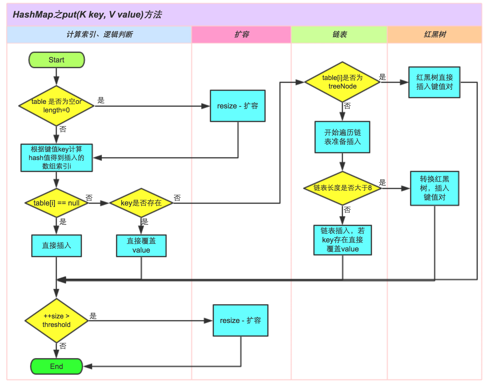

## 1. HashMap原理探究

> https://zhuanlan.zhihu.com/p/45430524

当创建HashMap集合对象的时候：

- 在JDK8 前，构造方法中创建一个一个长度是16的`Entry[] table`用来存储键值对数据的
- 在JDK8后，<u>不是在HashMap的构造方法底层创建数组了</u>，是在**第一次调用**`put`方法时创建的数组，
	`Node[] table`用来存储键值对数据的。

HashMap底层的实现采用了哈希表，哈希表的实现：

- JDK8之 前：数组 + 单向链表

- JDK8之 后：数组 + 单向链表 / 红黑树（链表的长度超过8）

`Node<K,V>[] table`就是HashMap核心的数据结构，也称之为“位桶数组”。

HashMap集合是一个无序的集合，不保证映射的顺序，存储元素和取出元素的顺序有可能不一致。

HashMap内部节点


一个节点类存储了：

- `hasn`：键对象的哈希值

- `key`：键

- `value`：值

- `next`：下一个节点的位置

每一个Node对象就是就是一个单链表结构


然后，我们映射出`Node<K,V>[]`数组的结构（HashMap的结构）：


其实就是在数组中存放一个链表。那数组中是怎么存放的链表呢？`hash`又怎么计算呢？

怎么能通过`key`来找到对应的`value`呢？

我们接着来探讨。

## 2. 添加put

**put过程**



**实现步骤大致如下：**

1. 先通过`hash`值计算出**key**映射到哪个桶；
2. 如果桶上没有碰撞冲突，则直接插入；
3. 如果出现碰撞冲突，则需要处理冲突：
	- 如果该桶使用红黑树处理冲突，则调用红黑树的方法插入数据；
	- 否则采用传统的链式方法插入。如果链的长度达到临界值，则把链转变为红黑树；
4. 如果桶中存在重复的键，则为该键替换新值`value`；
5. 如果`size`大于國值`threshold`，则进行扩容；

`put`方法：

```java
public V put(K key, V value) {
	return putVal(hash(key), key, value, false, true);
}
```


<hr>

### Hash算法

**【提问】：HashMap为什么不直接使用hashCode()处理后的哈希值直接作为table的下标？**

- hashCode产生的hash值太大，与数组长度不匹配

- HashMap自己实现了自己的hash()方法，通过两次扰动使得它自己的哈希值高低位自行进行`^`运算，<u>降低哈希碰撞概率使得数据分布更平均</u>；

**【面试提问】：哈希表层釆用何种算法计算hash值？还有哪些算法可以计算出hash值？**

底层采用的**key**的hashCode方法的值，结合数组长度进行无符号右移`>>>16`、按位异或`^`、按位与`&`，计算出索引。

```java
static final int hash(Object key) {
    int h;
    return (key == null) ? 0 : (h = key.hashCode()) ^ (h >>> 16);
}
```


还可以采用：

- 平方取中法
- 取余数
- 伪随机数法

----------------

### 存入过程

我们的目的是将`key-value`两个对象**成对**存放到 HashMap的Node数组中。**核心就是产生hash值，该值用来对应数组的存储位置**

```java
put(1,"test");
```


**第一步：获取Key对象的hashCode**

调用key对象的`hashCode`方法，获得哈希码

> hashCode是Object类中的对象，所以任何类对象都可以调用

**第二步：计算hsah值**

根据hashCode计算出`hash`值（要求在 [0 ， 数组长度-1] 之间）

hashCode是一个整数，我们需要将它转化成 [0 ， 数组长度-1] 的范围。我们要求转化后的hash值尽量均匀地分布在 [0 ， 数组长度-1] 这个区间，减少**hash冲突**

> hash(哈希)冲突：不同的hashCode转换为hash值时计算出的结果相同

**【hash值的计算】**

I. 极端情况

```java
hash =  hashCode / hashCode;
```

hash值总是1。意味着，键值对对象都会存储到数组索引`1`位置，这样就形成一个非常长的链表。相当于每存储一个对象都会发生“hash冲突”， HashMap也退化成了一个“链表”。


hash值都不相同，退化为长度为N的数组。此时hash成为了数组下标


**所以，我们必须采用折中的算法，让数组的容量不能太大，让链表的长度不能太长。让存储在哈希表中的数据尽量散开均匀分布，提高查询速度。**

—种简单和常用的算法是**相除取余算法**

```java
hash值 = hashCode % 数组长度;
```

这种算法可以让hash值均匀的分布在 [0 ， 数组长度-1] 的区间。早期的Hashtable就是采用这种算法。但是，这种算法由于使用了“除法″，效率低下。

JDK后来改进了算法。首先约定数组长度必须为2的整数幂，这样采用位运算可实现取余的效果：

```java
hash值 = hashCode &(数组长度 - 1);
```

**第三步：生成Node对象**

一个Node对象包含4部分：key对象、 value对象、hash值、指向下一个Node对象的引用。

我们现在算出了hash值，下一个 Entry对象的引用为null

**第四步：将Node对象放到table数组中**

- 如果本Node对象对应的数组索引位置还没有放Node对象，则直接将Node对象存储进数组；
- 如果对应索引位置已经有Node对象，则将已有Node对象的next指向本Node对象，形成链表

-------------

### 链表插入元素

插入：如果`key`相同，`value`会<u>覆盖</u>为最新

**JDK7**

- 数组 + 链表

- 头插法

【头插法的原因】

1. 头插法相对于尾插法，遍历链表的长度平均来说较短，每次不一定全部遍历
2. 根据时间局部性原理，最近插入的最有可能被使用

**JDK8**

- 数组 + 链表 / 红黑树
- 尾插法

------------------

### 解决hash碰撞

当添加一个元素`key-value`时，首先计算`key`的hash值，以此确定插入数组中的位置。但是可能存在同hash值的元素已经被放在数组同一位置了，这时就添加到同一hash值的元素的后面，他们在数组的同一位置，就形成了链表。

同一个链表上的hash值是相同的，所以说数组存放的是链表。

JDK8及之后，当**链表长度大于8时，并且数组长度大于64**（二者必须同时满足）链表就转换为红黑树，这样又大大提高了查找的效率

链表长度小于`6`时，会再次退化为链表


查询复杂度：

- 链表`O(n)`
- 红黑树`O(log n)`

-----------------

### 转化的阈值为什么为8

根据统计学**Poisson-泊松分布**规律，一个桶中链表长度**大于**8个元素的概率为`0.0000006`，几乎为不可能事件。**权衡空间和事件选择阈值为8**

**【自己的理解】**

红黑树的平均查找长度是`log(n)`

- 如果长度为8，平均查找长度为`log(8)=3`；链表的平均查找长度为`n / 2`，当长度为8时，平均查找长度为`8/2=4`，这才有转换成树的必要；
- 链表长度如果是小于等于6，`6/2=3`，而`log(6)=2.6`，虽然速度也很快的，但是转化为树结构和生成树的时间并不会太短

<br>

### 转化为红黑树

**链表长度大于8时，并且数组长度大于64** 

**小于数组长度64时，要2倍 resize()**


<br>

## 3.取出数据get

```java
get(1); //test
```

我们需要通过key对象获得“键值对”对象，进而返回value对象。明白了存储数据过程，取数据就比较简单了，参见以下步骤：

**第一步：获取Key对象的hashCode**

同存储数据一样，获取数据也要先计算hash值。获得key的hashcode，通过Hash散列算法得到hash值，进而定位到数组的位置

**第二步：遍历链表/红黑树**

遍历相同hash的链表，在链表上挨个比较Key对象。调用`equals`方法，将Key对象和链表上所有节点的Key对象进行比较，直到碰到返回true的节点对象为止。

- 先计算hash值定位到存储数据的链表

- 遍历链表，通过`equaks`来确定Key对象，查找到链表上对应的节点

- 返回该节点的`Value`值

**【hashCode和equals方法的关系】**

- equals相同，hashCode一定相同，hash值一定相同；（在同一个链表上）

- hashCode相同，equals不一定相同；（hash冲突）

**总结**

不管是存储数据还是取出数据，都必须先计算hash值，根据哈希值来确定数据在Node[]数组上存放/取出的位置

## 4. 扩容resize

**扩容的目的：** 在达到阈值时，扩容是为了缩短链表/红黑树，散开hash，提高查询效率

HashMap的位桶数组，初始大小为16，若指定容量则寻找最接近的大于等源指定值的**2的幂次方数**。实际使用时，显然大小是可变的。如果位桶数组中的元素达到**阈值**`0.75 * arr.length`，就重新调整数组大小变为原来的`2`倍大小

- 16为初始容量
- 0.75为加载因子

### 初始容量的确定

- **不指定默认为16**

- **指定容量18，寻找32**

HashMap 总是使用**2^n^**作为哈希表的大小，`tableSizeFor`方法保证了 HashMap 总是使用2的幂作为哈希表的大小，保证初始化容量`CAPACITY` **大于等于**其2^n^

- 先将`(CAPACITY - 1) * 2 `  = `D_CAPACITY`

-  移位
- `|`运算

保留`D_CAPACITY`二进制的**最高位**为`1`，其余后面为全为`0`，该数即为初始容量

```java
    /**
     * Returns a power of two size for the given target capacity.
     */
    static final int tableSizeFor(int cap) {
        int n = cap - 1;
        n |= n >>> 1;
        n |= n >>> 2;
        n |= n >>> 4;
        n |= n >>> 8;
        n |= n >>> 16;
        return (n < 0) ? 1 : (n >= MAXIMUM_CAPACITY) ? MAXIMUM_CAPACITY : n + 1;
    }

```

以`18`为例进行演算

```java
18 - 1 == 17
减一是防止2的幂次方数扩容，传入16时变为32
=========================================    
17     0001 0001
>>>1   0000 1000
|      0001 1001
>>>2   0000 0110
|      0001 1111
>>>4   0000 0001
|      0001 1111
>>>8   0000 0000
|      0001 1111
>>>16  0000 0000
|      0001 1111

===========================================       
i - (i >> 1)
       0001 1111
>>>1   0000 1111
--     0001 0000
    
[原始数二进制保留最高位，其余全变为0] 
    
       0001 0000 ------ 16
===========================================    
【最终】
      (18 - 1) * 2 == 34 ---> 32
```

扩容很耗时，扩容的本质是定义新的更大的数组，并将原数组内容拷贝到新数组中

### 为什么是2的幂次方

- 只有当数组长度为2的幂次方时，`hash & (length-1)`才等价于`hash % length`，而`%`运算效率太低，使用位运算来实现key的定位
- 2的幂次方可以减少`hash`冲突次数，提高HashMap的查询效率；

> 如果数组长度不是2的n次幂，容易发生hash碰撞，导致其余数组空间很大程度上并没有存储数据，链表或者红黑树过长，效率降低

### 加载因子loadFactor

**loadFactor怎么计算**

- 存储的元素个数`size`
- 桶数组的长度`capacity`

```java
loadFactor = size / capacity
0.75 =  12 / 16
```

**加载因子为什么为`0.75`?**

根据泊松分布统计学规律，**兼顾了**桶数组的利用率又避免的链表节点太多

- 大于`0.75`：链表挂载的节点太多
- 小于`0.75`：数组使用率低

### 位桶数组2倍扩容

如果位桶数组中的元素达到**阈值**`0.75 * arr.length`，就重新调整数组大小变为原来的`2`倍大小

- 16为初始容量
- 0.75为加载因子
- 创建新数组，2倍扩容，浅拷贝原数组

HashMap在进行扩容时，**不需要重新计算hash值**。`rehash`方式非常巧妙，因为每次扩容都是翻倍，与原来计算的`(n-1)&hash`的结果相比，只是多了一个bit位，所以节点要么就在**原来**的位置，要么就被分配到**原位置+旧容量**这个位置


**<font color = red>【注意】：</font>**

- 扩容并不是直接将数组对应`hash`下的链表直接复制，而是节点逐个移动，*重新计算Hash值*

- **扩容达到缩短链表，散开hash，提高查询效率**的效果


### JDK7多线程扩容下出现的问题

在位桶数组扩容后，数组对应`hash`下的链表`next`指针可能会出现环，循环链表造成死循环

【原因】：

- JDK7扩容采用头插法，导致数据-移动到扩容后的数组顺序发生变化	

## 6. 并发问题

### 问题复现

- 一边遍历`map`，一边修改`map`，出现`ConcurrentModificationException`

```java
public static void main(String[] args) {
    Map<String, String> map = new HashMap<>();
    map.put("1", "1");
    map.put("2", "2");
    map.put("3", "3");
    
    //remove"2"或“3”都会出现 ConcurrentModificationException
    for (String s : map.keySet()) {
        if(s.equals("2")) {
            map.remove(s);
        }
    }
}
```

> 此问题在JDK7、JDK8都会出现

### 原因分析

**读写同步，导致出现并发修改的异常**

- `modCount`计数器记录修改次数

**1. 先put添加元素**


- 每当调用一次`put`或者`remove`等做修改时，`modCount++`，此时`modCount == 2`

- 遍历`map`时会返回`KeySet`的迭代器，构造方法初始化`expectedModCount = modCount`等于2

**2. 遍历，判断remove**

- 调用`map`的`remove()`，`modCount++`，`modCount=3`

- 此时`expectedModCount`没做更新，依然为2，二者不相等
- 因为`expectedModCount`只在初始化迭代器时，构造方法做了赋值

```java
if (modCount != expectedModCount)
    theow new ConcurrentModificationException();
```

<mark>故抛出异常</mark>

### 解决方法

#### 1. 使用ConcurrentHashMap

ConcurrentHashMap保证了安全性

```java
Map<String, String> map = new ConcurrentHashMap<>();
```

#### 2. fail-fast机制

**Hashtable迭代器提供了fail-fast机制**

**快速失败（fail—fast）**是java集合中的一种机制， 在用迭代器遍历一个集合对象时，如果遍历过程中对集合对象的内容进行了修改（增加、删除、修改），则会抛出Concurrent Modification Exception。

**Tip**：**安全失败（fail—safe）**大家也可以了解下，java.util.concurrent包下的容器都是安全失败，可以在多线程下并发使用，并发修改。

迭代器的`remove`同步了`expectedModCount` 和`modCount`


```java
public static void main(String[] args) {
    Map<String, String> map = new HashMap<>();
    //Map<String, String> map = new ConcurrentHashMap<>();
    map.put("1", "1");
    map.put("2", "2");
    map.put("3", "3");

    Iterator var2 = map.keySet().iterator();
    while(var2.hasNext()) {
        String s = (String)var2.next();
        if (s.equals("2")) {
            //调用iterator的remove()
            //map.remove(s);
            var2.remove(); //保证了modCount和exceptedModCount相等
        }
    }
}
```

