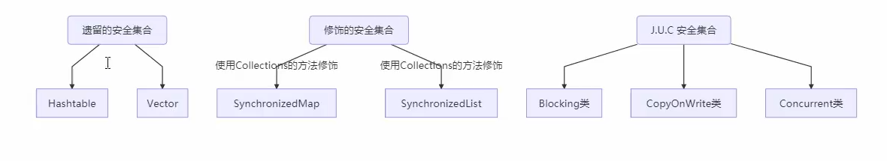
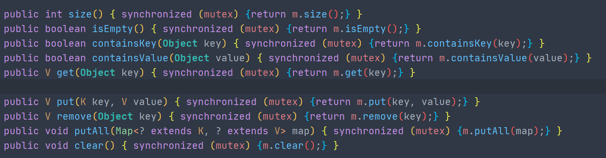
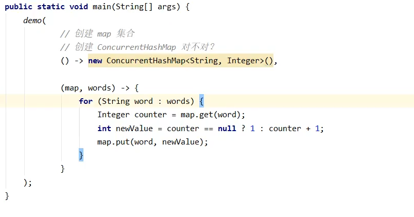

## 线程安全的集合

 

分为三大类：

### 1. 遗留的线程安全集合

- Hashtable
- Vector

### 2. Collections 修饰的线程安全集合

`synchronized`修饰

`metex`即为`this`当前对象

- Collections. synchronizedCollection
- Collections. synchronizedList
- Collections. synchronizedMap
- Collections. synchronizedSet
- Collections. synchronizedNavigableMap
- Collections.synchronizedNavigableSet
- Collections. synchronizedSortedMap
- Collections. synchronizedSortedSet

### 3. JUC包下的集合类

JUC包下的线程安全集合类，包括三大类：Blocking、CopyOnWrite、Concurrent

**Blocking** 基于`Lock`锁实现，提供用来阻塞的方法

**CopyOnWrite**开销大，写时复制，读时共享，适用于读多写少

**Concurrent集合**，使用**CAS优化**，吞吐量高

- **弱一致性**。迭代器便利时，容器发生修改，依然可进行遍历，内容是旧的

遍历时发生了修改，使用**fail-fast**快速失败机制，让便利立刻失效，抛出`ConcurrentModificationException`，不再继续遍历

**使用线程安全的集合类，就一定能保证线程安全吗？**

- 并不是

线程安全的集合类**ConcurrentHashMap**是线程安全的，它的`get`、`put`操作是原子的，但是在同一个方法中**组合起来使用**，就不能保证**线程安全了**

当前**ConcurrentHashMap**就是一份共享资源，多个线程对其进行读取，添加数据。怎么保证线程安全呢？

- 加锁，放入`synchronized`同步块或者同步方法中，效率低
- `computeIfAbsent()`，保证`k-v`的安全性

