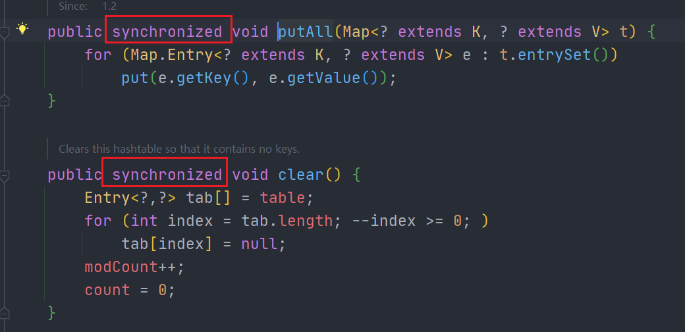
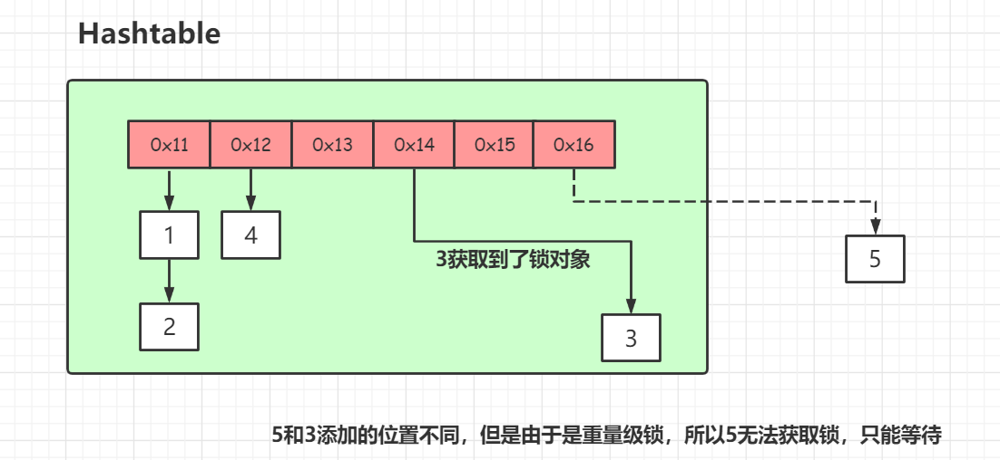

## 1. Hashtable

重量级锁，`synchronized`都是加到了方法上，效率低

5和3添加的位置不同，但是由于是重量级锁，所以5无法获取锁，只能等待

基于这样的效率低的问题，**ConcurrentHashMap**来了

## 2. ConcurrentHashMap分段锁-JDK7实现

**JDK1.7的ConcurrentHashMap：**

**JDK7 ConcurrentHashMap 是由 Segment 数组结构和 HashEntry 数组结构组成**

Segment 实现了 **ReentrantLock**，所以 Segment 是一种可重入锁，扮演锁的角色。HashEntry 用于存储键值对数据。**当对 HashEntry 数组的数据进行修改时，必须首先获得对应的 Segment的锁。**

首先将数据分为一段一段的存储，然后给每一段数据配一把锁，当一个线程占用锁访问其中一个段数据时，其他段的数据也能被其他线程访问。

如果容量大小是16他的并发度就是16，可以同时允许16个线程操作16个Segment而且还是线程安全的。

### put

1. 先定位到Segment，然后再进行put操作
2. 尝试自旋获取。
3. 如果重试的次数达到了 `MAX_SCAN_RETRIES` 则改为阻塞锁获取，保证能获取成功

### get

- get 逻辑比较简单，只需要将 Key 通过 Hash 之后定位到具体的 Segment ，再通过一次 Hash 定位到具体的元素上。

- 由于 HashEntry 中的 value 属性是用 volatile 关键词修饰的，保证了内存可见性，所以每次获取时都是最新值。

- ConcurrentHashMap 的 get 方法是非常高效的，**因为整个过程都不需要加锁**

### 存在的问题

> 虽然可以支持每个Segment并发访问，但是还是存在一些问题？

是的，因为基本上还是数组加链表的方式，我们去查询的时候，还得遍历链表，会导致效率很低，这个跟jdk1.7的HashMap是存在的一样问题，所以他在jdk1.8完全优化了。

## 3. ConcurrentHashMap-JDK8的优化

**JDK1.8的ConcurrentHashMap（TreeBin: 红黑二叉树节点 Node: 链表节点）：**

ConcurrentHashMap取消了Segment分段锁，采用**CAS**和**synchronized**来保证并发安全。

synchronized只锁定当前链表或红黑二叉树的首节点，这样只要hash不冲突，就不会产生并发，效率又提升N倍。

把之前的HashEntry改成了Node，但是作用不变，把值和next采用了`volatile`去修饰，保证了可见性，并且也引入了红黑树，在链表大于一定值的时候会转换（默认是8）。

链表（寻址时间复杂度为O(N)）、红黑树（寻址时间复杂度为O(log(N))）

### put

1. 根据 key 计算出 hashcode 
2. 判断是否需要进行初始化
3. 即为当前 key 定位出的 Node，如果为空表示当前位置可以写入数据，利用 CAS 尝试写入，失败则自旋保证成功
4. 如果当前位置的 `hashcode == MOVED == -1`,则需要进行扩容
5. 如果都不满足，则利用 synchronized 锁写入数据
6. 如果数量大于 `TREEIFY_THRESHOLD` 则要转换为红黑树

### get

- 根据计算出来的 hashcode 寻址，如果就在桶上那么直接返回值。
- 如果是红黑树那就按照树的方式获取值。
- 就不满足那就按照链表的方式遍历获取值。