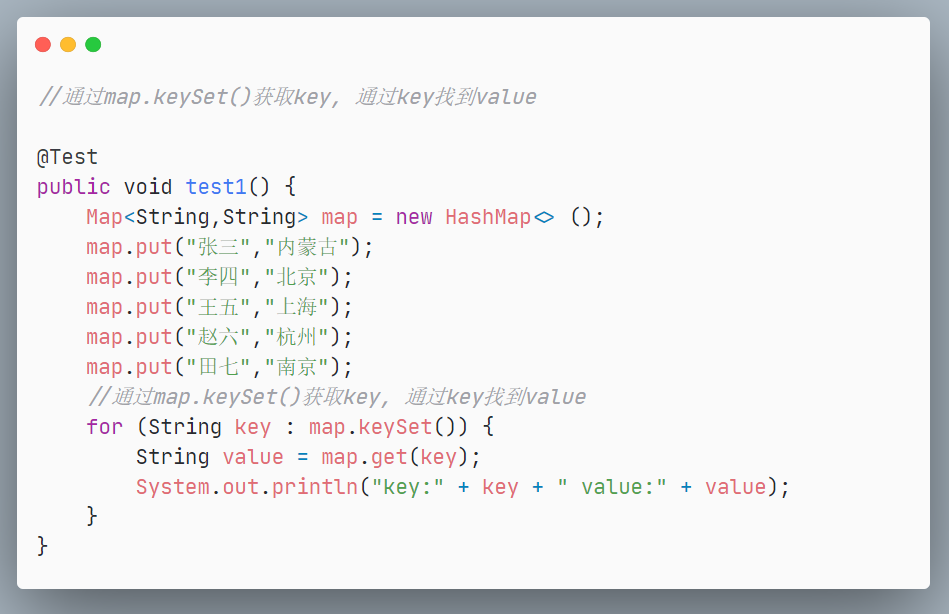
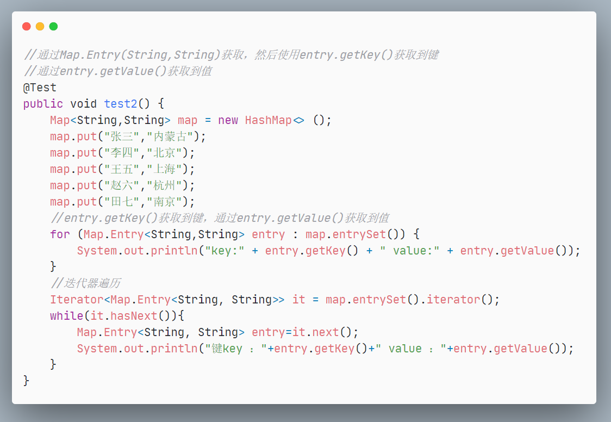
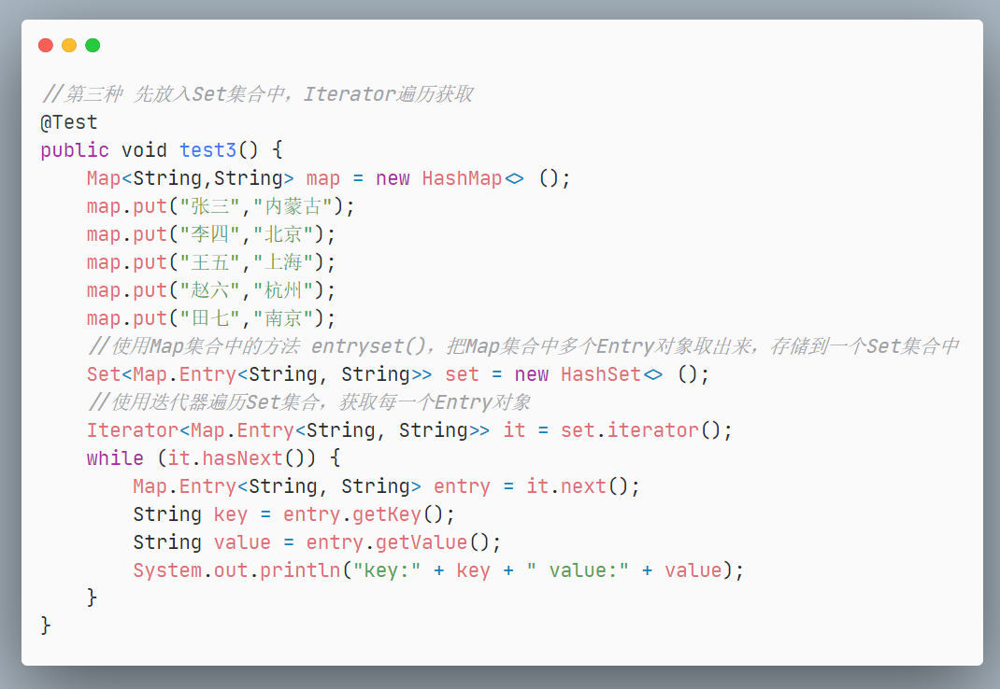
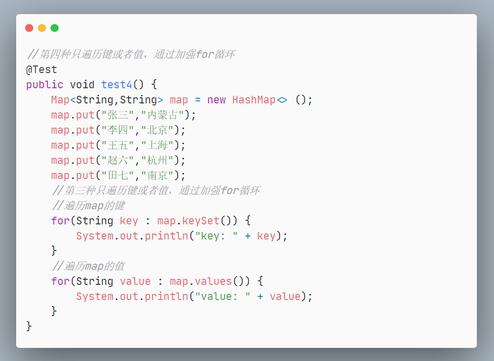
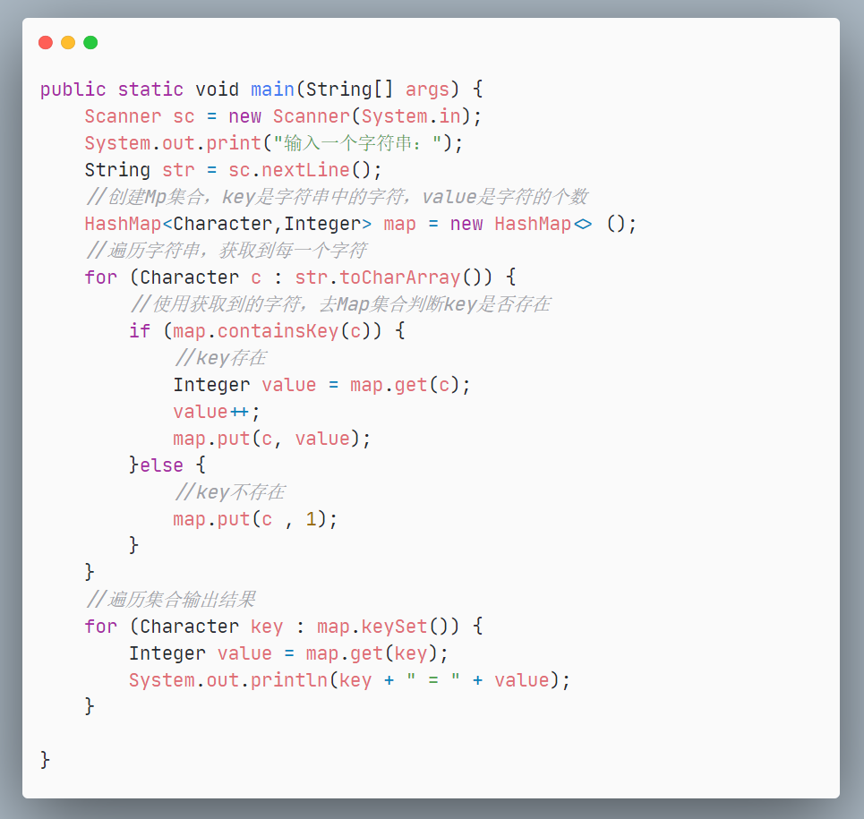

## 1. Set集合遍历

## 2. Map集合遍历

**【方式一】通过map.keySet()获取key，通过key找到value**

**【方式二】通过Map.Entry(String,String)获取，然后使用entry.getKey()获取到键，通过entry.getValue()获取到值**

**【方式三】先放入Set集合中，Iterator遍历获取**

**【方式四】只遍历键或者值，通过加强for循环**

----------------------------------------------------------------------------------

**计算一个字符串中每个字符出现次数**

解题思路：

1. 使用 Scanner获取用户输入的字符串  

2. 创建Map集合，key是字符串中的字符， value是字符的个数  

3. 遍历字符串获取每一个字符  

4. 使用获取到的字符，去Map集合判断key是否存在  

	- key存在：  

		- 通过字符（key），获取vaue（字符个数）  

		- value++  

		- put（key, value）把新的 value存储到Map集合中  

	- key不存在：  

		- put（key, 1）  

5. 遍历Map集合，输出结果

 