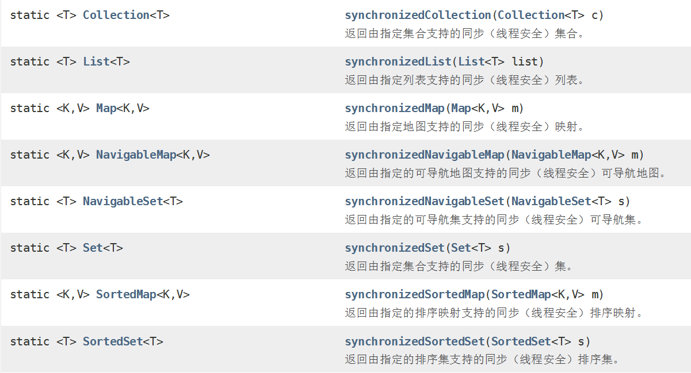

## 1. 解决ArrayList线程不安全

在并发操作下，向ArrayList中存入数据，很可能会产生`ConcurrentModificationException`并发修改异常

```java
public class SafeArrayList {
    public static void main(String[] args) {
        ArrayList<String> list = new ArrayList<>();
        for (int i = 0; i < 10; i++) {
            new Thread(() -> {
                list.add(UUID.randomUUID().toString().substring(0,5));
                System.out.println(list);
            }).start();
        }
    }
}
```


**【方法一】我们先想到到是用Vector来替换ArrayList**

**【方法二】Collections线程安全集合类**

在Collections工具类中，提供了安全的集合类



于是，我们可以用synchronizedList来替换ArrayList，同样是线程安全的集合。

```java
List<String> list = Collections.synchronizedList(new ArrayList<>());
```

**【方法三】JUC包下的CopyOnWriteArrayList**

一个线程安全的变体ArrayList，其中所有可变操作（  `add` ， `set` ，等等）通过对底层数组的最新副本实现。 

```java
List<String> list = new CopyOnWriteArrayList<>();
```

### Vector和CopyOnWriteArrayList区别

那对于Vector和CopyOnWriteArrayList的区别又在哪里捏？

首先，对于Vector来讲，为了保证线程安全，它的方法都加了`synchronized`来修饰，这就必然导致了效率低下。


而CopyOnWriteArrayList采用的是读写分离的模式，并没有采用`synchronized`关键字，用的是Lock锁，效率自然比Vector高


 

------------------

那么，同理我们可以类比Set集合，同样可以用线程安全的集合类来解决（没有与Vector相对应的Set集合）

- Collections.synchronizedSet
- CopyOnWriteSet