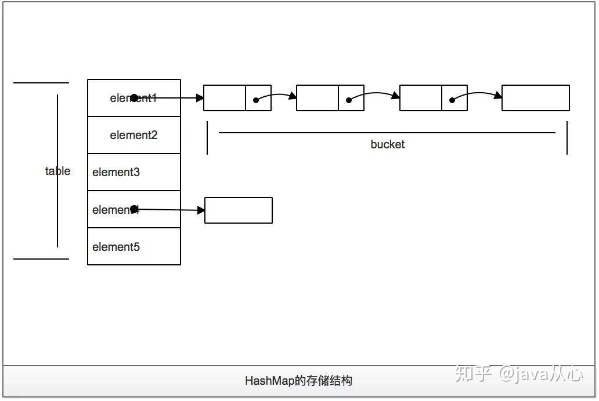
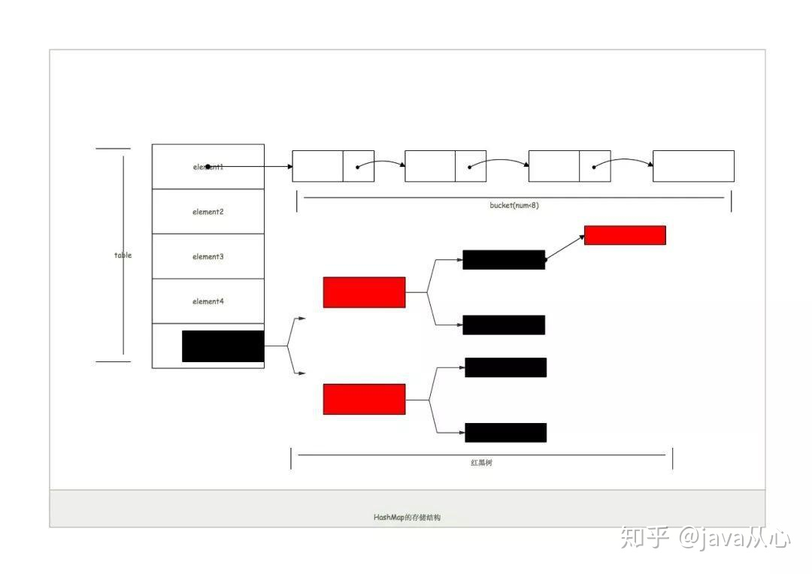
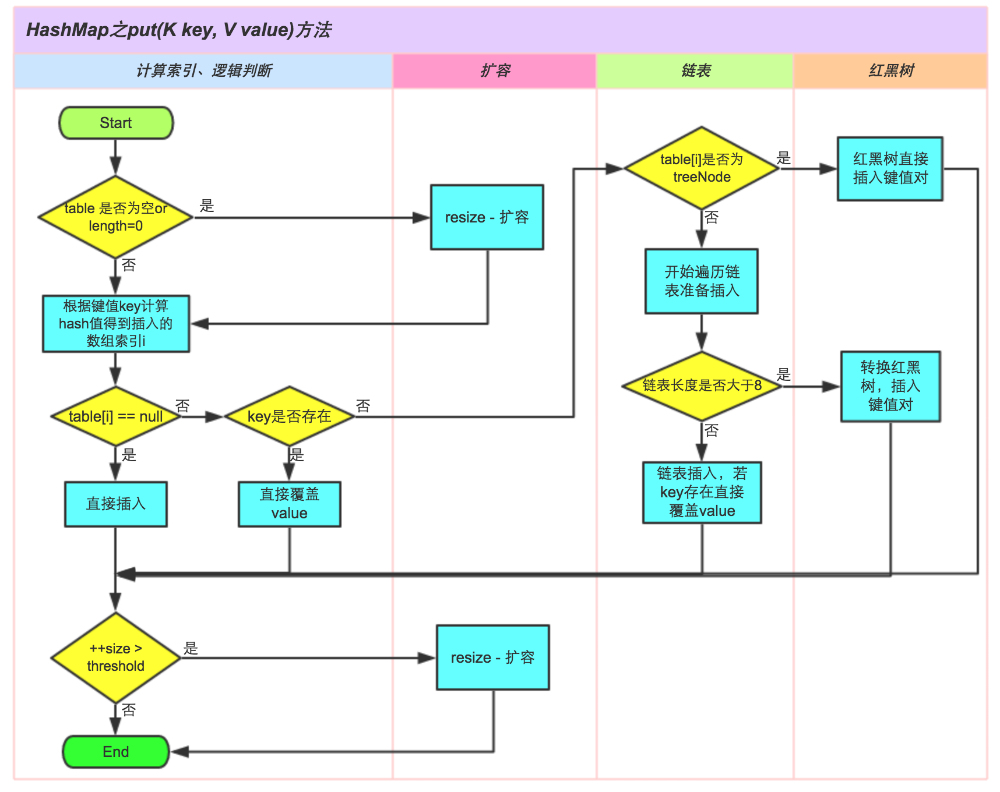
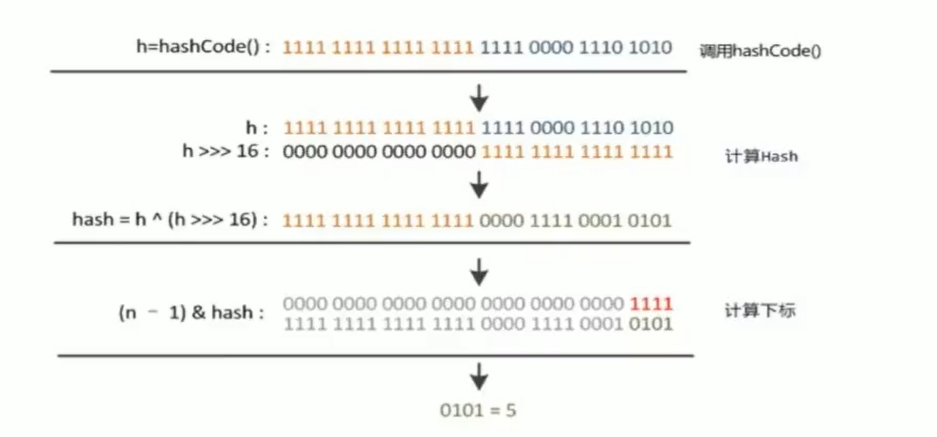
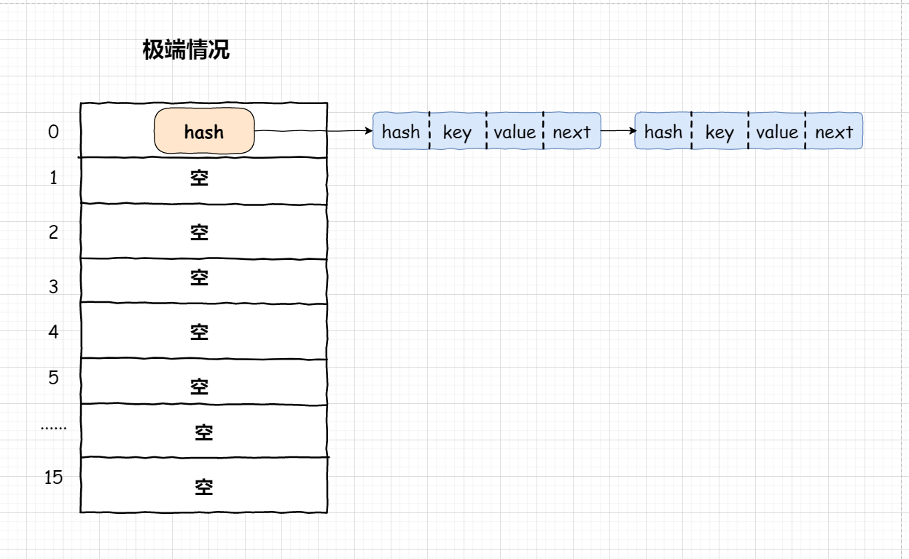
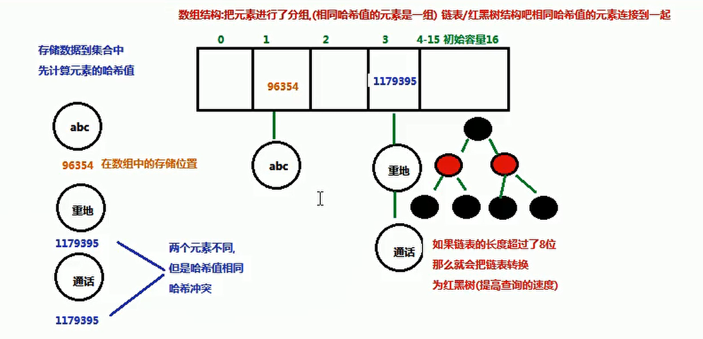
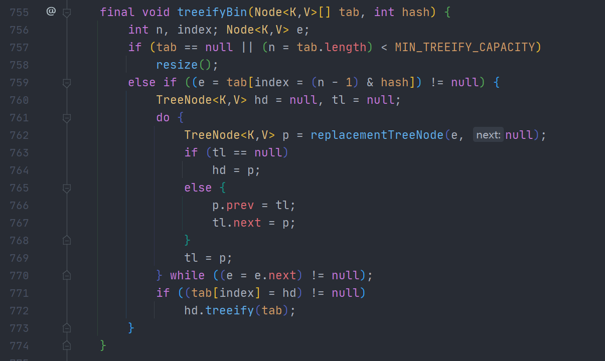

## 1. HashMap原理探究

> https://zhuanlan.zhihu.com/p/45430524

### 版本差别


**1. 底层结构**

JDK-7：数组 + 单向链表

```java
Entry<K,V>[] table;
```



JDK8之 后：数组 + 单向链表 / 红黑树（链表的长度超过8）

```java
Node<K,V>[] table;
```



**2. 扩容机制 - 发生hash冲突时** 

- 在JDK-7，构造方法中创建一个一个长度是16的`Entry[] table`用来存储键值对数据的
- 在JDK8后，<u>不是在HashMap的构造方法底层创建数组了</u>，是在**第一次调用**`put`方法时创建的数组，
	`Node[] table`用来存储键值对数据的

**3. 元素迁移** 

- **JDK7:** 头插法。多线程下产生循环链表 

- **JDK8：**尾插法，先维护一个双向链表方便转红黑树。多线程下会存在元素覆盖问题，造成数据丢失

### 底层探究

`Node<K,V>[] table`就是HashMap核心的数据结构，也称之为“位桶数组”。

HashMap集合是一个无序的集合，不保证映射的顺序，存储元素和取出元素的顺序有可能不一致。

HashMap内部节点


一个节点类存储了：

- `hasn`：键对象的哈希值

- `key`：键

- `value`：值

- `next`：下一个节点的位置

每一个Node对象就是就是一个单链表结构


然后，我们映射出`Node<K,V>[]`数组的结构（HashMap的结构）：


## 2. 构造方法

**【面试提问🎈】为什么我们建议在定义HashMap的时候，就指定它的初始化大小呢？**

1. 在当我们对HashMap初始化时没有设置初始化容量，系统会默认创建一个容量为16的大小的集合。当HashMap的容量 超过了临界值(默认16*0.75=12)时，HashMap将会重新扩容到下一个2的指数幂（16->32）。HashMap扩容将要进行resize的操作，频繁resize，会导致降低性能。
2. HashMap是线程不安全的，它的不安全就体现在resize的时候，多线程的情况下，可能会形成环形链表，导致下一次读取的时候可能会出现死循环。

### 初始容量的确定

- **不指定默认为16**

- **指定容量18，寻找32**

HashMap 总是使用**2^n^**作为哈希表的大小，`tableSizeFor`方法保证了 HashMap 总是使用2的幂作为哈希表的大小，保证初始化容量`CAPACITY` **大于等于**其2^n^

- 先将`(CAPACITY - 1) * 2 `  = `D_CAPACITY`

-  移位
- `|`运算

保留`D_CAPACITY`二进制的**最高位**为`1`，其余后面为全为`0`，该数即为初始容量

```java
    /**
     * Returns a power of two size for the given target capacity.
     */
    static final int tableSizeFor(int cap) {
        int n = cap - 1;
        n |= n >>> 1;
        n |= n >>> 2;
        n |= n >>> 4;
        n |= n >>> 8;
        n |= n >>> 16;
        return (n < 0) ? 1 : (n >= MAXIMUM_CAPACITY) ? MAXIMUM_CAPACITY : n + 1;
    }

```

以`18`为例进行演算

```java
18 - 1 == 17
减一是防止2的幂次方数扩容，传入16时变为32
    
=========================================    
17     0001 0001
>>>1   0000 1000
|      0001 1001
>>>2   0000 0110
|      0001 1111
>>>4   0000 0001
|      0001 1111
>>>8   0000 0000
|      0001 1111
>>>16  0000 0000
|      0001 1111

===========================================       
i - (i >> 1)
       0001 1111
>>>1   0000 1111
--     0001 0000
    
[原始数二进制保留最高位，其余全变为0] 
    
       0001 0000 ------ 16
===========================================    
【最终】
      (18 - 1) * 2 == 34 ---> 32
```

扩容很耗时，扩容的本质是定义新的更大的数组，并将原数组内容拷贝到新数组中

----------------

**存7个元素，初始容量设为几合适？**

- 10合适

我们设置的默认值是7，经过JDK处理之后，HashMap的容量会被设置成8，但是，这个HashMap在元素个数达到 8*0.75 = 6的时候就会进行一次扩容

通过expectedSize / 0.75F + 1.0F计算，7/0.75 + 1 = 10 ,10经过JDK处理之后，会被设置成16，这就大大的减少了扩容的几率

> [HashMap初始化容量设置](https://blog.csdn.net/h363659487/article/details/105706822)

--------------

### 为什么是2的幂次方数

1. **只有当数组长度为2的幂次方时，`hash & (length-1)`才等价于`hash % length`，而`%`运算效率太低，使用位运算来实现key的定位**
2. **2的幂次方可以减少`hash`冲突次数，提高HashMap的桶数组的利用效率；**
3. **扩容后，原数组Node节点的角标迁移，保证只会出现在原来位置会加偏移量，不需要`rehash`提高效率**

> 如果数组长度不是2的n次幂，容易发生hash碰撞，导致其余数组空间很大程度上并没有存储数据，链表或者红黑树过长，效率降低

```java
如果是奇数 ---长度为5;

    00101001001001011111111111100111;
&   00000000000000000000000000000100   ---长度5，参与hash运算的是4;

得到的结果永远是偶数，代表获取的角标永远是偶数，【数组浪费一半】;

-----------------------------------------------------------------
    
如果是偶数，会出现丢失角标位，【部分角标永远没有值】
```


<br>

## 2. 添加put

**put过程**



**实现步骤大致如下：**

1. 先通过`hash`值计算出**key**映射到哪个桶；
2. 如果桶上没有碰撞冲突，则直接插入；
3. 如果出现碰撞冲突，则需要处理冲突：
	- 如果该桶使用红黑树处理冲突，则调用红黑树的方法插入数据；
	- 否则采用传统的链式方法插入。如果链的长度达到临界值，则把链转变为红黑树；
4. 如果桶中存在重复的键，则为该键替换新值`value`；
5. 如果`size`大于國值`threshold`，则进行扩容；

`put`方法：

```java
public V put(K key, V value) {
	return putVal(hash(key), key, value, false, true);
}
```


<hr>

### Hash算法

**【提问】：HashMap为什么不直接使用hashCode()处理后的哈希值直接作为table的下标？**

- hashCode产生的`hash`值太大，与数组长度不匹配
- HashMap自己实现了自己的`hash()`方法，通过两次扰动使得它自己的哈希值高低位自行进行`^`运算，<u>降低哈希碰撞概率使得数据分布更平均</u>；

**还可以采用：**

- 平方取中法
- 取余数
- 伪随机数法

<br>

### 确定桶数组的挂载点

**【面试提问】：哈希表层釆用何种算法计算hash值？还有哪些算法可以计算出hash值？**

底层采用的**key**的hashCode方法的值，结合数组长度进行无符号右移`>>>16`、按位异或`^`、按位与`&`，计算出索引

**根据key求index的过程**

```java
// 先用key求得hash值
static final int hash(Object key) {
    int h;
    return (key == null) ? 0 : (h = key.hashCode()) ^ (h >>> 16);
}

// 利用上述函数求取hash值后 然后（n-1）& hash
int hash = hash(key);
index = (n - 1) & hash;
```

### JDK-8 Hash算法

> 桶数组长度为 n

1. Object类生成key的hashCode`h`
2. `hash = h ^ (h >>> 16)`
4. `(n - 1) & hash`  




`hash = hashcode ^ (hashcode >>> 16)`，让低16位同时包含了高位和低位的信息，在计算下标时，**由于高位和低位的同时参与，减少hash的碰撞**

`(n - 1) & hash`：n - 1 使得低位全为1，高位全为0，位与之后的结果一定在0 ---> n-1范围内

<br>

----------------

### 存入过程

我们的目的是将`key-value`两个对象**成对**存放到 HashMap的Node数组中。**核心就是产生hash值，该值用来对应数组的存储位置**

```java
put(1,"test");
```


**第一步：获取Key对象的hashCode**

调用key对象的`hashCode`方法，获得哈希码

> hashCode是Object类中的对象，所以任何类对象都可以调用

**第二步：计算hsah值**

根据hashCode计算出`hash`值（要求在 [0 ， 数组长度-1] 之间）

hashCode是一个整数，我们需要将它转化成 [0 ， 数组长度-1] 的范围。我们要求转化后的hash值尽量均匀地分布在 [0 ， 数组长度-1] 这个区间，减少**hash冲突**

> hash(哈希)冲突：不同的hashCode转换为hash值时计算出的结果相同

**【hash值的计算】**

I. 极端情况

```java
hash =  hashCode / hashCode;
```

hash值总是1。意味着，键值对对象都会存储到数组索引`1`位置，这样就形成一个非常长的链表。相当于每存储一个对象都会发生“hash冲突”， HashMap也退化成了一个“链表”。



hash值都不相同，退化为长度为N的数组。此时hash成为了数组下标


**所以，我们必须采用折中的算法，让数组的容量不能太大，让链表的长度不能太长。让存储在哈希表中的数据尽量散开均匀分布，提高查询速度。**

—种简单和常用的算法是**相除取余算法**

```java
hash值 = hashCode % 数组长度;
```

这种算法可以让hash值均匀的分布在 [0 ， 数组长度-1] 的区间。早期的Hashtable就是采用这种算法。但是，这种算法由于使用了“除法″，效率低下。

JDK后来改进了算法。首先约定数组长度必须为2的整数幂，这样采用位运算可实现取余的效果：

```java
hash值 = hashCode &(数组长度 - 1);
```

**第三步：生成Node对象**

一个Node对象包含4部分：key对象、 value对象、hash值、指向下一个Node对象的引用。

我们现在算出了hash值，下一个 Entry对象的引用为null

**第四步：将Node对象放到table数组中**

- 如果本Node对象对应的数组索引位置还没有放Node对象，则直接将Node对象存储进数组；
- 如果对应索引位置已经有Node对象，则将已有Node对象的next指向本Node对象，形成链表

-------------

### 链表插入元素

插入：如果`key`相同，`value`会<u>覆盖</u>为最新

**JDK7**

- 数组 + 链表

- 头插法

【头插法的原因】

1. 头插法相对于尾插法，遍历链表的长度平均来说较短，每次不一定全部遍历
2. 根据时间局部性原理，最近插入的最有可能被使用

**JDK8**

- 数组 + 链表 / 红黑树
- 尾插法

------------------

### 解决hash碰撞

当添加一个元素`key-value`时，首先计算`key`的hash值，以此确定插入数组中的位置。但是可能存在同hash值的元素已经被放在数组同一位置了，这时就添加到同一hash值的元素的后面，他们在数组的同一位置，就形成了链表。

同一个链表上的hash值是相同的，所以说数组存放的是链表。

JDK8及之后，当**链表长度大于8时，并且数组长度大于64**（二者必须同时满足）链表就转换为红黑树，这样又大大提高了查找的效率

链表长度小于`6`时，会再次退化为链表



查询复杂度：

- 链表`O(n)`
- 红黑树`O(log n)`

-----------------

### 转化的阈值为什么为8

根据统计学**Poisson-泊松分布**规律，一个桶中链表长度**大于**8个元素的概率为`0.0000006`，几乎为不可能事件。**权衡空间和事件选择阈值为8**

**【自己的理解】**

红黑树的平均查找长度是`log(n)`

- 如果长度为8，平均查找长度为`log(8)=3`；链表的平均查找长度为`n / 2`，当长度为8时，平均查找长度为`8/2=4`，这才有转换成树的必要；
- 链表长度如果是小于等于6，`6/2=3`，而`log(6)=2.6`，虽然速度也很快的，但是转化为树结构和生成树的时间并不会太短

<br>

### 转化为红黑树

先将链表迁移为**双向链表**，双向链表再树化`treeify`

- 双向链表是为了简化红黑树的操作

**链表长度大于8时，并且数组长度大于64** 

**小于数组长度64时，要2倍 resize()**



<br>

## 3.取出数据get

```java
get(1); //test
```

我们需要通过key对象获得“键值对”对象，进而返回value对象。明白了存储数据过程，取数据就比较简单了，参见以下步骤：

**第一步：获取Key对象的hashCode**

同存储数据一样，获取数据也要先计算hash值。获得key的hashcode，通过Hash散列算法得到hash值，进而定位到数组的位置

**第二步：遍历链表/红黑树**

遍历相同hash的链表，在链表上挨个比较Key对象。调用`equals`方法，将Key对象和链表上所有节点的Key对象进行比较，直到碰到返回true的节点对象为止。

- 先计算hash值定位到存储数据的链表

- 遍历链表，通过`equaks`来确定Key对象，查找到链表上对应的节点

- 返回该节点的`Value`值

**【hashCode和equals方法的关系】**

- equals相同，hashCode一定相同，hash值一定相同；（在同一个链表上）

- hashCode相同，equals不一定相同；（hash冲突）

**总结**

不管是存储数据还是取出数据，都必须先计算hash值，根据哈希值来确定数据在Node[]数组上存放/取出的位置

## 4. 扩容resize

**扩容的目的：** 在达到阈值时，扩容是为了缩短链表/红黑树，散开hash，提高查询效率

HashMap的位桶数组，初始大小为16，若指定容量则寻找最接近的大于等源指定值的**2的幂次方数**。实际使用时，显然大小是可变的。如果位桶数组中的元素达到**阈值**`0.75 * arr.length`，就重新调整数组大小变为原来的`2`倍大小

- 16为初始容量
- 0.75为加载因子


### 加载因子loadFactor

**loadFactor怎么计算**

- 存储的元素个数`size`
- 桶数组的长度`capacity`

```java
loadFactor = size / capacity
0.75 =  12 / 16
```

**加载因子为什么为`0.75`?**

根据泊松分布统计学规律，**兼顾了**桶数组的利用率又避免的链表节点太多

- 大于`0.75`：链表挂载的节点太多
- 小于`0.75`：数组使用率低

### 位桶数组2倍扩容

如果位桶数组中的元素达到**阈值**`0.75 * arr.length`，就重新调整数组大小变为原来的`2`倍大小

- 16为初始容量
- 0.75为加载因子
- 创建新数组，2倍扩容，浅拷贝原数组

HashMap在进行扩容时，**不需要重新计算hash值**。`rehash`方式非常巧妙，因为每次扩容都是翻倍，与原来计算的`(n-1)&hash`结果相比，只是多了一个bit位，所以节点要么就在**原来**的位置，要么就被分配到**原位置+旧容量**这个位置


**<font color = red>【注意】：</font>**

- 扩容并不是直接将数组对应`hash`下的链表直接复制，而是节点逐个移动，*重新计算Hash值*

- **扩容达到缩短链表，散开hash，提高查询效率**的效果


### JDK7多线程扩容下出现的问题

在位桶数组扩容后，数组对应`hash`下的链表`next`指针可能会出现环，循环链表造成死循环

【原因】：

- JDK7扩容采用头插法，导致数据-移动到扩容后的数组顺序发生变化	

<br>

## 5. 删除remove

- 若为树，查找为`O(logn)`
- 若为链表，查找为`O(n)`

<br>

## 6. 并发问题

### 问题复现

- 一边遍历`map`，一边修改`map`，出现`ConcurrentModificationException`

```java
public static void main(String[] args) {
    Map<String, String> map = new HashMap<>();
    map.put("1", "1");
    map.put("2", "2");
    map.put("3", "3");
    
    //remove"2"或“3”都会出现 ConcurrentModificationException
    for (String s : map.keySet()) {
        if(s.equals("2")) {
            map.remove(s);
        }
    }
}
```

> 此问题在JDK7、JDK8都会出现

### 原因分析

**读写同步，导致出现并发修改的异常**

- `modCount`计数器记录修改次数

**1. 先put添加元素**


- 每当调用一次`put`或者`remove`等做修改时，`modCount++`，此时`modCount == 2`

- 遍历`map`时会返回`KeySet`的迭代器，构造方法初始化`expectedModCount = modCount`等于2

**2. 遍历，判断remove**

- 调用`map`的`remove()`，`modCount++`，`modCount=3`

- 此时`expectedModCount`没做更新，依然为2，二者不相等
- 因为`expectedModCount`只在初始化迭代器时，构造方法做了赋值

```java
if (modCount != expectedModCount)
    theow new ConcurrentModificationException();
```

<mark>故抛出异常</mark>

### 解决方法

#### 使用ConcurrentHashMap

ConcurrentHashMap保证了安全性

```java
Map<String, String> map = new ConcurrentHashMap<>();
```

## 7. JDK7多线程下扩容产生循环链表

> 究其原因，是因为在多线程环境下使用了非线程安全的Map集合

**【JDK-7成环】**

**transfer函数：** 扩容后的元素迁移

**transfer()**方法`newTable[i] = e`处，线程1完成元素迁移，线程2在执行时链表尾结点又指向了头结点(**头插**)，产生循环链表

HashMap之所以在并发下的扩容造成死循环，是因为，多个线程并发进行时，因为一个线程先期完成了扩容，将原的链表重新散列到自己的表中，并且链表变成了倒序，后一个线程再扩容时，又进行自己的散列，再次将倒序链表变为正序链表。于是形成了一个环形链表，当表中不存在的元素时，造成死循环。

> [HashMap中的"致命错误"：循环链表](https://zhuanlan.zhihu.com/p/132834837)
>
> [1.7中HashMap死循环分析](https://www.jianshu.com/p/a105a7917d6f)

---------------

<font color = red>**JDK 7**</font>的头插法，在多线程场景下会产生**循环链表**，最终出现OOM

**【JDK-8扩容丢失】**

**JDK 8 **改为了`尾插 / 红黑树`，不会出现循环链表


JDK8 虽然将扩容给为尾插，但仍不能够安全扩容，会出现**扩容丢数据**的问题，即**角标元素覆盖**

  