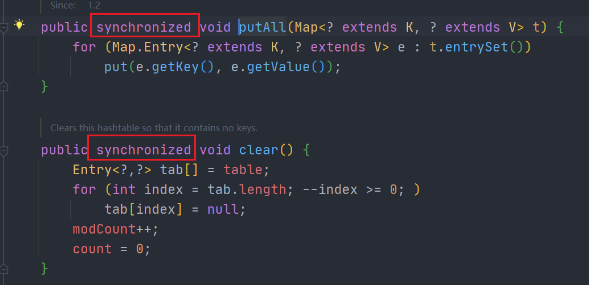
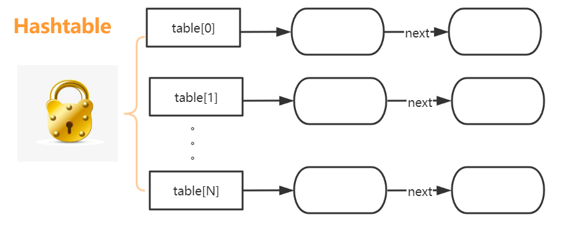
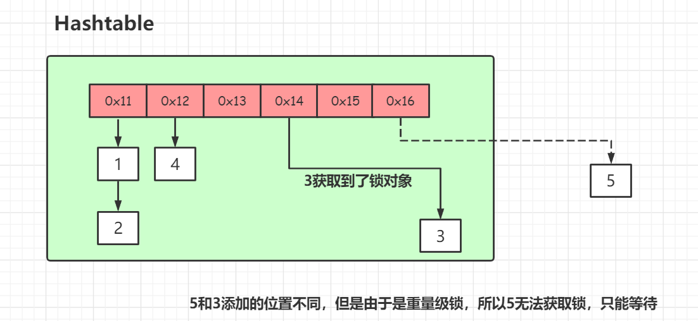
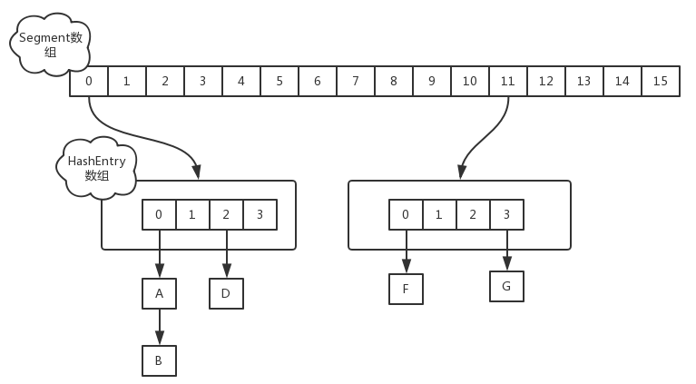
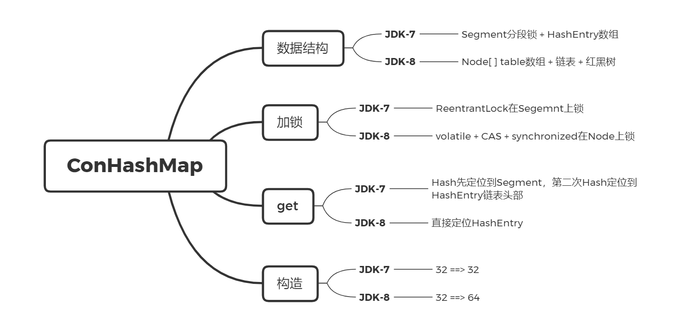
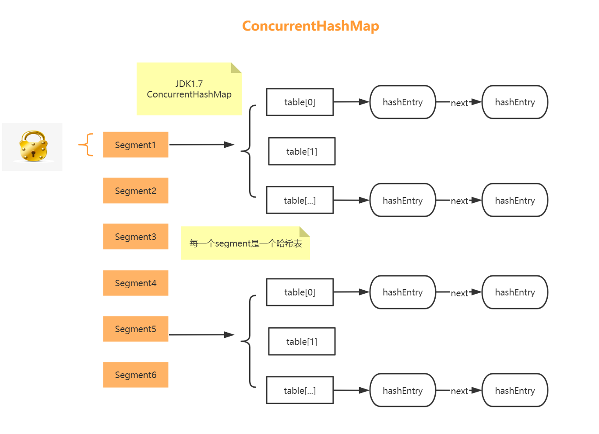
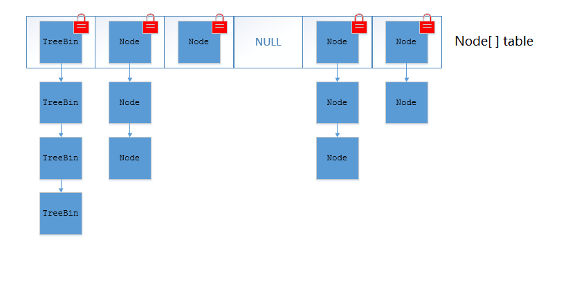
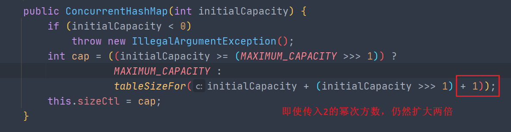

## 1. Hashtable

重量级锁，`synchronized`都是加到了方法上，效率低







5和3添加的位置不同，但是由于是重量级锁，所以5无法获取锁，只能等待

- HashTable不允许`key`和`value`为null
- ConcurrentHashMap不允许`key`和`value`为null
- **HashTable是线程安全的**

<br>

基于这样的效率低的问题，**ConcurrentHashMap**来了。

主要就是为了应对HashMap在并发环境下不安全而诞生的，ConcurrentHashMap的设计与实现非常精巧，大量的利用了`volatile`，`final`，**CAS**等**lock-free**技术来减少锁竞争对于性能的影响。

**ConcurrentHashMap避免了对全局加锁改成了局部加锁操作**，这样就极大地提高了并发环境下的操作速度，由于ConcurrentHashMap在JDK1.7和1.8中的实现非常不同，接下来我们谈谈JDK在1.7和1.8中的区别。


## 2. Hashtable与ConcurrentHashMap对比

- **实现方式不同**：Hashtable 继承了 Dictionary类，而 HashMap 继承的是 AbstractMap 类。

- **初始化容量不同**：HashMap 的初始容量为：16，Hashtable 初始容量为：11，两者的负载因子默认都是：0.75。

- **扩容机制不同**：当现有容量大于总容量 * 负载因子时，HashMap 扩容规则为当前容量翻倍，Hashtable 扩容规则为当前容量翻倍 + 1。

- **迭代器不同**：HashMap 中的 Iterator 迭代器是 **fail-fast** 的，而 Hashtable 的 Enumerator 不是 fail-fast 的。

	所以，当其他线程改变了HashMap 的结构，如：增加、删除元素，将会抛出`ConcurrentModificationException` 异常，而 Hashtable 则不会。

<br>

## 3. fail-fast机制

**Hashtable迭代器提供了fail-fast机制**

**快速失败（fail—fast）**是java集合中的一种机制， 在用迭代器遍历一个集合对象时，如果遍历过程中对集合对象的内容进行了修改（增加、删除、修改），则会抛出`Concurrent Modification Exception`

---------

迭代器在遍历时直接访问集合中的内容，并且在遍历过程中使用一个 `modCount `变量，集合在被遍历期间如果内容发生变化，就会改变`modCount`的值。

每当迭代器使用**hashNext()/next()**遍历下一个元素之前，都会检测`modCount`变量是否等于`expectedmodCount`值，是的话就返回遍历；否则抛出异常，终止遍历。

迭代器的`remove`同步了`expectedModCount` 和`modCount`


```java
public static void main(String[] args) {
    Map<String, String> map = new HashMap<>();
    //Map<String, String> map = new ConcurrentHashMap<>();
    map.put("1", "1");
    map.put("2", "2");
    map.put("3", "3");

    Iterator var2 = map.keySet().iterator();
    while(var2.hasNext()) {
        String s = (String)var2.next();
        if (s.equals("2")) {
            //调用iterator的remove()
            //map.remove(s);
            var2.remove(); //保证了modCount和exceptedModCount相等
        }
    }
}
```

> **Tip**：**安全失败（fail—safe）**java.util.concurrent包下的容器都是安全失败，可以在多线程下并发使用，并发修改。

**JDK-7**



**JDK-8**




## 4. 【JDK7-分段锁】

JDK-7 ConcurrentHashMap 是由：

 **Segment分段锁🔒 + HashEntry数组** 组成

- Segment 实现了 **ReentrantLock**可重入锁保证线程安全

- HashEntry 用于存储键值对数据。**当对 HashEntry 数组的数据进行修改时，必须首先获得对应的 Segment的锁。**


首先将数据分为一段一段的存储，然后给每一段数据配一把锁，当一个线程占用锁访问其中一个段数据时，其他段的数据也能被其他线程访问。



### put

1. 先定位到Segment，然后再进行put操作
2. 如果获取失败肯定就有其他线程存在竞争，则利用 `scanAndLockForPut()` **自旋获取锁**
3. 如果重试的次数达到了 `MAX_SCAN_RETRIES` 则改为**阻塞锁获取**，保证能获取成功

### get

ConcurrentHashMap定位一个元素的过程需要进行**两次Hash**操作

- 第一次将 Key 通过 Hash 之后定位到具体的 Segment
- 第二次Hash定位到元素所在的**链表的头部**


### 该结构的优劣势

**【坏处】**

- 遍历链表效率很低

- 这一种结构的带来的副作用是Hash的过程要比普通的HashMap要长

**【好处】**

由于 HashEntry 中的 value 属性是用 `volatile `关键词修饰的，保证了内存可见性，所以每次获取时都是最新值

ConcurrentHashMap 的 get 方法是非常高效的，**因为整个过程都不需要加锁**

如果容量大小是16，他的并发度就是16，可以同时允许16个线程操作16个Segment而且还是线程安全的

所以，通过这一种结构，ConcurrentHashMap的并发能力可以大大的提高。

<br>

## 5. 【JDK8的优化】

JDK-8的ConcurrentHashMap

**Node[ ] table数组 + 链表 + 红黑树**

- **CAS + synchronized保证Node数组的线程安全**
- **Node：保存key，value及key的hash值。其中value和next都用volatile修饰，保证并发的可见性**



**与HashMap很类似**


`synchronized`只锁定当前链表或红黑二叉树的**首节点**，这样只要`hash`不冲突，就不会产生并发，效率又提升N倍。

把之前的HashEntry改成了**Node**，但是作用不变，把值和next采用了`volatile`去修饰，保证了可见性，并且也引入了红黑树，在链表大于一定值的时候会转换（默认是8）

```java
class Node<K,V> implements Map.Entry<K,V> {
    final int hash;
    final K key;
    volatile V val;
    volatile Node<K,V> next;
    //... 省略部分代码
} 
```

链表（寻址时间复杂度为O(N)）、红黑树（寻址时间复杂度为O(log(N))）

### put

1. 根据 key 计算出 hashcode 
2. 判断是否需要进行初始化
3. 当前 key 定位出 Node，如果为空表示当前位置可以写入数据，利用 CAS 尝试写入，失败则自旋保证成功
4. 如果当前位置的 `hashcode == MOVED == -1`，则需要进行扩容
5. 如果都不满足，则利用 **synchronized **锁写入数据
6. 如果数量大于 `TREEIFY_THRESHOLD` ，则要转换为红黑树

### 锁升级过程

针对 synchronized 获取锁的方式，JVM 使用了锁升级的优化方式。

1. 先使用**偏向锁**，优先同一线程获取
2. 如果失败，就升级为 **CAS 轻量级锁**
3. 如果失败就会短暂**自旋**，防止线程被系统挂起。
4. 最后如果以上都失败就升级为**重量级锁**。

### get

- 根据计算出来的 hashcode 寻址，如果就在桶上那么直接返回值
- 如果是红黑树那就按照树的方式获取值
- 就不满足那就按照链表的方式遍历获取值

## 5. 构造参数

**依然是2的幂次方数**

如默认传入32

- JDK-7，`capacity = 32`
- JDK8，`capacity = 64`



## 6. ConcurrentHashMap总结

JDK-7版本的**ReentrantLock + Segment + HashEntry**

JDK-8版本中**synchronized + CAS + HashEntry + 红黑树**

**1. 数据结构**：取消了Segment分段锁的数据结构，取而代之的是数组+链表+红黑树的结构。

**2. 保证线程安全机制**：JDK1.7采用segment的分段锁机制实现线程安全，其中segment继承自ReentrantLock。JDK1.8采用CAS+Synchronized保证线程安全。

**3. 锁的粒度**：原来是对需要进行数据操作的Segment加锁，现调整为对每个数组元素加锁（Node）。

**4. 链表转化为红黑树**:定位结点的hash算法简化会带来弊端,Hash冲突加剧,因此在链表节点数量大于8时，会将链表转化为红黑树进行存储。

**5. 查询时间复杂度**：从原来的遍历链表O(n)，变成遍历红黑树O(logN)。