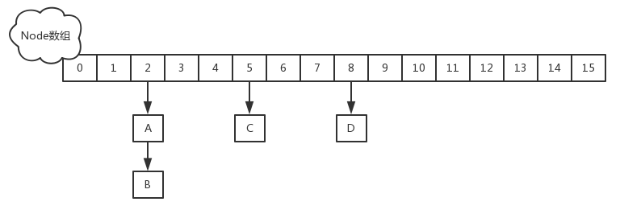
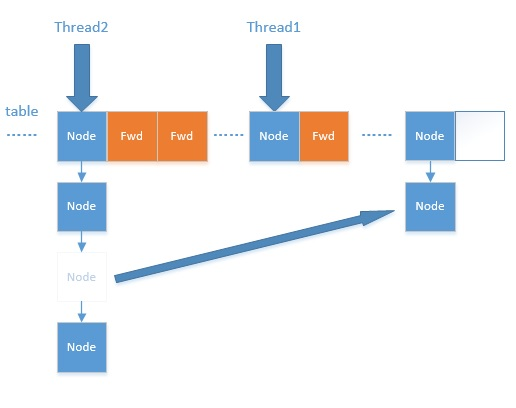

📚搭配实用[**ConcurrentHashMap1.8 - 扩容详解**](https://blog.csdn.net/ZOKEKAI/article/details/90051567?utm_medium=distribute.pc_relevant.none-task-blog-BlogCommendFromMachineLearnPai2-1.channel_param&depth_1-utm_source=distribute.pc_relevant.none-task-blog-BlogCommendFromMachineLearnPai2-1.channel_param)

## 常见问题

- 谈谈你理解的 Hashtable，讲讲其中的 get put 过程。ConcurrentHashMap同问。

- 1.8 做了什么优化？

- 线程安全怎么做的？

- 不安全会导致哪些问题？

- 如何解决？有没有线程安全的并发容器？

- ConcurrentHashMap 是如何实现的？

- ConcurrentHashMap并发度为啥好这么多？

- 1.7、1.8 实现有何不同？为什么这么做？

- CAS是啥？

- ABA是啥？场景有哪些，怎么解决？

- synchronized底层原理是啥？

- synchronized锁升级策略

- 快速失败（fail—fast）是啥，应用场景有哪些？安全失败（fail—safe）


## 1. 前言

 ConcurrentHashMap 与HashMap和Hashtable 最大的不同在于：put和 get 两次Hash到达指定的HashEntry，第一次hash到达Segment,第二次到达Segment里面的Entry,然后在遍历entry链表

(1) 从1.7到1.8版本，由于HashEntry从链表 变成了红黑树所以 concurrentHashMap的时间复杂度从O(n)到O(log(n))

(2)  HashEntry最小的容量为2

(3)Segment的初始化容量是16;

(4)HashEntry在1.8中称为Node,链表转红黑树的值是8 ,当Node链表的节点数大于8时Node会自动转化为TreeNode,会转换成红黑树的结构

## 2. 总结与思考

其实可以看出JDK1.8版本的ConcurrentHashMap的数据结构已经接近HashMap，相对而言，ConcurrentHashMap只是增加了同步的操作来控制并发，从JDK1.7版本的ReentrantLock+Segment+HashEntry，到JDK1.8版本中synchronized+CAS+HashEntry+红黑树,相对而言，总结如下思考

1. JDK1.8的实现降低锁的粒度，JDK1.7版本锁的粒度是基于Segment的，包含多个HashEntry，而JDK1.8锁的粒度就是HashEntry（首节点）
2. JDK1.8版本的数据结构变得更加简单，使得操作也更加清晰流畅，因为已经使用synchronized来进行同步，所以不需要分段锁的概念，也就不需要Segment这种数据结构了，由于粒度的降低，实现的复杂度也增加了
3. JDK1.8使用红黑树来优化链表，基于长度很长的链表的遍历是一个很漫长的过程，而红黑树的遍历效率是很快的，代替一定阈值的链表，这样形成一个最佳拍档
4. JDK1.8为什么使用内置锁synchronized来代替重入锁ReentrantLock，我觉得有以下几点
	1. 因为粒度降低了，在相对而言的低粒度加锁方式，synchronized并不比ReentrantLock差，在粗粒度加锁中ReentrantLock可能通过Condition来控制各个低粒度的边界，更加的灵活，而在低粒度中，Condition的优势就没有了
	2. JVM的开发团队从来都没有放弃synchronized，而且基于JVM的synchronized优化空间更大，使用内嵌的关键字比使用API更加自然
	3. 在大量的数据操作下，对于JVM的内存压力，基于API的ReentrantLock会开销更多的内存，虽然不是瓶颈，但是也是一个选择依据

以前写过介绍HashMap的文章，文中提到过HashMap在put的时候，插入的元素超过了容量（由负载因子决定）的范围就会触发扩容操作，就是rehash，这个会重新将原数组的内容重新hash到新的扩容数组中，在多线程的环境下，存在同时其他的元素也在进行put操作，如果hash值相同，可能出现同时在同一数组下用链表表示，造成闭环，导致在get时会出现死循环，所以HashMap是线程不安全的。

我们来了解另一个键值存储集合HashTable，它是线程安全的，它在所有涉及到多线程操作的都加上了synchronized关键字来锁住整个table，这就意味着所有的线程都在竞争一把锁，在多线程的环境下，它是安全的，但是无疑是效率低下的。

其实HashTable有很多的优化空间，锁住整个table这么粗暴的方法可以变相的柔和点，比如在多线程的环境下，对不同的数据集进行操作时其实根本就不需要去竞争一个锁，因为他们不同hash值，不会因为rehash造成线程不安全，所以互不影响，这就是锁分离技术，将锁的粒度降低，利用多个锁来控制多个小的table，这就是这篇文章的主角ConcurrentHashMap JDK1.7版本的核心思想

## 1.7实现

在JDK1.7版本中，ConcurrentHashMap的数据结构是由一个Segment数组和多个HashEntry组成，如下图所示：

 

Segment数组的意义就是将一个大的table分割成多个小的table来进行加锁，也就是上面的提到的锁分离技术，而每一个Segment元素存储的是HashEntry数组+链表，这个和HashMap的数据存储结构一样

#### 初始化

ConcurrentHashMap的初始化是会通过位与运算来初始化Segment的大小，用ssize来表示，源码如下所示 

```
private static final int DEFAULT_CONCURRENCY_LEVEL = 16;
private void writeObject(java.io.ObjectOutputStream s)
        throws java.io.IOException {
        // For serialization compatibility
        // Emulate segment calculation from previous version of this class
        int sshift = 0;
        int ssize = 1;
        while (ssize < DEFAULT_CONCURRENCY_LEVEL) {
            ++sshift;
            ssize <<= 1;
        }
        int segmentShift = 32 - sshift;
        int segmentMask = ssize - 1;
```

由此可以看出：因为ssize用位于运算来计算（`ssize <<=1`），所以Segment的大小取值都是以2的N次方，无关concurrencyLevel的取值，当然concurrencyLevel最大只能用16位的二进制来表示，即65536，换句话说，Segment的大小最多65536个，没有指定concurrencyLevel元素初始化，**Segment的大小ssize默认为** DEFAULT_CONCURRENCY_LEVEL =**16(阿里面试官曾问过)** 

 

每一个Segment元素下的HashEntry的初始化也是按照位于运算来计算，用cap来表示，如下：

```
int cap = 1;
while (cap < c)
    cap <<= 1
```

如上所示，HashEntry大小的计算也是2的N次方（cap <<=1）， cap的初始值为1，所以HashEntry最小的容量为2

#### put操作

对于ConcurrentHashMap的数据插入，这里要**进行两次Hash**去定位数据的存储位置

```
   static class Segment<K,V> extends ReentrantLock implements Serializable {
        private static final long serialVersionUID = 2249069246763182397L;
        final float loadFactor;
        Segment(float lf) { this.loadFactor = lf; }
    }
```

 

从上Segment的继承体系可以看出，Segment实现了ReentrantLock,也就带有锁的功能，当执行put操作时，会进行第一次key的hash来定位Segment的位置，如果该Segment还没有初始化，即通过CAS操作进行赋值，然后进行第二次hash操作，找到相应的HashEntry的位置，这里会利用继承过来的锁的特性，在将数据插入指定的HashEntry位置时（链表的尾端），会通过继承ReentrantLock的tryLock（）方法尝试去获取锁，如果获取成功就直接插入相应的位置，如果已经有线程获取该Segment的锁，那当前线程会以**自旋的方式(如果不了解自旋锁，请参考：**[自旋锁原理及java自旋锁](http://www.cnblogs.com/aspirant/p/8746255.html)**)**去继续的调用tryLock（）方法去获取锁，超过指定次数就挂起，等待唤醒（美团面试官问道的，多个线程一起put时候，currentHashMap如何操作）

#### get操作

ConcurrentHashMap的get操作跟HashMap类似，只是ConcurrentHashMap第一次需要经过一次hash定位到Segment的位置，然后再hash定位到指定的HashEntry，遍历该HashEntry下的链表进行对比，成功就返回，不成功就返回null

#### size操作

计算ConcurrentHashMap的元素大小是一个有趣的问题，因为他是并发操作的，就是在你计算size的时候，他还在并发的插入数据，可能会导致你计算出来的size和你实际的size有相差（在你return size的时候，插入了多个数据），要解决这个问题，JDK1.7版本用两种方案

```
try {
    for (;;) {
        if (retries++ == RETRIES_BEFORE_LOCK) {
            for (int j = 0; j < segments.length; ++j) ensureSegment(j).lock(); // force creation
        }
        sum = 0L;
        size = 0;
        overflow = false;
        for (int j = 0; j < segments.length; ++j) {
            Segment<K,V> seg = segmentAt(segments, j);
            if (seg != null) { sum += seg.modCount; int c = seg.count; if (c < 0 || (size += c) < 0)
               overflow = true;
            } }
        if (sum == last) break;
        last = sum; } }
finally {
    if (retries > RETRIES_BEFORE_LOCK) {
        for (int j = 0; j < segments.length; ++j)
            segmentAt(segments, j).unlock();
    }
}
```

 

1、第一种方案他会使用不加锁的模式去尝试多次计算ConcurrentHashMap的size，最多三次，比较前后两次计算的结果，结果一致就认为当前没有元素加入，计算的结果是准确的

2、第二种方案是如果第一种方案不符合，他就会给每个Segment加上锁，然后计算ConcurrentHashMap的size返回(美团面试官的问题,多个线程下如何确定size)

## JDK1.8的优化

**改进一：取消segments字段，直接采用transient volatile HashEntry<K,V>[] table保存数据，采用table数组元素作为锁，从而实现了对每一行数据进行加锁，进一步减少并发冲突的概率。**

**改进二：将原先table数组＋单向链表的数据结构，变更为table数组＋单向链表＋红黑树的结构。对于hash表来说，最核心的能力在于将key hash之后能均匀的分布在数组中。如果hash之后散列的很均匀，那么table数组中的每个队列长度主要为0或者1。但实际情况并非总是如此理想，虽然ConcurrentHashMap类默认的加载因子为0.75，但是在数据量过大或者运气不佳的情况下，还是会存在一些队列长度过长的情况，如果还是采用单向列表方式，那么查询某个节点的时间复杂度为O(n)；因此，对于个数超过8(默认值)的列表，jdk1.8中采用了红黑树的结构，那么查询的时间复杂度可以降低到O(logN)，可以改进性能。**

JDK1.8的实现已经摒弃了Segment的概念，而是直接用Node数组+链表+红黑树的数据结构来实现，并发控制使用Synchronized和CAS来操作，整个看起来就像是优化过且线程安全的HashMap，虽然在JDK1.8中还能看到Segment的数据结构，但是已经简化了属性，只是为了兼容旧版本



在深入JDK1.8的put和get实现之前要知道一些常量设计和数据结构，这些是构成ConcurrentHashMap实现结构的基础，下面看一下基本属性：

```
// node数组最大容量：2^30=1073741824
private static final int MAXIMUM_CAPACITY = 1 << 30;
// 默认初始值，必须是2的幕数
private static final int DEFAULT_CAPACITY = 16
//数组可能最大值，需要与toArray（）相关方法关联
static final int MAX_ARRAY_SIZE = Integer.MAX_VALUE - 8;
//并发级别，遗留下来的，为兼容以前的版本
private static final int DEFAULT_CONCURRENCY_LEVEL = 16;
// 负载因子
private static final float LOAD_FACTOR = 0.75f;
// 链表转红黑树阀值,> 8 链表转换为红黑树
static final int TREEIFY_THRESHOLD = 8;
//树转链表阀值，小于等于6（tranfer时，lc、hc=0两个计数器分别++记录原bin、新binTreeNode数量，<=UNTREEIFY_THRESHOLD 则untreeify(lo)）
static final int UNTREEIFY_THRESHOLD = 6;
static final int MIN_TREEIFY_CAPACITY = 64;
private static final int MIN_TRANSFER_STRIDE = 16;
private static int RESIZE_STAMP_BITS = 16;
// 2^15-1，help resize的最大线程数
private static final int MAX_RESIZERS = (1 << (32 - RESIZE_STAMP_BITS)) - 1;
// 32-16=16，sizeCtl中记录size大小的偏移量
private static final int RESIZE_STAMP_SHIFT = 32 - RESIZE_STAMP_BITS;
// forwarding nodes的hash值
static final int MOVED     = -1;
// 树根节点的hash值
static final int TREEBIN   = -2;
// ReservationNode的hash值
static final int RESERVED  = -3;
// 可用处理器数量
static final int NCPU = Runtime.getRuntime().availableProcessors();
//存放node的数组
transient volatile Node<K,V>[] table;
/*控制标识符，用来控制table的初始化和扩容的操作，不同的值有不同的含义
 *当为负数时：-1代表正在初始化，-N代表有N-1个线程正在 进行扩容
 *当为0时：代表当时的table还没有被初始化
 *当为正数时：表示初始化或者下一次进行扩容的大小
private transient volatile int sizeCtl;
```

 

基本属性定义了ConcurrentHashMap的一些边界以及操作时的一些控制，下面看一些内部的一些结构组成，这些是整个ConcurrentHashMap整个数据结构的核心

### Node

Node是ConcurrentHashMap存储结构的基本单元，继承于HashMap中的Entry，用于存储数据，源代码如下

```
 static class Node<K,V> implements Map.Entry<K,V> {
        final int hash;
        final K key;
        volatile V val;
        volatile Node<K,V> next;

        Node(int hash, K key, V val, Node<K,V> next) {
            this.hash = hash;
            this.key = key;
            this.val = val;
            this.next = next;
        }

        public final K getKey()       { return key; }
        public final V getValue()     { return val; }
        public final int hashCode()   { return key.hashCode() ^ val.hashCode(); }
        public final String toString(){ return key + "=" + val; }
        public final V setValue(V value) {
            throw new UnsupportedOperationException();
        }

        public final boolean equals(Object o) {
            Object k, v, u; Map.Entry<?,?> e;
            return ((o instanceof Map.Entry) &&
                    (k = (e = (Map.Entry<?,?>)o).getKey()) != null &&
                    (v = e.getValue()) != null &&
                    (k == key || k.equals(key)) &&
                    (v == (u = val) || v.equals(u)));
        }

        /**
         * Virtualized support for map.get(); overridden in subclasses.
         */
        Node<K,V> find(int h, Object k) {
            Node<K,V> e = this;
            if (k != null) {
                do {
                    K ek;
                    if (e.hash == h &&
                        ((ek = e.key) == k || (ek != null && k.equals(ek))))
                        return e;
                } while ((e = e.next) != null);
            }
            return null;
        }
    }
```

 

Node数据结构很简单，从上可知，就是一个链表，但是只允许对数据进行查找，不允许进行修改

### TreeNode

TreeNode继承与Node，但是数据结构换成了二叉树结构，它是红黑树的数据的存储结构，用于红黑树中存储数据，当链表的节点数大于8时会转换成红黑树的结构，他就是通过TreeNode作为存储结构代替Node来转换成黑红树源代码如下

```
  static final class TreeNode<K,V> extends Node<K,V> {
        TreeNode<K,V> parent;  // red-black tree links
        TreeNode<K,V> left;
        TreeNode<K,V> right;
        TreeNode<K,V> prev;    // needed to unlink next upon deletion
        boolean red;

        TreeNode(int hash, K key, V val, Node<K,V> next,
                 TreeNode<K,V> parent) {
            super(hash, key, val, next);
            this.parent = parent;
        }

        Node<K,V> find(int h, Object k) {
            return findTreeNode(h, k, null);
        }

        /**
         * Returns the TreeNode (or null if not found) for the given key
         * starting at given root.
         */
        final TreeNode<K,V> findTreeNode(int h, Object k, Class<?> kc) {
            if (k != null) {
                TreeNode<K,V> p = this;
                do  {
                    int ph, dir; K pk; TreeNode<K,V> q;
                    TreeNode<K,V> pl = p.left, pr = p.right;
                    if ((ph = p.hash) > h)
                        p = pl;
                    else if (ph < h)
                        p = pr;
                    else if ((pk = p.key) == k || (pk != null && k.equals(pk)))
                        return p;
                    else if (pl == null)
                        p = pr;
                    else if (pr == null)
                        p = pl;
                    else if ((kc != null ||
                              (kc = comparableClassFor(k)) != null) &&
                             (dir = compareComparables(kc, k, pk)) != 0)
                        p = (dir < 0) ? pl : pr;
                    else if ((q = pr.findTreeNode(h, k, kc)) != null)
                        return q;
                    else
                        p = pl;
                } while (p != null);
            }
            return null;
        }
    }
```

 

 ### TreeBin

TreeBin从字面含义中可以理解为存储树形结构的容器，而树形结构就是指TreeNode，所以TreeBin就是封装TreeNode的容器，它提供转换黑红树的一些条件和锁的控制，部分源码结构如下

```java
static final class TreeBin<K,V> extends Node<K,V> {
        TreeNode<K,V> root;
        volatile TreeNode<K,V> first;
        volatile Thread waiter;
        volatile int lockState;
        // values for lockState
        static final int WRITER = 1; // set while holding write lock
        static final int WAITER = 2; // set when waiting for write lock
        static final int READER = 4; // increment value for setting read lock

        /**
         * Tie-breaking utility for ordering insertions when equal
         * hashCodes and non-comparable. We don't require a total
         * order, just a consistent insertion rule to maintain
         * equivalence across rebalancings. Tie-breaking further than
         * necessary simplifies testing a bit.
         */
        static int tieBreakOrder(Object a, Object b) {
            int d;
            if (a == null || b == null ||
                (d = a.getClass().getName().
                 compareTo(b.getClass().getName())) == 0)
                d = (System.identityHashCode(a) <= System.identityHashCode(b) ?
                     -1 : 1);
            return d;
        }

        /**
         * Creates bin with initial set of nodes headed by b.
         */
        TreeBin(TreeNode<K,V> b) {
            super(TREEBIN, null, null, null);
            this.first = b;
            TreeNode<K,V> r = null;
            for (TreeNode<K,V> x = b, next; x != null; x = next) {
                next = (TreeNode<K,V>)x.next;
                x.left = x.right = null;
                if (r == null) {
                    x.parent = null;
                    x.red = false;
                    r = x;
                }
                else {
                    K k = x.key;
                    int h = x.hash;
                    Class<?> kc = null;
                    for (TreeNode<K,V> p = r;;) {
                        int dir, ph;
                        K pk = p.key;
                        if ((ph = p.hash) > h)
                            dir = -1;
                        else if (ph < h)
                            dir = 1;
                        else if ((kc == null &&
                                  (kc = comparableClassFor(k)) == null) ||
                                 (dir = compareComparables(kc, k, pk)) == 0)
                            dir = tieBreakOrder(k, pk);
                            TreeNode<K,V> xp = p;
                        if ((p = (dir <= 0) ? p.left : p.right) == null) {
                            x.parent = xp;
                            if (dir <= 0)
                                xp.left = x;
                            else
                                xp.right = x;
                            r = balanceInsertion(r, x);
                            break;
                        }
                    }
                }
            }
            this.root = r;
            assert checkInvariants(root);
        }
```

 

介绍了ConcurrentHashMap主要的属性与内部的数据结构，现在通过一个简单的例子以debug的视角看看ConcurrentHashMap的具体操作细节

```
public class TestConcurrentHashMap{   
    public static void main(String[] args){
        ConcurrentHashMap<String,String> map = new ConcurrentHashMap(); //初始化ConcurrentHashMap
        //新增个人信息
        map.put("id","1");
        map.put("name","andy");
        map.put("sex","男");
        //获取姓名
        String name = map.get("name");
        Assert.assertEquals(name,"andy");
        //计算大小
        int size = map.size();
        Assert.assertEquals(size,3);
    }
}
```

 

我们先通过`new ConcurrentHashMap()`来进行初始化　　

```java
public ConcurrentHashMap() { }
```

由上你会发现ConcurrentHashMap的初始化其实是一个空实现，并没有做任何事，这里后面会讲到，***\*这也是和其他的集合类有区别的地方，初始化操作并不是在构造函数实现的，而是在put操作中实现\****，当然ConcurrentHashMap还提供了其他的构造函数，有指定容量大小或者指定负载因子，跟HashMap一样，这里就不做介绍了

### put操作

在上面的例子中我们新增个人信息会调用put方法，我们来看下

```java
public V put(K key, V value) {
    return putVal(key, value, false);
}
/** Implementation for put and putIfAbsent */
final V putVal(K key, V value, boolean onlyIfAbsent) {
    if (key == null || value == null) throw new NullPointerException();
    int hash = spread(key.hashCode()); //两次hash，减少hash冲突，可以均匀分布
    int binCount = 0;
    for (Node<K,V>[] tab = table;;) { //对这个table进行迭代
        Node<K,V> f; int n, i, fh;
        //这里就是上面构造方法没有进行初始化，在这里进行判断，为null就调用initTable进行初始化，属于懒汉模式初始化
        if (tab == null || (n = tab.length) == 0)
            tab = initTable();
        else if ((f = tabAt(tab, i = (n - 1) & hash)) == null) {//如果i位置没有数据，就直接无锁插入
            if (casTabAt(tab, i, null,
                         new Node<K,V>(hash, key, value, null)))
                break;                   // no lock when adding to empty bin
        }
        else if ((fh = f.hash) == MOVED)//如果在进行扩容，则先进行扩容操作
            tab = helpTransfer(tab, f);
        else {
            V oldVal = null;
            //如果以上条件都不满足，那就要进行加锁操作，也就是存在hash冲突，锁住链表或者红黑树的头结点
            synchronized (f) {
                if (tabAt(tab, i) == f) {
                    if (fh >= 0) { //表示该节点是链表结构
                        binCount = 1;
                        for (Node<K,V> e = f;; ++binCount) {
                            K ek;
                            //这里涉及到相同的key进行put就会覆盖原先的value
                            if (e.hash == hash &&
                                ((ek = e.key) == key ||
                                 (ek != null && key.equals(ek)))) {
                                oldVal = e.val;
                                if (!onlyIfAbsent)
                                    e.val = value;
                                break;
                            }
                            Node<K,V> pred = e;
                            if ((e = e.next) == null) {  //插入链表尾部
                                pred.next = new Node<K,V>(hash, key,
                                                          value, null);
                                break;
                            }
                        }
                    }
                    else if (f instanceof TreeBin) {//红黑树结构
                        Node<K,V> p;
                        binCount = 2;
                        //红黑树结构旋转插入
                        if ((p = ((TreeBin<K,V>)f).putTreeVal(hash, key,
                                                       value)) != null) {
                            oldVal = p.val;
                            if (!onlyIfAbsent)
                                p.val = value;
                        }
                    }
                }
            }
            if (binCount != 0) { //如果链表的长度大于8时就会进行红黑树的转换
                if (binCount >= TREEIFY_THRESHOLD)
                    treeifyBin(tab, i);
                if (oldVal != null)
                    return oldVal;
                break;
            }
        }
    }
    addCount(1L, binCount);//统计size，并且检查是否需要扩容
    return null;
}
```

 

这个put的过程很清晰，对当前的table进行无条件自循环直到put成功，可以分成以下六步流程来概述

1. 如果没有初始化就先调用initTable（）方法来进行初始化过程
2. 如果没有hash冲突就直接CAS插入
3. 如果还在进行扩容操作就先进行扩容
4. 如果存在hash冲突，就加锁来保证线程安全，这里有两种情况，一种是链表形式就直接遍历到尾端插入，一种是红黑树就按照红黑树结构插入，
5. ***\*最后一个如果该链表的数量大于阈值8，就要先转换成黑红树的结构，break再一次进入循环\*\*`(阿里面试官问题，默认的链表大小，超过了这个值就会转换为红黑树)``;`\*\**\***
6. 如果添加成功就调用addCount（）方法统计size，并且检查是否需要扩容

现在我们来对每一步的细节进行源码分析，在第一步中，符合条件会进行初始化操作，我们来看看initTable（）方法

```java
/**
 * Initializes table, using the size recorded in sizeCtl.
 */
private final Node<K,V>[] initTable() {
    Node<K,V>[] tab; int sc;
    while ((tab = table) == null || tab.length == 0) {//空的table才能进入初始化操作
        if ((sc = sizeCtl) < 0) //sizeCtl<0表示其他线程已经在初始化了或者扩容了，挂起当前线程
            Thread.yield(); // lost initialization race; just spin
        else if (U.compareAndSwapInt(this, SIZECTL, sc, -1)) {//CAS操作SIZECTL为-1，表示初始化状态
            try {
                if ((tab = table) == null || tab.length == 0) {
                    int n = (sc > 0) ? sc : DEFAULT_CAPACITY;
                    @SuppressWarnings("unchecked")
                    Node<K,V>[] nt = (Node<K,V>[])new Node<?,?>[n];//初始化
                    table = tab = nt;
                    sc = n - (n >>> 2);//记录下次扩容的大小
                }
            } finally {
                sizeCtl = sc;
            }
            break;
        }
    }
    return tab;
}
```

 

在第二步中没有hash冲突就直接调用Unsafe的方法CAS插入该元素，进入第三步如果容器正在扩容，则会调用helpTransfer（）方法帮助扩容，现在我们跟进helpTransfer（）方法看看

```java
**
 *帮助从旧的table的元素复制到新的table中
 */
final Node<K,V>[] helpTransfer(Node<K,V>[] tab, Node<K,V> f) {
    Node<K,V>[] nextTab; int sc;
    if (tab != null && (f instanceof ForwardingNode) &&
        (nextTab = ((ForwardingNode<K,V>)f).nextTable) != null) { //新的table nextTba已经存在前提下才能帮助扩容
        int rs = resizeStamp(tab.length);
        while (nextTab == nextTable && table == tab &&
               (sc = sizeCtl) < 0) {
            if ((sc >>> RESIZE_STAMP_SHIFT) != rs || sc == rs + 1 ||
                sc == rs + MAX_RESIZERS || transferIndex <= 0)
                break;
            if (U.compareAndSwapInt(this, SIZECTL, sc, sc + 1)) {
                transfer(tab, nextTab);//调用扩容方法
                break;
            }
        }
        return nextTab;
    }
    return table;
}
```

 

其实helpTransfer（）方法的目的就是调用多个工作线程一起帮助进行扩容，这样的效率就会更高，而不是只有检查到要扩容的那个线程进行扩容操作，其他线程就要等待扩容操作完成才能工作

既然这里涉及到扩容的操作，我们也一起来看看扩容方法transfer（）

```
private final void transfer(Node<K,V>[] tab, Node<K,V>[] nextTab) {
        int n = tab.length, stride;
        // 每核处理的量小于16，则强制赋值16
        if ((stride = (NCPU > 1) ? (n >>> 3) / NCPU : n) < MIN_TRANSFER_STRIDE)
            stride = MIN_TRANSFER_STRIDE; // subdivide range
        if (nextTab == null) {            // initiating
            try {
                @SuppressWarnings("unchecked")
                Node<K,V>[] nt = (Node<K,V>[])new Node<?,?>[n << 1];        //构建一个nextTable对象，其容量为原来容量的两倍
                nextTab = nt;
            } catch (Throwable ex) {      // try to cope with OOME
                sizeCtl = Integer.MAX_VALUE;
                return;
            }
            nextTable = nextTab;
            transferIndex = n;
        }
        int nextn = nextTab.length;
        // 连接点指针，用于标志位（fwd的hash值为-1，fwd.nextTable=nextTab）
        ForwardingNode<K,V> fwd = new ForwardingNode<K,V>(nextTab);
        // 当advance == true时，表明该节点已经处理过了
        boolean advance = true;
        boolean finishing = false; // to ensure sweep before committing nextTab
        for (int i = 0, bound = 0;;) {
            Node<K,V> f; int fh;
            // 控制 --i ,遍历原hash表中的节点
            while (advance) {
                int nextIndex, nextBound;
                if (--i >= bound || finishing)
                    advance = false;
                else if ((nextIndex = transferIndex) <= 0) {
                    i = -1;
                    advance = false;
                }
                // 用CAS计算得到的transferIndex
                else if (U.compareAndSwapInt
                        (this, TRANSFERINDEX, nextIndex,
                                nextBound = (nextIndex > stride ?
                                        nextIndex - stride : 0))) {
                    bound = nextBound;
                    i = nextIndex - 1;
                    advance = false;
                }
            }
            if (i < 0 || i >= n || i + n >= nextn) {
                int sc;
                // 已经完成所有节点复制了
                if (finishing) {
                    nextTable = null;
                    table = nextTab;        // table 指向nextTable
                    sizeCtl = (n << 1) - (n >>> 1);     // sizeCtl阈值为原来的1.5倍
                    return;     // 跳出死循环，
                }
                // CAS 更扩容阈值，在这里面sizectl值减一，说明新加入一个线程参与到扩容操作
                if (U.compareAndSwapInt(this, SIZECTL, sc = sizeCtl, sc - 1)) {
                    if ((sc - 2) != resizeStamp(n) << RESIZE_STAMP_SHIFT)
                        return;
                    finishing = advance = true;
                    i = n; // recheck before commit
                }
            }
            // 遍历的节点为null，则放入到ForwardingNode 指针节点
            else if ((f = tabAt(tab, i)) == null)
                advance = casTabAt(tab, i, null, fwd);
            // f.hash == -1 表示遍历到了ForwardingNode节点，意味着该节点已经处理过了
            // 这里是控制并发扩容的核心
            else if ((fh = f.hash) == MOVED)
                advance = true; // already processed
            else {
                // 节点加锁
                synchronized (f) {
                    // 节点复制工作
                    if (tabAt(tab, i) == f) {
                        Node<K,V> ln, hn;
                        // fh >= 0 ,表示为链表节点
                        if (fh >= 0) {
                            // 构造两个链表  一个是原链表  另一个是原链表的反序排列
                            int runBit = fh & n;
                            Node<K,V> lastRun = f;
                            for (Node<K,V> p = f.next; p != null; p = p.next) {
                                int b = p.hash & n;
                                if (b != runBit) {
                                    runBit = b;
                                    lastRun = p;
                                }
                            }
                            if (runBit == 0) {
                                ln = lastRun;
                                hn = null;
                            }
                            else {
                                hn = lastRun;
                                ln = null;
                            }
                            for (Node<K,V> p = f; p != lastRun; p = p.next) {
                                int ph = p.hash; K pk = p.key; V pv = p.val;
                                if ((ph & n) == 0)
                                    ln = new Node<K,V>(ph, pk, pv, ln);
                                else
                                    hn = new Node<K,V>(ph, pk, pv, hn);
                            }
                            // 在nextTable i 位置处插上链表
                            setTabAt(nextTab, i, ln);
                            // 在nextTable i + n 位置处插上链表
                            setTabAt(nextTab, i + n, hn);
                            // 在table i 位置处插上ForwardingNode 表示该节点已经处理过了
                            setTabAt(tab, i, fwd);
                            // advance = true 可以执行--i动作，遍历节点
                            advance = true;
                        }
                        // 如果是TreeBin，则按照红黑树进行处理，处理逻辑与上面一致
                        else if (f instanceof TreeBin) {
                            TreeBin<K,V> t = (TreeBin<K,V>)f;
                            TreeNode<K,V> lo = null, loTail = null;
                            TreeNode<K,V> hi = null, hiTail = null;
                            int lc = 0, hc = 0;
                            for (Node<K,V> e = t.first; e != null; e = e.next) {
                                int h = e.hash;
                                TreeNode<K,V> p = new TreeNode<K,V>
                                        (h, e.key, e.val, null, null);
                                if ((h & n) == 0) {
                                    if ((p.prev = loTail) == null)
                                        lo = p;
                                    else
                                        loTail.next = p;
                                    loTail = p;
                                    ++lc;
                                }
                                else {
                                    if ((p.prev = hiTail) == null)
                                        hi = p;
                                    else
                                        hiTail.next = p;
                                    hiTail = p;
                                    ++hc;
                                }
                            }
                            // 扩容后树节点个数若<=6，将树转链表
                            ln = (lc <= UNTREEIFY_THRESHOLD) ? untreeify(lo) :
                                    (hc != 0) ? new TreeBin<K,V>(lo) : t;
                            hn = (hc <= UNTREEIFY_THRESHOLD) ? untreeify(hi) :
                                    (lc != 0) ? new TreeBin<K,V>(hi) : t;
                            setTabAt(nextTab, i, ln);
                            setTabAt(nextTab, i + n, hn);
                            setTabAt(tab, i, fwd);
                            advance = true;
                        }
                    }
                }
            }
        }
    }
```

扩容过程有点复杂，这里主要涉及到多线程并发扩容,ForwardingNode的作用就是支持扩容操作，将已处理的节点和空节点置为ForwardingNode，并发处理时多个线程经过ForwardingNode就表示已经遍历了，就往后遍历，下图是多线程合作扩容的过程：



介绍完扩容过程，我们再次回到put流程，在第四步中是向链表或者红黑树里加节点，到第五步，会调用treeifyBin（）方法进行链表转红黑树的过程

```
private final void treeifyBin(Node<K,V>[] tab, int index) {
    Node<K,V> b; int n, sc;
    if (tab != null) {
        //如果整个table的数量小于64，就扩容至原来的一倍，不转红黑树了
        //因为这个阈值扩容可以减少hash冲突，不必要去转红黑树
        if ((n = tab.length) < MIN_TREEIFY_CAPACITY)
            tryPresize(n << 1);
        else if ((b = tabAt(tab, index)) != null && b.hash >= 0) {
            synchronized (b) {
                if (tabAt(tab, index) == b) {
                    TreeNode<K,V> hd = null, tl = null;
                    for (Node<K,V> e = b; e != null; e = e.next) {
                        //封装成TreeNode
                        TreeNode<K,V> p =
                            new TreeNode<K,V>(e.hash, e.key, e.val,
                                              null, null);
                        if ((p.prev = tl) == null)
                            hd = p;
                        else
                            tl.next = p;
                        tl = p;
                    }
                    //通过TreeBin对象对TreeNode转换成红黑树
                    setTabAt(tab, index, new TreeBin<K,V>(hd));
                }
            }
        }
    }
}
```

 

到第六步表示已经数据加入成功了，现在put调用addCount()方法计算ConcurrentHashMap的size，在原来的基础上加一，现在来看看addCount()方法

```
private final void addCount(long x, int check) {
    CounterCell[] as; long b, s;
    //更新baseCount，table的数量，counterCells表示元素个数的变化
    if ((as = counterCells) != null ||
        !U.compareAndSwapLong(this, BASECOUNT, b = baseCount, s = b + x)) {
        CounterCell a; long v; int m;
        boolean uncontended = true;
        //如果多个线程都在执行，则CAS失败，执行fullAddCount，全部加入count
        if (as == null || (m = as.length - 1) < 0 ||
            (a = as[ThreadLocalRandom.getProbe() & m]) == null ||
            !(uncontended =
              U.compareAndSwapLong(a, CELLVALUE, v = a.value, v + x))) {
            fullAddCount(x, uncontended);
            return;
        }
        if (check <= 1)
            return;
        s = sumCount();
    }
     //check>=0表示需要进行扩容操作
    if (check >= 0) {
        Node<K,V>[] tab, nt; int n, sc;
        while (s >= (long)(sc = sizeCtl) && (tab = table) != null &&
               (n = tab.length) < MAXIMUM_CAPACITY) {
            int rs = resizeStamp(n);
            if (sc < 0) {
                if ((sc >>> RESIZE_STAMP_SHIFT) != rs || sc == rs + 1 ||
                    sc == rs + MAX_RESIZERS || (nt = nextTable) == null ||
                    transferIndex <= 0)
                    break;
                if (U.compareAndSwapInt(this, SIZECTL, sc, sc + 1))
                    transfer(tab, nt);
            }
            //当前线程发起库哦哦让操作，nextTable=null
            else if (U.compareAndSwapInt(this, SIZECTL, sc,
                                         (rs << RESIZE_STAMP_SHIFT) + 2))
                transfer(tab, null);
            s = sumCount();
        }
    }
}
```

 

put的流程现在已经分析完了，你可以从中发现，***\*他在并发处理中使用的是乐观锁\****，当有冲突的时候才进行并发处理，而且流程步骤很清晰，但是细节设计的很复杂，毕竟多线程的场景也复杂

### get操作

我们现在要回到开始的例子中，我们对个人信息进行了新增之后，我们要获取所新增的信息，使用String name = map.get(“name”)获取新增的name信息，现在我们依旧用debug的方式来分析下ConcurrentHashMap的获取方法get()

```
public V get(Object key) {
    Node<K,V>[] tab; Node<K,V> e, p; int n, eh; K ek;
    int h = spread(key.hashCode()); //计算两次hash
    if ((tab = table) != null && (n = tab.length) > 0 &&
        (e = tabAt(tab, (n - 1) & h)) != null) {//读取首节点的Node元素
        if ((eh = e.hash) == h) { //如果该节点就是首节点就返回
            if ((ek = e.key) == key || (ek != null && key.equals(ek)))
                return e.val;
        }
        //hash值为负值表示正在扩容，这个时候查的是ForwardingNode的find方法来定位到nextTable来
        //查找，查找到就返回
        else if (eh < 0)
            return (p = e.find(h, key)) != null ? p.val : null;
        while ((e = e.next) != null) {//既不是首节点也不是ForwardingNode，那就往下遍历
            if (e.hash == h &&
                ((ek = e.key) == key || (ek != null && key.equals(ek))))
                return e.val;
        }
    }
    return null;
}
```

 

ConcurrentHashMap的get操作的流程很简单，也很清晰，可以分为三个步骤来描述

1. 计算hash值，定位到该table索引位置，如果是首节点符合就返回
2. 如果遇到扩容的时候，会调用标志正在扩容节点ForwardingNode的find方法，查找该节点，匹配就返回
3. 以上都不符合的话，就往下遍历节点，匹配就返回，否则最后就返回null

### size操作

最后我们来看下例子中最后获取size的方式int size = map.size();，现在让我们看下size()方法

```
public int size() {
    long n = sumCount();
    return ((n < 0L) ? 0 :
            (n > (long)Integer.MAX_VALUE) ? Integer.MAX_VALUE :
            (int)n);
}
final long sumCount() {
    CounterCell[] as = counterCells; CounterCell a; //变化的数量
    long sum = baseCount;
    if (as != null) {
        for (int i = 0; i < as.length; ++i) {
            if ((a = as[i]) != null)
                sum += a.value;
        }
    }
    return sum;
}
```

 

在JDK1.8版本中，对于size的计算，在扩容和addCount()方法就已经有处理了，可以注意一下Put函数，里面就有addCount()函数，早就计算好的，然后你size的时候直接给你。JDK1.7是在调用size()方法才去计算，其实在并发集合中去计算size是没有多大的意义的，因为size是实时在变的，只能计算某一刻的大小，但是某一刻太快了，人的感知是一个时间段，所以并不是很精确

##  

**【参考】**

1. [Java并发编程总结4——ConcurrentHashMap在jdk1.8中的改进](http://www.cnblogs.com/everSeeker/p/5601861.html)

2. [ConcurrentHashMap原理分析（1.7与1.8）](http://www.cnblogs.com/study-everyday/p/6430462.html)

3. [ConcurrentHashMap JDK1.8](https://blog.csdn.net/u010412719/article/details/52145145)

3. [谈谈ConcurrentHashMap1.7和1.8的不同实现](https://www.jianshu.com/p/e694f1e868ec)

4. [ConcurrentHashMap(JDK1.8)为什么要放弃Segment](https://my.oschina.net/liuxiaomian/blog/880088) 

5. [J.U.C之Java并发容器：ConcurrentHashMap](http://cmsblogs.com/?p=2283)

6. [jdk1.8的HashMap和ConcurrentHashMap](https://yq.aliyun.com/articles/68282)

7. [concurrenthashmap jdk1.8](http://www.cnblogs.com/L-a-u-r-a/p/8557401.html)

8. [ConcurrentHashMap(JDK1.8)为什么要放弃Segment](http://blog.csdn.net/mian_csdn/article/details/70185104)

9. [ConcurrentHashMap原理分析（1.7与1.8）](http://www.cnblogs.com/study-everyday/p/6430462.html)

10. [ConcurrentHashMap的JDK1.8实现](http://blog.csdn.net/fouy_yun/article/details/77816587)

11. [Java并发编程总结4——ConcurrentHashMap在jdk1.8中的改进](http://www.cnblogs.com/everSeeker/p/5601861.html)

12. [【JAVA秒会技术之ConcurrentHashMap】JDK1.7与JDK1.8源码区别](http://blog.csdn.net/qq296398300/article/details/79074239)

 
