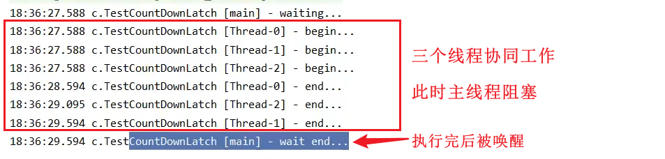

## 1.CountDownLatch

**倒计时锁🔒**：同步辅助类，通过它可以阻塞当前线程。实现一个线程或者多个线程一直等待，直到其他线程执行的操作完成。

使用一个给定的计数器进行初始化，该计数器的操作是原子操作，即同时只能有一个线程操作该计数器。

**【原理】**：多个线程协同执行任务，每个线程任务执行完，**计数**减一`countDown()`

- 构造方法用来初始化**等待计数值**
- `await()`用来等待计数器归零
- `countDown()`让计数器减一



调用该类await()方法的线程会一直阻塞，直到其他线程调用该类的countDown()方法，使当前计数器的值变为0为止。每次调用该类的countDown()方法，当前计数器的值就会减1。当计数器的值减为0的时候，所有因调用await()方法而处于等待状态的线程就会继续往下执行。这种操作只能出现一次，因为**该类中的计数器不能被重置**。

> 如果需要一个可以重置计数次数的版本，可以考虑使用**CyclicBarrier**类。

CountDownLatch支持给定时间的等待，超过一定的时间不再等待，使用时只需要在countDown()方法中传入需要等待的时间即可。此时，countDown()方法的方法签名如下：

```java
public boolean await(long timeout, TimeUnit unit)
```

#### 使用场景

在某些业务场景中，程序执行需要等待某个条件完成后才能继续执行后续的操作。

典型的应用为并行计算：

**当某个处理的运算量很大时，可以将该运算任务拆分成多个子任务，等待所有的子任务都完成之后，父任务再拿到所有子任务的运算结果进行汇总。**

【e.g.】

我们使用只有2个核心线程的线程池，分别执行*查询订单*和*派送订单*的操作，并且初始化了一个大小为 2 的 CountDownLatch，每次查询完后，都要 countDown()；

主线程则一直等待减为 0 了之后，才开始继续往下执行。

<br>

## 2. CyclicBarrier

#### 概述

是一个同步辅助类，允许**一组线程**相互等待，直到到达某个公共的屏障点，通过它可以完成**多个线程之间相互等待**，只有当每个线程都准备就绪后，才能各自继续往下执行后面的操作。

与CountDownLatch有相似的地方，都是使用计数器实现，当某个线程调用了CyclicBarrier的`await()`方法后，该线程就进入了等待状态，而且计数器执行加1操作，当计数器的值达到了设置的初始值，调用await()方法进入等待状态的线程会被唤醒，继续执行各自后续的操作。

**CyclicBarrier在释放等待线程后可以重用，所以，CyclicBarrier又被称为循环屏障。**

```java
// 初始化值为5的栅栏
CyclicBarrier cyclicBarrier = new CyclicBarrier(5);

// 每个线程调用 await()
cyclicBarrier.await();

// 等到有 5 个线程都执行了 await() 之后，继续执行。

// 并且 栅栏的 计数器会自动重置为 5 ，可以接着用
```

#### CyclicBarrier与CountDownLatch的区别

- CountDownLatch的**计数器**只能使用一次，而CyclicBarrier的计数器可以使用`reset()`方法进行重置，并且可以循环使用
- CountDownLatch主要实现1个或n个线程需要等待其他线程完成某项操作之后，才能继续往下执行，描述的是1个或n个线程等待其他线程的关系。而CyclicBarrier主要实现了多个线程之间相互等待，直到所有的线程都满足了条件之后，才能继续执行后续的操作，描述的是各个线程内部相互等待的关系。
- CyclicBarrier能够处理更复杂的场景，如果计算发生错误，可以重置计数器让线程重新执行一次。

【e.g.】

在英雄联盟中，选好英雄之后，会等待所有 10 个玩家进度条都到 100% 才开始游戏，我们可以使用 CyclicBarrier 来模拟这个场景

<br>

## 3. Semaphore

### 概述

**Semaphore信号量：** 用来限制访问共享资源的**线程数**，**控制同一时间并发线程的数目**

能够完成对于信号量的控制，可以控制某个资源可被同时访问的个数。

- 每次只允许规定数量的线程来获取资源
- 待规定的线程执行完释放了信号量，再调度规定数量的线程继续执行

提供了两个核心方法——acquire()方法和release()方法。

- `acquire()`：获取一个许可，如果没有则等待
- `release()`：在操作完成后释放对应的许可

Semaphore维护了当前访问的个数，通过提供*同步机制*来控制同时访问的个数

```java
// 1. 创建Semaphore对象,允许三个线程同时获取资源
Semaphore semaphore = new Semaphore(3);

// 2. 10个线程同时运行
for (int i = 0; i < 10; i++) {
    new Thread(() -> {
        try {
            //获取信号量
            semaphore.acquire();
            
            //执行线程任务
        } catch () {
            
        } finally {
            //执行完，释放信号量
            semaphore.release();
        }
    }).start();
}
```

### 使用场景

使用`Semaphore`**限流**，在访问高峰期时，让请求线程阻塞，高峰期过去再释放许可，当然它<font color = red>只适合限制单机线程</font>数量（不适合分布式），并且**仅是限制线程数**，而不是限制资源数（例如客户端连接数，请对比Tomcat LimitLatch的实现）

适合用在**资源数与线程数相同**时使用，Semaphore常用于仅能提供有限访问的资源，比如：**数据库连接数**

<br>

## 【三者小结】

1. CountDownLatch 可以实现计数等待，主要用于**A线程等待其他几个线程执行完后再执行；**

2. CyclicBarrier 实现循环栅栏，主要用于**一组线程互相等待至某个状态，然后这一组线程再同时执行；**

3. **CountDownLatch 是不能够重用的，而 CyclicBarrier 是可以重用的**

4. Semaphore 信号量，主要强调只有**某些个数量的线程能拿到资源执行**。

	> Semaphore 其实和锁有点类似，它一般用于控制对 某组 资源的访问权限，而锁是控制对 某个 资源的访问权限


## 4. ReadWriteLock

独占锁（写锁）：一次只能被一个线程占有

共享锁（读锁）：多个线程可以同时占有

- 读<---->读：可以共存
- 读<---->写：互斥，不可共存
- 写<---->写：互斥，不可共存

```java
class MyCache {
    private  volatile Map<String,Object> map = new HashMap<> ();
    //读写锁，更加细粒度控制
    private ReadWriteLock readWriteLock = new ReentrantReadWriteLock();
    private Lock lock = new ReentrantLock();

    public void write(String key,Object value) {
        readWriteLock.writeLock().lock();
        try {
            System.out.println(Thread.currentThread().getName() + " writing " + value);
            map.put(key,value);
            System.out.println(Thread.currentThread().getName() + " write over!");
        } catch (Exception e) {
            e.printStackTrace();
        } finally {
            readWriteLock.writeLock().unlock();
        }
    }

    public void read(String key) {
        readWriteLock.writeLock().lock();
        try {
            key = Thread.currentThread().getName();
            System.out.println(key + " reading ");
            map.get(key);
            System.out.println(key + " read over");
        } catch (Exception e) {
            e.printStackTrace();
        } finally {
            readWriteLock.writeLock().unlock();
        }
    }

}

public class ReadWriteLockTest {
    public static void main(String[] args) {
        MyCache cache = new MyCache();
        //写入操作
        for (int i = 0; i < 5; i++) {
            final int temp = i;
            new Thread(() -> {
                cache.write(Thread.currentThread().getName(), temp);
            },String.valueOf(i)).start();
        }

        //读取操作
        for (int i = 0; i < 5; i++) {
            final int temp = i;
            new Thread(() -> {
                cache.read(Thread.currentThread().getName());
            },String.valueOf(i)).start();
        }
    }
}
```

加上`ReadWriteLock`之后，能够更加细粒度的控制锁，避免读写同时发生造成“脏读”。


