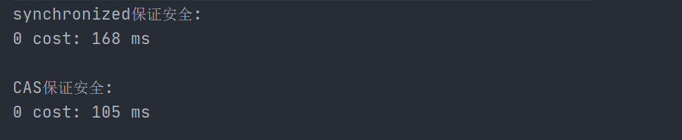

## 有锁和无锁

### 加锁🔒

针对线程安全性的问题，防止多个线程同时对某一共享变量同时操作带来的数据不一致问题，我们都是通过加锁🔒来保证线程安全的。

加锁保证了同一时刻，只有一个线程拿到了共享资源的锁，可以对其进行操作，其他线程只能阻塞等待该线程释放锁来进行竞争获取。

【代表】

- `synchronized`

- `Lock`

### 无锁🔑

加锁保证了安全性，解决了并发带来数据不一致的问题。但是，加锁的效率相对而言是很低的。无锁🔑不对线程操作进行加锁，通过不断地比较交换来保证安全性，从而解决并发问题。

【代表】

- `CAS`和`volatile`（组合拳）

## CAS与volatile组合拳

**CAS-volatile为什么是组合拳？**

- 因为它们是互补的。`volatile`无法保证原子性，CAS恰好是原子操作。

> 当然，加锁也可以保证原子性

**获取共享变量时，为了保证可见性，需要使用volatile**

`volatile`可以用来修饰成员变量和静态成员变量，他可以避免线程从自己的工作缓存中查找变量的值，必须到主存中获取它的值，线程操作 `volatile`变量都是直接操作主存。即—个线程对`vailatile`变量的修改，对另一个线程可见。

**但是，volatile不能保证原子性。CAS恰好是原子操作，通过【比较于交换】达到无锁的线程安全。**

<br>

#### JUC下提供的原子工具

**1. 原子整数**

- AtomicBoolean
- AtomicInteger
- AtomicLong

**2. 原子引用AtomicReference**

**3. 原子数组AtomicIntegerArray**

**4. 原子累加器LongAdder**

## 无锁为什么高效

**因为无锁不会发生线程的上下文切换，一直处于运行状态。**

并发编程的本质是提高CPU的利用效率。通过操作系统的调度器，CPU不停地**调度--切换**线程来执行。当CPU切换到当前线程执行时，首先通过JVM的程序计数器来恢复线程的上下文环境，在执行结束后，还得记录当前的执行状态，为下次执行做准备。

- 有锁🔒状态下执行当前线程时，其他线程处于“熄火”的阻塞状态，等到调度时才“重启”发动机，先恢复上下文环境，再恢复运行

- 无锁🔑状态下执行当前线程时，其余线程始终处于运行状态（在不断自旋中），没有切换上下文。等到CPU调度时能够立即执行

**但无锁情况下，因为线程要保持运行，需要额外的CPU支持**。由于没有分到时间片而无法被调度，仍然会进入阻塞状态，还是会导致上下文切换。

> CPU在这里就好比高速跑道，没有额外的跑道，线程想高速运行也无从谈起。虽然不会进入阻塞，但没有条件运行也只能等待。

**所以，线程数不要超过CPU核数（双核CPU）**

## 实例测试

经典的银行转账案例：

由于没有保证线程安全，所以多个线程并发会导致结果出现错误

- 正确期望结果`account = 0`
- 线程不安全下数据不一致`account`可能不等于0，或正或负

【Account接口类】

```java
//@Description:CAS无锁保证线程安全测试
public interface Account {
    // 获取余额
    Integer getBalance();
    // 取款
    void withdraw(Integer amount);
    /**
     * 方法内会启动 1000 个线程，每个线程做 -10 元 的操作
     * 如果初始余额为 10000 那么正确的结果应当是 0
     */
    static void demo(Account account) {
        List<Thread> ts = new ArrayList<>();
        long start = System.nanoTime();
        for (int i = 0; i < 1000; i++) {
            ts.add(new Thread(() -> {
                account.withdraw(10);
            }));
        }
        ts.forEach(Thread::start);
        ts.forEach(t -> {
            try {
                t.join();
            } catch (InterruptedException e) {
                e.printStackTrace();
            }
        });
        long end = System.nanoTime();
        System.out.println(account.getBalance()
                + " cost: " + (end-start)/1000_000 + " ms");
    }
}
```

【采用synchronized】

```java
// @Description:synchronized加锁保证安全
public class Account_Sync implements Account{
    private Integer balance;
    public Account_Sync(Integer balance) {
        this.balance = balance;
    }
    @Override
    public synchronized Integer getBalance() {
        return balance;
    }
    @Override
    public synchronized void withdraw(Integer amount) {
        balance -= amount;
    }

    //测试
    public static void main(String[] args) {
        Account.demo(new Account_Sync(10000));
    }
}
```

【采用CAS】

```java
// @Description:CAS无锁保证安全
public class Account_CAS implements Account {
    private AtomicInteger balance;

    public Account_CAS(Integer balance) {
        this.balance = new AtomicInteger(balance);
    }

    @Override
    public Integer getBalance() {
        return balance.get();
    }

    @Override
    public void withdraw(Integer amount) {
        // 需要不断尝试，直到成功为止
        while (true) {
            // 比如拿到了旧值 1000
            int prev = balance.get();
            // 在这个基础上 1000-10 = 990
            int next = prev - amount;
            /**
             * compareAndSet正是做检查，在Set前，先比较 prev 与当前值
             *     - 不一致，next 作废，返回 false 表示失败
             *            比如，别的线程已经做了减法，当前值已经被减成了 990
             *            那么本线程的这次 990 就作废了，进入 while 下次循环重试
             *     - 一致，以 next 设置为新值，返回 true 表示成功
             */
            if (balance.compareAndSet(prev, next)) {
                break;
            }
        }
        // 可以简化为下面的方法
        // balance.addAndGet(-1 * amount);
    }


    //测试
    public static void main(String[] args) {
        Account.demo(new Account_CAS(10000));
    }
}
```



可以看出二者均保证啦结果的正确性，但是显然此时**CAS无锁更高效**

【CAS分析】


compareAndSet是做检查，在Set前，先比较`prev `与当前值

- 不一致，`next `作废，返回 `false `表示失败

>  比如，别的线程已经做了减法，当前值已经被减成了 990
> 
> 那么本线程的这次 990 就作废了，进入 while 下次循环重试

- 一致，以 next 设置为新值，返回 true 表示成功