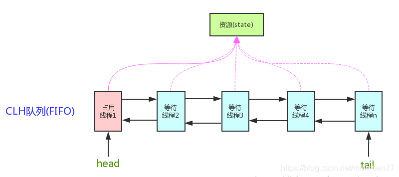
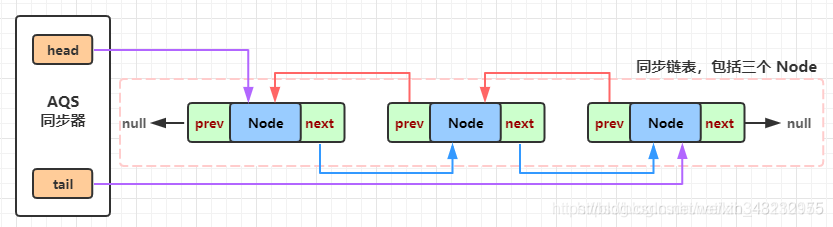
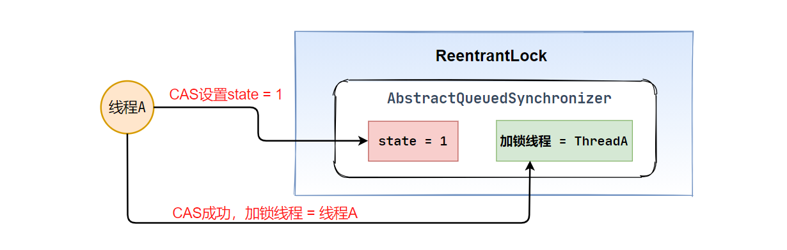
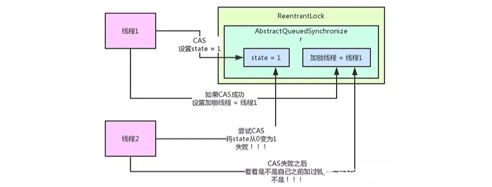
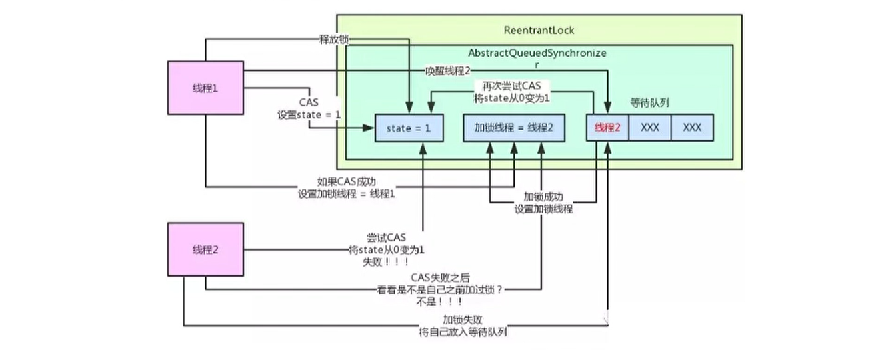

## 1. ReentrantLock和AQS的关系

Lock的使用：

```java
Lock lock = new ReentrantLock();

// 加锁
lock.lock();
try {
    // 线程任务
} catch (Exception e) {
    e.printStackTrace();
} finally {
    // 释放锁
    lock.unlock();
}
```

`ReentrantLock`、`ReentrantReadWriteLock`底层，是基于**AQS**来实现的

 **AQS**（AbstractQueuedSynchronizer），抽象队列同步器。`ReentrantLock`内部包含了AQS对象，AQS是`ReentrantLock`实现加锁和释放锁的关键核心组件


**AQS 队列同步器 三要素 ：**

1. **CAS 通过此来竞争锁资源**
2. **LockSurpport.park/unpark 线程阻塞和释放**
3. **CLH 双向链表 存放被阻塞的线程**

### AQS原理

AQS：AbstractQuenedSynchronizer抽象的队列式同步器。是除了java自带的synchronized关键字之外的锁机制。AQS的全称为（AbstractQueuedSynchronizer），这个类在java.util.concurrent.locks包

**AQS的核心思想：**

如果被请求的共享资源空闲，则将当前请求资源的线程设置为有效的工作线程，并将共享资源设置为锁定状态，如果被请求的共享资源被占用，那么就需要一套线程阻塞等待以及被唤醒时锁分配的机制，这个机制AQS是用CLH队列锁实现的，即将暂时获取不到锁的线程加入到队列中。

**用大白话来说，AQS就是基于CLH队列，用volatile修饰共享变量state，线程通过CAS去改变状态符，成功则获取锁成功，失败则进入等待队列，等待被唤醒。**

- CLH（Craig，Landin，and Hagersten）队列是一个虚拟的双向队列，虚拟的双向队列即不存在队列实例，仅存在节点之间的关联关系。

- AQS是将每一条请求共享资源的线程封装成一个CLH锁队列的一个结点（Node），来实现锁的分配



AQS维护了一个**volatile** `int state`和一个**FIFO**线程等待队列，多线程争用资源被阻塞的时候就会进入这个队列。

state就是共享资源，其访问方式有如下三种：

- `getState()`
- `setState()`
- `compareAndSetState();`

CLH队列--双向链表实现

🔗[AQS 同步器原理分析](https://blog.csdn.net/lzb348110175/article/details/103709548?utm_medium=distribute.pc_relevant.none-task-blog-BlogCommendFromBaidu-5.channel_param&depth_1-utm_source=distribute.pc_relevant.none-task-blog-BlogCommendFromBaidu-5.channel_param)

  AQS **Node**节点被 `volatile` 修饰，head 和 tail（即：链表的头部和尾部）

```java
// Head of the wait queue, lazily initialized. 
private transient volatile Node head;
 
// Tail of the wait queue, lazily initialized. .
private transient volatile Node tail;
```


**注意：AQS是自旋锁：**在等待唤醒的时候，经常会使用自旋`while(!cas())`的方式，不停地尝试获取锁，直到被其他线程获取成功

**实现了AQS的锁有：自旋锁、互斥锁、读锁写锁、条件产量、信号量、栅栏都是AQS的衍生物**

<br>

## 2. ReentrantLock锁机制原理

AQS内部核心

- `state` int类型，初始为0。代表**加锁的状态**
- 关键变量，记录当前获取到锁的线程，初值为null


初始时，线程A调用**RentrantLock**的`lock`方法尝试加锁，加锁的过程是用**CAS**将`state`由0变为1

此时线程A获取锁成功

线程A加锁成功后，将加锁线程设置为**自己**



### 可重入锁

线程A再次获取到了锁，判断**当前加锁线程是否是自己？**，是的话再次获取锁成功，`satte`类加1

### 互斥锁

线程B想要获取锁，先判断`state`是否为0

- `state = 0`，尝试获取锁
- `state != 0`，看持有锁的线程是否是自己；不是则进入到**等待队列**
- 线程B等待线程A释放锁之后，尝试重新获取



**AQS中有一个等待队列，存放获取锁🔒失败的线程**


### 释放锁

`state`变量减一，为0时彻底释放锁，不再持有资源，**直至 加锁线程为null**

接下来，**从等待队列的对头唤醒线程B，重新尝试加锁**

- 线程B重复上述操作，获取锁成功




## 3. AQS资源共享方式

AQS 定义了两种资源共享方式：

1. **Exclusive**：独占，只有一个线程能执行，如ReentrantLock
2. **Share**：共享，多个线程可以同时执行，如Semaphore、CountDownLatch、ReadWriteLock，CyclicBarrier

不同的自定义的同步器争用共享资源的方式也不同

<br>

## 4. AQS底层使用了模板方法模式

同步器的设计是基于模板方法模式的，如果需要自定义同步器一般的方式是这样（模板方法模式很经典的一个应用）：

1. 使用者继承AbstractQueuedSynchronizer并重写指定的方法。
2. 将AQS组合在自定义同步组件的实现中，并调用其模板方法，而这些模板方法会调用使用者重写的方法。
	这和我们以往通过实现接口的方式有很大区别，这是模板方法模式很经典的一个运用。

**自定义同步器**在实现的时候只需要实现共享资源state的获取和释放方式即可，至于具体线程等待队列的维护，AQS已经在顶层实现好了。自定义同步器实现的时候主要实现下面几种方法：

- `isHeldExclusively()`：该线程是否正在独占资源。只有用到`Condition`才需要去实现它；

**独占**

- `tryAcquire(int)`：独占方式。尝试获取资源，成功则返回true，失败则返回false；
- `tryRelease(int)`：独占方式。尝试释放资源，成功则返回true，失败则返回false；

**共享**

- `tryAcquireShared(int)`：共享方式。尝试获取资源。负数表示失败；0表示成功，但没有剩余可用资源；正数表示成功，且有剩余资源；
- `tryReleaseShared(int)`：共享方式。尝试释放资源，如果释放后允许唤醒后续等待结点返回true，否则返回false；

### ReentrantLock为例

（可重入独占式锁）：state初始化为0，表示未锁定状态，A线程lock()时，会调用tryAcquire()独占锁并将state+1.之后其他线程再想tryAcquire的时候就会失败，直到A线程unlock（）到state=0为止，其他线程才有机会获取该锁。A释放锁之前，自己也是可以重复获取此锁（state累加），这就是可重入的概念。

> 注意：获取多少次锁就要释放多少次锁，保证state是能回到零态的

### CountDownLatch为例

任务分N个子线程去执行，state就初始化 为N，N个线程并行执行，每个线程执行完之后`countDown()`一次，**state**就会**CAS**减一。当N子线程全部执行完毕，state=0，会`unpark()`主调用线程，主调用线程就会从`await()`函数返回，继续之后的动作。

一般来说，自定义同步器要么是独占方法，要么是共享方式，他们也只需实现`tryAcquire-tryRelease`、`tryAcquireShared-tryReleaseShared`中的一种即可。但AQS也支持自定义同步器同时**实现独占和共享两种方式，如ReentrantReadWriteLock。**

<br>

-----------------

部分内容参考自：

- [AQS详解](https://blog.csdn.net/mulinsen77/article/details/84583716?utm_medium=distribute.pc_relevant.none-task-blog-BlogCommendFromMachineLearnPai2-2.channel_param&depth_1-utm_source=distribute.pc_relevant.none-task-blog-BlogCommendFromMachineLearnPai2-2.channel_param)

- [Java并发之AQS详解](https://www.cnblogs.com/waterystone/p/4920797.html)

