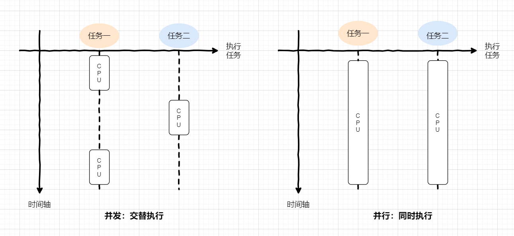
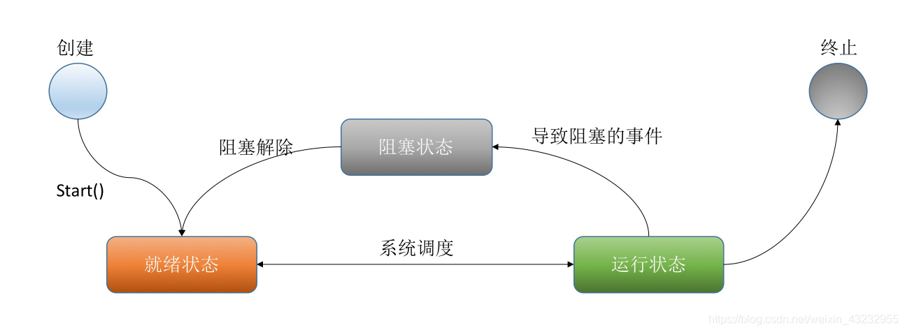
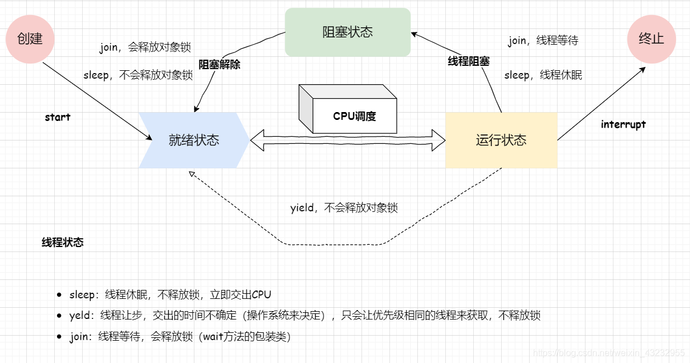
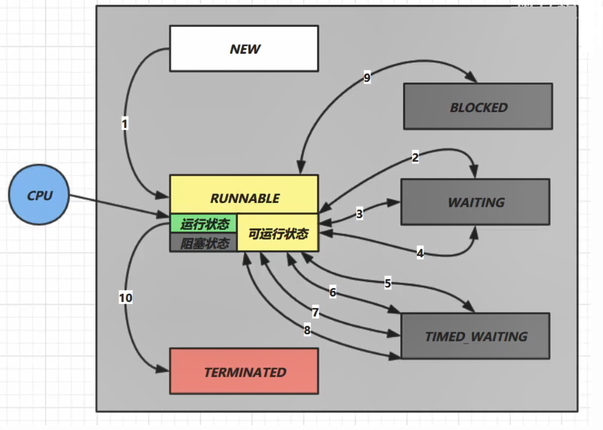
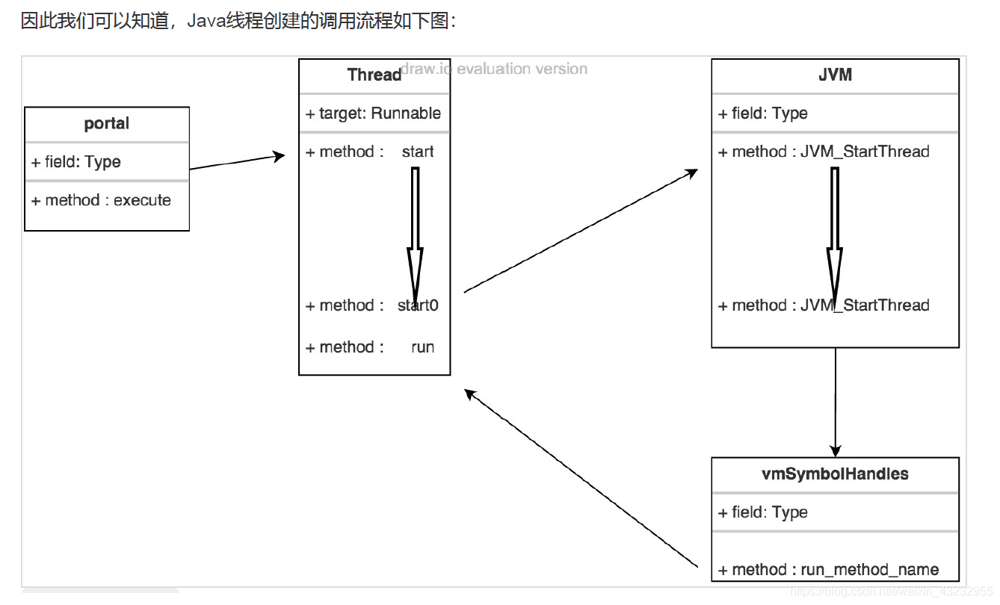
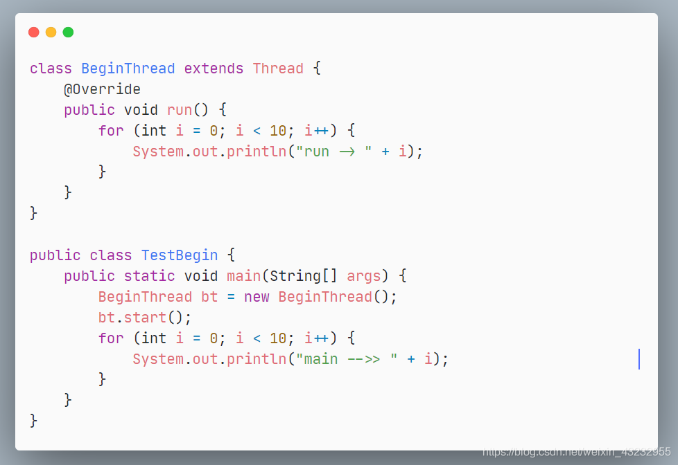
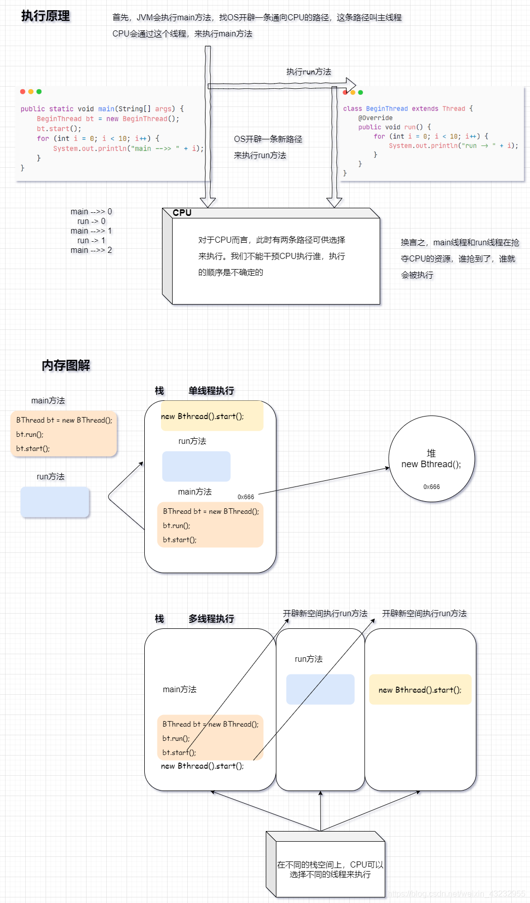
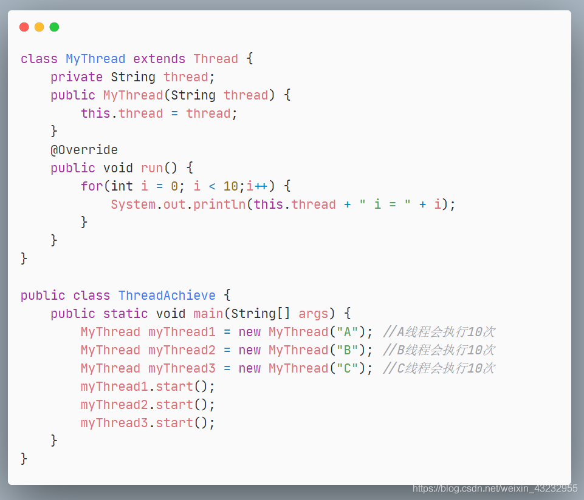
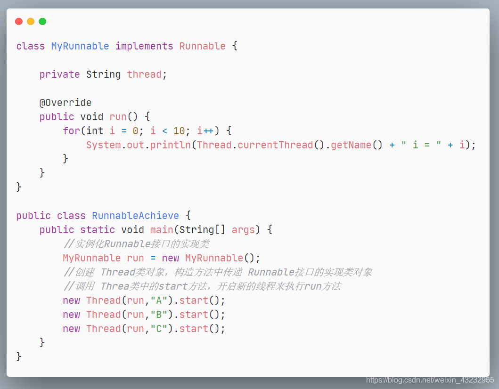
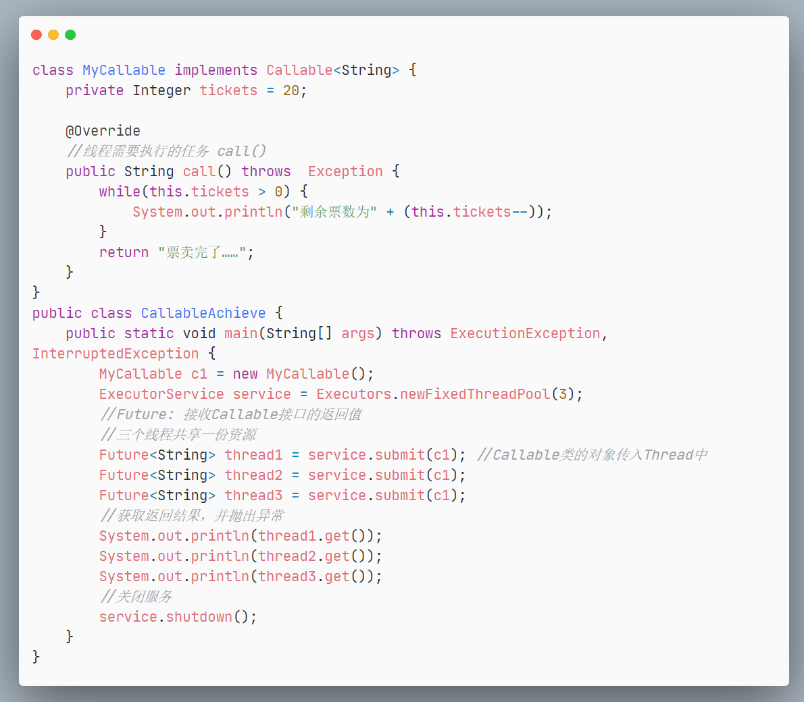

## 1. 进程与线程

**进程：** 进入到内存中执行的程序称为进程，它描述的是操作系统中一个程序的执行周期

**线程：** 一个程序同时执行多个任务，一个任务称之为线程，线程是进程的执行单元

**进程于线程的区别**

1. 每个进程都有自己的一整套变量，而线程则数据共享

2. 进程是操作系统中资源分配的最小单位；线程是OS中任务调度的基本单位

3. 启动、撤销一个进程的开销要比线程大得多

4. 没有线进程就没有线程，进程结束，线程终止

**并发与并行**

【并发编程的本质】：充分利用CPU资源

并发：指两个或多个事件在==同一时间段==内发生

并行：指两个或多个事件在==同一时刻==发生（同时发生）

- 并发：交替执行（一个CPU在来回切换）
- 并行：同时执行（多个CPU同时工作）


高并发：访问线程量非常非常高(CPU占用率高99.9%)

> **JVM的启动时是多线程的吗？**
> 
> - JVM的启动至少启动了垃圾回收线程和主线程，所以是多线程的

### 线程的状态（操作系统层面）





> 图中缺少了**WAITING**。处于`wait`等待状态的线程情况比较特殊，需要通过`notify`来唤醒。由于`wait`会释放锁，唤醒之后置于同步队列，又需要重新获取锁对象，也就是再回到阻塞状态等待CPU调度。

### 线程的状态（Java API层面）

根据**Thread State**枚举，分为六种状态



| 状态         | 描述                                                         |
| ------------ | ------------------------------------------------------------ |
| NEW          | 尚未启动的线程处于这种状态                                   |
| RUNNABLE     | 在Java虚拟机中线程处于就绪（ready）和运行中（running）两种状态称为运行状态 |
| BLOCKED      | 被阻塞等待对象锁的线程处于此状态                             |
| WAITING      | 正在等待另一个线程执行特定动作的线程处于此状态               |
| TIME_WAITING | 该状态不同于WAITING，它可以在指定的时间后自行返回            |
| TERMINATED   | 已经退出运行的线程处于此状态                                 |

### run与start启动线程

无论使用哪种方式创建线程，启动线程一律使用Thread类提供的`strat()`，`run()`不能由用户直接调用，而是JVM调用。

`run()`方法只能由JVM调用，用户调用和普通方法无区别，执行结果是单线程的

`start() ` ---->  `start0()`  [本地方法]  ----->  进入到JVM中调用操作系统写好的方法来执行

**JVM调用`start0()`方法进行资源的分配与系统调度，准备好资源启动线程后回调`run()`方法来执行线程的具体任务**

 一个线程的`start`只能被执行一次，否则会抛出`IllegalThreadStartException`

> Java真的可以开启线程吗？
>
> 答：Java在底层无法真正开启线程，`start0`是本地方法，Java无法操作硬件。

-----

**run 存放线程的任务**


### 线程创建的原理分析


执行结果：

> run -> 0
> run -> 1
> run -> 2
> run -> 3
> main -->> 0
> main -->> 1
> main -->> 2
> main -->> 3
> main -->> 4
> main -->> 5
> main -->> 6
> main -->> 7
> main -->> 8
> run -> 4
> run -> 5
> run -> 6
> run -> 7
> main -->> 9
> run -> 8
> run -> 9


**线程的执行调度**

线程调度的顺序取决于CPU的调度，CPU的调度是随机的。设置线程调度的优先级只是提高线程被调度的概率，并不一定按照优先级调度执行

------------

## 2. Java实现多线程

### a. 继承Thread类

【实现步骤】

1. 创建一个Thread类的子类
2. 在 Thread类的子类中重写 Thread类中的run方法，设置线程任务（开启线程要做什么？）
3. 创建 Threa类的子类对象
4. 调用 Thread类中的方法 `start`方法，开启新的线程，JVM执行`run`方法
- start方法使该线程开始执行
- JVM调用该线程的run方法来执行线程任务

> 在Java中是单继承原则，如果继承了Thread类，后面就无法在进行拓展了

JDK文档说明：



### b. 实现Runnable接口

【实现步骤】

1. 创建Runnable接口的实现类

2. 在实现类中覆写Runnable接口的`run`方法，设置线程任务

3. 实例化Runnable接口的实现类

4. 创建 Thread类对象，构造方法中传递 Runnable接口的实现类对象

5. 调用 Threa类中的`start`方法，开启新的线程来执行`run`方法
   
   JDK文档说明：
   
   在Thread类中，他的构造方法可以接收Runnable接口
   
   

### c. Callable实现多线程

Callable接口类似于Runnable，因为它们都是为其实例可能由另一个线程执行的类设计的。 然而， `Runnable`不返回结果，也不能抛出被检查的异常。

该Executors类包含的实用方法，从其他普通形式转换为Callable类。

【实现步骤】

```java
1. 实现Callable接口，需要返回值类型

2. 重写call()方法，抛出异常

3. 创建目标对象 MyCallable mc = new MyCallable();

4. 创建服务 ExecutorService service = Executors.newFixedThreadPool(3);

5. 提交执行服务   Future<String> thread = service.submit(mc); 

6. 获取返回值 thread.get();

7. 关闭服务  service.shutdown();
```

> - 灵活拓展，泛型类为任意返回值类型
> - 可以将异常抛出

重写`call()`方法，等同于`run`方法，存放线程要执行的任务



**Callable对比于Runnable**

1. 需要实现的方法不同`call`

2. 有返回值

3. 可以抛出异常

### d. 线程池 -- 推荐

[**👉线程池👈**](https://blog.csdn.net/weixin_43232955/article/details/98971298)

```java
class  MyThread implements Callable<String> {
    private Integer tickets = 20;

    @Override
    //线程需要执行的任务 call()
    public String call() throws  Exception {
        while(this.tickets > 0) {
            System.out.println(Thread.currentThread().getName() + " 剩余票数为" + (this.tickets--));
        }
        return Thread.currentThread().getName() + " 票卖完了……";
    }
}

public class AchieveThread {
    public static void main(String[] args) throws Exception {
        // Future: 接收Callable接口的返回值
        // FutureTask 在多线程并发下可以保证任务(传入的Callable或Runnable)只执行一次

        //缓存线程池创建线程
        ExecutorService exec = Executors.newCachedThreadPool();
        Callable<String> callable = new MyThread();
        for(int i = 0;i < 3; i++) {
            exec.submit(callable);
        }
        exec.shutdown();
    }
}
```

-----------------

## 3. 匿名内部类创建线程


### Runnable对象实例化

**I.Thread类提供的构造方法来接收Runnable对象**

```java
MyRunnable run = new MyRunnable();
new Thread(run).start();
```

**II. 匿名内部类：**

```java
new Thread(new Runnable() {
    @Override
    public void run() {
        //线程任务
    }
}).start();
```

**III. Lambda表达式：**

```java
Runnable runnable = () -> System.out.println("Lambda表达式");
new Thread(runnable).start();
```

## 4. 继承Thread类与实现Runnable的区别

<font color=#6495ED size=4>**实现Runnable接囗创建多线程程序的好处**</font>

**I. 避免了单继承的局限性**

一个类只能继承一个类（一个人只能有一个亲爹），类继承了 Thread类就不能继承其他的类。
实现了 Runnable接口，可以继承其他的类，实现其他的接口。

**2. 增强了程序的扩展性，降低了程序的耦合性（解耦）**

实现 Runnable接口的方式把设置线程任务和开启新线程进行了分离（解耦）

- 实现类中，重写了`run`方法来设置线程任务
- 创建 Thread类对象，调用`start`方法来开启新线程

--------------------------

<font  size=4>**[资源共享带来的并发问题](https://blog.csdn.net/weixin_43232955/article/details/96761123)**</font>

**买票问题：一份资源，多个线程共享，会带来并发问题(数据的不一致性)**

```java
class Web123 implements Runnable {
    private Integer tickets = 50;
    @Override
    public void run() {
        while (tickets >= 0) {
            try {
                Thread.sleep(200);
            } catch (InterruptedException e) {
                e.printStackTrace();
            }
            System.out.println(Thread.currentThread().getName() + "---->" + tickets--);
        }
    }
}

public class TicketsConcurrency {
    public static void main(String[] args) {
        Web123 web123 = new Web123();    //一分资源，多个共享
        System.out.println(Thread.currentThread().getName());
        new Thread(web123,"黄牛A").start();
        new Thread(web123,"黄牛B").start();
        new Thread(web123,"黄牛C").start();
    }
}
```

