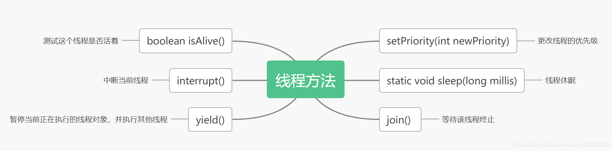
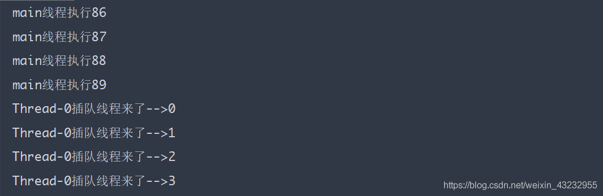
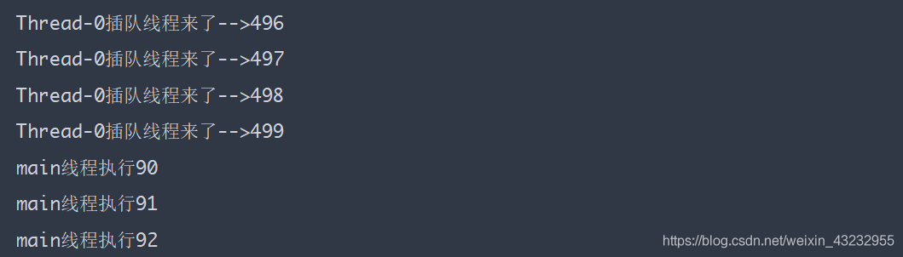

### 1. 获取并设置线程名称

**取得当前JVM中正在执行的线程对象**

静态方法直接调用

    Thread.currentThread.getName(); //获取当前线程的名称

**线程命名的两种方式：**


在创建线程时通过构造方法来传入名称

    new Thread(run,"线程A").start();

通过set方法来设置线程名称


---------


- sleep：抱着资源在睡觉
- yield:  文明礼让有先序
- join:    插队优先是大哥

-------------------------

### 2. 线程休眠-sleep

`sleep(long time<毫秒>)`

sleep方法是静态方法，直接通过Thread类名称来调用。在哪个线程中调用，就休眠当前线程

- 让线程暂缓执行，`sleep()`会让当前线程从`RUNNING`进入到`TIME_WAITTING`状态，时间到达后处于**就绪状态，并不是出于运行状态**
- sleep方法会让当前线程立即交出CPU，但**不会释放对象锁**
- `interrupt()`可以打断正在睡眠的线程，此时`sleep`方法会抛出`InterruptedException`
- sleep可以模拟网络延时，倒计时等，要精确控制时间单位用`TimeUnit`


-------------------

### 3. 线程让步-yield

`Thread.yield()`方法作用是：当前线 程暂停执行，让出CPU给他线程。

`yield`是让当前运行线程回到**就绪状态**，以允许具有相同优先级的其他线程获得运行机会。因此，使用yield()的目的是**让相同优先级的线程之间能适当的轮转执行**。

但是，礼让却不一定能够成功，实际中无法保证`yield`达到让步目的，还取决于操作系统的任务调度器。

结论：`yield`从未导致线程转到等待/睡眠/阻塞状态。在大多数情况下，yield()将导致线程从运行状态转到可运行状态，但有可能没有效果，**礼让不一定会成功**。


【yield要点归纳】

- 暂停当前正在执行的线程对象，并执行其他线程（只供相同优先级的线程使用）
- 当前线程不会立即交出CPU，**不释放锁**，交出时间由系统调度
- 礼让不一定成功（当前礼让的线程有可能再次被调度）
- 从运行状态返回**就绪状态**

#### 案例一

```java
class ThreadYield implements Runnable {
    @Override
    public void run() {
        System.out.println(Thread.currentThread().getName() + "-->开始执行");
        Thread.yield();
        System.out.println(Thread.currentThread().getName() + "<--结束执行");
    }
}

public class ThreadYeild {
    public static void main(String[] args) {
        ThreadYield ty = new ThreadYield();
        new Thread(ty,"A线程").start();
        new Thread(ty,"B线程").start();
    }
}
```

礼让失败：

B线程被CPU调度，遇到了yield方法礼让，回到就绪态。此时，线程B再次被CPU调度，B线程结束执行


礼让成功：

B线程被CPU调度，遇到了yield方法礼让，回到就绪态。此时，线程A被CPU调度，A线程开始执行


#### 案例二

【线程让步测试】

- 在线程2中调用yield方法, 将线程2的调度时间分给线程1
- 最终 [线程A] `count1 > count2` [线程B]


```java
public class YieldTest {
    public static void main(String[] args) {
        new Thread(() -> {
            int count1 = 0;
            for(;;) System.out.println("----->[1]" + (count1++));
        }, "线程A").start();

        new Thread(() -> {
            int count2 = 0;
            for(;;) {
                Thread.yield();
                System.out.println("                 ----->[2]" + (count2++));
            }
        }, "线程B").start();

    }
}
```


但是，结果并不一定差别很大。线程的调度最终取决于操作系统的任务调度器。


<br>

----------

### 4. 线程等待-join

  

- 若线程1需要等待线程2执行完毕后再恢复执行，可以在线程1中调用线程2的`join()`；

- 在哪个线程中调用，哪个线程被阻塞，等待插队的线程执行完毕后当前线程再恢复执行

- 从运行态到阻塞态**会释放锁**


**通过一段代码来验证一下**

* 在A线程中让线程B插队（调用线程B的join方法），那么线程A阻塞，直到线程B执行完毕，
* 线程A继续执行(回到就绪)

```java
public class ThreadJoin implements Runnable{

    @Override
    public void run() {
        for (int i = 0; i < 500; i++) {
            System.out.println(Thread.currentThread().getName() + "插队线程来了-->" + i);
        }
    }

    public static void main(String[] args) throws InterruptedException {
        ThreadJoin tj = new ThreadJoin();
        Thread thread = new Thread(tj);
        thread.start();
        //主线程任务
        for (int i = 0; i < 100; i++) {
            if (i == 90) {
                thread.join();
            }
            System.out.println("main线程执行" + i);
        }
    }
}
```






主线程在运行中，当`i = 90`时Thread-0插队。此时主线程被阻塞，Thread-0执行完成后，主线程继续执行。