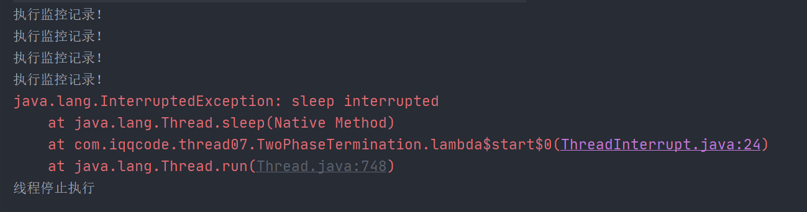
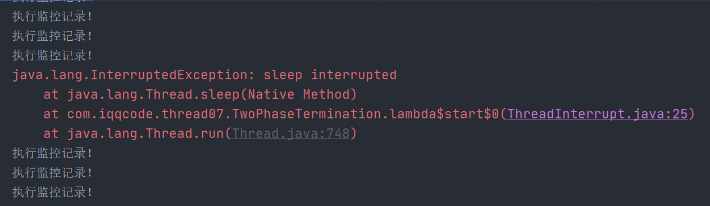

## 线程的停止

**三种方式停止当前线程**

1. 设置标记位，线程正常退出
2. 使用stop方法强制线程退出，该方法不安全已被弃用
3. 使用interrupt方法中断线程

### 1. 设置标志位

**设置标志位(无法处理线程阻塞时的问题)**

```java
class TStop implements Runnable {
    //设置标志位
    private boolean flag = true;

    @Override
    public void run() {
        int i = 0;
        while (flag) {
            System.out.println(Thread.currentThread().getName() + "执行 i = " + (i++));
        }
    }

    //转换标志位
    public void setFlag() {
        this.flag = false;
    }
}

public class ThreadStop {
    public static void main(String[] args) throws InterruptedException {
        TStop tp = new TStop();
        Thread thread = new Thread(tp,"线程A");
        thread.start();
        for (int i = 0; i < 1000; i++) {
            System.out.println("[main]->" + i);
            if (i == 900) {
                //thread.stop();不建议使用stop方法强制停止线程
                tp.setFlag();
                Thread.sleep(100);
                System.err.println("线程A执结束！");
            }
        }
    }
}
```


### 2. stop方法强行关闭线程

为什么说stop方法强行关闭线程不安全呢？

因为stop会解除由线程获取的所有锁，当在一个线程对象上调用stop()方法时，这个线程对象所运行的线程就会**立即停止**。

假如一个线程正在执行：

    synchronized void { x = 3; y = 4;} 

由于方法是同步的，多个线程访问时总能保证x，y被同时赋值，而如果一个线程正在执行到 `x=3` 时，被调用了stop方法，当前线程会被强制停止执行，导致`y`没有被赋值。即使在同步块中，它也会立即stop，这样就产生了不完整的残缺数据。

---------------------

### 3.调用Thread类提供的interrupt

若线程中没有使用类似`sleep/wait/join`时(使线程进入阻塞态)，调用此线程对象的`interrupt` **不会真正中断线程**，只是简单的将线程的状态置为interrupt而已，根据此状态来进一步确定如何处理线程

```java
public class ThreadInterrupt implements Runnable {
    @Override
    public void run() {
        while (true) {
            try {
                Thread.sleep(1000);
            } catch (InterruptedException e) {
                System.err.println("收到中断信号！");
                e.printStackTrace();
                break;
            }
        }
    }

    public static void main(String[] args) throws InterruptedException {
        ThreadInterrupt tr = new ThreadInterrupt();
        Thread thread = new Thread(tr);
        Thread.sleep(1000);
        thread.start();
        System.out.println("是否中断？"+ thread.isInterrupted());
        thread.interrupt();
        System.out.println("是否中断？"+ thread.isInterrupted());
    }
}
```

  

Thread类提供的`isInterrupted`方法，测试这个线程是否被中断

- 如果为`true`，则停止当前线程的执行
- 如果为`false`，则继续执行

若线程中调用了阻塞线程的方法`sleep/wait/join`方法，该线程在阻塞时被打断。此时再掉用线程的 `interrupt`方法会抛出异常，同时线程状态还原 isInterrupted = false，又恢复执行

【测试案例】

- 监控线程每隔1s输出一次监控日志
- 监控5s后，让监控线程停止执行

> 要重置中断标志位，否则异常后继续执行

```java
class TwoPhaseTermination {

    private Thread monitor;

    //启动监控线程，测试其被打断的状态,不打断每隔一秒执行一次监控
    public void start() {
        monitor = new Thread(() -> {
            while(true) {
                Thread current = Thread.currentThread();
                //如果被打断了，则线程停止执行
                if(current.isInterrupted()) {
                    System.out.println("线程停止执行");
                    break;
                }
                
                try {
                    Thread.sleep(1000);
                    System.out.println("执行监控记录！");
                } catch (InterruptedException e) {
                    e.printStackTrace();
                    //重新设置中断标记位。因为中断后又会恢复为isInterrupted = false
                    // 还会继续执行
                    current.interrupt();
                }
            }
        });
        monitor.start();
    }

    //停止监控线程
    public void stop() {
        monitor.interrupt();
    }
}

public class ThreadInterrupt {
    public static void main(String[] args) throws InterruptedException {
        TwoPhaseTermination tpt = new TwoPhaseTermination();
        tpt.start(); //启动监控
        Thread.sleep(5000);
        tpt.stop(); //5s停止监控
    }
}
```

重置标记位`current.interrupt();`



**没有重置中断标志位，继续执行**。

因为中断后又会恢复为初始没被打断的状态`isInterrupted = false`，还会继续执行



**interrupt()源码：**

`interrupt0()`为中断标志位


## 线程的优先级

线程的优先级指的是优先级越高 **越有可能**被先执行

就拿买彩票来说，买100张彩票的中奖几率一定是大于一张的，但是买100张彩票就一定会中奖吗？搏一搏，单车变摩托🤣？

同样的道理，线程的优先级越高，**越有可能**被先执行。执行的机率加大，但具体是否执行，还得看CPU的调度


- **设置线程优先级**  `setPriority(int priority)`

- **获取优先级**  `int getPriority`

JDK内置的三种优先级：


**<font color=#8B008B size=3>MAX_PRIORITYT = 10</font>**

**<font color=#8B008B size=3>NORM_PRIORITYT = 5</font>**

**<font color=#8B008B size=3>MIN_PRIORITYT = 1</font>**

> **main**线程默认的优先级为 NORM_PRIORITYT = 5

**优先级的设定：** 优先级的设定要放到启动线程之前

**线程的继承性：** 在一个线程中创建了子线程，默认子线程与父线程的优先级相同

理论上优先级高的先执行，但是还取决于CPU的调度


---------------

## 守护线程

Java中线程分为：

- 用户线程
- 守护线程（Daemon）

**守护线程为陪伴线程**，只要JVM中存在任何一个用户线程没有终止，守护线程就一直在工作。JVM必须确保用户线程执行完毕，但是不用等待守护线程

默认创建的线程都是用户线程，包括主线程

通过`setDaemon(true)`将线程对象设置为守护线程

**典型的守护线程：**

- **垃圾回收线程、内存监控、日志记录**
- **Tomcat中的Accepter(接收请求)和Poller(分发请求)线程，在执行shutdown会立即关闭，不会等待它们处理完当前请求**

```java
class God implements Runnable {
    @Override
    public void run() {
        while (true) {
            System.out.println("God Bless you!");
        }
    }
}

class Person implements Runnable {
    @Override
    public void run() {
        for (int i = 0; i < 5; i++) {
            System.out.println("Live happily...");
        }
        System.err.println("--> 撒由那拉！！！");
    }
}

public class ThreadDaemon {
    public static void main(String[] args) throws InterruptedException {
        God god = new God();
        Person per = new Person();
        Thread thread = new Thread(god);
        //设置上帝为守护线程
        thread.setDaemon(true);
        thread.start();
        //启动用户线程 
        new Thread(per).start();
    }
}
```

当用户线程Person结束后，守护线程并没有立即停止


当前程序停止，则守护线程也会被强制停止。