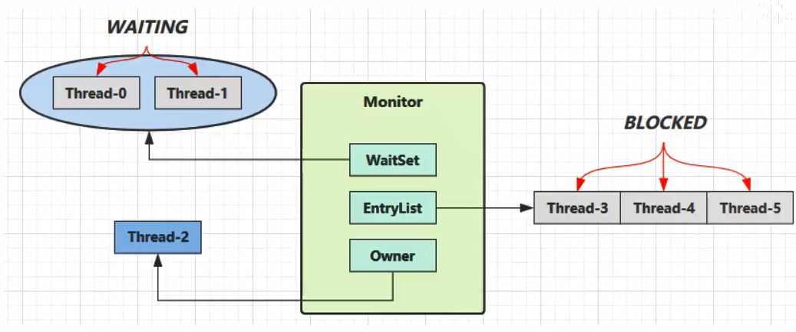
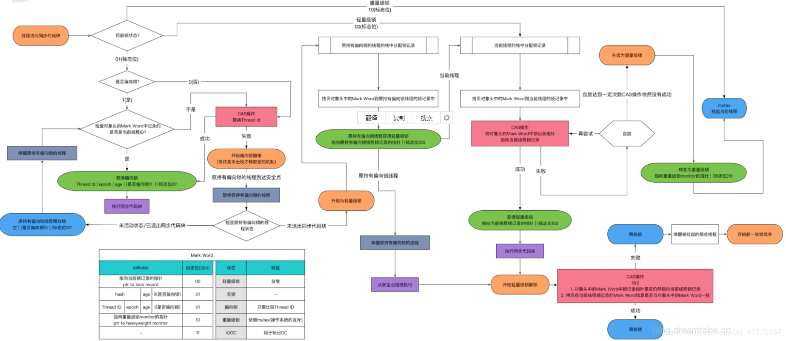

sychronized的使用场景：


## 1. 对象锁monitor机制



- 刚开始**Monitor**中Owner为null

- 当Thread-2执行`synchronized(obj)`就会成为**Monitor**的所有者，**Owner**置为Thread-2，Monitor中只能有一个Owner
- 在Thread-2上锁的过程中，如果Thread-3、Thread-4、Thread-5也来执行`synchronized(obj)`，就会进入**EntryList BLOCKED**

- Thread-2执行完同步代码块的内容，然后唤醒EntryList中等待的线程来竞争锁；**竞争的时是非公平的**，并不是先进入EntryList中得线程先获取锁，取决于操作系统调度器的调度顺序

- 图中WaitSet中的Thread-0、Thread-1是**已经获得锁**，但**条件不满足**进入WAITING状态的线程

> **注意**
>
> - synchronized必须是进入**同一个对象**的monitor才有上述的效果
>
> - 不加synchronized的对象不会关联监视器，不遵从以上规则

<hr>

## 2. synchronized底层原理

### synchronized修饰同步代码块

先来看一段简单的代码


为了解到synchronized的底层实现原理，我们来对这段代码进行反编译

先通过`cd`命令进入到src下的package目录

先编译`javac Test.java`，生成class文件

反编译命令：

`javap -c -v Test.class`

然后我们来看**同步代码块**下生成的字节码：


```java
 public static void main(java.lang.String[]);
    descriptor: ([Ljava/lang/String;)V
    flags: ACC_PUBLIC, ACC_STATIC
    Code:
      stack=2, locals=3, args_size=1
         0: getstatic     #2     // <- lock引用<synchronized开始>          
         3: dup
         4: astore_1             // lock引用，存入局部变量表slot_1
         5: monitorenter         // 将lock对象 Markward置为 Monitor指针
         6: getstatic     #3                  
         9: ldc           #4                  
        11: invokevirtual #5                 
        14: aload_1
        15: monitorexit          // 将lock对象MarkWard重置，唤醒EntryList 
        16: goto          24
        19: astore_2
        20: aload_1
        21: monitorexit          // 将lock对象 Markward重置，唤醒 EntryList
        22: aload_2
        23: athrow
        24: return
      Exception table:             // 异常监测表
         from    to  target type   // 监测范围
             6    16    19   any
            19    22    19   any
```

执行同步代码块后首先要先执行`monitorenter`指令，退出的时候执行`monitorexit`指令。

通过分析之后可以看出，使用**synchronized**进行同步，其关键就是要获取对象的监视器`monitor`，当线程获取`monitor`后才能继续往下执行，否则就只能等待。

而这个获取的过程是互斥的，即同一时刻只有一个线程能够获取到`monitor`。

上述字节码中包含一个`monitorenter`指令以及两个`monitorexit`指令。这是因为JVM需要确保获得的锁在正常执行路径、异常执行路径上都能够被解锁。

### synchronized修饰同步方法

当用**synchronized**标记方法时，字节码中方法的访问标记`flags`多了 `ACC_SYNCHRONIZED`。

- 进入该方法时，JVM需要进行 `monitorenter` 操作
- 退出该方法时，不管是正常返回，还是向调用者抛异常，JVM均需要进行 `monitorexit` 操作


-------------

### monitorenter---monitorexit

- 关于monitorenter 和 monitorexit 的作用，我们可以抽象地理解为：每个锁对象拥有一个锁计数器和一个 “指向持有该锁的线程” 的指针（对象头）

- 当执行monitorenter时，如果目标锁对象的计数器为0，那么说明它没有被其他线程所持有。在这个情况下JVM会将该锁对象的持有线程设置为当前线程，并且将其计数器加1

- 在目标锁对象的计数器不为0的情况下，如果锁对象的持有线程是当前线程，那么JVM可以将其计数器再加1；否则需要等待，直至持有线程释放该锁

- 当执行monitorexit时，JVM则需将锁对象的计数器减1。当计数器减为0时，便代表该锁已经被释放掉了

<hr>

### 可重入锁

当执行`monitorenter`时，对象的**monitor计数器**值不为0，但是持有锁的线程恰好是当前线程。此时将monitor计数器值再次`+1`，当前线程再次进入同步方法或代码块

之所以采用这种计数器的方式，是为了**允许同一个线程重复获取同一把锁**

【证明锁的可重入与互斥】

synchronized修饰的`test1`方法中调用`test2`方法

```java
class Sync implements Runnable {

    @Override
    public void run() {
        test1();
        test2();
    }

    public synchronized void test1() {
        if (Thread.currentThread().getName().equals("A")) {
            test2();
        }
    }

    public synchronized void test2() {
        if (Thread.currentThread().getName().equals("B")) {
            System.out.println("B线程进入该同步方法test2()...");
        }else {
            //此时B线程还没有启动
            System.out.println(Thread.currentThread().getName() + "线程--->进入test2()方法");
        }
    }
}

public class Reentrant {
    public static void main(String[] args) throws InterruptedException {
        Sync run = new Sync();
        new Thread(run,"A").start();
        //有时间差，保证A先启动
        Thread.sleep(2000);
        new Thread(run,"B").start();
    }
}
```


如果一个类中拥有多个synchronized方法，那么这些方法之间的相互调用，不管是直接的还是间接的，都会涉及对同一把锁的重复加锁操作

--------------------

## 3. JDK1.6后对synchronized的优化

synchronized的操作都是互斥的，Monitor机制是由操作系统来提供的，效率低。

当一个线程拿到了锁资源之后，因为要保证同步，所以其他线程只能等待该线程释放锁，效率自然降低。

**优化的思想：让每个线程通过同步代码块时的速度提高**

### 锁升级的过程

面：前面你提到synchronized是个重量级锁，那它的优化有了解嘛？

应：为了减少获得锁和和释放锁带来的性能损耗引入了偏向锁、轻量级锁、重量级锁来进行优化，锁升级的过程如下：

首先是一个**无锁**的状态，当线程进入同步代码块的时候，会检查对象头内和栈帧中的锁记录里是否存入存入当前线程的ID，如果没有使用**CAS **进行替换。以后该线程进入和退出同步代码块不需要进行CAS 操作来加锁和解锁，只需要判断对象头的Mark word内是否存储指向当前线程的偏向锁。如果有表示已经获得锁，如果没有或者不是，则需要使用CAS进行替换，如果设置成功则当前线程持有偏 向锁，反之将偏向锁进行撤销并升级为轻量级锁。
  
轻量级锁加锁过程，线程在执行同步块之前，JVM会在当前线程的栈帧中创建用于存储锁记录的空间，并将对象头的Mark Word复制到锁记录(Displaced Mark Word)中，然后线程尝试使用CAS 将对象头中的Mark Word替换为指向锁记录的指针。如果成功，当前线程获得锁，反之表示其他线程竞争锁，当前线程便尝试使用自旋来获得锁。
  
轻量级锁解锁过程，解锁时，会使用CAS将Displaced Mark Word替换回到对象头，如果成功，则表示竞争没有发生，反之则表示当前锁存在竞争锁就会膨胀成重量级锁。

**升级过程流程图**



----------

### 偏向锁

  JDK 1.6 之后默认synchronized

  最乐观的锁：进入同步块或同步方法始终是一个线程

  在不同时刻时，当出现另一个线程也尝试获取锁，偏向锁会升级为轻量级锁

------

### 轻量级锁

- 不同时刻有不同的线程获取锁，基本不存在锁竞争
- 同一时刻，如果不同线程尝试获取锁，会将偏向锁自动升级为重量级锁

----------

### 重量级锁

- JDK 1.6 之前的锁都是重量级锁，将线程阻塞挂起

- 锁只有升级过程，没有降级

-------------

### 锁粗化

将多次连接在一起的加锁、解锁操作合并为一次，将多个连续的锁扩展成为一个范围更大的锁

比如使用StringBuffer中的apperd方法来添加字符串

```java
sb.append("a");
sb.append("b");
sb.append("c");
```

  这里每次调用append方法都需要加锁和解锁操作

如果虚拟机检测到有一系列连串对同一个对象加锁和解锁操作，就会将其合并成一次范围更大的加锁和解锁操作，即在第一次`append`方法时进行加锁，最后一次`append`方法结束后进行解锁

---------

### 锁消除

当对象不属于共享资源时，对象内部的同步方法或同步代码块的锁会被自动解除

​    