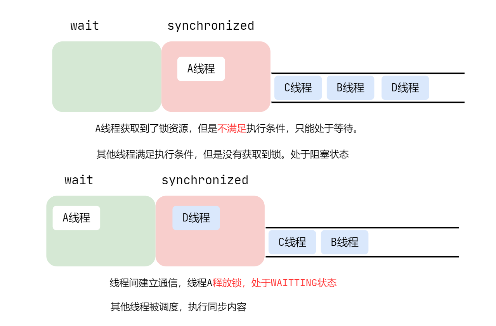
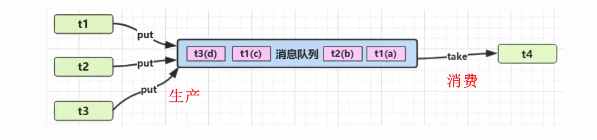

| 方法  | 作用     | 释放锁  |
| ----- | -------- | :-----: |
| sleep | 线程休眠 | 不释放🔒 |
| join  | 线程插队 | 释放锁🔑 |
| yield | 线程让步 | 不释放🔒 |
| wait  | 线程等待 | 释放锁🔑 |

## 1. 线程间的通信

**什么是线程间的通信**

多个线程协同处理同一个资源，线程的任务不相同

**为什么需要线程间的通信**



多个线程并发执行时，在默认情况下CPU是随机切换线程的，当我们需要多个线程来共同完成一件任务，并且希望他们有规律的执行，那么多线程之间需要协调通信，以此来帮我们达到**多个线程共同操作一份数据的目的**。

**如何保证线程间的通信**

多个线程在操作同一份数据时，避免对同一共享变量的争夺，通过**等待唤醒机制**来保证线程能合理有有效的利用资源。

**通信的前提**

<font color = red>**线程必须在同步方法或同步代码块中拿到相应对象的锁，已经获取了锁资源**</font>

## 2. 等待唤醒机制

就像我们前面买票的例子，如果不加锁线程在访问共享资源的时候就会竞争，都去等待CPU的调度来争夺资源。但是，通过`synchronized`和`Lock`来对资源上锁，使资源同时只能被一个线程访问到，避免了并发带来的不安全问题。这属于线程间的**竞争**。

就像人一样，有竞争就会有合作

`wait / notify` 就是线程间的一种协作机制。

**线程间的合作**就是一个线程进行了规定操作后，就进入等待状态`wait`，等待其他线程执行完他们的指定代码过后再将其唤酲`notify`。

在有多个线程进行等待时，如果需要，可以使用`notifyAll`来唤酲所有的等待线程

<br>

### sleep & wait

sleep和wait方法都能使当前线程停止执行，进入到阻塞状态，那具体有什么区别呢？

1. sleep是Thread类的静态方法，而wait是Object的方法
2. sleep在睡眠时，不会释放对象锁；wait会释放对象锁，唤醒之后需要重新竞争锁
3. sleep不强制和`synchronized`一起使用，wait必须在`synchronized`内使用，否则会抛异常

<br>

### 等待唤醒中的方法

- wait、notify必须搭配synchronized使用

使用`wait`、`notify`的前提： 

<font color = red>**必须在同步方法或同步代码块中使用(拿到相应对象的锁)**</font>。即wait、notify必须在`synchronized`中调用才可以，否则会抛出` java.lang.IllegalMonitorStateException`（非法监视器状态异常）

<br>

#### wait

持有锁的线程调用`wait()`后会一直阻塞，直到有线程调用`notify()`将其唤醒

**wait的重载方法：**

```java
public final native void wait(long timeout)
```

等待一段时间，若还未被唤醒，继续执行，默认单位为ms

```java
public class WaitTest {
    public static void main(String[] args) throws InterruptedException {
        Object obj = new Object();
        synchronized (obj) {
            System.out.println("wait开始...");
            obj.wait(3000);
            System.out.println("wait结束...");
        }
    }
}
```

不加唤醒时间，没有notify就会一直处于等待中


添加唤醒时间，在规定的时间内没有被唤醒就会自动结束等待


#### notify

- 唤醒任意**一个**处于等待状态的线程（notify方法就是使等待的线程继续运行）

- 被唤醒之后的线程，处于阻塞状态，需要重新进入EntryList获取锁


等待唤酲机制就是用于解决线程间通信的问题的，使用到的3个方法的含义如下：

1. **wait：** 线程不再参与竞争锁，不再等待CPU调度，进入wait set中，此时线程的状态是WAITING。它要等待别的线程执唤醒它(notify)，通知它从wait set中释放出来，重新进入到调度队列 ready queue中
2. **notify：** 唤醒等待的线程，通知等待的线程从wait set中释放，重新进入到调度队列 ready queue中
3. **notifyAll：** 唤醒所有等待的线程

**注意：**    

**wait会释放锁，notify仅仅只是通知，不释放锁**。

哪怕只通知了—个等待的线程，被通知线程也不能立即恢复执行，因为它当初中断的地方是在同步块内，而此刻它已经不持有锁（wait方法会释放锁来等待），所以它需要再次尝试去获取锁（很可能面临其它线程的竞争），**成功后才能在当初调用wait方法之后的地方恢复执行**。

1. wait方法与notify方法必须要由同一个锁对象调用
2. wait方法与notify方法是属于Object类的方法的
3. wait方法与notify方法必须要在同步代码块或者是同步方法中使用

**总结：**

- 如果能获取锁，线程就从WAITING状态变为就绪状态
- 如果没有获取到锁，就从 **WaitSet** 中出来然后进入到 **EntryList** ，线程从WAITING变为阻塞状态

**notify()唤醒等待的线程：**

```java
class Sync implements Runnable{
    //标志位来唤醒等待的线程
    private boolean flag;
    private Object obj;

    public Sync(Object obj,boolean flag) {
        this.obj = obj;
        this.flag = flag;
    }

    public void waitMethod() {
        synchronized (obj) {
            while (true) {
                try {
                    System.out.println("wait方法开始..." + Thread.currentThread().getName());
                    obj.wait();
                    System.err.println("wait方法结束..." + Thread.currentThread().getName());
                } catch (InterruptedException e) {
                    e.printStackTrace();
                }
            }
        }
    }

    public void notifyMethod() {
        synchronized (obj) {
            System.out.println("notify方法开始,唤醒等待的线程" + Thread.currentThread().getName());
            obj.notify();
            System.err.println("notify方法结束！！！" + Thread.currentThread().getName());
        }
    }


    @Override
    public void run() {
        if (flag) {
            this.waitMethod();
        }else {
            this.notifyMethod();
        }
    }
}

public class SyncWaitNotify {
    public static void main(String[] args) throws InterruptedException {
        Object obj = new Object();
        Sync wait = new Sync(obj,true);
        Sync notify = new Sync(obj,false);
        new Thread(wait,"wait线程").start();
        Thread.sleep(2000);
        new Thread(notify,"notify线程").start();
    }
}
```


**运行结果分析：**

从结果上来看第一个线程执行的是一个waitMethod方法，该方法里面有个死循环并且使用了wait方法进入等待状态将锁释放，如果这个线程不被唤醒的话将会一直等待下去，这个时候第二个线程执行的是notifyMethod方法，该方法里面执行了一个唤醒线程的操作，并且一直将notify的同步代码块执行完毕之后才会释放锁然后继续执行wait结束打印语句。


任意一个Object及其子类对象都有两个队列：

- 同步队列-EntryList：所有尝试获取该对象`Monitor`失败的线程，都加入同步队列，排队获取
- 等待队列-WaitSet：已经拿到了锁的线程在等待其他资源时，主动释放锁，置入该对象等待队列中，等待其被唤醒；当调用`notify()`会在等待队列中任意唤醒一个线程，将其**置入到同步队列尾部，排队获取锁**

**notifyAll**：将等待队列中的所有线程唤醒，并且加入到同步队列

<br>

## 3. 虚假唤醒


线程A和线程B都处于`WAITTING`状态，我想通过`notify`来**唤醒线程A**

但是`notify`唤醒的线程是随机的，我可能会唤醒*线程B*，此时线程A仍然处于`WAITTING`状态。这就是**虚假唤醒**。

怎么解决这个问题呢？

1. 使用`notifyAll()`将线程A、线程B全部唤醒
2. 将判断条件`if`改为`while`
3. JUC工具类下的**Condition**，实现精准唤醒

<br>

### 改变条件判断

比如现在有一个业务类，那么要将条件判断`if`改为`while`循环中，避免虚假唤醒。


开启四个线程，A线程加，B线程减，C线程加，D线程减


正确结果是A、C线程拿到的数字只能是`1`，而B、D线程只能拿到`0`。这就是所谓的**虚假唤醒**

我们拿生产者--消费者模型来举例说明：

举个例子，我们现在有一个生产者--消费者队列和三个线程：

1. 1号线程从队列中获取了一个元素，此时队列变为空

2. 2号线程也想从队列中获取一个元素，但此时队列为空，2号线程便只能进入阻塞`wait`，等待队列非空

3. 这时，3号线程将一个元素入队，并调用`notify`唤醒条件变量

4. 处于等待状态的2号线程接收到3号线程的唤醒信号，便准备解除阻塞状态，执行线程任务(获取队列中的元素)

5. 然而可能出现这样的情况：当2号线程准备获得队列的锁，去获取队列中的元素时，此时1号线程刚好执行完之前的元素操作，返回再去请求队列中的元素，1号线程便获得队列的锁，检查到队列非空，就获取到了3号线程刚刚入队的元素，然后释放队列锁

6. 等到2号线程获得队列锁，判断发现队列仍为空，1号线程**偷走了**这个元素，所以对于2号线程而言，这次唤醒就是**虚假**的，它需要再次等待队列非空

**为什么将`if`改为`while`就能避免虚假等待的问题呢？**

**答：if判断条件只会检查一次，故产生虚假唤醒；while会不断检查，直至满足条件为止**

如果用if判断，多个等待线程在满足if条件时都会被唤醒(虚假的)，就像线程2一样，但实际上条件并不满足（生产的元素已被线程1拿走），生产者生产出来的消费品已经被第一个线程消费了

这就是我们使用while去做判断而不是使用if的原因：

因为等待在条件变量上的线程被唤醒有可能不是因为条件满足而是由于虚假唤醒。所以，我们需要对条件变量的状态进行**不断检查**直到其满足条件，不仅要在进入条件之前前检查条件是否成立，在出了条件之后也要检查。

为什么使用while就可以呢，即使唤醒了所有的消费者线程，当为`if`的时候，条件只会判断一次，但是为`while`时会不停循环判断，如果此时条件是为1，那么AC线程就不能出while，那么他们也就不回执行下面number加的操作了，那么就会避免了这种错误。这也是官方提倡的在使用wait 和notifyAll的时候，必须使用while循环条件判断。

**【小结】**

wait / notify的使用

```java
synchronized(lock) {
    while(条件不成立) {
        lock.wait(); //等待
    } 
    //干活
}

//另一个线程
synchronized(lock) {
    lock.notifyAll()
}
```


<hr>


## 5. 生产消费者模型

生产者消费者模式是通过一个容器来解决生产者和消费者的强耦合问题。生产者和消费者彼此之间不直接通讯，而通过阻塞队列来进行通讯，所以生产者生产完数据之后不用等待消费者处理，直接扔给阻塞队列，消费者不找生产者要数据，而是直接从阻塞队列里取，阻塞队列就相当于一个缓冲区，平衡了生产者和消费者的处理能力。

这个阻塞队列就是用来给生产者和消费者解耦的。大多数设计模式，都会找一个第三者出来进行解耦，如工厂模式的第三者是工厂类，模板模式的第三者是模板类。在学习一些设计模式的过程中，如果先找到这个模式的第三者，能帮助我们快速熟悉一个设计模式

**举一个生活中的例子来说明：**


作为一个即将迈入社会并被生活毒打的卑微青年，毕业后到“工地搬砖”一定会遇到租房子的问题。对于房东来说，我是一个消费者，她是房子的生产者。我要租房子，一定得和房东协商，那么，这个效率就比较低了，如果这个房子我觉得不合适，只能再去看房子，再和其它的房东进行协商；而房东呐，她也只能等着房客来看房子。

但是，有一个机构它聪明呀，他可能偷偷看了“生产者消费者模型”，理解到了其中的真谛，于是，他作为“中介”的角色出现了...现在，他到各个房东手上收集房源，然后整理出来给租客们选择，然后闷声发大财。

那么，中介这个角色是不是就相当于“容器”来解决生产者（房东）和消费者(租客)的强耦合问题。房客住的房子有问题了，找中介；房东想涨房租，找中介；中介来调和房东与房客之间的问题，不在需要房东与房客之间有联系。


**生产消费者模型：应用在线程间通信**

- 消费队列可以用来平衡生产和消费的线程资源
- **生产和消费是异步的**，生产和消费发生在不同时刻，生产的不会被立刻消费

- 生产者仅负责产生结果数据，不关心数据该如何处理，而消费者专心处理结果数据

- 消息队列是有容量限制的，满时不会再加入数据，空时不会再消耗数据

- JDK中各种阻塞队列，采用的就是这种模式


