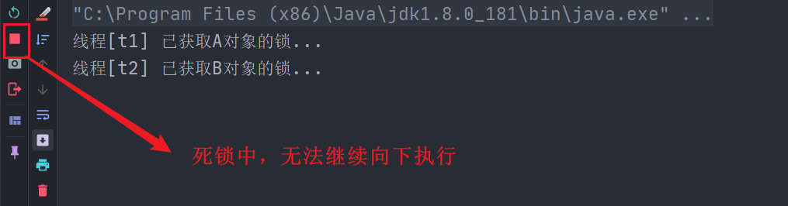
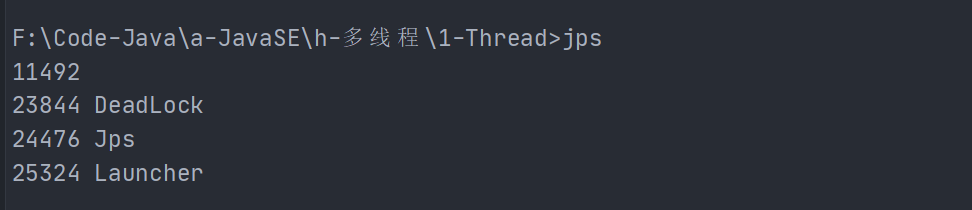
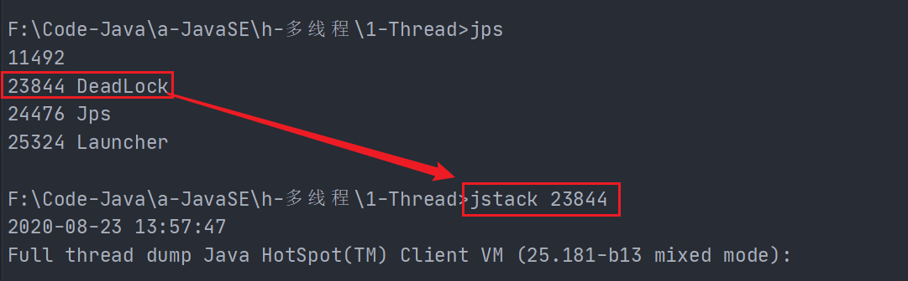
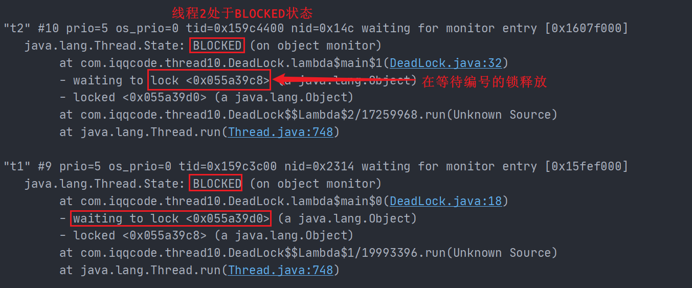
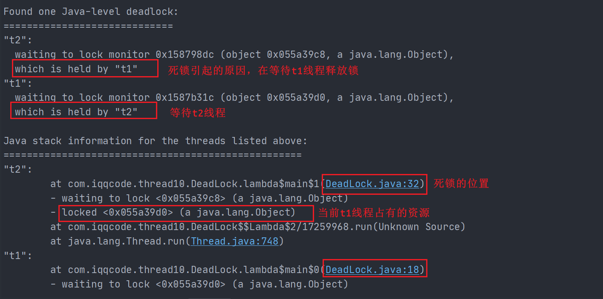
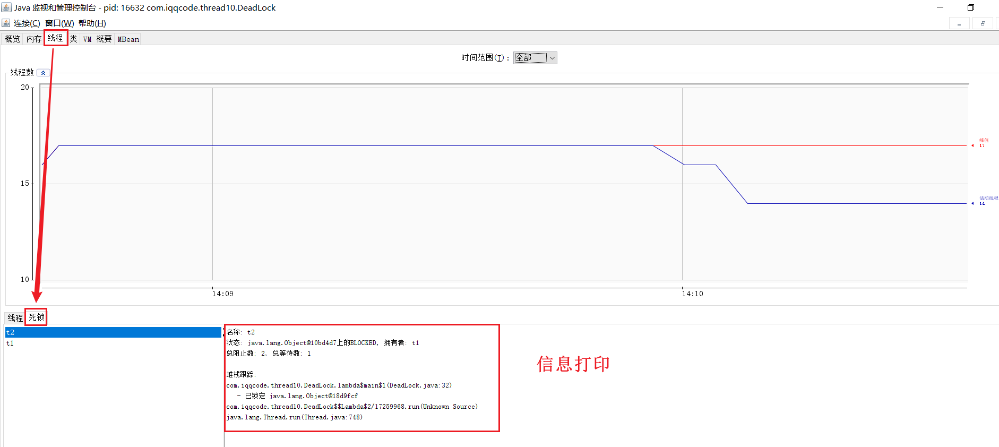
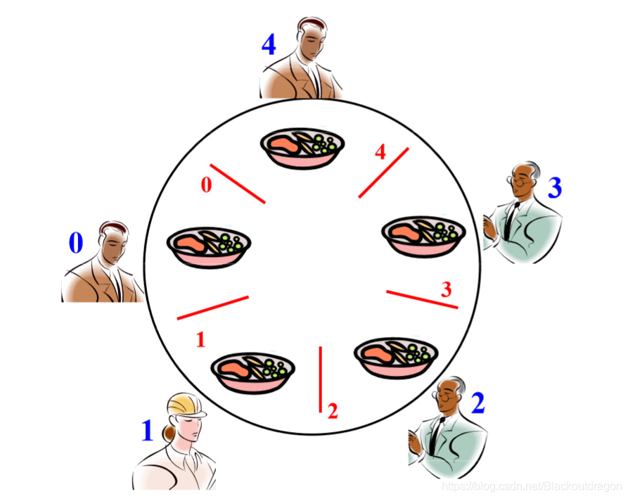

## 1. 死锁

死锁的产生：细粒度的多把锁🔒下，要同时获取对方的锁资源

有这样的情况：一个线程需要同时获取多把锁，这时就容易发生死锁

- t1线程获得 A对象锁，接下来想获取 B对象 的锁
- t2线程获得 B对象锁，接下来想获取 A对象 的锁

<hr>

🔗死锁参生的条件(下列四个条件必须同时满足)：

1. 互斥
2. 不可抢占
3. 占有且等待
4. 循环等待

**I. 互斥**

- 共享资源只能同时被一个线程占用，锁🔒具有独占性

**II. 不可抢占**

- 线程不能强行抢占其他线程的锁

**III. 占有且等待**

- 当前线程拿到了一个锁，不释放的同时又去申请另一个锁

**IV. 循环等待**

- 线程T1等待线程T2占有的资源，线程T2又等待线程T1占有的资源，双方抱着对方需要的资源形成僵持

【解决死锁的思路】：破坏参生条件的任意一个

**【死锁场景模拟】**

一个线程需要同时获取多把锁，这时就容易发生死锁

- t1线程获得 A对象锁，接下来想获取 B对象 的锁
- t2线程获得 B对象锁，接下来想获取 A对象 的锁

```java
public class DeadLock {
    public static void main(String[] args) {
        Object A = new Object();
        Object B = new Object();
        Thread t1 = new Thread(() -> {
            synchronized (A) {
                try {
                    System.out.println("线程[" + Thread.currentThread().getName()+"] 已获取A对象的锁...");
                    Thread.sleep(1000);
                    synchronized (B) {
                        System.out.println("线程[" + Thread.currentThread().getName()+"] 想要获取B对象的锁...");
                    }
                } catch (InterruptedException e) {
                    e.printStackTrace();
                }
            }
        }, "t1");

        Thread t2 = new Thread(() -> {
            synchronized (B) {
                try {
                    System.out.println("线程[" + Thread.currentThread().getName()+"] 已获取B对象的锁...");
                    Thread.sleep(2000);
                    synchronized (A) {
                        System.out.println("线程[" + Thread.currentThread().getName()+"] 想要获取B对象的锁...");
                    }
                } catch (InterruptedException e) {
                    e.printStackTrace();
                }
            }
        }, "t2");

        t1.start();
        t2.start();
    }
}

```



<br>

## 2. 死锁的定位

### 命令行jstack

**1. `jps`查看Java进程id**



**2. jstack查看当前线程信息**



【日志显示】

```java
2020-08-23 13:57:47
Full thread dump Java HotSpot(TM) Client VM (25.181-b13 mixed mode):

"DestroyJavaVM" #11 prio=5 os_prio=0 tid=0x02c4ec00 nid=0x5270 waiting on condition [0x00000000]
   java.lang.Thread.State: RUNNABLE

"t2" #10 prio=5 os_prio=0 tid=0x159c4400 nid=0x14c waiting for monitor entry [0x1607f000]
   java.lang.Thread.State: BLOCKED (on object monitor)
        at com.iqqcode.thread10.DeadLock.lambda$main$1(DeadLock.java:32)
        - waiting to lock <0x055a39c8> (a java.lang.Object)
        - locked <0x055a39d0> (a java.lang.Object)
        at com.iqqcode.thread10.DeadLock$$Lambda$2/17259968.run(Unknown Source)
        at java.lang.Thread.run(Thread.java:748)

"t1" #9 prio=5 os_prio=0 tid=0x159c3c00 nid=0x2314 waiting for monitor entry [0x15fef000]
   java.lang.Thread.State: BLOCKED (on object monitor)
        at com.iqqcode.thread10.DeadLock.lambda$main$0(DeadLock.java:18)
        - waiting to lock <0x055a39d0> (a java.lang.Object)
        - locked <0x055a39c8> (a java.lang.Object)
        at com.iqqcode.thread10.DeadLock$$Lambda$1/19993396.run(Unknown Source)
        at java.lang.Thread.run(Thread.java:748)


Found one Java-level deadlock:
=============================
"t2":
  waiting to lock monitor 0x158798dc (object 0x055a39c8, a java.lang.Object),
  which is held by "t1"
"t1":
  waiting to lock monitor 0x1587b31c (object 0x055a39d0, a java.lang.Object),
  which is held by "t2"

Java stack information for the threads listed above:
===================================================
"t2":
        at com.iqqcode.thread10.DeadLock.lambda$main$1(DeadLock.java:32)
        - waiting to lock <0x055a39c8> (a java.lang.Object)
        - locked <0x055a39d0> (a java.lang.Object)
        at com.iqqcode.thread10.DeadLock$$Lambda$2/17259968.run(Unknown Source)
        at java.lang.Thread.run(Thread.java:748)
"t1":
        at com.iqqcode.thread10.DeadLock.lambda$main$0(DeadLock.java:18)
        - waiting to lock <0x055a39d0> (a java.lang.Object)
        - locked <0x055a39c8> (a java.lang.Object)
        at com.iqqcode.thread10.DeadLock$$Lambda$1/19993396.run(Unknown Source)
        at java.lang.Thread.run(Thread.java:748)

Found 1 deadlock.

```






### 可视化jconsole

> JProfile当然更强大

**1. `jps`查看Java进程id**

**2. 查看线程状态**




## 3. 解决死锁问题

**破坏死锁占有且等待的条件，让两个线程不再同时拿到对方想要的锁**

Lock解决死锁，**破坏不可抢占**：

1. 响应中断`lockInterruptibly`
2. 支持超时`boolean tryLock(long time, TimeUnit unit)`
3. 非阻塞式获取锁，线程若获取不到锁，线程直接退出`boolean tryLock()`

在Lock接口出现之前，Java程序主要是靠`synchronized`关键字实现锁功能。而JDK5之后，并发包中增加了Lock接口，它提供了与synchronized一样的锁功能。虽然它失去了像synchronize隐式加锁解锁的便捷性(Lock锁为显式)，但是却拥有了获取锁和释放锁的可操作性，可中断的获取锁以及超时获取锁等多种synchronized关键字所不具备的同步特性（synchronized锁是互斥的）

<br>

## 4.哲学家就餐问题



有五位哲学家，围坐在圆桌旁。他们只做两件事，思考和吃饭，思考一会吃口饭，吃完饭后接着思考。

- 吃饭时要用两根筷子吃，桌上共有5根筷子，每位哲学家左右手边各有一根筷子。
- 如果筷子被身边的人拿着，自己就得等待

## 5. 活锁

与死锁相对应，谁也无法停止当前线程的执行。

【解决】：随机增加线程休眠时间