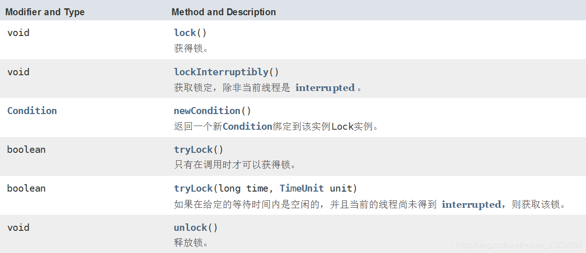
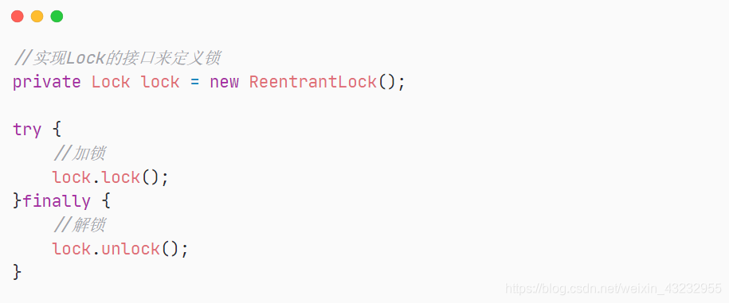

## 1. Lock体系

### Lock接口

Lock----JDK5 基于Java语言实现的线程锁

**Java中实现线程“锁”的方式：**

- synchronized
- Lock

下面来看看Lock接口中定义了哪些方法



1. `void lock();`    获取锁
2. `void lockInterruptibly();`  获取锁的过程能够响应中断
3. ` boolean tryLock();`    非阻塞式响应中断能立即返回，获取锁返回true反之为false
4. ` boolean tryLock(long time,TimeUnit unit);`  超时获取锁，在超时内或未中断的情况下能获取锁
5. `Condition newCondition();`   获取与lock绑定的等待通知组件，当前线程必须先获得了锁才能等待，等待会释放锁，再次获取到锁才能从等待中返回

**Lock类相关介绍**

1. Lock重要的实现类：ReentrantLock 和 ReentrantReadWriteLock。
2. Lock：定义了标准的Lock的api。
3. ReentrantLock ：重入锁(实现了AQS) 支持公平和非公平。
4. ReentrantReadWriteLock：同ReentrantLock 在基础上支持读写分离适合多读少写的场景
5. Condition：是需要与Lock配合使用的，提供多个等待集合，更精确的控制(底层是park/unpark机制)

> **可中断锁**：在等待获取锁过程中可中断。注意是在等待锁过程中才可以中断，如果已经获取了锁，中断就无效。

<br>

## 2. Lock锁的使用

Lock是一个接口，就类似`List`和`Set`接口，具体的使用还是调用其实现类**ReentrantLock(重入锁)**

**Lock实现类介绍**

1. 所的实现类：`AQS`(AbstractQueuedSynchronizer)、`ReentrantLock`、`ReentrantReadWriteLock`、`CountDownLatch`、`Semphore`。
2. 其他多线程协作的场景: `CyclicBarrier`



```java
package com.iqqcode.lock;

import java.util.concurrent.locks.Lock;
import java.util.concurrent.locks.ReentrantLock;

/**
 * @Author: Mr.Q
 * @Date: 2020-05-28 16:55
 * @Description:Lock锁
 */
class Sync implements Runnable {

    //实现Lock的接口来定义锁
    private Lock ticketsLock = new ReentrantLock();
    private int tickets = 20;

    @Override
    public void run() {
        while(true) {
            //需要对程序上锁
            try {
                //等同于synchronized(this)
                ticketsLock.lock();
                Thread.sleep(200);
                if(this.tickets >= 0) {
                    System.out.println(Thread.currentThread().getName() +
                            "还有" + this.tickets-- + "张票");
                }else {
                    break;
                }
            } catch (InterruptedException e) {
                e.printStackTrace();
            } finally {
                ticketsLock.unlock();
            }
        }
    }
}

public class LockSync {
    public static void main(String[] args) {
        Sync run = new Sync();
        new Thread(run,"黄牛A").start();
        new Thread(run,"黄牛B").start();
        new Thread(run,"黄牛C").start();
    }
}
```

可以看出 Lock 可以实现和 synchronized 同样的功能


<br>

---------------

## 3. Condition

Condition：Lock体系的线程通信方式，类比Object类的 wait，notify；可以进一部提高效率，减少线程阻塞与唤醒带来的开销

`await()`:  释放Lock锁，将线程置入等待队列阻塞

`signal()`： 唤醒一个处于等待状态的线程

`signalAll()`:  唤醒所有线程

类比 **wait()** 和 **notify( ）**

获取一个Lock锁的Condition队列：

`Lock.newCondition` : 每当调用一次，就产生一个新的Condition

> 使用详见👉 **《6.线程间的通信》**

<br>

## 5. 使用synchronized还是Lock

1. Lock是显示锁，手动关闭，手动开启；synchronized是隐式锁，出了作用域自动释放

2. Lock只能作用域代码块，而synchronized可以作用域代码块和方法上

3. 使甪Lock锁JVM将花费较少的时间来调度线程，性能更好，并且具有更好的扩展性（提供更多的子类）

4. 若无特殊的应用场景，推荐使用 **synchronized**,其使用方便(隐式的加减锁)，并且由于 synchronized是 JVM层面的实现，在之后的 JDK还有优化

5. 若要使用 **公平锁，读写锁，超时锁**等特殊场景，才会考虑使用 Lock

6. Synchronized是可重入锁，不可以中断的，非公平；Lock是可重入锁，可以判断锁，非公平（可设置）