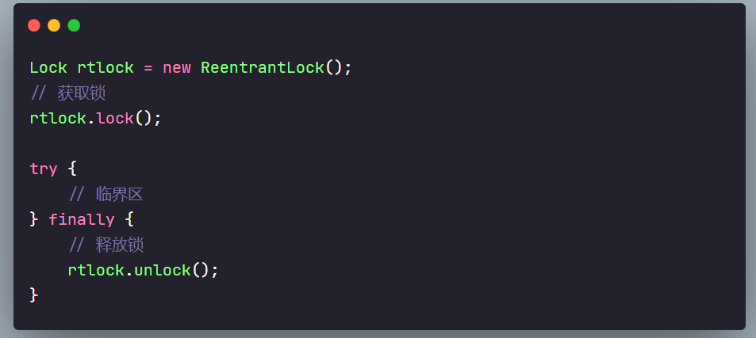
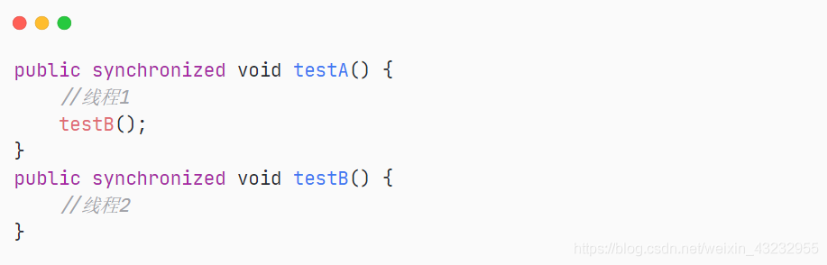
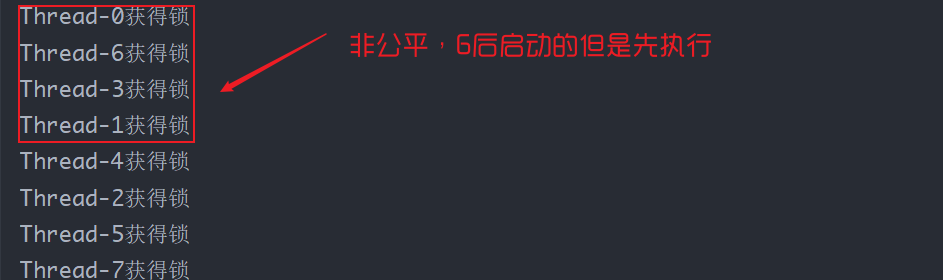
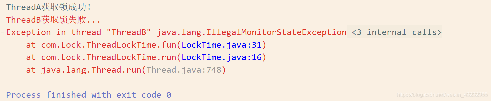
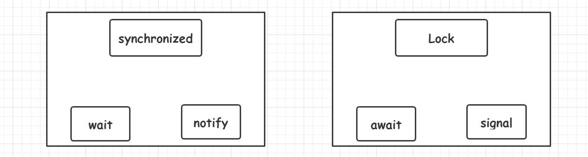
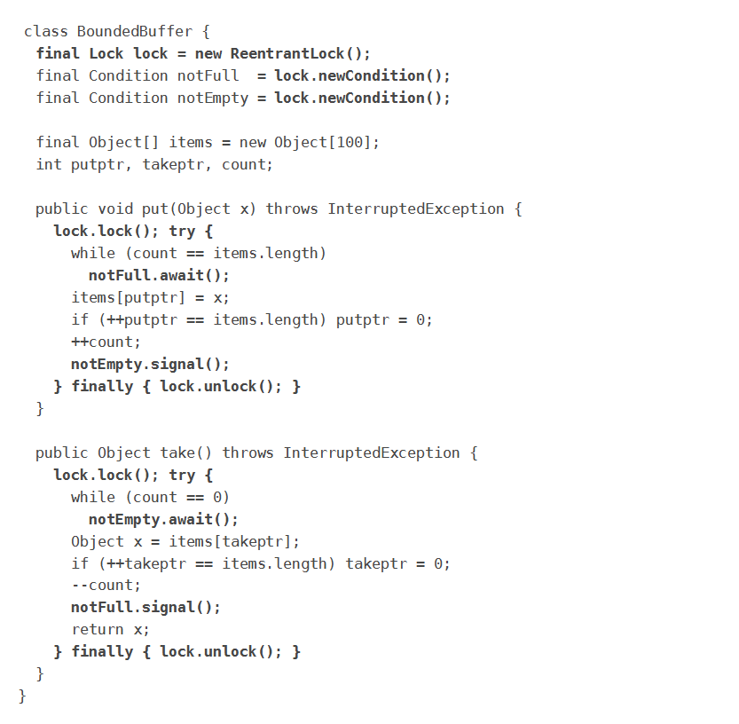
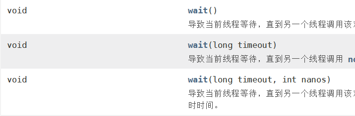

## 1. ReentrantLock简介

相对于Synchronized，ReentrantLock特点如下：

- 可中断
- 可以设置超时时间
- 可设置为公平锁
- 支持多个条件变量实现等待唤醒机制
- 支持可重入

【基本使用】




**独占锁**：在任意时刻，只有一个线程拥有此锁

**共享锁**：在同一时刻，可以有多个线程拥有锁（读写锁是共享锁的一种，读锁共享，写锁独占）

**ReentrantLock可重入锁：** Lock的实现类，持有锁的线程可以再次对锁的计数器`+1`

synchronized有可重入锁，但是重量级的锁



## 2. 可重入锁

三个方法均上锁🔒，验证可重入性：

- `main()`中在未解锁之前调用`method1()`
- `method1()`中在未解锁之前调用`method2()`

```java
public class ReentrantLockTest {

    static ReentrantLock lock = new ReentrantLock();

    public static void main(String[] args) {
        lock.lock();
        try {
            System.out.println("enter main");
            //在未解锁之前调用method1()
            method1();
        } finally {
            lock.unlock();
        }
    }

    public static void method1() {
        lock.lock();
        try {
            System.out.println("enter method1...");
            //锁重入
            method2();
        } finally {
            lock.unlock();
        }
    }

    public static void method2() {
        lock.lock();
        try {
            //锁重入
            System.out.println("enter method2...");
        } finally {
            lock.unlock();
        }
    }
}
```

> enter main
>
> enter method1...
>
> enter method2...

<br>

##  3. 公平锁与非公平锁

【源码查看：ReentrantLock】


默认无参构造创建的是非公平锁，传入`true`代表实现公平锁。

**公平锁非公平锁测试**

```java
class FairUnfair {
    private Lock lock;

    public FairUnfair(boolean isfair) {
        //默认无参为非公平锁
        lock = new ReentrantLock(isfair);
    }

    public void foo() {
        try {
            lock.lock();
            System.out.println(Thread.currentThread().getName() + "获得锁");
        } finally {
            lock.unlock();
        }
    }
}

class ThreadService extends Thread {
    private FairUnfair service;

    public ThreadService(FairUnfair service) {
        this.service = service;
    }

    @Override
    public void run() {
        service.foo();
    }
}

public class FairUnfairLock {
    public static void main(String[] args) {
        //FairUnfair fu = new FairUnfair(false); //非公平锁
        FairUnfair fu = new FairUnfair(true); //公平锁
        Thread[] threads = new Thread[20];
        //创建线程组测试
        for (int i = 0; i < threads.length; i++) {
            threads[i] = new ThreadService(fu);
        }
        //尽量同时启动线程组
        for (int i = 0; i < threads.length; i++) {
            threads[i].start();
        }
    }
}


```




<br>


## 4. 可中断

**可中断：被动的过程，获取不到锁会处于阻塞转态；阻塞后被其他线程打断，防止无限的等待**

- 如果没有竞争，获取Lock对象锁

- 如果有竞争，就进入阻塞队列，一直等待
- 可以被其它线程用 `interrupt`方法打断阻塞等待的状态


<br>

## 5. 支持超时tryLock

**锁可打断是被动的过程，超时是主动的过程**

- 如果获取锁失败，等待一段时间后自动放弃获取

```java
class ThreadLockTime implements Runnable {
    private Lock lock = new ReentrantLock(); //实现 Lock的接口
    @Override
    public void run() {
        fun();
    }

    private void fun() {
        try {
            if(lock.tryLock(1,TimeUnit.SECONDS)) {
                System.out.println(Thread.currentThread().getName() + "获取锁成功！");
                // sleep 2000ms,线程B获取不到锁
                Thread.sleep(2000);
            }else {
                System.err.println(Thread.currentThread().getName() + "获取锁失败...");
            }
        } catch (InterruptedException e) {
            e.printStackTrace();
        } finally {
            lock.unlock();
        }
    }
}

public class LockTime {
    public static void main(String[] args) {
        ThreadLockTime threadLockTime = new ThreadLockTime();
        new Thread(threadLockTime,"ThreadA").start();
        new Thread(threadLockTime,"ThreadB").start();
    }
}
```

代码分析：

`boolean tryLock(long timeout, TimeUnit unit)` 
如果在给定的等待时间内没有被另一个线程占用 ，并且当前线程尚未被保留，则获取该锁interrupted

A,B线程获取锁成功是随机的，看操作系统的调度. 我们以A线程获取锁成功为例

在run( )中调用fun( ),给定的等待时间为  `if(lock.tryLock(1,TimeUnit.SECONDS))` 1s,线程A先拿到锁之后，线程B想要获取锁时，必须得先sleep 2s;

休眠的时间大于给定的等待时间，所以线程B获取锁失败了！



> PS：一个很玄学的问题，上面的测试程序在Windows下测试，构造方法无论是传入`true`或者`false`，结果都是非公平的！但是在Linux或者mac OS上则相反，都是公平的。
>
> 查资料没找到具体的说明，我猜测可能是不同的操作系统，调度线程的方式不同吧，才导致出现这样的问题。

<br>


## 6. Condition实现精准等待唤醒

`synchronized`关键字，它配合Object 的`wait`、`notify`系列方法可以实现等待/通知机制。对于Lock，通过Condition也可以实现**等待/通知**模式

Condition是在JDK 1.5中出现的，它用来替代传统的Object的wait、notify实现线程间的协作，相比使用Object的wait、notify，使用Condition的`await`、`signal`这种方式实现线程间协作更加安全和高效。因此通常来说比较推荐使用Condition，阻塞队列实际上是使用了Condition来模拟线程间协作



Lock和Condition的关系：

Lock只能实现互斥（一个线程持有锁，另外的线程不能访问该锁），但是不能实现通信。而Condition可以实现线程之间的合作通信，**即使当前线程获取了CPU的执行权，但是Condition也可以让当前线程出执行权，通知另外的线程执行**。

Condition是个接口，基本的方法就是`await`和`signal`方法

一个`Condition`实例本质上绑定到一个锁。 要获得特定`Condition`实例的Condition实例，使用其`newCondition()`方法

JDK官方文档使用说明：



调用Condition的`await`和`signal`方法，都必须在Lock保护之内，就是说必须在lock.lock()和lock.unlock之间才可以使用Conditon中的awai和signal，用法和wait、notify类似

### Conditon的优势

同样是线程等待唤醒，那Condition相比于Object中wait和notify的优势是什么？

`notify`只能是唤醒处于`wait`状态的线程，让线程从等待队列中出来重新获取锁。如果此时我有多个线程处于WAINTING状态，我又不想全部将他们唤醒，只唤醒其中特定的几个。

查完wait方法相关的API之后，发现它干不了这个事，要么就是全部唤醒了。



那这个场景，就需要Condition出马了。

**Condition的优势：能够精准的通知和唤醒线程**

我们来实现一个精准唤醒的例子。

### 线程的轮流唤醒

三个线程，一个线程在执行时，其他两个线程处于等待中。

- A执行完后，唤醒B线程

- B执行完后，唤醒C线程

- C执行完后，唤醒A线程

```java
/**
 * @Author: Mr.Q
 * @Date: 2020-06-03 18:41
 * @Description:生产者消费者模型
 * @Solution: 线程A -> 线程B -> 线程C (交替执行,依次唤醒，同一时刻只有一个在执行)
 */

class Data {

    private int number = 1;

    Lock lock = new ReentrantLock();
    Condition condition1 = lock.newCondition();
    Condition condition2 = lock.newCondition();
    Condition condition3 = lock.newCondition();


    //condition.await() 等待
    //condition.signal() 唤醒

    //执行A业务
    public void workA()  {
        lock.lock();
        try {
            //业务：判断 -> 执行 -> 通知
            while (number != 1) {
               condition1.await(); //等待
            }
            System.out.println(Thread.currentThread().getName() + " -> " + number);
            number = 2;
            //线程A执行完，唤醒线程B
            condition2.signal();
        } catch (InterruptedException e) {
            e.printStackTrace();
        } finally {
            lock.unlock();
        }
    }

    //执行B业务
    public void workB() {
        lock.lock();
        try {
            while (number != 2) {
                condition2.await();
            }
            System.out.println(Thread.currentThread().getName() + " --> " + number);
            number = 3;
            //线程B执行完，唤醒线程C
            condition3.signal();
        } catch (InterruptedException e) {
            e.printStackTrace();
        } finally {
            lock.unlock();
        }
    }

    //执行C业务
    public void workC() {
        lock.lock();
        try {
            while (number != 3) {
                condition3.await();
            }
            System.out.println(Thread.currentThread().getName() + " --> " + number);
            number = 1;
            //线程B执行完，唤醒线程C
            condition1.signal();
        } catch (InterruptedException e) {
            e.printStackTrace();
        } finally {
            lock.unlock();
        }
    }
}

public class Condition_wait_notify {
    public static void main(String[] args) {
        Data data = new Data();

        new Thread(() -> {
            for (int i = 0; i < 5; i++) {
                data.workA();
            }
        },"线程A").start();

        new Thread(() -> {
            for (int i = 0; i < 5; i++) {
                data.workB();
            }
        },"线程B").start();

        new Thread(() -> {
            for (int i = 0; i < 5; i++) {
                data.workC();
            }
        },"线程C").start();
    }
}
```

三个线程交替执行：


<br>

-----------------------------

【参考链接】：[Java多线程之Condition的使用](https://blog.csdn.net/yucaixiang/article/details/89357690?ops_request_misc=%257B%2522request%255Fid%2522%253A%2522159140913219195239837882%2522%252C%2522scm%2522%253A%252220140713.130102334..%2522%257D&request_id=159140913219195239837882&biz_id=0)
