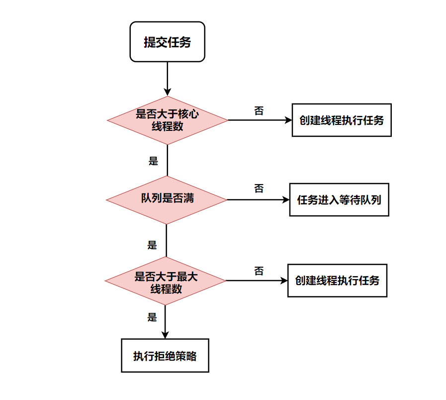
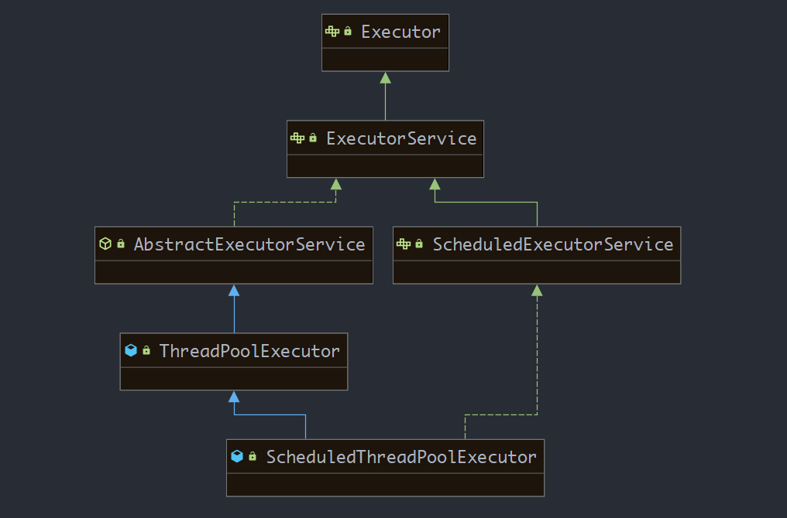
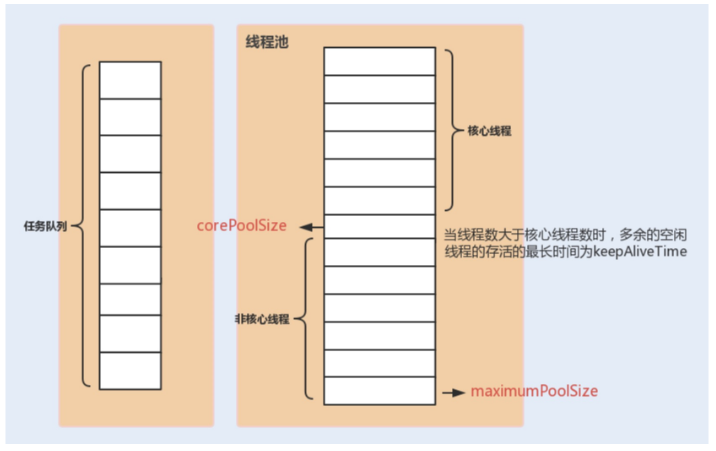
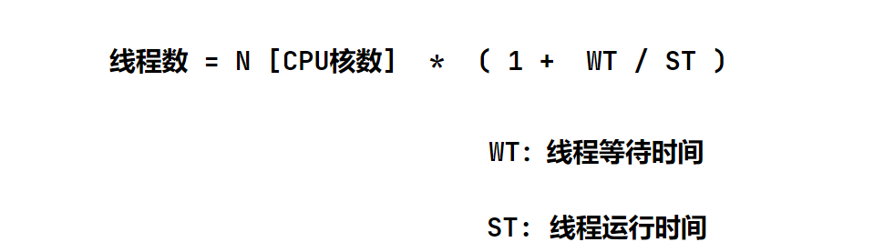

> 线程池：4大方法、7大参数、4种拒绝策略

## 1. 线程池

创建线程的方式

1. 继承 **Thread** `run()`

2. 实现 **Runnable** `run()`

3. 实现 **Callable** `call()`

4. 线程池（推荐使用线程池来创建线程）

### 线程池概述

程序启动一个新的线程的成本是比较高的，因为它要与操作系统来交互。而使用线程池可以很好的提高性能，尤其是当程序中要创建大量<font color=green>**生命周期很短的线程时**</font>，更应该考虑使用**线程池**。

**线程池里的每一个线程在调用结束后，并不会死亡，而是再次回到线程池中成为空闲状态，再次等待调度**

- JDK5之前，线程池必须手动来创建；

- JDK5之后，Java内置线程池来直接使用

### 线程池的优点(结合内核)

1. **降低资源消耗：** 通过重复利用已创建的线程，降低线程创建和销毁带来的开销
2. **提高响应速度：** 当任务到达时，任务可以不需要等待线程的创建能立即执行（线程池中存在已经创建好的线程来直接使用）
3. **提高线程的可管理性：** 使用线程池可以统一进行线程分配、调度和监控

<br>

## 【OS调度执行线程】

**【线程模型分类】**

- [x] **用户级线程[User-Level-Thread]-UTL**

应用程序实现，不依赖操作系统核心。负责创建、同步、调度和管理线程。不需要**用户态 / 核心态**切换，速度快。<font color = red>内核对ULT无感知</font>，线程阻塞则进程阻塞

- [x] **内核级线程[Kernel-Level Thread]-KLT**

内核保存线程的状态和上下文信息，线程阻塞进程-不会阻塞。负责多线程在CPU上的并发处理，需要进行上下文切换

<font color=blue>**用户线程只能依托于内核级线程来调度CPU资源**</font>

-----------------------

**为什么要隔离**

- 提高稳定性，用户线程崩了，内核线程不会受影响；
- 提高安全性，防止用户线程有病毒或攻击

### Java的线程模型

**语言-采用的是内核级线程**


### Java到系统内核线程映射

JVM调用系统库，通过系统调度器在内核空间创建内核线程。内核线程与Java线程是**1 : 1** 的映射关系


**线程上下文切换：**

用户线程寄存器中的上下文环境（当前执行到的指令，程序计数器，中间数据）均保存在内核空间的**TSS任务状态段**中


<br>

---------------------

-----------------------------

## 【线程池工作原理】

1. 当前线程数小于`corePoolSize`，创建线程
2. 当前线程数大于等于`corePoolSize`，且**阻塞队列**未满，将任务放入阻塞队列
3. 当线程数大于等于`corePoolSize`，且阻塞队列已满时：
	- 若线程数小于`maxPoolSize`，创建l**临时线程**执行任务
	- 若线程数等于`maxPoolSize`，抛出异常，拒绝任务




<font color = #70a1ff>**懒加载策略**</font>：创建完线程池之后，默认情况下，线程池中并没有任何线程，等到有任务来才创建线程去执行任务

> **预热：线程池一旦创建就会立即创建线程。** 调用 `prestartAllCoreThreads()` 或者 `prestartCoreThread()` 方法的话，可以提前创建等于核心线程数的线程数量，这种方式被称为**预热**，在抢购系统中就经常被用到


### 线程回收

当线程池中创建的线程数量超过设置的 `corePoolSize`，在某些线程处理完任务后，如果等待 `keepAliveTime `时间后仍然没有新的任务分配给它，那么这个线程将会被回收。线程池回收线程时，会对所谓的“核心线程”和“非核心线程”一视同仁，直到线程池中线程的数量等于设置的 corePoolSize 参数，回收过程才会停止。

即使是 corePoolSize 线程，在一些非核心业务的线程池中，如果长时间地占用线程数量，也可能会影响到核心业务的线程池，这个时候就需要把没有分配任务的线程回收掉。

我们可以通过 allowCoreThreadTimeOut 设置项要求线程池：将包括“核心线程”在内的，没有任务分配的所有线程，在等待 keepAliveTime 时间后全部回收掉。


--------------------

## 线程池核心接口

> Executor并不是线程池，只是一个执行线程的工具



- **ExecutorService**：普通线程池

- **ScheduledExecutoService**：定时线程池

- **ThreadPoolExecutor**：线程池核心类，ExecutorService的默认实现 

- **ScheduledThreadPoolExecutor**：继承自ThreadPoolExecutor实现了ScheduledExecutoService接口，周期性线程任务调度

**ExecutorService普通线程池**

向线程池提交任务：

- `execute(Runnable command)`

- `submit(Collable<T> task || Runnable)`

**ScheduledExecutoService定时线程池**

- `scheduleAtFixedRate()`

## 【ThreadPoolExecutor线程池参数】

> ThreadPoolExecutor 是ExecutorService 的子类

ThreadPoolExecutor的七大核心参数：

```java
public ThreadPoolExecutor(int corePoolSize,  //核心池大小
                          int maximumPoolSize, //最大池大小
                          long keepAliveTime, //线程空闲后，保持存活的时间
                          TimeUnit unit, //时间单位
                          BlockingQueue<Runnable> workQueue, //阻塞队列
                          ThreadFactory threadFactory, //创建线程的工厂
                          RejectedExecutionHandler handler) //拒绝策略
```

1. **corePoolSize核心池**：当提交一个任务到线程池时，线程池会创建一个线程来执行任务，即使有其他空闲线程可以处理任务也会创新线程，等到工作的线程数大于核心线程数时就不会在创建了。如果调用了线程池的`prestartAllCoreThreads`方法，线程池会提前把核心线程都创造好，并启动。如果等于0，则任务执行完后，没有任务请求进入时销毁线程池中的线程。如果大于0，即使本地任务执行完毕，核心线程也不会被销毁。设置过大会浪费系统资源，设置过小导致线程频繁创建。
2. **maximumPoolSize最大池**：必须大于等于1，且大于等于corePoolSize。如果与corePoolSize相等，则线程池大小固定。如果大于corePoolSize，则最多创建maximumPoolSize个线程执行任务，其他任务加入到workQueue缓存队列中，当workQueue为空且执行任务数小于maximumPoolSize时，线程空闲时间超过keepAliveTime会被回收。线程池允许创建的最大线程数。如果队列满了，并且以创建的线程数小于最大线程数，则线程池会再创建新的线程执行任务。如果我们使用了无界队列，那么所有的任务会加入队列，这个参数就没有什么效果了
3. **keepAliveTime线程空闲时间**：线程池中线程空闲时间达到keepAliveTime值时，线程会被销毁，只到剩下corePoolSize个线程为止。默认情况下，线程池的最大线程数大于corePoolSize时，keepAliveTime才会起作用。线程池的工作线程空闲后，保持存活的时间。如果没有任务处理了，有些线程会空闲，空闲的时间超过了这个值，会被回收掉。如果任务很多，并且每个任务的执行时间比较短，避免线程重复创建和回收，可以调大这个时间，提高线程的利用率
4. **unit**：keepAliveTIme的时间单位
5. **workQueue阻塞队列**：<font color = red>当提交的任务数超过核心线程数大小后，再提交的任务就存放在这里</font>。它仅仅用来存放被 `execute `方法提交的 `Runnable `任务
6. **threadFactory创建线程工厂**：用来生产一组相同任务的线程。主要用于设置生成的线程名词前缀、是否为守护线程以及优先级等。**设置有意义的名称前缀有利于在进行虚拟机分析时，知道线程是由哪个线程工厂创建的。**
7. **handler拒绝策略**：当队列里面放满了任务、最大线程数的线程都在工作时，这时继续提交的任务线程池就处理不了，应该执行怎么样的拒绝策略，默认有4种策略

**创建实例：**

`总线程数 = maxPoolSize + queue.size`

```java
ExecutorService pool = new ThreadPoolExecutor(3, 
                                              5, 
                                              1L, 
                                              TimeUnit.SECONDS, 
                                              new ArrayBlockingQueue<>(3), 
                                              Executors.defaultThreadFactory(),  // 默认的线程工厂
                                              new ThreadPoolExecutor.AbortPolicy());
```




<br>

## 【线程数配置】

根据真实的业务场景来配置，公式只能作为参考，因为它是两种极端场景，而真实的业务场景往往是介于两者之间。

<font color = #2ed573>**要根据具体情况，计算出一个大概的数值，再通过实际的性能测试，计算出一个合理的线程数量**</font>

> 拿美团来说，下午3，4点的流量，能和 12 点左右午饭时的流量比吗？

**【线程数量太小】**

线程数量太小，同一时间大量请求将被阻塞在线程队列中排队等待执行线程，此时 CPU 没有得到充分利用；

**【线程数量太大】**

当线程数量太大，被创建的执行线程同时在争取 CPU 资源，又会导致大量的上下文切换，从而增加线程的执行时间，影响了整体执行效率

**【如何判断是 CPU 密集任务还是 IO 密集任务】**

- CPU 密集型简单理解就是利用 CPU 计算能力的任务比如你在内存中对大量数据进行排序

- 但凡涉及到网络读取，文件读取这类都是 IO 密集型，这类任务的特点是 CPU 计算耗费时间相比于等待 IO 操作完成的时间来说很少，大部分时间都花在了等待 IO 操作完成上

<br>

### CPU密集型

**N（CPU 核心数）+ 1**

这种任务消耗的主要是 CPU 资源，应当充分利用CPU资源。`+1`是为了防止线程偶发的缺页中断，或者其它原因导致的任务暂停是线程进入到阻塞状态。一旦任务暂停，CPU 就会处于空闲状态，而在这种情况下多出来的一个线程就可以**充分利用 CPU 的空闲时间**。

<br>

### IO密集型

**2 * N（CPU核数）**

这种任务应用起来，系统会用大部分的时间来处理 I/O 交互，而线程在处理 I/O 的时间段内不会占用 CPU 来处理，这时就可以将 CPU 交出给其它线程使用。因此在 I/O 密集型任务的应用中，我们可以多配置一些线程。

<br>

### 真实业务场景

参考以下公式来计算线程数：

<font color = #ff4757>**线程数 = CPU 核心数 *（ 1 - IO 阻塞系数）**</font>



我们可以通过 JDK 自带的工具 VisualVM 来查看 WT/ST 比例：

```java
WT（线程等待时间）= 36788ms [线程运行总时间] - 36788ms[ST（线程时间运行时间）]= 0

线程数 = N（CPU 核数）*（1+ 0 [WT（线程等待时间）]/36788ms[ST（线程时间运行时间）]）= N（CPU 核数）
```

可以根据自己的业务场景，从“N+1”和“2N”两个公式中选出一个适合的.

- 先计算出一个大概的线程数量
- 之后通过实际压测，逐渐往“增大线程数量”和“减小线程数量”这两个方向调整，然后观察整体的处理时间变化，最终确定一个具体的线程数量

`utilization`CPU利用率


<br>

## 【线程池五种状态】

1. **Running**：接收新任务，处理已添加的任务
2. **Shutdown**：不接受新任务，处理已添加任务（处理队列中的任务）
3. **Stop**：不接受新任务，不处理已添加任务，并且中断当前正在处理的任务
4. **Tydying**：所有任务已终止，`ctl = 0`（ctl记录线城池的运行状态和活动线程数）
5. **Terminated**：线程池销毁


<br>


## JUC下的四大线程池

**Exeutors**类的==静态工厂==提供了常用的线程池

> 直接通过 Exeutors.方法名调用（静态方法）


| 静态方法                    | 解释                                                         |
| --------------------------- | ------------------------------------------------------------ |
| **newCachedThreadPool**     | 可缓存的线程池，可创建任意大小的线程数，只要不超出JVM方法区（本地内存）的大小即可。60s会回收部分空闲线程 |
| **newFixedThreadPool**      | 定长线程池，大小固定且不能更改。可控制线程最大并发数，超出的线程会在队列中等待 |
| **newScheduledThreadPool**  | 定时及周期性任务执行线程任务                                 |
| **newSingleThreadExecutor** | 单线程的线程池。单线程串型执行所有任务， 如果产生了异常，会有新的线程来替代，保证所有任务按序执行 |

1. CachedThreadPool：初始核心线程数量为0，最大线程数量为Integer.MAX_VALUE，线程空闲时存活时间为60秒，并且它的阻塞队列为SynchronousQueue，它的初始长度为0，这会导致任务每次进来都会创建线程来执行，在线程空闲时，存活时间到了又会释放线程资源
1. FixedThreadPool：线程池线程数量固定，即`corePoolSize`和`maximumPoolSize`数量一样
2. SingleThreadPool：单个线程的线程池
4. ScheduledThreadPool：创建一个定长的线程池，而且支持定时的以及周期性的任务执行，类似于Timer

## 为什么不建议使用Executors

使用 `ThreadPoolExecutor` 的构造函数声明线程池

线程池必须手动通过 `ThreadPoolExecutor` 的构造函数来声明，避免使用`Executors` 类的 `newFixedThreadPool` 和 `newCachedThreadPool` ，因为可能会有 OOM 的风险。

**答：原因如下**

<font color = red>**1. 只有使用有界队列，才能控制线程创建数量**</font>

**2. ThreadPoolExecutor能根据业务场景来灵活配置。**实际使用中需要根据自己机器的性能、业务场景来手动配置线程池的参数比如核心线程数、使用的任务队列、饱和策略等等

**3. 应该显示地给我们的线程池命名，这样有助于定位问题**

<br>


-----------------------

## 四大拒绝策略

###  AbortPolicy终止策略

| 功能                                             | 使用场景               |
| ------------------------------------------------ | ---------------------- |
| 当发生拒绝策略时，直接抛出异常，打断当前执行流程 | 抛出异常，终止程序执行 |

```java
public static class AbortPolicy implements RejectedExecutionHandler {
    
        public AbortPolicy() { }
    
        public void rejectedExecution(Runnable r, ThreadPoolExecutor e) {
            throw new RejectedExecutionException("Task " + r.toString() +
                                                 " rejected from " +
                                                 e.toString());
        }
    }
```

ThreadPoolExecutor 中默认的策略就是AbortPolicy

- 使用无界队列的线程池时，内存撑爆了都不会触发拒绝策略。
- 自定义线程池实例时，使用这个策略一定要处理好触发策略时抛的异常，因为他会打断当前的执行流程

<br>

### CallerRunsPolicy调用者运行策略

| 功能                                                         | 使用场景                                                   |
| ------------------------------------------------------------ | ---------------------------------------------------------- |
| 当触发拒绝策略时，只要线程池没有关闭，就由提交任务的当前线程处理 | 一般在不允许失败的、对性能要求不高、并发量较小的场景下使用 |

```java
public static class CallerRunsPolicy implements RejectedExecutionHandler {

        public CallerRunsPolicy() { }

        public void rejectedExecution(Runnable r, ThreadPoolExecutor e) {
            if (!e.isShutdown()) {
                r.run();
            }
        }
    }
```

使用场景：一般在不允许失败的、对性能要求不高、并发量较小的场景下使用，因为线程池一般情况下不会关闭，也就是提交的任务一定会被运行，但是由于是调用者线程自己执行的，当多次提交任务时，就会阻塞后续任务执行，性能和效率自然就慢了。

<br>

### DiscardPolicy丢弃策略

| 功能                                     | 使用场景               |
| ---------------------------------------- | ---------------------- |
| 当发生拒绝策略时，直接丢弃任务，不做处理 | 任务无关紧要或者空实现 |

```java
    public static class DiscardPolicy implements RejectedExecutionHandler {

        public DiscardPolicy() { }

        public void rejectedExecution(Runnable r, ThreadPoolExecutor e) { }
    }
```

<br>

### DiscardOldestPolicy弃老策略

| 功能                                                         | 使用场景                                                   |
| ------------------------------------------------------------ | ---------------------------------------------------------- |
| 如果线程池未关闭，就弹出队列头部的元素（丢弃最先的任务），然后尝试执行 | 尝试和最先开始执行的线程竞争，竞争成功则执行，失败则被丢弃 |

```java
public static class DiscardOldestPolicy implements RejectedExecutionHandler {
        public DiscardOldestPolicy() { }

        public void rejectedExecution(Runnable r, ThreadPoolExecutor e) {
            if (!e.isShutdown()) {
                e.getQueue().poll();
                e.execute(r);
            }
        }
    }
```

【实际使用场景】

发布消息，和修改消息，当消息发布出去后，还未执行，此时更新的消息又来了，这个时候未执行的消息的版本比现在提交的消息版本要低就可以被丢弃了。因为队列中还有可能存在消息版本更低的消息会排队执行，所以在真正处理消息的时候一定要做好消息的版本比较


---------------------

## 线程池提交任务

可以使用两个方法向线程池提交任务，分别为**execute() 和 submit()方法**

`execute()`方法用于提交**不需要返回值**的任务，所以无法判断任务是否被线程池执行成功

`submit()`方法用于提交需要返回值的任务

- 线程池会返回一个Future类型的对象，通过这个Future对象可以判断任务是否执行成功。并且可以通过Future的`get()`方法来获取返回值，并且能够捕获异常，get()方法会阻塞当前线程直到任务完成
- 使用`get(long timeout，TimeUnit unit)`方法则会阻塞当前线程一段时间后立即返回，这时候有可能任务没有执行完

| 线程中提交方法 |       传入参数       | 返回值  |
| :------------: | :------------------: |:------------------: |
| **execute()**  |       Runnable       |   无   |
|  **submit()**  | Runnable 或 Callable |Future 对象 |

```java
// submit
<T> Future<T> submit(Callable<T> task);
<T> Future<T> submit(Runnable task, T result);
Future<?> submit(Runnable task);

//execute
void execute(Runnable command);
```

**submit 方法主要做了两件事情：**

1. 把 Runnable 和 Callable 都转化成 FutureTask
2. 使用 execute 方法执行 FutureTask

<br>

## 关闭线程池

线程池提供了2个关闭方法：`shutdown` 和 `shutdownNow`。

当调用者两个方法之后，线程池会遍历内部的工作线程，然后调用每个工作线程的**interrrupt**方法给线程发送中断信号，内部如果无法响应中断信号的可能永远无法终止，所以如果内部有无线循环的，最好在循环内部检测一下线程的中断信号，合理的退出。调用者两个方法中任意一个，线程池的`isShutdown`方法就会返回true，当所有的任务线程都关闭之后，才表示线程池关闭成功，这时调用`isTerminaed`方法会返回true。

- 调用`shutdown`方法之后，线程池将不再接收新任务，**内部会将`所有`已提交的任务处理完毕**，处理完毕之后，工作线程自动退出

- 调用`shutdownNow`方法后，**线程池会将还未处理的（在队里等待处理的任务）任务移除，将正在处理中的处理完毕之后，工作线程自动退出**

至于调用哪个方法来关闭线程，应该由提交到线程池的任务特性决定，多数情况下调用`shutdown`方法来关闭线程池，如果任务不一定要执行完，则可以调用`shutdownNow`方法。

<br>


## 常见的阻塞队列

**ArrayBlockingQueue**：是一个基于数组的**有界**阻塞队列

**LinkedBlockingQueue**：一个基于链表结构的阻塞队列，静态工厂方法`newFixedThreadPool`使用了这个队列

**PriorityBlockingQueue**：基于数组实现的优先级队列，进入队列的元素按照优先级会进行排序

**SynchronousQueue**：一个不存储元素的阻塞队列，每个插入操作必须等到另外一个线程调用移除操作，否则插入操作一直处理阻塞状态。静态工厂方法`newCachedThreadPool`使用这个队列

1. SynchronousQueue没有容量。与其他BlockingQueue不同，SynchronousQueue是一个不存储元素的BlockingQueue。每一个put操作必须要等待一个take操作，否则不能继续添加元素，反之亦然。
2. 因为没有容量，所以对应 peek, contains, clear, isEmpty … 等方法其实是无效的。例如clear是不执行任何操作的，contains始终返回false,peek始终返回null。
3. SynchronousQueue分为公平和非公平，默认情况下采用非公平性访问策略，当然也可以通过构造函数来设置为公平性访问策略（为true即可）。
4. 若使用 TransferQueue, 则队列中永远会存在一个 dummy node

<br>

## 线程是如何复用的

1. Worker 初始化时把当前 Worker 作为线程的构造器入参，Worker 的 run 方法中调用了 runWorker 方法。
2. 通过取 Worker 的 firstTask 或者通过 getTask 方法从 workQueue 中不停地取任务.
3. 直接调用 Runnable 的 run 方法来执行任务，这样就保证了每个线程都始终在一个循环中，反复获取任务，然后执行任务，从而实现了线程的复用

## 一个线程池中的线程异常了，那么线程池会怎么处理这个线程

1. 当执行方式是`execute`时，可以看到堆栈异常的输出
2. 当执行方式是`submit`时，堆栈异常没有输出。但是调用Future.get()方法时，可以捕获到异常
3. 不会影响线程池里面其他线程的正常执行
4. 线程池会把这个线程移除掉，并创建一个新的线程放到线程池中

## 单核CPU线程安全问题

单核CPU不能保证调度的顺序性和任务的原子性，如果操作不是原子操作，你无法控制cpu在什么时机切换线程

> [单核cpu](https://www.zhihu.com/question/37396742)