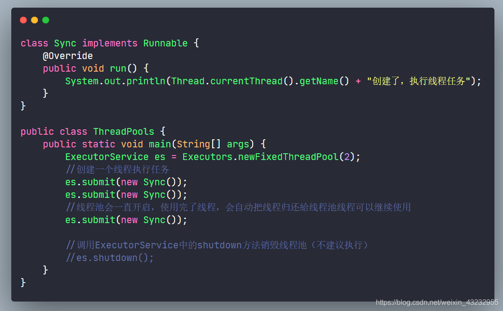
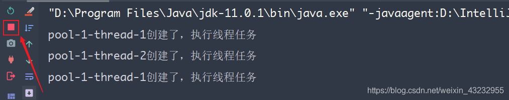

## 【线程池考点】

1. 为什么使用线程池，优点是什么
2. 线程池的工作流程
3. 线程池参数配置
4. 为什么不建议使用Executors
5. 了解JDK Executors线程池吗?知道JDK提供了哪些默认的实现吗？ 
6. 看过阿里巴巴java开发手册吗？知道为啥不允许使用默认的实现吗？ 
7. 你们没有用默认的吧?那来介绍一下你们自定义线程池的几个常用参数呗？ 
8. 你这个几个参数的值是怎么得来的呀？算出来的？怎么算出来的？ 
9. 现在我们有一个自定义线程池了，来说一下你这个线程池的工作流程呗？ 
10. 那你这个线程池满了怎么办呀？拒绝？咋拒绝？有哪些拒绝策略呢？ 

--------------

## 1. 线程池

创建线程的方式

1. 继承 **Thread**

2. 实现 **Runnable**

3. 实现 **Callable**

4. 线程池（推荐使用线程池来创建线程）

### 线程池概述

程序启动一个新的线程的成本是比较高的，因为它要与操作系统来交互。而使用线程池可以很好的提高性能，尤其是当程序中要创建大量<font color=green>**生命周期很短的线程时**</font>，更应该考虑使用**线程池**。

**线程池里的每一个线程在调用结束后，并不会死亡，而是再次回到线程池中成为空闲状态，再次等待调度**

- JDK5之前，线程池必须手动来创建；

- JDK5之后，Java内置线程池来直接使用

### 线程池的优点

1. **降低资源消耗：** 通过重复利用已创建的线程，降低线程创建和销毁带来的开销
2. **提高响应速度：** 当任务到达时，任务可以不需要等待线程的创建能立即执行（线程池中存在已经创建好的线程来直接使用）
3. **提高线程的可管理性：** 使用线程池可以统一进行线程分配、调度和监控

### 线程池的简单使用

我们在线程池中创建两个线程来执行三个线程任务


线程池会一直开启，使用完了线程，会自动把线程归还给线程池，线程可以继续使用


-----------------------------

## 2. 线程池核心接口


### ExecutorService普通线程池

向线程池提交任务：

`execute(Runnable command)`

`submit(Collable<T> task || Runnable)`

### ScheduledExecutoService定时线程池

`scheduleAtFixedRate()`

### ThreadPoolExecutor线程池核心类

ThreadPoolExecutor 是ExecutorService 的子类

ThreadPoolExecutor的七大核心参数：

```java
public ThreadPoolExecutor(int corePoolSize,
                          int maximumPoolSize,
                          long keepAliveTime,
                          TimeUnit unit,
                          BlockingQueue<Runnable> workQueue,
                          ThreadFactory threadFactory,
                          RejectedExecutionHandler handler)
```

1. int corePoolSize：核心线程池大小

2. int maximumPoolSize：最大核心池大小

3. long keepAliveTime：生存时间，超时不调用就会释放（针对救急线程）

4. TimeUnit unit：超时单位（针对救急线程）

5. BlockingQueue<Runnable> workQueue：阻塞队列

6. ThreadFactory threadFactory：线程工厂，创建线程并为线程命名

7. RejectedExecutionHandler handler：拒绝策略

------------------------------

## 3. 线程池工作原理

### 实例讲解

现在我们用银行的业务办理来模拟一个线程池的场景

- 日常营业窗口：int corePoolSize [核心线程池大小]

- 窗口最大营业：int maximumPoolSize [最大核心池大小]

- 办理业务等待时间：long keepAliveTime [超时不调用就会释放]

- 候客区位置数量：BlockingQueue  workQueue [阻塞队列]

- 拒绝策略：RejectedExecutionHandler handler [四种拒绝策略]

我们默认最大营业窗口maximumPoolSize为5，候客区等待位置数量BlockingQueue为3，候客区坐满人时，开启窗口的最大营业

```java
ThreadPoolExecutor pool = new ThreadPoolExecutor( 3, 5,
                                        2000,TimeUnit.MILLISECONDS,                                                                      
                                        new LinkedBlockingDeque<Runnable>());
```

**【日常业务】**

银行日常人数不多时，业务办理窗口并不会全部开启，只会开启部分窗口，候客区人数未满，处于候客区的顾客需要排队等待窗口的空闲位置。


转化为线程池的理解：

当执行的线程小于或者等于核心池数量`corePoolSize`时，此时我们线程池中的线程是够用的。

顾客A在1号窗口办理完了业务离开，处于等待区的顾客1接着去1号窗口办理。1号窗口的线程被反复调用执行。

<kbd>对应代码</kbd>

```java
public class Test {
    public static void main(String[] args) {
        ExecutorService pool = new ThreadPoolExecutor(2,
                5,
                1,
                TimeUnit.SECONDS,
                new LinkedBlockingQueue<>(3),
                Executors.defaultThreadFactory(),
                new ThreadPoolExecutor.AbortPolicy());

        try {
            for (int i = 1; i <= 5; i++) {
                pool.execute(() -> {
                    System.out.println(Thread.currentThread().getName() + " -->> OK");
                });
            }
        } catch (Exception e) {
            e.printStackTrace();
        } finally {
            pool.shutdown();
        }
    }
}
```


**【窗口最大营业】**

如果今天是银行还贷款日，来银行办理业务的人特别多，候客区一直处于全满的状态。此时，银行就需要做出相应的调整了，让所有的窗口全部开启，银行到达最大营业数。


转化为线程池的理解：

需要执行任务的线程数已经超出的核心池的线程数，此时需要再创建线程达到开启最大线程数`maximumPoolSize`

<kbd>对应代码</kbd>

```java
public class Test {
    public static void main(String[] args) {
        ExecutorService pool = new ThreadPoolExecutor(2,
                5,
                1,
                TimeUnit.SECONDS,
                new LinkedBlockingQueue<>(3),
                Executors.defaultThreadFactory(),
                new ThreadPoolExecutor.AbortPolicy());

        try {
            for (int i = 1; i <= 8; i++) {
                pool.execute(() -> {
                    System.out.println(Thread.currentThread().getName() + " -->> OK");
                });
            }
        } catch (Exception e) {
            e.printStackTrace();
        } finally {
            pool.shutdown();
        }
    }
}
```

**最大承载**：maximumPoolSize[最大核心池大小] + workQueue[阻塞队列]

> 需要8个线程来执行任务，最大线程数maximumPoolSize为5，workQueue为3


**【拒绝策略】**

在银行最大营业模式下，并且此时候客区满载，又来了一个人来办理业务，那么银行会告诉他让他等待或者无法办理业务。


转化为线程池理解：

线城池中需要执行任务的线程数量此时已经超出了最大值`maximumPoolSize`，那么此时会调用拒绝策略打回任务。

<kbd>对应代码</kbd>

```java
public class Test {
    public static void main(String[] args) {
        ExecutorService pool = new ThreadPoolExecutor(2,
                5,
                1,
                TimeUnit.SECONDS,
                new LinkedBlockingQueue<>(3),
                Executors.defaultThreadFactory(),
                new ThreadPoolExecutor.AbortPolicy());

        try {
            for (int i = 1; i <= 10; i++) {
                pool.execute(() -> {
                    System.out.println(Thread.currentThread().getName() + " -->> OK");
                });
            }
        } catch (Exception e) {
            e.printStackTrace();
        } finally {
            pool.shutdown();
        }
    }
}
```

抛出`RejectedExecutionException`拒绝执行异常

> java.util.concurrent.RejectedExecutionException: Task com.iqqcode.pool.Test$$Lambda$14/0x0000000100066840@3796751b rejected from java.util.concurrent.ThreadPo


**【窗口关闭】**

银行还款日一过，办理业务的人数又回到了日常状态，为了节约人力物力，将多余窗口关闭。


转化为线程池理解：

长时间线程任务数没有超出核心池`corePoolSize`时，就会关闭释放**keepAliveTime**！

---------------------

### 线程池工作流程


当一个任务提交给线程池时

> 核心线程池 **corePoolSize**
> 
> 最大线程池 **maximumPoolSize**
> 
> 阻塞队列 **BlockingQueue**
> 
> 拒绝策略 **RejectPolicy**

1. 首先判断<font color=#8A2BE2 size=3>核心池</font>的线程数量是否达到 **corePoolSize**. 若未达到，线程池创建新的线程执行任务并<font color=#8A2BE2 size=3>将其置入核心池中</font>;  否则，判断核心线程池是否有<font color=#7FFF00 size=3>空闲线程</font>. 若有，分配任务执行； 否则，进入步骤2
2. 判断当前<font color=#00BFFF size=3>线程池</font>中线程数量有没有达到线程池的最大数**maximumPoolSize**. 若没有，创建新的线程执行任务并将其置入<font color=#00BFFF size=3>线程池</font>中； 否则，进入步骤3
3. 判断<font color=#FFD700 size=3>阻塞队列</font>是否已满. 若未满，将任务置入<font color=#FFD700 size=3>阻塞队列</font>中等待调度. 否则，进入步骤4
4. 调用相应的<font color=#F08080 size=3>拒绝策略</font>打回任务.(有四种拒绝策略，默认抛出异常给用户 **AbortPolicy**)

-----------------------

## 4. 四大拒绝策略

**1. AbortPolicy**

> 抛出异常：相当于还款日你的业务银行没法办理

一个处理程序抛出一个拒绝任务的RejectedExecutionException ， 这是默认的处理程序ThreadPoolExecutor和ScheduledThreadPoolExecutor 


**2. CallerRunsPolicy**

> 不抛出异常，哪里调用在回到哪里执行

用于被拒绝任务的处理程序直接运行被拒绝的任务中的调用线程execute方法，如果执行程序已关闭，在这种情况下，任务将被丢弃

```java
new ThreadPoolExecutor.CallerRunsPolicy());
```


在主线程中调用再回到主线程中执行


**3. DiscardPolicy**

> 不抛出异常，丢弃被拒绝的任务

处理程序用于被拒绝任务是默默丢弃被拒绝的任务


**4.DiscardOldestPolicy**

> 尝试和最先开始执行的线程竞争，竞争成功则执行，失败则被丢弃

用于被拒绝任务的处理程序，它放弃最旧的未处理请求，然后重试execute ，如果执行程序已关闭，在这种情况下，任务将被丢弃。


---------------------

## 5. 创建线程池以及向线程池提交任务

手工创建一个线程池

```java
ThreadPoolExecutor pool = new ThreadPoolExecutor( 3, 5,
                                        2000,TimeUnit.MILLISECONDS,                                                                      
                                        new LinkedBlockingDeque<Runnable>());
```

可以使用两个方法向线程池提交任务，分别为**execute() 和 submit()方法**

- `execute()`方法用于提交不需要返回值的任务; 所以无法判断任务是否被线程池执行成功
- `submit()`方法用于提交需要返回值的任务; 线程池会返回一个future类型的对象，通过这个future对象可以判断任务是否执行成功，并且可以通过future的get()方法来获取返回值，get()方法会阻塞当前线程直到任务完成，而使用`get(long timeout，TimeUnit unit)`方法则会阻塞当前线程一段时间后立即返回，这时候有可能任务没有执行完

| 线程中提交方法       | 传入参数                |
|:-------------:|:-------------------:|
| **execute()** | Runnable            |
| **submit()**  | Runnable 或 Callable |

```java
class ThreadPoolTest implements Callable<String> {
    private Integer tickets = 20;
    @Override
    public String call() throws Exception {
        for (int i = 0; i < tickets; i++) {
            if(tickets > 0)
                System.out.println(Thread.currentThread().getName() +"还剩 "+tickets--+" 票...");
        }
        return Thread.currentThread().getName() + "票卖完了！";
    }
}

public class ExecutorTest {
    public static void main(String[] args) {
        ExecutorService executor = new ThreadPoolExecutor(2,3,
                60,TimeUnit.SECONDS,
                new LinkedBlockingQueue<>());
        ThreadPoolTest threadPoolTest = new ThreadPoolTest();
        for(int i = 0; i < 5; i ++) {
            executor.submit(threadPoolTest); //submit可以提交Callable,Runnable接口
        }
        executor.shutdown();
    }
}
```


提交了5次任务，但是 ThreadPool 创建了两个线程；

原因是核心线程池未满，有空闲线程；由于实现 Callable接口只做了 `System.out`,线程拿到任务很快执行完成；**执行任务的速度快于提交任务的速度**，就不在创建线程了...

**线程池中的线程被包装为Worker工作线程，具备可重复执行任务的能力**

## 6. 合理配置线程池

> 查看当前电脑CPU数目：
> 
> `System.out.println(Runtime.getRuntime().availableProcessors());`
> 
> - 输出为当前电脑CPU核数，可执行的线程数目为CPU核数的两倍。
> 
> - 目前默认一个CPU可以同时执行两个线程

CPU密集型任务 ： 频繁操作CPU（大数运算）

IO密集型任务 ： 频繁操作文件（读写文件）

**配置核心池以及最大线程池线程数量(n为CPU数量)**

- CPU密集型任务：`n`CPU + 1
- IO密集型任务： 2  * `n`CPU

## 7. JDK内置的四大线程池

Executor最核心的类是**ThreadPoolExecutor**，它是线程池的实现类。通过Executor的工具类Executors，可以创建4种类型的 ThreadPoolExecutor

### newCachedThreadPool

**1.缓存线程池(无大小限制的线程池)**：`newCachedThreadPool()` 

使用场景：适用于负载较轻的服务器，或执行很多短期的异步任务

```java
ExecutorService executorService = Executors.newCachedThreadPool();

public static ExecutorService newCachedThreadPool() {
        return new ThreadPoolExecutor(0, Integer.MAX_VALUE,
                                      60L, TimeUnit.SECONDS,
                                      new SynchronousQueue<Runnable>());
    }
```

| 任务提交速度 > 线程执行速度     | 会不断创建线程（有可能无限创建线程将内存写满） |
| ------------------- | ----------------------- |
| **任务提交速度 < 线程执行速度** | **只会创建若干线程**            |

### newFixedThreadPool

**2.固定大小线程池**：`newFixedThreadPool(int nThreads)`

使用场景： 适用于负载较重的服务器，来满足资源分配的要求

```java
ExecutorService executorService = Executors.newFixedThreadPool();

public static ExecutorService newFixedThreadPool(int nThreads) {
        return new ThreadPoolExecutor(nThreads, nThreads,
                                      0L, TimeUnit.MILLISECONDS,
                                      new LinkedBlockingQueue<Runnable>());
    }
```

### newSingleThreadExecutor

**3.单线程池**：`newSingleThreadExecutor()`

使用场景： 多线程场景下需要让任务串行执行

```java
ExecutorService executorService = Executors.newSingleThreadExecutor();

public static ExecutorService newSingleThreadExecutor() {
        return new FinalizableDelegatedExecutorService
            (new ThreadPoolExecutor(1, 1,
                                    0L, TimeUnit.MILLISECONDS,
                                    new LinkedBlockingQueue<Runnable>()));
    }
```

### newScheduledThreadPool

**4.定时调度池**: `newScheduledThreadPool();`

使用场景：ScheduledExecutorService是java.util.concurrent并发包下的一个接口，表示调度服务

```java
ScheduledExecutorService scheduled = Executors.newScheduledThreadPool();

public static ScheduledExecutorService newScheduledThreadPool(int corePoolSize) {
        return new ScheduledThreadPoolExecutor(corePoolSize);
    }
```

**定时调度池中的方法**

1. `scheduled.schedule();`

延迟 delay个时间单元后创建 nThreads个线程执行 command任务

```java
 ScheduledExecutorService scheduled = Executors.newScheduledThreadPool();
 scheduled.schedule();

 public ScheduledFuture<?> schedule(Runnable command,
                                       long delay, TimeUnit unit);
```

2. `scheduled.scheduleAtFixedRate();`

延迟 delay个时间单元后每隔 period time执行一次 command任务

```java
 ScheduledExecutorService scheduled = Executors.newScheduledThreadPool(3);
 scheduled.scheduleAtFixedRate();

public ScheduledFuture<?> scheduleAtFixedRate(Runnable command,
                                                  long initialDelay,
                                                  long period,
                                                  TimeUnit unit);
```

3. `scheduled.scheduleWithFixedDelay();`

`scheduled.scheduleAtFixedRate();` 和 `scheduled.scheduleWithFixedDelay();`都表示每间隔一段时间定时执行任务

- scheduleAtFixedRate是以上一次任务的开始时间为间隔的，并且当任务执行时间大于设置的间隔时间时，真正间隔的时间由任务执行时间为准
- scheduleWithFixedDelay是以上一次任务的结束时间为间隔

> [**ScheduledExecutorService**](https://blog.csdn.net/z2012c/article/details/84827423)中方法详解（参考）

## 8. 常见的阻塞队列

- ArrayBlockingQueue：是一个基于数组结构的**有界**阻塞队列
- LinkedBlockingQueue：一个基于链表结构的阻塞队列，静态工厂方法Executors.newFixedThreadPool()使用了这个队列
- 内置线程池 FixedThreadPool, SingleThreadPool
- SynchronousQueue：一个不存储元素的阻塞队列
- 内置线程池 CachedThreadPool (一个元素的插入必须等待同时有一个元素的删除操作，否则插入操作就一直阻塞)
- PriorityBlockingQueue: 基于优先级的阻塞队列