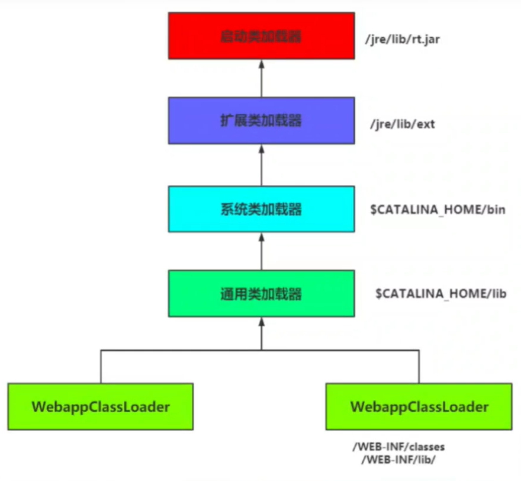
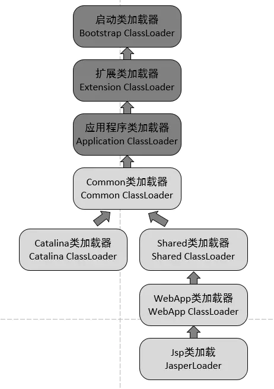

## 1. Java内存结构概述

**Java程序，由编译到运行期间的过程是怎样的？**（概念简述）

- 首先，通过编译器将`.jav a`程序编译成`.class`文件

- 然后通过**Class Loader**类加载器加载到内存中，生成`Class`对象

- 初始化静态属性，将Class对象的数据分配到运行时数据区中

- 执行引擎来解释执行`.class`文件，在运行时数据区读取运行时依赖的数据


-------------------

## 2. 类加载过程

类加载的过程分为三大环节：

1. 加载Loading

2. 链接Linking

3. 初始化Initialition


### 加载Loading

**类加载** 和 **加载**是两个概念，加载属于类加载的第一个环节。

我们写的`.java`程序是保存在磁盘上的，而程序的计算和运行需要加载到内存中来。**加载Loading**是通过IO流将类读取到内存中去。

【加载干了三件事】

**1. 通过类的全限定类名获取此类的二进制字节流**（就是我们上面说的读取）

**2. 将这个字节流所代表的静态存储结构转化为方法区的运行时数据结构**

**3. 在内存中生成此类的**`java.lang.Class`**对象**（反射要获取的Class对象）

> 在Java中一切皆对象，通过Class对象，来调用访问各种数据

### 链接Linking

链接分为三个步骤：

- 验证Verify

- 准备Prepare

- 解析Resolve

**1. 验证Verify**

确保`.class`文件中的信息符合虚拟机的要求，保证被加载类的正确性

主要包括四种验证：

- 文件格式验证

- 元数据验证

- 字节码验证

- 符号引用验证

**2. 准备Prepare**

- 为类变量分配内存并设置初始默认值（赋值在初始化阶段）

- `final`修饰的`static`常量，分配内存并*显示*初始化

- 不为实例变量分配初始化（等到堆上的对象创建时才初始化）

**3. 解析Resolve**

将常量池内的符号引用转为直接引用的过程 

### 初始化Initialization

初始化阶段就是执行类构造器方法`<clinit>()`的过程

此方法不需定义，是 javac编译器自动收集类中的所有类变量的赋值动作和静态代码块中的语句合并而来 

<br>

**类加载时，JVM确保了类加载的过程是线程安全的。只有当前类加载完成，其他类才会被加载**

<hr>

## 3. 类加器的分类

根据JVM规范，JVM支持两种类型的类加载器，分别为：

- 引导类加载器Bootstrap ClassLoader（也称启动类加载器）

- 自定义类加载器Custom ClassLoader

其中，**引导类加载器是由C/C++编写的，Java的核心类库都是使用引导类加载器完成加载**

自定义类加载器分为三层，分别为：

- 拓展类加载器
- 系统类加载器
- 用户自定义类加载器

加载器之间存在层级关系（并不是继承类关系），底层的加载器通过`getParent()`方法可以获取到它上一级的加载器，但是只限定于自定义类加载器器，没法获取到引导类加载器。


**查看类加载器层级关系：**

`ClassLoader`类加载器是负责加载类的对象，ClassLoader类是一个抽象类。

 其后面的所有的的类加载器都是继承自ClassLoader（不包括引导类加载器，因为是C/C++写的，没法继承）

```java
/**
 * @Author: Mr.Q
 * @Date: 2020-06-23 17:03
 * @Description:查看类加载器层级关系
 */
public class ClassLoaderView {
    public static void main(String[] args) {
        //获取系统类加载器
        ClassLoader systemClassLoader = ClassLoader.getSystemClassLoader();
        System.out.println(systemClassLoader); //sun.misc.Launcher$AppClassLoader@b4aac2

        //获取其上层: 拓展类加载器
        ClassLoader extenClassLoader = systemClassLoader.getParent();
        System.out.println(extenClassLoader); //sun.misc.Launcher$ExtClassLoader@14ae5a5

        //获取不到其上层: 引导类加载器
        ClassLoader bootStrapLoader = extenClassLoader.getParent();
        System.out.println(bootStrapLoader); //null

        //用户自定义类加载器: 默认使用系统类加载器
        ClassLoader definedClassLoader = ClassLoaderView01.class.getClassLoader();
        System.out.println(definedClassLoader); //sun.misc.Launcher$AppClassLoader@b4aac2

        //String类使用引导类加载器进行加载: Java的核心类库都是使用引导类加载器完成加载
        ClassLoader classLoader = String.class.getClassLoader();
        System.out.println(classLoader); //null
    }
}
```

**为什么要自定义类加载器？**

- 隔离加载类
- 修改类加载的方式
- 拓展加载源
- 防止源码泄露

## 4. Class对象是否相等

怎么样判断类加载器加载到内存中的两个Class对象是否相等？

在JVM中表示两个Class对象是否为同一个类存在两个必要条件：

- 类的全限定类名必须完全一致，包括包名

- 加载类的类加载器必须相同（ClassLoader实例对象）

在JVM中，即使这两个类对象（c1ass对象）来源同一个Class文件，被同一个虚拟机所加载，但只要加载它们的ClassLoade实例对象不同，那么这两个类对象也是不相等的。

## 5. 双亲委派模型

JVM对`class`文件采用的是<font color = red>按需加载</font>，当需要使用该类时，才会将他的`class`文件加载到内存中。

采用的加载方式是**双亲委派模型**：

- **把请求皆由上层加载器处理，它是一种任务委派模式**

【双亲委派模型验证】：

新建`java.lang`包下新建`String`类

```java
package java.lang; //自定的lang包

//自定义的String类
public class String {
    static {
        System.out.println("自定义的String!");
    }
}
```

测试自定义`String`类：

```java
package iqqocde.loader;

public class StringTest {
    public static void main(String[] args) {
        String str = new String();
        System.out.println("Hello!");
    }
}
```

> 输出：Hello!

为什么可以执行的结果中没有“自定义的String!”呢？

这就涉及到双亲委派模型的原理了：


- **如果一个类加载器收到了类加载的请求，<font color = red>它不会先去自己加载</font>，而是把这个请求委托给父类加载器去执行**

- 若父类加载器还存在其父类加载器，则继续向上一步委托，请求最终到达顶层启动类加载器（也叫引导类加载器）

- 如果向上委托，父类加载器能够完成任务，就成功返回；完不成，子类加载器才会自己去尝试自己加载

我们自定义的类所属的加载器都是**系统类加载器**（APPlication ClassLoader），根据前文的测试，String类使用引导类加载器进行加载。

所以执行引擎并没有识别我们自定义的`java.lang`，而是由引导类加载器加载了JDK的`String`。

如果上层加载器没有识别到，那么才会由系统类加载器加载我们自定义的String类。

------------------

如果此时我们这样写：

```java
package java.lang;

public class String {

    static {
        System.out.println("自定义的String!");
    }

    public static void main(String[] args) {
        System.out.println("Hello!");
    }
}
```


现在，`java.lang`包交由启动类加载器加载，在执行`main`方法时，发现核心API中的`java.lang`包下并没有main方法，所以找不到main方法。

**【双亲委派模型优势】**

- <font color="pink">隔离加载类，避免类的重复加载</font>
- <font color="pink">保护程序安全、防止核心API被篡改</font>

<br>

### Tomcat的类加载机制



每一个部署在Tomcat服务器上的应用的类加载器是WebappClassLoader，有多少个应用，就有多少个这样独立的加载器。

**Tomcat默认的类加载机制并不是双亲委派模型**（可以改）。

Tomcat破坏双亲委派模型，是为了**将各个Web应用隔离开**。

> 例如JDK7和JDK8下，同一个jar包属于不同的版本，我们需要隔离加载不同的版本。

## 6. 双亲委派机制的破坏

### 怎么打破双亲委派机制

1. 自定义类加载器

2. 重写`loadclass`方法

3. 重写`findclass`方法

这里最主要的是重写`loadclass`方法，因为双亲委派机制的实现都是通过这个方法实现的，先找附加在其进行加载，如果父加载器无法加载再由自己来进行加载，源码里会直接找到根加载器，重写了这个方法以后就能自己定义加载的方式了。

### JDBC破话双亲委派机制

原生的JDBC中**Driver**驱动本身只是一个接口，并没有具体的实现，具体的实现是由不同数据库类型去实现的。

例如，MySQL的mysql-connector-.jar中的Driver类具体实现的。 原生的JDBC中的类是放在`rt.jar`包的，是由**启动类加载器**进行类加载的，在JDBC中的Driver类中需要动态去加载不同数据库类型的Driver类，而mysql-connector-.jar中的Driver类是用户自己写的代码，那启动类加载器肯定是不能进行加载的，既然是自己编写的代码，那就需要由**应用程序启动类**去进行类加载。于是乎，这个时候就引入**线程上下文件类加载器(Thread Context ClassLoader)**。有了这个之后，程序就可以把原本需要由启动类加载器进行加载的类，由**应用程序类加载器**去进行加载了。

### Tomcat破坏双清委派机制

**Tomcat要解决什么问题？**

作为一个Web容器，Tomcat要解决什么问题 ， Tomcat 如果使用默认的双亲委派类加载机制能不能行？

1. 我们知道Tomcat可以部署多个应用，不同的应用程序可能会依赖同一个第三方类库的不同版本，不能要求同一个类库在同一个服务器只有一份，因此要保证每个应用程序的类库都是独立的，保证相互隔离 .

	举个例子 假设APP1 使用的是 Spring4 ， APP2 使用的是Spring5 , 毫无疑问 Spring4 和 Spring 5 肯定有 类的全路径一样的类吧，如果使用双亲委派 ，父加载器加载谁？

2. 部署在**同一个web容器中相同的类库相同的版本可以共享**， 比如jdk的核心jar包，否则，如果服务器有n个应用程序，那么要有n份相同的类库加载进虚拟机。

3. **web容器 自己依赖的类库 (tomcat lib目录下)，不能与应用程序的类库混淆**。基于安全考虑，应该让容器的类库和程序的类库隔离开来。

**Tomcat类加载过程：**



**每一个Web应用程序**对应一个WebApp类加载器，每一个**JSP文件**对应一个Jsp类加载器。所以Tomcat将Web应用隔离开来，破坏双清委派加载机制，保证了每个Web应用隔离加载而互不影响。

> [Tomcat 类加载器之为何违背双亲委派模型](https://www.jianshu.com/p/abf6fd4531e7)