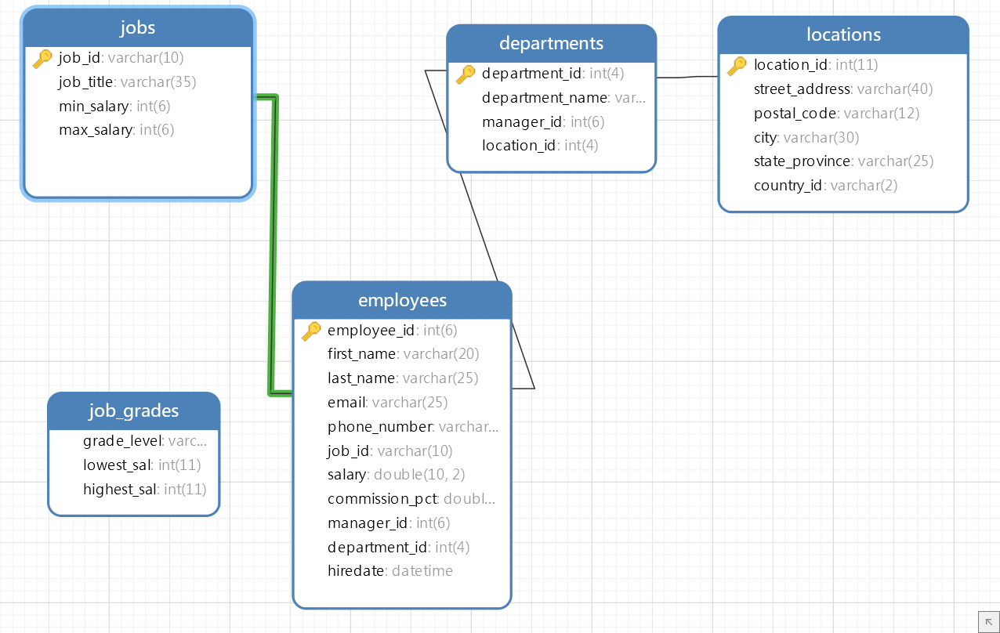
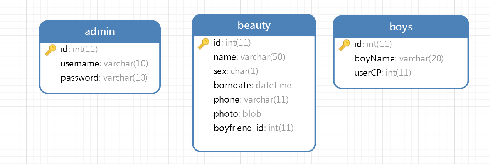
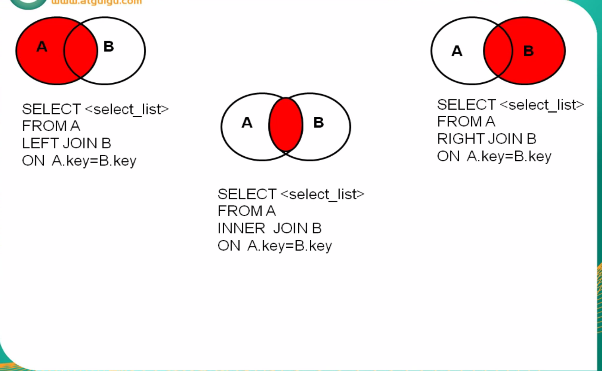
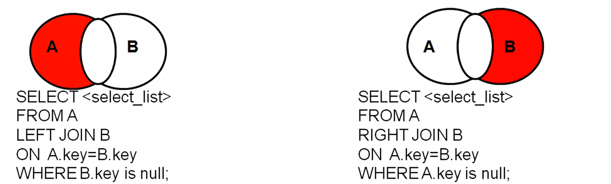
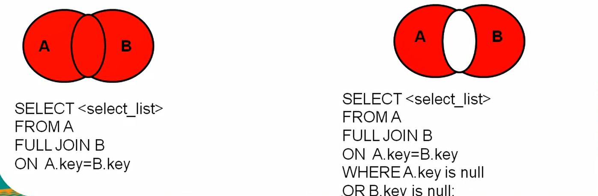

# 1. where基础条件查询

**CONCAT合并列名，做字符串拼接**

```sql
select CONCAT(first_name,last_name) as 姓名 from employees; 
```

**IFNULL判断为空**

- 查询奖金是否为空，为空加为0

```sql
select IFNULL(commission_pct,0) as 奖金, commission_pct from employees;
```

## 1.1 条件表达式查询

- 查询工资大于12000的员工

```sql
select *  from employees where salary > 12000;
```

- 查询部门编号不等于90号的员工名和部门编号

```sql
select last_name,department_id from employees where department_id <> 90;
```

## 1.2 逻辑表达式筛选

- 查询工资在10000到20000之间的员工名、工资以及奖金

```sql
SELECT
	employee_id,
	salary,
	salary * commission_pct 
FROM
	employees 
WHERE
	salary >= 10000 and salary <= 20000;
```

- 查询部门编号不是在90到110之间，或者工资高于15000的员工信息

```sql
SELECT
	*
FROM
	employees 
WHERE
	not(department_id >= 90 and department_id <= 110) or salary >= 15000;	
```

## 1.3 模糊查询

### I. like

- 查询员工名中包含字符a的员工信息

```sql
select last_name from employees where last_name like '%a%';
```

- 查询员工名中第三个字符为n，第五个字符为l的员工名和工资

```sql
SELECT
	last_name,
	salary 
FROM
	employees 
WHERE
	last_name LIKE '__n_l%'
```

- 查询员工名中第二个字符为的员工名

```sql
SELECT
	last_name 
FROM
	employees 
WHERE
	last_name LIKE '_$_%' ESCAPE '$';
	
select last_name from employees where last_name like '_\_%';
```


### II. between-and

- 查询员工编号在100到120之间的员工信息

```sql
select * from employees where employee_id BETWEEN 100 AND 120;
```


### III. in

- 查询员工的工种编号是工IT_ROG、AD_VP、 AD_PRES中的一个员工名和工种编号

```sql
SELECT
	last_name,
	job_id 
FROM
	employees 
WHERE
	job_id IN ( 'IT_PROT', 'AD_VP', 'AD_PRES' );
```

- 憨憨写法	

```sql
SELECT last_name,job_id 
FROM employees 
WHERE job_id = 'IT_PROT' or job_id ='AD_VP'or job_id = 'AD_PRES';
```


### IV.IS NOT NULL

- 查询没有奖金的员工名

```sql
SELECT
	last_name,
	commission_pct
FROM
	employees 
WHERE
	commission_pct IS NULL;	
```

### V. 安全等于<=> 

- 查询没有奖金的员工名

```sql
SELECT last_name,commission_pct FROM employees WHERE commission_pct <=> NULL;
```

- 查询工资为12000的员工信息

```sql
SELECT * FROM employees WHERE salary <=> 12000;
```

<br>

<hr>

<br>

# 2. 排序查询

## 2.1 ORDER BY

- 查询员工信息，要求工资从高到低排序

 ```sql
SELECT * from employees ORDER BY salary desc;
 ```

- 查询部门编号>=90的员工信息，按入职时间的先后进行排序

 ```sql
select * from employees where employee_id >= 90 ORDER BY hiredate;
 ```

- 按年薪的高低显示员工的信息和年薪【按表达式排序】

```sql
SELECT
	*,
	salary *12*(1 + IFNULL( commission_pct, 0 )) AS 年薪
FROM
	employees 
WHERE
	employee_id >= 90 
ORDER BY
	salary *12*(1 + IFNULL( commission_pct, 0 )) desc;
```

- 按年薪的高低显示员工的信息和年薪【按别名排序】

```sql
SELECT
	*,
	salary *12*(1 + IFNULL( commission_pct, 0 )) AS 年薪
FROM
	employees 
WHERE
	employee_id >= 90 
ORDER BY
	年薪 desc;
```

- 按姓名的长度显示员工的姓名和工资【按函数排序】

```sql
SELECT
	LENGTH(last_name) AS 姓名长度,
	last_name,
	salary
FROM
	employees 
ORDER BY
	姓名长度 desc;
```

- 查询员工信息，要求先按工资升序，再按员工编号降序【按多个字段排序】

```sql
SELECT
	*
FROM
	employees 
ORDER BY
	salary desc,employee_id desc;
```

<br>

<hr>

<br>

# 3. 单行函数

## 3.1 字符串函数

- **length**-字符串长度

```sql
select LENGTH('iqqcode');
```

- **concat**-字符串拼接

```sql
select CONCAT(last_name,'_',first_name) 姓名 from employees;
```

- **upper-lower**大小写

```sql
select CONCAT(UPPER(last_name),'_',LOWER(first_name)) AS name from employees;
```

- **substr**-截取字符<索引从1开始>

```sql
select SUBSTR(str FROM pos FOR len);
```

- 姓名中-前两个字符大写，其他字符小写然后用拼接，显示出来

```sql
SELECT
	CONCAT(
		UPPER(
		SUBSTR( last_name, 1, 2 )),
		'_',
		LOWER(
		SUBSTR( last_name, 3 ))
	) AS NAME 
FROM
	employees;
```

- instr-返回子串<第一次>出现的索引，如果找不到返回

```sql
select INSTR(str,substr)
select INSTR('iqqcode_好好学习_iqqcode','学习') AS 输出;
```

**去空格**

- trim()去掉字符串左右两边的空格(或指定字符)

- ltrim()去掉字符串左边的空格(或指定字符)

- rtrim()去掉字符串右边的空格(或指定字符)

```sql
select TRIM([remstr FROM] str)
select TRIM('a' FROM 'aaaaaaaaaa_好好aa学习_aaaaaaa') AS 输出;
```

**replace字符串替换**

```sql
select replace('iqqcdoe爱学习', '学习' , 'Mr.Q') AS 输出;
```

## 3.2 数学函数

- **rounds**四舍五入

```sql
select ROUND(-1.55) AS Result;
select ROUND(-1.554, 2) AS Result;
```

- 向上取整**cell**、向下取整**floor**

```sql
select CEIL(3.1415);
```

随机数**rand**

```sql
select RAND();
```


## 3.3 日期函数

**str_to_date**字符串转日期

- 查询入职日期为1992--4-3的员工信息

```sql
SELECT
   *
FROM
   employees 
WHERE
   hiredate = STR_TO_DATE( '4-3 1992', '%c-%d %Y' );
```

**date_format**---将日期转为字符串

- 查询有奖金的员工名和入职日期(xx月/xx日 xxxx年)

```sql
SELECT
	last_name,
	DATE_FORMAT( hiredate, '%m月/%d日 %y年' ) AS 入职日期 
FROM
	employees 
WHERE
	commission_pct IS NOT NULL;
```

## 3.4 流程函数

**if...els**

```sql
select if(10 < 5, '是','否') As Result;
```

**case**

- 如果工资>20000，显示A级别
- 如果工资>15000，显示B级别
- 如果工资>10000，显示C级别
- 否则，显示D级别

```sql
SELECT salary,
CASE 
	WHEN salary > 20000 THEN 'A'
	WHEN salary > 15000 THEN 'B'
	WHEN salary > 10000 THEN 'C'
	ELSE 'D'
END AS 工资级别
from employees;
```

<br>

<hr>

<br>

# 4. 分组函数

> **分组函数自动忽略NULL值**
>
> **与分组函数使用的必须是`[group by]`后的字段**

**综合使用**

```sql
select SUM(salary) from employees;
select AVG(salary) from employees;
select MIN(salary) from employees;
select MAX(salary) from employees;
select COUNT(salary) from employees;

select SUM(salary) 和, AVG(salary) 平均, MIN(salary) 最大,MAX(salary) 最小,COUNT(salary) 总计 from employees;
```

**distinct去重**

- 去重求和

```sql
select sum(DISTINCT salary),sum(salary) from employees;
```

- 去重计数

```sql
select Count(DISTINCT salary),Count(salary) from employees;
```

## 4.1 COUNT函数

【效率】

 *   MYISAM存储引擎下，`COUNT(*)`的效率高
 *   INNODB存储引擎下，`COUNT(*)`、`COUNT(1)`的效率差不多，比COUNT(字段)要高
 *   字段要判断是否为空

加一列常量值，统计共有多少行

```sql
select COUNT(*) from employees;
select COUNT(1) from employees;
```

<br>

<hr>

<br>

# 5. 分组查询

**分组查询条件删选**

1. **分组前筛选：where**
2. **分组后对结果集再次筛选：having**

**【语法】**

- 查询整个公司下，不同部门的，平均工资

```sql
select 分组函数, 列(必须出现在GROUP BY后面)
FROM Table
[where 筛选条件]
GROUP BY 分组的列表
having(MIN,MAX,COUNT...)
[ORDER BY 子句]
```

**【注意】:   查询列表必须特殊，要求是分组函数(sum...count)和GROUP BY后的出现的字段**

## 5.1 简单分组查询

- 查询每个工种的最高工资

```sql
SELECT MAX(salary),job_id
from employees
GROUP BY job_id;
```

- 查询每个位置上的部门个数

```sql
SELECT COUNT(*),location_id
from departments
GROUP BY location_id;
```

## 5.2 复合分组查询

### I. 分组前筛选

- 查询邮箱中包含a字符的，每个部门的平均工资

```sql
SELECT AVG(salary),department_id
from employees
where email like '%a%'
GROUP BY department_id;
```

- 查询有奖金的每个领导手下员工的最高工资

```sql
SELECT MAX(salary),manager_id
from employees
where commission_pct IS NOT NULL
GROUP BY manager_id;
```

### II. 分组后筛选

**分组后筛选`having`在新生成的结果集上筛选**

**案例1: 查询哪个部门的员工个数 > 2**

- ①查询每个部门的员工个数

```sql
SELECT count(*),department_id
from employees
GROUP BY department_id; 
```

- ②根据①的结果集进行筛选，查询哪个部门的员工个数 > 2

```sql
SELECT count(*),department_id
from employees
GROUP BY department_id
HAVING count(*) > 2;
```

**案例2: 查询每个工种有奖金的员工的最高工资 > 12000的工种编号和最高工资**

- ①查询每工种有奖金的员工的最高工资

```sql
SELECT Max(salary),job_id
from employees 
WHERE commission_pct IS NOT NULL
GROUP BY job_id;
```

- ②根据①结果继续筛选，最高工资>12000

```sql
SELECT Max(salary),job_id
from employees 
WHERE commission_pct IS NOT NULL
GROUP BY job_id
HAVING MAX(salary) > 12000;
```

**案例3：查询领导编号>102的每个领导手下的最低工资>5000的领导编号是哪个，以及其最低工资**

- ①查询领导编号>102的每个领导手下的最低工资

```sql
SELECT MIN(salary), manager_id
FROM employees
where manager_id >= 102
GROUP BY manager_id;
```

- ②根据①结果继续筛选，最低工资>5000;以及其最低工资

```sql
SELECT MIN(salary), manager_id
FROM employees
where manager_id > 102
GROUP BY manager_id
HAVING MIN(salary) > 5000;
```

**按多个字段分组 + 添加排序**

- 查询-每个部门-每个工种的员工的-平均工资 > 10000，并且按平均工资的高低显示

```sql
SELECT AVG(salary) AS avg,job_id,department_id
from employees
WHERE department_id
GROUP BY job_id,department_id
HAVING avg > 10000
ORDER BY AVG(salary) DESC;
```

<br>

<hr>

<br>

# 6. 连接查询

连接查询即为多表查询

- **内连接：求并集**
- **左外连接：左表的所有记录，主表为左表**
- **右外连接：右表的所有记录，主表为右表**



- **左外 + where去重**
- **右外 + where去重**



- **全外**
- **全外 + where去重**



## 6.1 内连接

### I. 等值连接

1. 查询女神名和对应的男神名

```sql
use girls;

select name,boyName
from beauty,boys
where beauty.boyfriend_id = boys.id;
```

2. 查询员工名和对应的部门名

```sql
use myemployees;

select last_name,department_name
from employees,departments
where employees.department_id = departments.department_id;
```

> 为表起别名，防止不同表的相同字段名产生歧义

> 如果为表起了别名, 则查询的字段就不能使用原来的表名去限定, 表的顺序可以交换

3. 查询员工名、工种号、工种名

```sql
select last_name, e.job_id, job_title
from employees AS e, jobs AS j
where e.job_id = j.job_id;
```

4. 查询有奖金的员工名、部门名

```sql
select last_name, department_name, commission_pct
from employees AS e, departments AS d
WHERE e.department_id = d.department_id
AND e.commission_pct IS NOT NULL;
```

5. 查询城市名中第二个字符为o的部门名和城市名

```sql
SELECT department_name,city
FROM departments AS d,locations AS l
WHERE d.location_id = l.location_id
AND city like '_o%';
```

6. 查询每个城市的部门个数

```sql
SELECT COUNT(*) count, city
FROM departments AS d,locations AS l
WHERE d.location_id = l.location_id
GROUP BY city;
```

7. 查询有奖金的每个部门的部门名和部门的领导编号和该部门的最低工资

```sql
SELECT department_name,d.manager_id,MIN(salary)
from employees AS e, departments AS d
WHERE e.department_id = d.department_id
AND commission_pct IS NOT NULL
GROUP BY department_name,d.manager_id;
```

- [SQL-99]

```sql
SELECT department_name,d.manager_id,MIN(salary)
from employees AS e
INNER JOIN departments AS d
ON e.department_id = d.department_id
WHERE commission_pct IS NOT NULL
GROUP BY department_name,d.manager_id;
```

8. 查询哪个部门的员工个数>3的部门名和员工个数，并按个数降序（添加排序）

- a. 查询每个部门的员工个数

```sql
SELECT count(*) AS 员工数,department_name
from employees AS e
INNER JOIN departments As d
ON e.department_id = d.department_id
GROUP BY department_name
```

- b. 在a的基础上进行筛选, 员工个数 > 3 并按个数降序

```sql
SELECT count(*),department_name
from employees AS e
INNER JOIN departments As d
ON e.department_id = d.department_id
GROUP BY department_name
HAVING COUNT(*) > 3
ORDER BY COUNT(*) DESC;
```

**三表查询**

9. 查询员工名、部门名和所在的-s开头的城市

```sql
SELECT last_name,department_name,city
from employees AS e, departments AS d,locations AS l
where e.employee_id = d.department_id
AND d.location_id = l.location_id
AND city like 's%'
ORDER BY department_name desc;
```

- [SQL-99]

```sql
SELECT last_name,department_name,city
from employees AS e
INNER JOIN departments AS d  ON e.employee_id = d.department_id
INNER JOIN locations AS l    ON d.location_id = l.location_id
where city like 's%'
ORDER BY department_name desc;
```

### II. 非等值连接

==where的条件不再是等于==

- 查询员工-工资的对应级别及-每个级别的个数>20(降序排序)

```sql
SELECT salary, grade_level, count(*)
from employees e, job_grades g
where e.salary BETWEEN g.lowest_sal AND g.highest_sal
GROUP BY grade_level
HAVING count(*) > 20
ORDER BY grade_level desc;
```

- [SQL-99]

```sql
SELECT salary, grade_level, count(*)
from employees e
INNER JOIN job_grades g
ON e.salary BETWEEN g.lowest_sal AND g.highest_sal
GROUP BY grade_level
HAVING count(*) > 20
ORDER BY grade_level desc;
```

### III. 自连接

==一张表当做多张表使用==

- 查询员工名和他对应的上级的名称

```sql
SELECT e.last_name AS 员工名, m.last_name AS 领导名
FROM employees e, employees m
where e.manager_id = m.employee_id;
```

- [SQL-99]

```sql
SELECT e.last_name AS 员工名, m.last_name AS 领导名
FROM employees e
INNER JOIN employees m
ON e.manager_id = m.employee_id;
```

## 6.2 SQL99-外连接

**一、【应用场景】: 用于查询一个表中有,另一个表没有的记录**

**二、【语法】**

```sql
SELECT 查询列表
FROM  表1  别名 [连接类型]
join  表2  别名
on  连接条件
[where  筛选条件]
[group by  分组 ]
[having 筛选条件]
[order by排序列表]
```

**三、【分类】**

**内连接：inner**

**外连接**

- 左外: left  [outer]
- 右外: right [outer]
- 全外: full  [outer]

**交叉连接: cross**

**四、【特点】**

**1. 外连接的查询结果为主表中的所有记录**

- 有和它匹配的，则显示匹配的值

- 如果从表中没有和它匹配的，则显示null
- [外连接查询结果 = 内连接结果 + 主表中有而从表没有的记录]		

**2. 主表选择**

- 左外连接，`left join`  左边的是主表

- 右外连接，`right join`右边的是主表

**3. 左外和右外交换两个表的顺序, 可以实现同样的效果**

-----------------------

### I. 左右外连接-相互转化

1. 查询男女CP组合

```sql
use girls

[左外连接]写法:
select g.name, b.boyName
from beauty AS g
LEFT OUTER JOIN boys AS b 
ON g.boyfriend_id = b.id;

[右外连接]写法:(调换主表位置即可)
select g.name, b.boyName
from boys AS b  
RIGHT OUTER JOIN beauty AS g
ON g.boyfriend_id = b.id;
```

2. 查询哪个部门没有员工

```sql
use myemployees;

[左外]
select department_name, e.employee_id
from departments AS d
left outer join employees AS e
ON e.employee_id = d.department_id
where e.employee_id is NULL;

[右外]
select department_name, e.employee_id
from employees AS e
RIGHT outer join departments AS d
ON e.employee_id = d.department_id
where e.employee_id is NULL;
```

### II. 全外连接


## 6.3 交叉连接

就是[SQL-92]语法的笛卡尔积