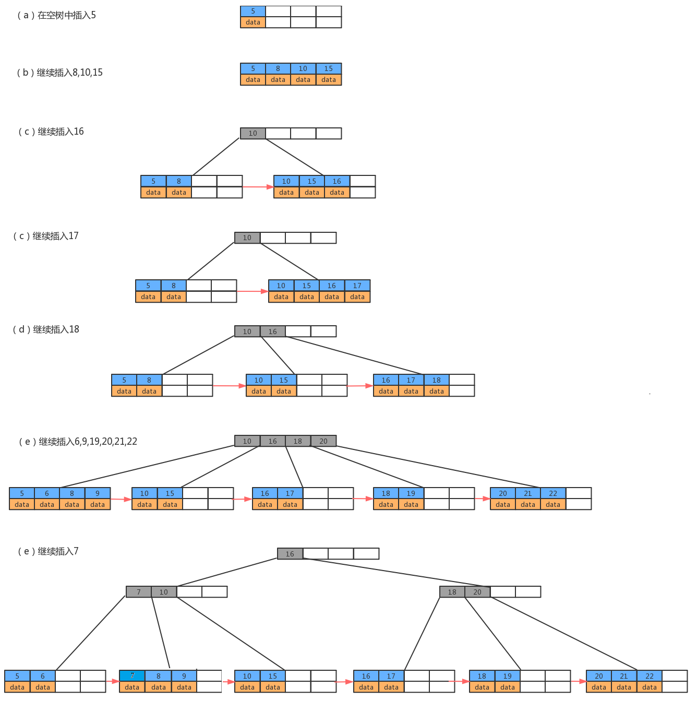

## 1. B树与B+树的区别

B-树、B+树、红黑树都是平衡查找树，从查询效率上讲，平均都是O(log n)

**【B树与B+树的本质区别】**

- B树节点存放数据，B+树的所有数据存放在叶子节点
- B+树叶子节点是双向链表，并且是有序的

### 叶子-非叶

**【叶子节点】**

- InnoDB：主键ID对应的行数据记录
- MyISAM：存储指向数据行的指针，可以直接取得全部的数据行数据

**【非叶子节点】**

- **非叶子节点不保存数据，只保存子树的`key`的临界值（最大或者最小）**。非叶子节点相当于是叶子节点的索引（稀疏索引），存储的是数据索引范围的临界值，所有的非叶子节点都可以看成是索引部分

 

## 2. B+树的优势

1. **B+树能够显著降低磁盘IO，使非叶节点的每一页能够存放更多的索引数据**。由于B+树在**非叶子结点上不包含真正的数据**，**只当做索引使用**，因此在内存相同的情况下，能够存放更多的`key`，所以每一层能够包含更多的节点因子，树高更矮。
2. **B+树的叶子结点都是相连且有序的，叶子节点间维护了双向链表，方便范围查找**。因此对整棵树的遍历只需要一次线性遍历叶子结点即可。而且由于数据顺序排列并且相连，所以便于区间查找和搜索。而B树则需要进行每一层的递归遍历
3. **更稳定的查询效率**。B+树是绝对平衡的数，时间复杂度为`O(logn)`

### 降低磁盘IO

**从磁盘中读取数据时，都是按照磁盘页来读取的，并不是一条一条的读。** 如果我们能把尽量多的数据放进磁盘页中，那一次IO读取操作就会读取更多数据，那我们查找数据的时间也会大幅度降低。 

关系数据库这种数据量大索引能达到亿级别，为了减少内存的占用，索引也会被存储在磁盘上。B-树/B+树的特点就是**每层节点数目非常多，层数少，目的就是为了减少磁盘的IO次数**。 

但是B-树的每个节点都有`data`域（指针），这无疑是增大了节点大小，也增加了磁盘的IO次数（因为磁盘IO一次读出的数据量大小是固定的，单个数据变大，每次读出的就会减少，IO次数也会增多），而**B+树除了叶子节点其他节点并不存储数据，节点小，磁盘IO次数就少**。

### 范围查找

B+树所有的`Data`域在叶子节点，B+树中各个页之间是通过**双向链表**连接的，叶子节点中的数据是通过**单向链表**连接的。这样遍历叶子节点就能获得全部数据，这样就能进行**区间访问**了。在数据库中基于范围的查询时非常频繁的，而B树不支持这样的遍历操作。

----------------------

## 3. 举例计算

- `p`指针存放的是磁盘文件的地址

InnoDB每一页大小为`16kb`，存取的主键字段`int`大小为`4B`，磁盘文件地址指针`p`大小为`6B`，当前B+树高为3，且叶子节点全部放满：

- 第一层存放`16kb / (6 + 4B)` = **1638**个index
- 第二层存放**1638**个index
- 第三层为`16kb `的**data**

共计存放`1638 * 1638 * 16`= **4000万** 条主键索引数据

一般**根节点是常驻内存**的，所以一般我们查找10亿数据，只需要2次磁盘IO。

 

 

 

## 附录说明

B树中允许一个结点中包含多个key，可以是3个、4个、5个甚至更多，并不确定，需要看具体的实现。现在我们选择一个参数M，来构造一个B树，我们可以把它称作是M阶的B树，那么该树会具有如下特点：

- 每个结点最多有M-1个key，并且以升序排列；

- 每个结点最多能有M个子结点；

- 根结点至少有两个子结点；

###  B树的优点

由于B树的每一个节点都包含key和value，因此我们根据key查找value时，只需要找到key所在的位置，就能找到value，但B+树只有叶子结点存储数据，索引每一次查找，都必须一次一次，一直找到树的最大深度处，也就是叶子结点的深度，才能找到value。

### B+树

B+树是对B树的一种变形树，它与B树的差异在于：

1. 非叶结点仅具有–索引作用，也就是说，**非叶子结点只存储key，不存储value**；
2. 树的所有叶结点构成一个**有序链表**，可以按照key排序的次序遍历全部数据。

### B+树存储数据

若参数M选择为5，那么每个结点最多包含4个键值对，我们以5阶B+树为例，看看B+树的数据存储。

### 未建立主键索引查询

执行`select * from user where id=18 `,需要从第一条数据开始，一直查询到第6条，发现id=18，此时才能查询出目标结果，共需要比较6次；

执行`select * from user where id = 18` ，如果有了索引，由于B+树的叶子结点形成了一个有序链表，所以我们只需要找到id为12的叶子结点：

- `18 > 12`，在`12`节点的右孩子
- 遍历右孩子链表，根据`key=18`，找到其地址即可

按照遍历链表的方式顺序往后查即可，共查询了3次，效率非常高。

**在区间查询时，效率体现的更加明显**

------------

【参考文章】

[1] [B-Tree和 B+Tree的数据存储结构](https://www.cnblogs.com/gekh/p/9965444.html)

[2] [MySQL为什么选择B+树作为索引结构](http://www.gxlcms.com/mysql-366759.html)

[3] [B+树叶子结点到底存储了什么](https://blog.csdn.net/Alice_8899/article/details/105357902)

[4] [数据结构之B-树、B+树](https://blog.csdn.net/xdzhouxin/article/details/80015424)