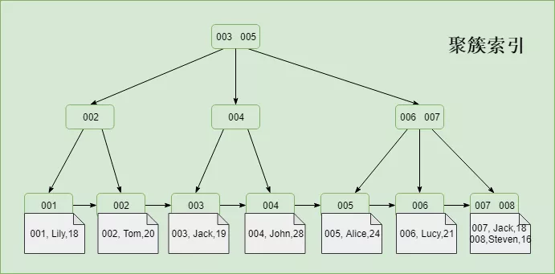

## 【小结】

**InnoDB**

- 聚集索引叶子节点直接存储**主键对应的行数据记录**，B+树根据主键ID来构建
- 非聚集索引叶子节点存储**主键ID**，B+树根据该列的ASCII来构建，需要回表再走一遍聚簇索引（主键索引）

**MyISAM**

- 聚簇或非聚簇-叶节点的data域存放的是<font color = #ff4757>**数据记录的地址**</font>

<br>

# 1. 索引分类

> 索引从不同角度划分有很多种，有时候常常是同一种名字下，包含了多种分类，所以感觉比较混杂。

按照不同的标准下，索引的分类：


## 1.1 数据结构分

> 聚集索引并不是一种索引类型，而是一种**数据存储方式**。

索引是在MySQL的存储引擎层中实现的，而不是在服务器层实现的。MySQL目前提供了以下4种索引：

- BTREE 索引 ： 最常见的索引类型，大部分索引都支持 B 树索引
- HASH 索引：只有Memory引擎支持 ， 使用场景简单 
- R-tree 索引（空间索引）：空间索引是MyISAM引擎的一个特殊索引类型，主要用于地理空间数据类型
- Full-text （全文索引） ：全文索引也是MyISAM的一个特殊索引类型，主要用于全文索引，InnoDB从Mysql5.6版本开始支持全文索引

**MyISAM、InnoDB、Memory三种存储引擎对各种索引类型的支持**

| 索引        | InnoDB引擎      | MyISAM引擎 | Memory引擎 |
| ----------- | --------------- | ---------- | ---------- |
| BTREE索引   | 支持            | 支持       | 支持       |
| HASH 索引   | 不支持          | 不支持     | 支持       |
| R-tree 索引 | 不支持          | 支持       | 不支持     |
| Full-text   | 5.6版本之后支持 | 支持       | 不支持     |

<br>

## 1.2 数据存储方式分（InnoDB）

B+树索引按照存储方式的不同分为<font color = #1fb6f5>**聚簇索引（聚集索引）**</font>和<font color = #1fb6f5>**非聚簇索引（非聚集索引）**</font>

### 聚簇索引

**叶子节点包含了完整的行数据记录**

普通二级索引（非主键索引<——>非聚簇索引），存储的是索引所在行的主键



**生成聚簇索引**

1. 如果表定义了PK，则PK就是聚集索引；
2. 如果表没有定义PK，则第一个`not NULL unique`列是聚集索引；
3. 否则，InnoDB会创建一个隐藏的`row-id`作为聚集索引；

<br>

### 非聚簇索引

**叶子节点存储的是主键ID，通过主键ID回表再走一次聚簇索引，索引覆盖（联合索引中包含了字段信息）则不必回表**


<font color = #0ada90>**针对InnoDB而言：**</font> **非聚集索引**的叶子节点不存储表中的数据，而是存储**主键值**，想要查找数据还需要根据主键再去聚集索引中进行查找，称为**回表**

> **针对InnoDB而言：** **不管以任何方式查询表， 最终都会利用主键通过聚集索引来定位到数据， 聚集索引（主键）是通往真实数据所在的唯一路径**

<font color = #0ada90>**针对MYISAM而言：**</font>因为数据和主键是分开存储的，所有索引类型都是<font color = #f51f1f>**非聚集索引**</font>，MyISAM引擎中主键索引和二级索引基本没有什么区别，索引都可以直接取得全部的数据行数据，<font color = #f51f1f>所以MyISAM表中的主键索引和二级索引都没有二次查询（回表）问题</font>


## 【聚簇索引的优劣】

### 优势

1. **进行IO的次数更少**。由于行数据和叶子节点存储在一起，同一页中会有多条行数据，访问同一数据页不同行记录时，已经把页加载到了Buffer中，再次访问的时候，会在内存中完成访问，不必访问磁盘。

2. 聚簇索引适合用在**排序的场合**，非聚簇索引不适合

3. 取出**一定范围数据**的时候，使用用聚簇索引
4. 可以把**相关数据保存在一起**。例如实现电子邮箱时，可以根据用户 ID 来聚集数据，这样只需要从磁盘读取少数的数据页就能获取某个用户的全部邮件。如果没有使用聚簇索引，则每封邮件都可能导致一次磁盘 I/O。

> 二级索引需要两次索引查找，而不是一次才能取到数据，因为存储引擎第一次需要通过二级索引找到索引的叶子节点，从而找到数据的**主键**，然后在聚簇索引中用主键再次查找索引，再找到数据

### 劣势

1. 维护索引很昂贵，特别是**插入新行或者主键被更新导至要分页(page split)的时候**。
2. 表因为使用UUId（随机ID）作为主键，使数据存储稀疏，这就会出现聚簇索引有可能有比全表扫面更慢

<br>

## 1.3 索引字段

**单值索引**


**联合索引**


## 1.4 是否为主键

### 主键索引和二级索引

首先定义一下什么叫主键索引，什么叫二级索引。**主键索引**一个表中只能有一个，也就是说除了主键索引以外的索引类型，都是**二级索引**。二级索引也叫**辅助键索引（结构上表现为非聚簇索引）**。注意二级索引（辅助键索引）并不是一个具体的索引类型，而是很多种索引的统称。

<br>

<br>

# 2. 存储引擎索引

在MySQL中，索引属于存储引擎级别的概念，不同存储引擎对索引的实现方式是不同的，主要讨论MyISAM和InnoDB两个存储引擎的索引实现方式。


**InnoDB存储引擎中，主键索引就可以特指聚集索引，二级索引就可以特指非聚集索引，因为该引擎就规定了主键索引用聚集索引来管理，而聚集索引在一个表中只能有一个，所以其他的索引类型就都是非聚集索引**

**MyISAM存储引擎中，因为它不支持聚集索引，所以该引擎中的所有索引类型都是非聚集索引，即在MyISAM存储引擎中主键索引和二级索引都是非聚集索引。**

<br>

## 2.1 MyISAM引擎索引

MyISAM引擎使用B+Tree作为索引结构，叶节点的data域存放的是<font color = #ff4757>**数据记录的地址**</font>。

<font color = #ff4757>**MyISAM引擎不支持聚集索引，MyISAM表中的索引都是非聚集索引**</font>。<font color = #1abc9c>**MyISAM存储引擎是通过在叶子节点中存储指向真实行数据的指针来实现非聚集索引的**</font>。因为MyISAM引擎不支持聚集索引，所以他的所有索引类型都是非聚集索引，这其中就包括主键索引和二级索引。

因为都是非聚集索引，所以在MyISAM引擎中主键索引和二级索引基本没有什么区别，只有节点中的索引字段不同罢了，它们的**叶子节点都是存储的指向数据行存储位置的指针**。

从这里就可以看出非聚集索引中的<font color = #9b59b6>**数据行数据在物理存储器中的真实位置和索引的逻辑顺序是不同的**</font>。

下图是MyISAM索引的原理图：


这里设表一共有三列，假设我们以`Col1`为主键，则上图是一个MyISAM表的主索引（Primary key）示意。可以看出MyISAM的索引文件仅仅保存数据记录的地址。

<br>

**在MyISAM中，主索引和辅助索引（Secondary key）在结构上没有任何区别，只是主索引要求key是唯一的，而辅助索引的key可以重复。**

<br>

如果我们在Col2上建立一个辅助索引，则此索引的结构如下图所示：


MyISAM中如果指定的`Key`存在，则取出其data域的值，然后以`data`域的值为地址，读取相应数据记录

## 2.2 InnoDB引擎索引

虽然InnoDB也使用B+Tree作为索引结构，但具体实现方式却与MyISAM截然不同。

第一个重大区别是<font color = #ff4757>**InnoDB的数据文件本身就是索引文件**</font>。这个索引的key是数据表的主键，因此InnoDB表数据文件本身就是主索引。

- MyISAM索引文件和数据文件是**分离**的，索引文件仅保存**数据记录的地址**。

- 而在InnoDB中，表数据文件本身就是按B+Tree组织的一个索引结构，这棵树的叶节点data域保存了完整的数据记录


这是InnoDB主索引（同时也是数据文件）的示意图，可以看到**叶节点包含了完整的数据记录**。这种索引叫做聚集索引。因为InnoDB的数据文件本身要按主键聚集，所以<font color = #02b340>**InnoDB要求表必须有主键（MyISAM可以没有）**</font>，如果没有显式指定，则MySQL系统会自动选择一个可以唯一标识数据记录的列作为主键，如果不存在这种列，则MySQL自动为InnoDB表生成一个隐含字段作为主键，这个字段长度为6个字节，类型为长整形。

<br>

第二个与MyISAM索引的不同是InnoDB的辅助索引data域存储相应记录主键的值而不是地址。换句话说，InnoDB的所有辅助索引都引用主键作为data域。下图为定义在Col3上的一个辅助索引：


这里以英文字符的**ASCII码**作为比较准则。

聚集索引这种实现方式使得按主键的搜索十分高效，但是辅助索引搜索需要检索**两遍索引（回表）**：

1. 首先检索辅助索引获得主键
2. 然后用主键到主索引中检索获得记录


# 3. 是否回表问题

**InnoDB的聚集索引不存在二次查询问题**。InnoDB的主键索引，因为它是通过聚集索引的方式管理的，所有表数据都存在叶子节点，所以没有二次查询问题。

**只有InnoDB存储引擎中的非聚集索引才有二次查询问题**。InnoDB中的非聚集索引（二级索引）是在叶子节点中存储的是**主键值**，所以InnoDB中在二级索引树中取得叶子节点之后如果索引字段没有覆盖查询字段，就需要进行一次**回表**，再利用得到的主键值去搜索主键索引树，这就是二次查询。

**MyISAM表中的主键索引和二级索引都没有二次查询问题。**MyISAM存储引擎只支持非聚集索引，它的非聚集索引的实现方式是是叶子节点中存储指向数据行的指针，可以直接取得全部的数据行数据，MyISAM引擎不会出现二次搜索的问题


# 4. Hash索引

## 4.1 HASH索引的使用

**HASH索引只有精确匹配索引所有列的查询才有效（where对等比较），Memory引擎默认使用的是此种索引。**

由于是一次定位数据，不像BTree索引需要从根节点到枝节点，最后才能访问到页节点这样多次IO访问，所以检索效率远高于BTree索引。


### 存储

存储引擎对所有的索隐列计算出一个哈希码，将哈希码存储在索引中，同时哈希表中保存每个数据行的指针。对于此种索引查找速度是非常快的。出现哈希值碰撞的话，索引会以链表的形式存放多个记录指针到同一个哈希条目中。


如果哈希冲突很多，一些索引维护操作的代价会很高。

### 查找

哈希索引的数据结构是：**（哈希表中哈希码是顺序的，导致对应的数据行是乱序的）**


看如下查询：

```sql
select lname from testhash where fname ='Peter'
```

Mysql首先计算`Peter`的哈希值是`8784`，然后到哈希索引中找到对应的行指针，根据指针找到对应的数据行

### 删除

如果从表中删除一行，需要遍历链表中的每一行，找到并删除对应行的引用，冲突越多，代价越大


哈希冲突（不同索引列会用相同的哈希码）会影响查询速度，此时需遍历索引中的行指针，**逐行进行比较**。

<br>

## 4.2 HASH索引的限制

索引只存储哈希码及行指针，所以索引的数据结构非常的紧凑，这也让哈希索引查找速度非常快，但是哈希索引也有他的限制。

1. **无法直接使用索引来避免读取行。**HAHS索引中只有hash值和行数的指针，而不存储字段值。不过，访问内存中的行的速度很快（因为memory引擎的数据都保存在内存里），所以大部分情况下这一点对性能的影响并不明显。
2. **无法用于排序**，哈希索引数据并不是按照索引列的值顺序存储的
3. **不支持部分索引列匹配查找**。因为哈希索引始终是使用索引的全部列值内容来计算哈希值的。如：数据列（a,b）上建立哈希索引，如果只查询数据列a，则无法使用该索引。
4. **只支持等值比较查询，不支持任何范围查询**。必须给定具体的where条件值来计算hash值，所以不支持范围查询.如：`=`、`in()`、`<=>`、(注意，<>和<=>是不同的操作)
5. **HAHS冲突频繁，遍历链表频繁**。访问哈希索引的数据非常快，除非有很多哈希冲突，当出现哈希冲突的时候，存储引擎*必须遍历链表中所有的行指针*，逐行进行比较，直到找到所有符合条件的行。
6. **如果哈希冲突很多的话，一些索引维护操作的代价也很高**。如：如果在某个选择性很低的列上建立哈希索引（即很多重复值的列），那么当从表中删除一行时，存储引擎需要遍历对应哈希值的链表中的每一行，找到并删除对应的引用，冲突越多，代价越大。

## 4.3 自适应HASH

InnoDB引擎有一个特殊的功能叫做**“自适应哈希索引（ adaptive hash index）**”。当InnoDB注意到某些索引值被使用得非常频繁时，它会在内存中基于B-Tree索引之上再创建一个哈希索引，这样就让B-Tree索引也具有哈希索引的一些优点，比如快速的哈希查找。这是一个完全自动的、内部的行为，用户无法控制或者配置，不过如果有必要完全可以关闭该功能

**创建自定义哈希索引：**

如果存储引擎不支持哈希索引，则可以模拟像InnoDB一样创建哈希索引，这可以享受一些哈希索引的便利。

**思路**：在B-Tree基础上创建一个伪哈希索引。这和真正的哈希索引不是一回事，因为还是使用B-Tree进行查找，但是它使用哈希值而不是键本身进行索引查找。*需要做的就是在查询的WHERE子句中手动指定使用哈希函数。*

下面是一个实例，例如需要存储大量的URL，并需要根据URL进行搜索查找：

如果使用B-Tree来存储URL，存储的内容就会很大，因为URL本身都很长。正常情况下会有如下查询：

```sql
select * from url_tb where url = "www.baidu.com";
```

若删除原来URL列上的索引，而新增一个被索引的 `url crc`列，使用**CRC32**做哈希，可以使用下面的方式查询：

```sql
select * from url_tb where url = "www.baidu.com" and url_crc = CRC32("www.baidu.com");
```

这样做的性能会非常高，因为 MySQL优化器会使用这个选择性很高而体积很小的基于`url crc`列的索引来完成查找（在上面的案例中，索引值为1560514994）。**即使有多个记录有相同的索引值，查找仍然很快**，只需要根据哈希值做快速的整数比较就能找到索引条目，然后一一比较返回对应的行。

> 另外一种方式就是对完整的URL字符串做索引那样会非常慢


--------------------

**【参考文献】**

[1] Baron Scbwartz等 著，王小东等 译；《高性能MySQL》（High Performance MySQL）；电子工业出版社，2010

[2] Michael Kofler 著，杨晓云等 译；MySQL5权威指南（The Definitive Guide to MySQL5）；人民邮电出版社，2006

[3] 姜承尧 著；MySQL技术内幕-InnoDB存储引擎；机械工业出版社，2011

[4] [MySQL索引背后的数据结构及算法原理](http://blog.codinglabs.org/articles/theory-of-mysql-index.html)

[5] [InnoDB存储引擎，MyISAM存储引擎，聚集索引，非聚集索引，主键索引，二级索引他们之间的关系梳理](https://blog.csdn.net/cy973071263/article/details/104513404/?utm_medium=distribute.wap_relevant.none-task-blog-title-4#1%E3%80%81%E4%B8%BB%E9%94%AE%E7%B4%A2%E5%BC%95%E5%92%8C%E4%BA%8C%E7%BA%A7%E7%B4%A2%E5%BC%95)

[6] [哈希索引,虽不常用，但威力巨大](https://baijiahao.baidu.com/s?id=1647079867833965110&wfr=spider&for=pc)

[7] [HASH索引的适用场景和限制](https://blog.csdn.net/sunjin9418/article/details/80334142)

[8] [哈希索引](https://blog.csdn.net/weixin_43378396/article/details/90447750)

