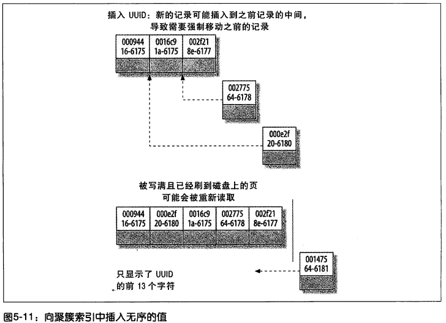

## 1. 索引使用注意事项

### 定义索引的类型

**主键通常建议使用auto_increment自增int类型**。**保证聚簇索引的数据的物理存放顺序与索引顺序是一致的，当-当前页被插满后，继续插入到新的页上**

### 为什么用自增

**保证聚簇索引的数据的物理存放顺序与索引顺序是一致的**

①下一条记录就会写入新的页中，一旦数据按照这种顺序的方式加载，主键页就会近乎于顺序的记录填满，提升了页面的最大填充率，不会有页的浪费

②新插入的行一定会在原有的最大数据行下一行，mysql定位和寻址很快，不会为计算新行的位置而做出额外的消耗

③减少了页分裂和碎片的产生

--------------

即：只要索引是相邻的，那么对应的数据一定也是相邻地存放在磁盘上的。如果主键不是自增id，它会不断地调整数据的物理地址、分页，当然也有其他一些措施来减少这些操作，但却无法彻底避免。

但，如果是自增的，那就简单了，它只需要一 页一页地写，索引结构相对紧凑，磁盘碎片少，效率也高。

因为**MyISAM的主索引并非聚簇索引，那么他的数据的物理地址必然是凌乱的，拿到这些物理地址，按照合适的算法进行I/O读取，于是开始不停的寻道不停的旋转**。**聚簇索引则只需一次I/O**。（强烈的对比）

### 为什么用int

自增的`int` id，避免了 **索引的调整维护，当-当前页被插满后，继续插入到新的页上**

因为uuid相对顺序的自增id来说是毫无规律可言的，新行的值不一定要比之前的主键的值要大，所以innodb无法做到总是把新行插入到索引的最后,而是需要为新行寻找新的合适的位置从而来分配新的空间。

不过，如果涉及到大数据量的排序、全表扫描、count之类的操作的话，还是MyISAM占优势些，因为索引所占空间小，这些操作是需要在内存中完成的。

### 不推荐使用uuid或者雪花id作为主键

①写入的目标页很可能已经刷新到磁盘上并且从缓存上移除，或者还没有被加载到缓存中，innodb在插入之前不得不先找到并从磁盘读取目标页到内存中，这将导致大量的随机IO

②因为写入是乱序的,innodb不得不频繁的做页分裂操作,以便为新的行分配空间,页分裂导致移动大量的数据，一次插入最少需要修改三个页以上

③由于频繁的页分裂，页会变得稀疏并被不规则的填充，最终会导致数据会有碎片

-------------

【参考】[Yrion-深入分析mysql为什么不推荐使用uuid或者雪花id作为主键](https://www.cnblogs.com/wyq178/)