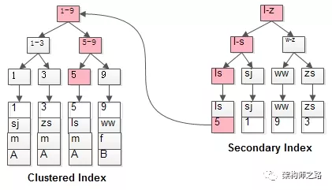

数据库表结构：

```mysql
create table user (
    id int primary key,
    name varchar(20),
    sex varchar(5),
    index(name)
)engine=innodb;

select id,name where name='shenjian';

select id,name,sex where name='shenjian';
```

> 多查询了一个属性，为何检索过程完全不同？

- 什么是回表查询？
- 什么是索引覆盖？
- 如何实现索引覆盖？
- 哪些场景，可以利用索引覆盖来优化SQL？

 

## 1. 回表查询和索引覆盖

<font color = red>InnoDB**普通索引**的叶子节点存储主键值</font>

<font color = red>**通常情况下，普通索引的查询需要扫码两遍索引树**</font>

### 非聚簇索引

如果不是主键索引，则就可以称之为非主键索引，又可以称之为辅助索引或者二级索引。主键索引的叶子节点存储了完整的数据行，而非主键索引的叶子节点存储的则是**主键索引值**，通过非主键索引查询数据时：

- 会先查找到主键索引
- 然后再到主键索引上去查找对应的数据。

<hr>

### 索引覆盖

在这里假设我们有张表user，具有三列：执行如下sql语句：

```mysql
ID，age，name，create_time

id是主键，(age, create_time, name) 建立辅助索引
```

`select name from user where age > 2 order by create_time desc;`

正常的话，查询分两步：

1. 按照辅助索引，查找到记录的主键
2. 按照主键主键索引里查找记录，返回name

但实际上，我们可以看到，辅助索引节点是按照`age`，`create_time`，`name`建立的，索引信息里完全包含我们所要的信息。 **因此不需要通过主键ID值的查找数据行的真实所在， 直接取得叶节点中name的值返回即可。** 通过这种覆盖索引直接查找的方式， 可以省略回表查询主键`id`， 大大的提高了查询性能

<font color = red>**将单列索引(name)升级为联合索引(name, sex)，即可避免回表**</font>。将被查询的字段，建立到联合索引里去。

按照这种思想Innodb里针对使用辅助索引的查询场景做了优化，叫**覆盖索引**

### 回表

```mysql
select * from t where name = lisi;　
```

**是如何执行的呢？**



如**粉红色**路径，需要扫码两遍索引树：

（1）先通过普通索引定位到主键值id=5；

（2）在通过聚集索引定位到行记录；

这就是所谓的**回表查询**，先定位主键值，再定位行记录，它的性能较扫一遍索引树更低。

------------

【问题解答】：`count(*)`是统计表数据数量的，在查询的时候虽然优先走非聚集索引，但是它不需要回表操作，它只需要统计非聚集索引树上的值即可，属于mysql5.7.18新特性！

---------------

<br>

## 2. 全列匹配

where子句几个搜索条件顺序调换不影响查询结果，因为MySQL的**查询优化器会自动调整where子句的条件顺序**以使用适合的索引。将where中的条件顺序颠倒，效果是一样的。


<br>

## 3. 最左前缀匹配原则

**最左匹配原则的定义**：**最左优先**，以最左边的为起点任何连续的索引都能匹配上。同时遇到范围查询(`>`、`<`、`between`、`like`)就会停止匹配

<br>

**要注意使用复合索引需要满足最左侧索引的原则**，如果where条件里面没有最左边的一到多列，索引就不会起作用。

针对的是**联合索引**（使用多列组合一个索引）

```sql
create index index_name on table(a, b, c);  --联合索引a、b、c
```

**1. 建立联合索引时，要选择重复值最少的列，作为最左列**

**2. 查询条件中，必须包含最左列**

<br>

## 4. 最左使用

**联合索引a、b、c，优先匹配a索引所在的列**

```mysql
create index index_name on table(a, b, c);
```

### 1. 全值匹配查询

查询时必须包含`a`列，最左列索引

```sql
select * from table where a = and b =  and c = ;
```

### 2. 匹配左边的列

**走索引**

```sql
select * from table_name where a = '1' 
select * from table_name where a = '1' and b = '2'  
select * from table_name where a = '1' and b = '2' and c = '3'
```

**不走索引**

```sql
select * from table_name where  b = '2' 
select * from table_name where  c = '3'
select * from table_name where  b = '1' and c = '3' 
```

### 3. 匹配列前缀

前缀匹配用的是索引，后缀和中缀只能全表扫描了

```sql
select * from table_name where a like 'As%';   -- 前缀都是排好序的，走索引查询
select * from table_name where  a like '%As';  -- 全表查询
select * from table_name where  a like '%As%'; -- 全表查询
```

> 如果列是字符型的话它的比较规则是先比较字符串的第一个字符，第一个字符小的哪个字符串就比较小，如果两个字符串第一个字符相通，那就再比较第二个字符，第二个字符比较小的那个字符串就比较小，依次类推，比较字符串。

### 4. 匹配范围值

走索引

```sql
select * from table_name where  a > 1 and a < 3
```

出现不等值情况，只会覆盖**最左列索引**

```sql
select * from table_name where  a > 1 and a < 3 and b > 1;

-- 只能覆盖到a = ,不能覆盖b和c
select * from table where a = and b <>  and c = ; 
```

### 5. 精确匹配某一列并范围匹配另外一列

如果左边的列是精确查找的，右边的列可以进行范围查找

```sql
select * from table_name where  a = 1 and b > 3;
```

`a=1`的情况下b是有序的，进行范围查找走的是**联合索引**

### 6. 排序

`order by`走索引，必须要保证**子句的顺序和索引列建立的顺序一致**


```sql
 select * from table_name order by a,b,c limit 10;  -- 走索引
 
 select * from table_name order by b,c,a limit 10;  -- 顺序颠倒，索引失效
 
 select * from table_name order by a limit 10;    -- 用到部分索引
select * from table_name order by a,b limit 10;   -- 用到部分索引
```

<br>


-----------------------------

【参考】[Mysql最左匹配原则](https://blog.csdn.net/sinat_41917109/article/details/88944290)


**最后总结一下**

1. 使用聚集索引的查询效率要比非聚集索引的效率要高，但是如果需要频繁去改变聚集索引的值，写入性能并不高，因为需要移动对应数据的物理位置
2. 非聚集索引在查询的时候可以的话就避免二次查询，这样性能会大幅提升。
3. 不是所有的表都适合建立索引，只有数据量大表才适合建立索引，且建立在选择性高的列上面性能会更好。


