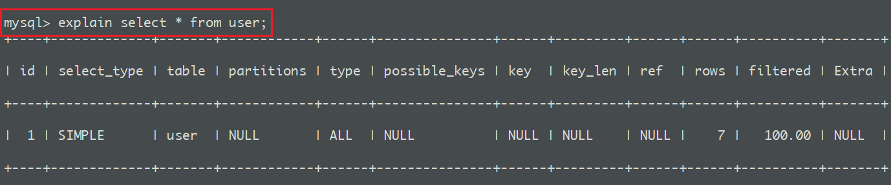

## 一. 分类讨论

一条 SQL 语句执行的很慢，那是每次执行都很慢呢？还是大多数情况下是正常的，偶尔出现很慢呢？分以下两种情况来讨论：

1. 大多数情况是正常的，只是偶尔会出现很慢的情况

2. 在数据量不变的情况下，这条SQL语句一直以来都执行的很慢

针对这两种情况，我们来分析下可能是哪些原因导致的。

## 二. 偶尔慢

SQL语句大概率是没有问题的，而而是其他原因导致的。

### I. 数据库在刷新脏页

当我们要往数据库插入一条数据、或者要更新一条数据的时候，我们知道数据库会在**内存**中把对应字段的数据更新了，但是更新之后，这些更新的字段并不会马上同步持久化到**磁盘**中去，而是把这些更新的记录写入到 `redo log` 日记中去，等到空闲的时候，在通过 `redo log` 里的日记把最新的数据同步到**磁盘**中去。

不过，`redo log` 里的容量是有限的，如果数据库一直很忙，更新又很频繁，这个时候 redo log 很快就会被写满了，这个时候就没办法等到空闲的时候再把数据同步到磁盘的，只能暂停其他操作，全身心来把数据同步到磁盘中去的，而这个时候，**就会导致我们平时正常的SQL语句突然执行的很慢**，所以说，数据库在在同步数据到磁盘的时候，就有可能导致我们的SQL语句执行的很慢了。


### II. 拿不到锁

判断是否真的在等待锁，我们可以用`show processlist`命令

要执行的这条语句，刚好这条语句涉及到的**表**，别人在用，并且加锁了，我们拿不到锁，只能慢慢等待别人释放锁了。

或者，表没有加锁，但要使用到的**某个一行被**加锁了，这个时候，我也没办法啊。

## 三. 一直慢

数据量一样大的情况下，这条 SQL 语句每次都执行的这么慢，**可能是SQL书写欠佳或者没走索引**

**【优化思路】：**

- 通过慢查询日志去寻找哪些 SQL 执行效率低
- 使用 `explain `获取低效率的 SQL 执行计划
- 结合 SQL 与执行计划，进行分析与优化

**引起 SQL 查询很慢的原因与解决办法：**

### 1. 没有索引

解决办法：

- 根据 where 和 order by 使用比较频繁的字段创建索引，提高查询效率
- 索引不宜过多，单表最好不要超过 6 个。索引过多会导致占用存储空间变大；insert、update 变慢
- 删除未使用的索引

### 2. 索引失效

解决办法：

- 避免在 where 子句中对字段进行 null 值判断，创建表默认值是 NULL。尽量使用 NOT NULL，或使用特殊值，如 0、-1
- 避免在 where 子句中使用 != 或 <> 操作符， MySQL 只有对以下操作符才使用索引：<、<=、=、>、>=、BETWEEN、IN、非 % 开头的 LIKE
- 避免在 where 子句中使用 or 来连接条件，可以使用 UNION 进行连接
- 能用 union all 就不用 union，union 过滤重复数据要耗费更多的 CPU 资源
- 避免部分 like 查询，如 '%ConstXiong%'
- 避免在索引列上使用计算、函数
- in 和 not in 慎用，能用 between 不要用 in
- select 子句中避免使用 *

 

### 3. 单表数据量太大

解决办法：

- 分页查询(在索引上完成排序分页操作、借助主键进行关联)
- 单表数据过大，进行分库分表
- 考虑使用非关系型数据库提高查询效率
- 全文搜索场景较多，考虑使用 ElasticSearch、solr

 

## 四. explain使用

`explain` 这个命令来查看这些 SQL 语句的执行计划，**查看该 SQL 语句有没有使用上了索引，有没有做全表扫描**。

## 3. 性能分析explain

使用`EXPLAIN`关键字可以模拟优化器执行SQL查询语句，从而知道MySQL是如何处理你的SQL语句的。分析你的查询语句或是表结构的性能瓶颈，针对出现的问题调整索引。

这都可以通过 explain 命令来查看，总结一下就是：

1. 表的读取顺序
2. 表的读取操作的操作类型
3. 哪些索引可以使用
4. <font color = red>哪些索引被实际使用</font>
5. 表之间的引用
6. <font color = red>每张表有多少行被优化器查询</font>

比如以下简单的语句：`select * from search_search `，如果在前方加入 explain ，表结构如下：




<font color = #ff6b81>**type **</font>的值为 ALL，即表示全表扫描，由于我们的 `select` 语句没有任何的优化，每一次查询都会遍历整个表。

---------------

通常来说，我们的查询不应该出现 ALL 类型的查询，因为这样的查询在数据量大的情况下，对数据库的性能是巨大的灾难，如一个查询是 ALL 类型查询，那么一般来说可以对相应的字段添加索引来避免。

不过这里需要注意，虽然 Explain 可以有这些特性，但是在使用上还是需要注意一些点，比如：

- 它不会考虑各种 cache
- 只能解释 select 操作
- 不能显示 MySQL 在执行查询时所作的优化工作

### 五. SQL查询优化

对于查询语句来说，我们优化的方向可以从以下几个思路着手

1. **首先打开慢查询记录，并找到慢查询记录所在的位置：**

```sql
set global log_queries_not_using_indexes = on;  -- 开启记录

show variables like 'slow_query_log_file%';
```

2. **使用 explain 分析语句时若发现 rows 非常大的查询语句可以考虑在对应的关键词上加入索引**

3. **子查询尽量修改为 JOIN 查询**
4. **尽量避免在 where 子句中使用 or 来连接条件，否则将导致引擎放弃使用索引而进行全表扫描，即使其中有条件带索引也不会使用**
5. **如果列类型是字符串，那一定要在条件中将数据使用引号引用起来，否则不会使用索引**
6. **应尽量避免在 where 子句中使用 != 或 <> 操作符，否则引擎将放弃使用索引而进行全表扫描**
7. **在搜索字符型字段时，我们有时会使用LIKE关键字和通配符，这种做法虽然简单，但却也是以牺牲系统性能为代价的，通过换为 >= 可以有效提升速度**

```sql
SELECT * FROM books WHERE name like "MySQL%";

SELECT  * FROM books WHERE name ＞=  "MySQL" and name ＜"MySQM"
```


## 五. 提升性能的一些技巧

- 尽量使用数字型字段
- 只需要一行数据时使用 limit 1
- 索引尽量选择较小的列
- 不需要的数据在 GROUP BY 之前过滤掉
- 大部分时候 exists、not exists 比 in、not in 效率（除了子查询是小表的情况使用 in 效率比 exists 高）
- 不确定长度的字符串字段使用 varchar/nvarchar，如使用 char/nchar 定长存储会带来空间浪费
- 不要使用 select *，去除不需要的字段查询
- 避免一次性查询过大的数据量
- 使用表别名，减少多表关联解析时间
- 多表 join 最好不超过 5 个，视图嵌套最好不超过 2 个
- or 条件查询可以拆分成 UNION 多个查询
- count(1) 比 count(*) 有效
- 判断是否存在数据使用 exists 而非 count，count 用来获取数据行数

