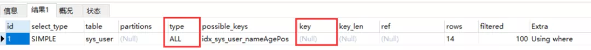

## 索引失效

`explain`判断索引是否生效：看`type`字段是否为**All**

- All则索引失效
- 否则用到了索引



<br>

### 1. 最左匹配失效

- **索引中，范围条件右边的列没有被覆盖**

- **where条件中含`!=` 或者`>`、`<`**
- **`group by`没有按索引顺序写，索引列和查序列顺序不一致**

### 2. 在索引列上有其他操作

**不在索引列上做任何操作（计算、函数（自动或手动）类型转换），会使索引失效转为全表扫描**

> 索引列做了计算或者函数的操作，导致了全表扫描

### 3. **is null，is not null 也无法使用索引**

### 4. like %开头

```sql
-- 索引失效
EXPLAIN SELECT * FROM sys_user WHERE name like '%明%'

-- 走索引
EXPLAIN SELECT * FROM sys_user WHERE name like '明%'

-- %abc…%，用覆盖索引解决索引失效的问题
EXPLAIN SELECT name,age,pos FROM sys_user WHERE name like '%明%'
```


### 5. 索引发生了类型转换

**字符串不加单引号索引会失效**

```sql
EXPLAIN SELECT * FROM sys_user WHERE name=222;
```

因为检索字符串是必须加单引号，上面用用了222是int类型，mysql在检索的时候会判断name是varchar的类型会将222转换为’222’进行检索，索引列发生了类型转换，故索引失效。

### 6. or连接时会索引失效


## 索引失效怎么解决


