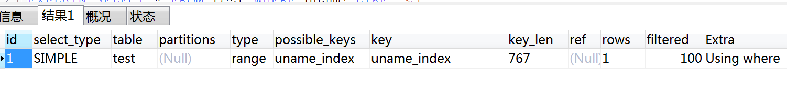
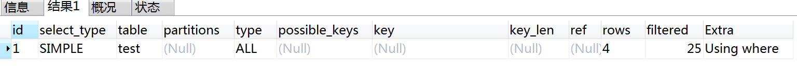
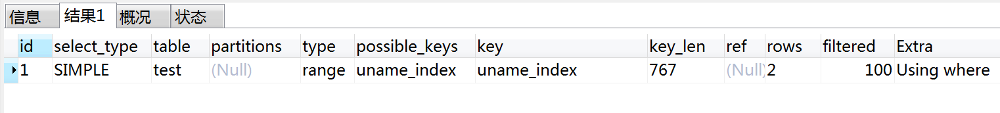

## like模糊查询优化

```sql
SELECT * FROM `employees` where first_name like '%M_';
```

一张表大概40万左右的数据，用**like模糊查询title**字段，很慢，title字段已经建立了索引，mysql 对 `someTitle%` 这样的模糊查询在有索引的前提下是很快的。

所以下面这两台sql语句差别就很大了

```sql
sql1 = “… title like someTitle%” (0.001秒)

sql2 = “…… title like %someTitle%” (0.8秒)
```

这两句的效率相差了800倍!

### 走索引验证

验证MySQL以`%`的模糊插叙查询是否走索引

> explain 这个命令来探究一些 like 语句是否有索引

### 1. like 字段名

```
EXPLAIN SELECT * FROM test WHERE uname LIKE 'j'; 
```

输出为： 



可以看出： **type 的值为：range，key 的值为 uname_index，也就是说这种情况下，使用了索引。**

### 2. like %字段名%

```
EXPLAIN SELECT * FROM test WHERE uname LIKE '%j%'; 
```

输出为： 



可以看出： **type 的值为 ALL 也就是全表扫描，而且 key 的值为 NULL，也就是说没用到任何索引。**

### 3. like %字段名

```
EXPLAIN SELECT * FROM test WHERE uname LIKE '%j'; 
```

输出为：  可以看出： **type 的值为 ALL，key 的值为 NULL，同样没用到索引。**

### 4. like 字段名%

```
EXPLAIN SELECT * FROM test WHERE uname LIKE 'j%'; 
```

输出为： 

 

可以看出： **type 的值为：range，key 的值为 uname_index，也就是说这种情况下，使用了索引。**

### 总结

由上面的试验可以总结出 like 是否使用索引的规律： 

**like 语句要使索引生效，like 后不能以%开始。也就是说 （ like %字段名%） 、（ like %字段名）这类语句会使索引失效，而（ like 字段名）、（ like 字段名%）这类语句索引是可以正常使用。**

<br>

## 【解决一】新增一列字段利用索引

```sql
sql1 = “… title like someTitle%” (0.001秒)

sql2 = “…… title like %someTitle%” (0.8秒)
```

在不用分词的方法的前提下，把存储的title字段，加一个特别的前缀，比如”im_prefix”，比如一条记录的**title="我是标题党**，那么存储的时候就存储为`im_prefix我是标题党`

这样一来，我们要模糊查找 **”标题党” **这个关键词的时候，就把sql写成这样：

```sql
$sql1 = “…… title like im_prefix%标题党%” (花费0.001秒)
```

前台显示数据的时候，把取到的title过滤掉`im_prefix`前缀了

**这种方法适合mysql5.7以下版本，这样能大大加快模糊查询速度，而且能到1000W以上应该都是没问题的**

<br>


## 【解决二】虚拟列

需要mysql5.7以上版本支持，用到**虚拟列**的方法，原理跟上述方法一样

```sql
ALTER TABLE tbl_ser_apply ADD INDEX virtual_col ( virtual_col )
```

在MySQL 5.7中，支持虚拟列Virtual Generated Column，只将Generated Column保存在数据字典中（表的元数据），并不会将这一列数据持久化到磁盘上；


## 【解决三】分表

将`like`的操作放到了j程序中来处理，**一次取定量数据进行筛选**，如果没取够，再取，再筛选……这样就避免了完全扫表了，只扫部分数据。

PS： 如果要`select`很多字段，其中又有超大类型的字段，比如 `longtext`，尽量先查询其他字段，然后根据id或者其他唯一字段来查询这个longtext字段。因为大字段影响效率


## 【解决四】函数代替模糊查询(不理想)

**LOCATE（'substr',str,pos）**

举例：

```sql
SELECT LOCATE('xbar',`foobar`); 
###返回0 


SELECT LOCATE('bar',`foobarbar`); 
###返回4


SELECT LOCATE('bar',`foobarbar`,5);
###返回7
```

返回 substr 在 str 中第一次出现的位置，如果 substr 在 str 中不存在，返回值为 0 。

如果pos存在，返回 substr 在 str 第pos个位置后第一次出现的位置，如果 substr 在 str 中不存在，返回值为0。

解决模糊查询方案：

```sql
SELECT `column` FROM `table` WHERE like'%keyword%'

SELECT `column` FROM `table` WHERE LOCATE('keyword', `field`)>0
```

> 备注：keyword是要搜索的内容，field为被匹配的字段，查询出所有存在keyword的数据

<br>

**POSITION('substr' IN `field`)**

position可以看做是locate的别名，功能跟locate一样：

```sql
SELECT `column` FROM `table` WHERE POSITION('keyword' IN `filed`)
```

<br>

**INSTR(`str`,'substr')**

**instr()**返回子字符串在字符串中首次出现的位置；如果没有找到，则返回0

```sql
用法：

INSTR（str,substr）

str：从哪个字符串中搜索

substr:要搜索的子字符串
```


```sql
SELECT `column` FROM `table` WHERE INSTR(`field`, 'keyword' )>0 
```

<br>