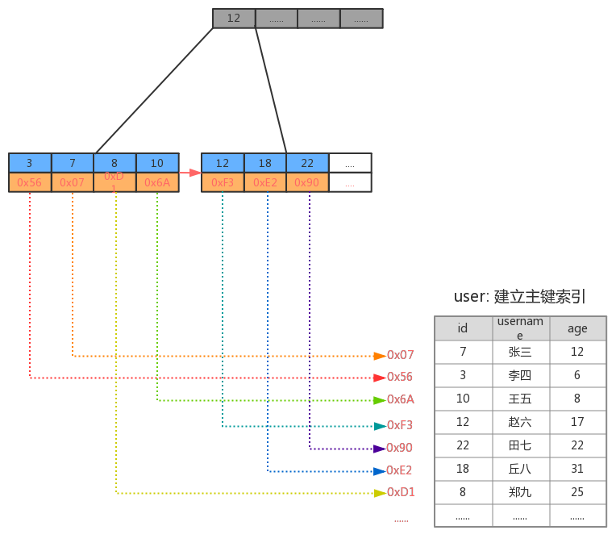

## MySQL高级内容简介

| 序号 | Day01              | Day02       | Day03          | Day04          |
| ---- | ------------------ | ----------- | -------------- | -------------- |
| 1    | Linux系统安装MySQL | 体系结构    | 应用优化       | MySQL 常用工具 |
| 2    | 索引               | 存储引擎    | 查询缓存优化   | MySQL 日志     |
| 3    | 视图               | 优化SQL步骤 | 内存管理及优化 | MySQL 主从复制 |
| 4    | 存储过程和函数     | 索引使用    | MySQL锁问题    | 综合案例       |
| 5    | 触发器             | SQL优化     | 常用SQL技巧    |                |

## 1. 索引概述

MySQL官方对索引的定义为：索引（index）是帮助MySQL高效获取数据的数据结构（有序）。

如下面的示意图所示 :


一般来说索引本身也很大，不可能全部存储在内存中，因此索引往往以索引文件的形式存储在磁盘上。索引是数据库中用来提高性能的最常用的工具。

### 索引优势劣势

优势

1） 类似于书籍的目录索引，提高数据检索的效率，降低数据库的IO成本。

2） 通过索引列对数据进行排序，降低数据排序的成本，降低CPU的消耗。

劣势

1） 实际上索引也是一张表，该表中保存了主键与索引字段，并指向实体类的记录，所以索引列也是要占用空间的。

2） 虽然索引大大提高了查询效率，同时却也降低更新表的速度，如对表进行INSERT、UPDATE、DELETE。因为更新表时，MySQL 不仅要保存数据，还要保存一下索引文件每次更新添加了索引列的字段，都会调整因为更新所带来的键值变化后的索引信息。

## 2. 索引结构

索引是在MySQL的存储引擎层中实现的，而不是在服务器层实现的。MySQL目前提供了以下4种索引：

- BTREE 索引 ： 最常见的索引类型，大部分索引都支持 B 树索引。
- HASH 索引：只有Memory引擎支持 ， 使用场景简单 。
- R-tree 索引（空间索引）：空间索引是MyISAM引擎的一个特殊索引类型，主要用于地理空间数据类型，通常使用较少，不做特别介绍。
- Full-text （全文索引） ：全文索引也是MyISAM的一个特殊索引类型，主要用于全文索引，InnoDB从Mysql5.6版本开始支持全文索引。

**MyISAM、InnoDB、Memory三种存储引擎对各种索引类型的支持**

| 索引        | InnoDB引擎      | MyISAM引擎 | Memory引擎 |
| ----------- | --------------- | ---------- | ---------- |
| BTREE索引   | 支持            | 支持       | 支持       |
| HASH 索引   | 不支持          | 不支持     | 支持       |
| R-tree 索引 | 不支持          | 支持       | 不支持     |
| Full-text   | 5.6版本之后支持 | 支持       | 不支持     |




- `p`指针存放的是磁盘文件的地址


InnoDB每一页大小为`16kb`，存取的主键字段`int`大小为`4B`，磁盘文件地址指针`p`大小为`6B`，当前B+树高为3，且叶子节点全部放满：

- 第一层存放`16kb / (6 + 4B)` = **1638**个index
- 第二层存放**1638**个index
- 第三层为`16kb `的**data**

共计存放`1638 * 1638 * 16`= **4000万** 条主键索引数据

一般**根节点是常驻内存**的，所以一般我们查找10亿数据，只需要2次磁盘IO。

<br>

## 3. 索引为什么使用B+树

B-树、B+树、红黑树都是平衡查找树，从查询效率上讲，平均都是O(log n)。

**【B树与B+树的本质区别】**

- B树节点存放数据，B+树的所有数据存放在叶子节点
- B+树层级页之间是双向链表，叶子节点是单链表
- 叶子节点单链表之间索引是*有序的*

但为什么MySQL使用B+树，而不是B-树呢？

#### 首先，为什么使用B/B+树

首先来看下，MySQL作为关系型数据库该如何衡量查询效率呢？

- **磁盘IO次数**

**从磁盘中读取数据时，都是按照磁盘页来读取的，并不是一条一条的读。** 如果我们能把尽量多的数据放进磁盘页中，那一次IO读取操作就会读取更多数据，那我们查找数据的时间也会大幅度降低。 

关系数据库这种数据量大索引能达到亿级别，为了减少内存的占用，索引也会被存储在磁盘上。B-树/B+树的特点就是**每层节点数目非常多，层数少，目的就是为了减少磁盘的IO次数**。 

<br>

#### 其次，为什么使用B+树


但是B-树的每个节点都有`data`域（指针），这无疑是增大了节点大小，也增加了磁盘的IO次数（因为磁盘IO一次读出的数据量大小是固定的，单个数据变大，每次读出的就会减少，IO次数也会增多），而**B+树除了叶子节点其他节点并不存储数据，节点小，磁盘IO次数就少**。

1. B+树只有叶子节点存放数据，其余节点用来索引，而B-树是每个索引节点都会有`Data`域。之所以这么做是因为在数据库中页的大小是固定的，innodb中页的默认大小是<mark>16KB</mark>。如果不存储数据，那么就会存储更多的键值，相应的树的阶数（节点的子节点树）就会更大，树就会更矮更胖，如此一来我们查找数据进行磁盘的IO次数有会再次减少，数据查询的效率也会更快。

2. B+树所有的`Data`域在叶子节点，B+树中各个页之间是通过**双向链表**连接的，叶子节点中的数据是通过**单向链表**连接的。这样遍历叶子节点就能获得全部数据，这样就能进行**区间访问**了。在数据库中基于范围的查询时非常频繁的，而B树不支持这样的遍历操作。

> MyISAM中的B+树索引实现与innodb中的略有不同。在MyISAM中，B+树索引的叶子节点并不存储数据，而是存储数据的文件地址。

<br>

## 4. 索引分类

1） 单值索引 ：即一个索引只包含单个列，一个表可以有多个单列索引

2） 唯一索引 ：索引列的值必须唯一`primary key`，但允许有空值

3） 复合索引 ：即一个索引包含多个列

<br>

【**聚集索引 VS 非聚集索引**】

B+树索引按照存储方式的不同分为**聚集索引**和**非聚集索引**

- **聚集索引**：叶子节点包含了完整的数据

- **非聚集索引**的叶子节点不存储表中的数据，而是存储该列对应的主键，想要查找数据还需要根据主键再去聚集索引中进行查找，称为**回表**

## 5. 索引语法

索引在创建表的时候，可以同时创建， 也可以随时增加新的索引。

准备环境:

```SQL
create database demo_01 default charset=utf8mb4;

use demo_01;

CREATE TABLE `city` (
  `city_id` int(11) NOT NULL AUTO_INCREMENT,
  `city_name` varchar(50) NOT NULL,
  `country_id` int(11) NOT NULL,
  PRIMARY KEY (`city_id`)
) ENGINE=InnoDB DEFAULT CHARSET=utf8;

CREATE TABLE `country` (
  `country_id` int(11) NOT NULL AUTO_INCREMENT,
  `country_name` varchar(100) NOT NULL,
  PRIMARY KEY (`country_id`)
) ENGINE=InnoDB DEFAULT CHARSET=utf8;


insert into `city` (`city_id`, `city_name`, `country_id`) values(1,'西安',1);
insert into `city` (`city_id`, `city_name`, `country_id`) values(2,'NewYork',2);
insert into `city` (`city_id`, `city_name`, `country_id`) values(3,'北京',1);
insert into `city` (`city_id`, `city_name`, `country_id`) values(4,'上海',1);

insert into `country` (`country_id`, `country_name`) values(1,'China');
insert into `country` (`country_id`, `country_name`) values(2,'America');
insert into `country` (`country_id`, `country_name`) values(3,'Japan');
insert into `country` (`country_id`, `country_name`) values(4,'UK');
```

### 5.1 创建索引

语法 ：

```sql
CREATE     [UNIQUE|FULLTEXT|SPATIAL]  INDEX index_name 
[USING  index_type]
ON tbl_name(index_col_name,...)


index_col_name : column_name[(length)][ASC | DESC]
```

示例 ： 为city表中的city_name字段创建索引 ；

  


### 5.2 查看索引

语法：

```
show index  from  table_name;
```

示例：查看city表中的索引信息；


### 5.3 删除索引

语法 ：

```
DROP  INDEX  index_name  ON  tbl_name;
```

示例 ： 想要删除city表上的索引idx_city_name，可以操作如下：


##### 2.5.4 ALTER命令

```
1). alter  table  tb_name  add  primary  key(column_list); 

    该语句添加一个主键，这意味着索引值必须是唯一的，且不能为NULL

2). alter  table  tb_name  add  unique index_name(column_list);

    这条语句创建索引的值必须是唯一的（除了NULL外，NULL可能会出现多次）

3). alter  table  tb_name  add  index index_name(column_list);

    添加普通索引， 索引值可以出现多次。

4). alter  table  tb_name  add  fulltext  index_name(column_list);

    该语句指定了索引为FULLTEXT， 用于全文索引
```

## 6. 索引设计原则

 索引的设计可以遵循一些已有的原则，创建索引的时候请尽量考虑符合这些原则，便于提升索引的使用效率，更高效的使用索引。

- 对查询频次较高，且数据量比较大的表建立索引。

- 索引字段的选择，最佳候选列应当从where子句的条件中提取，如果where子句中的组合比较多，那么应当挑选最常用、过滤效果最好的列的组合。

- 使用唯一索引，区分度越高，使用索引的效率越高。

- 索引可以有效的提升查询数据的效率，但索引数量不是多多益善，索引越多，维护索引的代价自然也就水涨船高。对于插入、更新、删除等DML操作比较频繁的表来说，索引过多，会引入相当高的维护代价，降低DML操作的效率，增加相应操作的时间消耗。另外索引过多的话，MySQL也会犯选择困难病，虽然最终仍然会找到一个可用的索引，但无疑提高了选择的代价。

- 使用短索引，索引创建之后也是使用硬盘来存储的，因此提升索引访问的I/O效率，也可以提升总体的访问效率。假如构成索引的字段总长度比较短，那么在给定大小的存储块内可以存储更多的索引值，相应的可以有效的提升MySQL访问索引的I/O效率。

- 利用最左前缀，N个列组合而成的组合索引，那么相当于是创建了N个索引，如果查询时where子句中使用了组成该索引的前几个字段，那么这条查询SQL可以利用组合索引来提升查询效率。

	```
	创建复合索引:
	
	    CREATE INDEX idx_name_email_status ON tb_seller(NAME,email,STATUS);
	
	就相当于
	    对name 创建索引 ;
	    对name , email 创建了索引 ;
	    对name , email, status 创建了索引 ;
	```