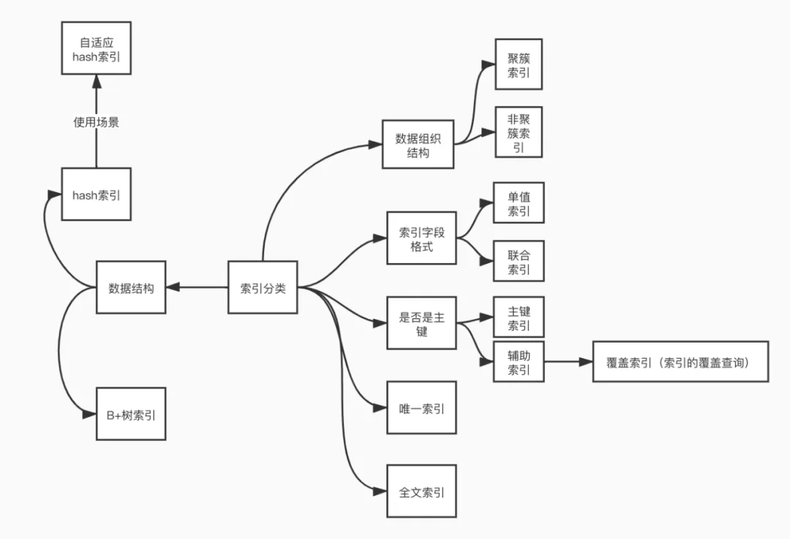
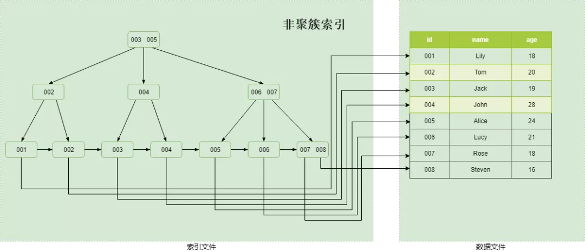
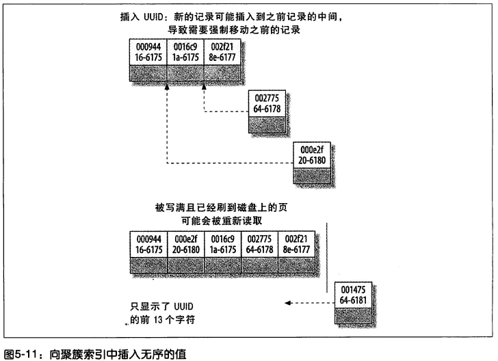

MySQL高级内容简介

| 序号 | Day01              | Day02       | Day03          | Day04          |
| ---- | ------------------ | ----------- | -------------- | -------------- |
| 1    | Linux系统安装MySQL | 体系结构    | 应用优化       | MySQL 常用工具 |
| 2    | 索引               | 存储引擎    | 查询缓存优化   | MySQL 日志     |
| 3    | 视图               | 优化SQL步骤 | 内存管理及优化 | MySQL 主从复制 |
| 4    | 存储过程和函数     | 索引使用    | MySQL锁问题    | 综合案例       |
| 5    | 触发器             | SQL优化     | 常用SQL技巧    |                |

## 1. 索引概述

MySQL官方对索引的定义为：索引（index）是帮助MySQL高效获取数据的数据结构（有序）。

如下面的示意图所示 :


一般来说索引本身也很大，不可能全部存储在内存中，因此索引往往以索引文件的形式存储在磁盘上。索引是数据库中用来提高性能的最常用的工具。

### 索引优势劣势

优势

1） 类似于书籍的目录索引，提高数据检索的效率，降低数据库的IO成本。

2） 通过索引列对数据进行排序，降低数据排序的成本，降低CPU的消耗。

劣势

1） 实际上索引也是一张表，该表中保存了主键与索引字段，并指向实体类的记录，所以索引列也是要占用空间的。

2） 虽然索引大大提高了查询效率，同时却也降低更新表的速度，如对表进行INSERT、UPDATE、DELETE。因为更新表时，MySQL 不仅要保存数据，还要保存一下索引文件每次更新添加了索引列的字段，都会调整因为更新所带来的键值变化后的索引信息。

## 2. 索引结构

索引是在MySQL的存储引擎层中实现的，而不是在服务器层实现的。MySQL目前提供了以下4种索引：

- BTREE 索引 ： 最常见的索引类型，大部分索引都支持 B 树索引。
- HASH 索引：只有Memory引擎支持 ， 使用场景简单 。
- R-tree 索引（空间索引）：空间索引是MyISAM引擎的一个特殊索引类型，主要用于地理空间数据类型，通常使用较少，不做特别介绍。
- Full-text （全文索引） ：全文索引也是MyISAM的一个特殊索引类型，主要用于全文索引，InnoDB从Mysql5.6版本开始支持全文索引。

**MyISAM、InnoDB、Memory三种存储引擎对各种索引类型的支持**

| 索引        | InnoDB引擎      | MyISAM引擎 | Memory引擎 |
| ----------- | --------------- | ---------- | ---------- |
| BTREE索引   | 支持            | 支持       | 支持       |
| HASH 索引   | 不支持          | 不支持     | 支持       |
| R-tree 索引 | 不支持          | 支持       | 不支持     |
| Full-text   | 5.6版本之后支持 | 支持       | 不支持     |


- `p`指针存放的是磁盘文件的地址


InnoDB每一页大小为`16kb`，存取的主键字段`int`大小为`4B`，磁盘文件地址指针`p`大小为`6B`，当前B+树高为3，且叶子节点全部放满：

- 第一层存放`16kb / (6 + 4B)` = **1638**个index
- 第二层存放**1638**个index
- 第三层为`16kb `的**data**

共计存放`1638 * 1638 * 16`= **4000万** 条主键索引数据

一般**根节点是常驻内存**的，所以一般我们查找10亿数据，只需要2次磁盘IO。

<br>

## 3. 索引为什么使用B+树

B-树、B+树、红黑树都是平衡查找树，从查询效率上讲，平均都是O(log n)。

**【B树与B+树的本质区别】**

- B树节点存放数据，B+树的所有数据存放在叶子节点
- B+树层级页之间是双向链表，叶子节点是单链表
- 叶子节点单链表之间索引是*有序的*

但为什么MySQL使用B+树，而不是B-树呢？

#### 首先，为什么使用B/B+树

首先来看下，MySQL作为关系型数据库该如何衡量查询效率呢？

- **磁盘IO次数**

**从磁盘中读取数据时，都是按照磁盘页来读取的，并不是一条一条的读。** 如果我们能把尽量多的数据放进磁盘页中，那一次IO读取操作就会读取更多数据，那我们查找数据的时间也会大幅度降低。 

关系数据库这种数据量大索引能达到亿级别，为了减少内存的占用，索引也会被存储在磁盘上。B-树/B+树的特点就是**每层节点数目非常多，层数少，目的就是为了减少磁盘的IO次数**。 

<br>

#### 其次，为什么使用B+树


但是B-树的每个节点都有`data`域（指针），这无疑是增大了节点大小，也增加了磁盘的IO次数（因为磁盘IO一次读出的数据量大小是固定的，单个数据变大，每次读出的就会减少，IO次数也会增多），而**B+树除了叶子节点其他节点并不存储数据，节点小，磁盘IO次数就少**。

1. B+树只有叶子节点存放数据，其余节点用来索引，而B-树是每个索引节点都会有`Data`域。之所以这么做是因为在数据库中页的大小是固定的，innodb中页的默认大小是<mark>16KB</mark>。如果不存储数据，那么就会存储更多的键值，相应的树的阶数（节点的子节点树）就会更大，树就会更矮更胖，如此一来我们查找数据进行磁盘的IO次数有会再次减少，数据查询的效率也会更快。

2. B+树所有的`Data`域在叶子节点，B+树中各个页之间是通过**双向链表**连接的，叶子节点中的数据是通过**单向链表**连接的。这样遍历叶子节点就能获得全部数据，这样就能进行**区间访问**了。在数据库中基于范围的查询时非常频繁的，而B树不支持这样的遍历操作。

> MyISAM中的B+树索引实现与innodb中的略有不同。在MyISAM中，B+树索引的叶子节点并不存储数据，而是存储数据的文件地址。

<br>

## 4. 索引分类



1） 主键索引（`primary key`）

- 唯一标识，主键不可重复，且主键只能有一个

2） 唯一索引 （`unique key`）

- 索引列的值必须唯一，允许有空值NULL

3） 普通索引（`index`）

- 是最基本的索引，它没有任何限制

4）联合索引

- 指多个字段上创建的索引，只有在查询条件中使用了创建索引时的第一个字段，索引才会被使用。使用组合索引时遵循最左前缀集合

5）全文索引

- 用来查找文本中的关键字，而不是直接与索引中的值相比较

<br>

### 按数据组织结构

B+树索引按照存储方式的不同分为**聚集索引**和**非聚集索引**

#### 聚集索引

**叶子节点包含了完整的数据记录**

普通二级索引（非主键索引<——>非聚簇索引），存储的是索引所在行的主键


**生成聚簇索引**

1. 如果表定义了PK，则PK就是聚集索引；
2. 如果表没有定义PK，则第一个`not NULL unique`列是聚集索引；
3. 否则，InnoDB会创建一个隐藏的`row-id`作为聚集索引；

<br>

#### 非聚簇索引

**索引在MYI文件，数据在MYD文件中。先定位到索引，根据索引-value存储的磁盘文件地址到MYD中查找数据记录**

索引存储顺序和数据存储关系毫无关联，是典型的非聚簇索引



**非聚集索引**的叶子节点不存储表中的数据，而是存储**主键值**，想要查找数据还需要根据主键再去聚集索引中进行查找，称为**回表**

> **不管以任何方式查询表， 最终都会利用主键通过聚集索引来定位到数据， 聚集索引（主键）是通往真实数据所在的唯一路径。**

<br>

## 5. 聚簇索引的优劣

### 优势

1. **进行IO的次数更少**。由于行数据和叶子节点存储在一起，同一页中会有多条行数据，访问同一数据页不同行记录时，已经把页加载到了Buffer中，再次访问的时候，会在内存中完成访问，不必访问磁盘。

2. 聚簇索引适合用在**排序的场合**，非聚簇索引不适合

3. 取出**一定范围数据**的时候，使用用聚簇索引
4. 可以把**相关数据保存在一起**。例如实现电子邮箱时，可以根据用户 ID 来聚集数据，这样只需要从磁盘读取少数的数据页就能获取某个用户的全部邮件。如果没有使用聚簇索引，则每封邮件都可能导致一次磁盘 I/O。

> 二级索引需要两次索引查找，而不是一次才能取到数据，因为存储引擎第一次需要通过二级索引找到索引的叶子节点，从而找到数据的**主键**，然后在聚簇索引中用主键再次查找索引，再找到数据

### 劣势

1. 维护索引很昂贵，特别是**插入新行或者主键被更新导至要分页(page split)的时候**。
2. 表因为使用UUId（随机ID）作为主键，使数据存储稀疏，这就会出现聚簇索引有可能有比全表扫面更慢


## 6. 主键通常建议使用自增id

==为什么使用自增id?==

**保证聚簇索引的数据的物理存放顺序与索引顺序是一致的**

即：只要索引是相邻的，那么对应的数据一定也是相邻地存放在磁盘上的。如果主键不是自增id，那么可以想 象，它会干些什么，不断地调整数据的物理地址、分页，当然也有其他一些措施来减少这些操作，但却无法彻底避免。

但，如果是自增的，那就简单了，它只需要一 页一页地写，索引结构相对紧凑，磁盘碎片少，效率也高。

因为**MyISAM的主索引并非聚簇索引，那么他的数据的物理地址必然是凌乱的，拿到这些物理地址，按照合适的算法进行I/O读取，于是开始不停的寻道不停的旋转**。**聚簇索引则只需一次I/O**。（强烈的对比）

==为什么使用 int 的 auto_increment作为主键？==

自增的`int` id，避免了 **索引的调整维护，当当前页被插满后，继续插入到新的页上**




不过，如果涉及到大数据量的排序、全表扫描、count之类的操作的话，还是MyISAM占优势些，因为索引所占空间小，这些操作是需要在内存中完成的。

<br>

## 7. 索引语法

索引在创建表的时候，可以同时创建， 也可以随时增加新的索引。

**创建索引**

```sql
create index 索引名 on 表名(添加到该列);

<e.g.>

create [unique] index index_name on table(表字段);
```

**ALTER命令追加索引**

```sql
该语句添加一个主键，这意味着索引值必须是唯一的，且不能为NULL

1) alter  table  tb_name  add  primary  key(column_list); 

    
这条语句创建索引的值必须是唯一的（除了NULL外，NULL可能会出现多次）

2) alter  table  tb_name  add  unique index_name(column_list);

    
添加普通索引， 索引值可以出现多次。

3) alter  table  tb_name  add  index index_name(column_list);


该语句指定了索引为FULLTEXT， 用于全文索引    

4) alter  table  tb_name  add  fulltext  index_name(column_list);
```

**查看索引**

```
show index  from  table_name;
```

**删除索引**

```
DROP  INDEX  index_name  ON  table_name;
```
