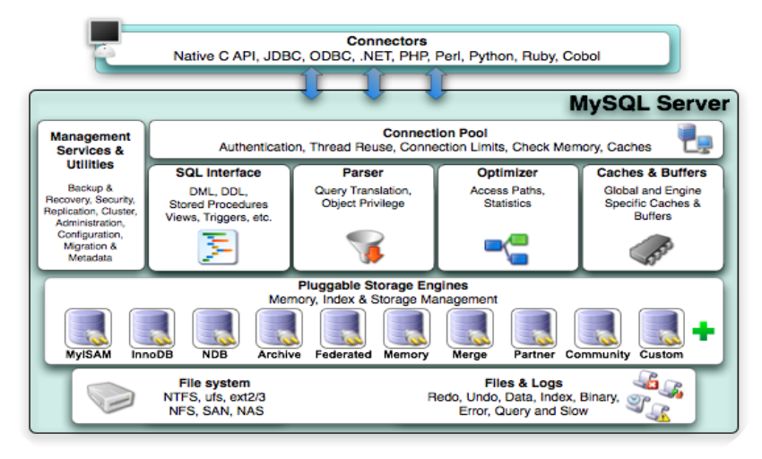
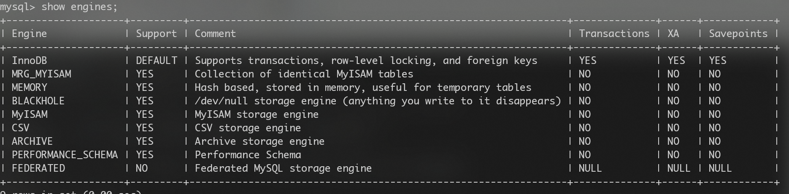
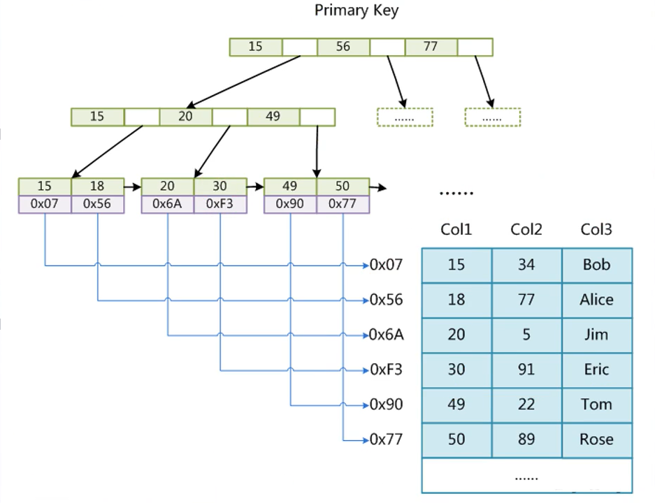

##  1. MySQL体系架构

### Mysql体系结构

 

整个MySQL Server由以下组成

- Connection Pool : 连接池组件
- Management Services & Utilities : 管理服务和工具组件
- Pluggable Storage Engines : 存储引擎
- File System : 文件系统

**1. 连接层**：客户端和链接服务，引入了线程池的概念主要完成一些类似于连接处理、授权认证、及相关的安全方案。

**2. 服务层**：第二层架构主要完成大多数的核心服务功能，如SQL接口，并完成缓存的查询，SQL的分析和优化，部分内置函数的执行。

**3. 引擎层**：存储引擎层， 存储引擎真正的负责了MySQL中数据的存储和提取，服务器通过API和存储引擎进行通信。

**4. 存储层**：数据存储层， 主要是将数据存储在文件系统之上，并完成与存储引擎的交互

<br>

### 存储引擎

**存储引擎就是存储数据，建立索引，更新查询数据等技术的实现方式 。存储引擎是<font color = red>基于表</font>>的，而不是基于库的。同一个数据库中的不同表，可以选择不同的存储引擎。所以存储引擎也可被称为表类型。**

几种常用的存储引擎， 并对比各个存储引擎之间的区别， 如下表所示 ： 

| 特点     | InnoDB               | MyISAM   | MEMORY |
| -------- | -------------------- | -------- | ------ |
| 存储限制 | 64TB                 | 有       | 有     |
| 事务安全 | ==支持==             |          |        |
| 锁机制   | ==行锁(适合高并发)== | ==表锁== | 表锁   |
| B树索引  | 支持                 | 支持     | 支持   |
| 全文索引 | 支持(5.6之后)        | 支持     |        |
| 索引缓存 | 支持                 | 支持     | 支持   |
| 支持外键 | ==支持==             |          |        |

```
show engines;
```



**📺【引擎的选择】**

| InnoDB                                                   | MyISAM                                                  |
| -------------------------------------------------------- | ------------------------------------------------------- |
| 默认选择InnoDB。业务的安全性较高、对数据的一致性要求严格 | 以读操作和插入操作为主（NoSQL）。对事物和一致性要求不高 |

<br>

## 2. InnoDB

### InnoDB的特点

Supports transactions，row-level locking，and foreign keys

- 支持事务
- 支持行锁
- 支持外键（MySQL中唯一支持外建的存储引擎）

<br>

### InnoDB索引结构


- `frm`表结构
- `ibd`索引 + 数据


### 面试提问

#### a. 主键提问

**为什么InnoDB推荐建表加int类型的主键，主键设为自增长？**

答：**主键自带索引**，添加主键的原因是为了方便B+树维护索引，自增长的id来唯一定位`data`在B+树中的位置。使InnoDB表的数据写入顺序和B+树索引的叶子节点顺序一致的话，提高存取效率

- **使用自增列（INT/BIGINT类型）做主键**，写入顺序是自增的，和B+树叶子节点分裂顺序一致，方便二分查找定位索引；
- **该表不指定自增列做主键**，InnoDB会选择内置的**ROWID**作为主键，写入顺序和ROWID增长顺序一致；

> https://www.cnblogs.com/moyand/p/9013663.html


<br>

## 3. MyISAM

MyISAM不支持事务、也不支持外键，其**优势是访问的速度快**。对事务的完整性没有要求或者**以 SELECT、 INSERT为主的应用**基本上都可以使用这个引擎来创建表。

- 不支持事务

- 不支持行锁🔒

MyISAM的叶子节点不存储数据，它是将表的主键索引`index`存在**MYI**表中，叶子节点存放的是**MYD**表中数据的地址

- `frm`表结构
- `MYI`主键索引
- `MYD`数据

