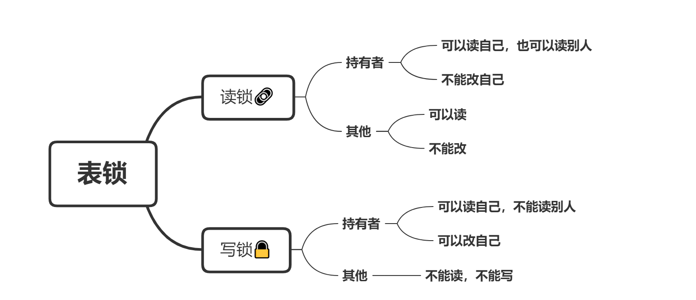

## 【锁的实现】

InnoDB行锁：只有通过索引条件检索数据，InnoDB才会使用行级锁，否则，InnoDB将使用表锁！

**InnoDB-行锁是基于索引来实现的：**

- **行锁必须有索引才能实现，否则会自动锁全表**

- **两个事务不能锁同一个索引**
- **类型转换导致行锁升级为表锁**。在MySql的写语句中，给表列赋值与表类型不符合时，MySql底层的优化器发挥作用，会做一个强制类型转化，此时能正常操作，但会导致行锁升级为表锁


<br>

## 1. Mysql锁分类

**锁概述**锁是计算机协调多个进程或线程并发访问某一资源的机制（避免资源争抢）。

**从对数据操作的粒度分 ： **

- 表锁：操作时，会锁定整个表

- 行锁：操作时，会锁定当前操作行

**从对数据操作的类型分：**

- 读锁（共享锁）：读锁会阻塞写，但是不会阻塞读
- 写锁（排它锁）：不能与其他锁并存。当前操作没有完成之前，它会阻断其他写锁和读锁

------------

```sql
lock table user read;   -- 加读锁

lock table user write;  -- 加写锁

unlock tables;          -- 释放锁
```



**读锁：** `session1` 对 **TableA** 加读锁

- `session1`<font color = red>**可以读**</font>自己加锁的 **TableA**，<font color = red>**不能改**</font>自己的**TableA**，<font color = red>**不可以读**</font>其他表
- `session2` <font color = blue>**可以读**</font>**TableA**，改**TableA**时<font color = blue>**会阻塞等待，持有者释放锁之后才能改**</font> ，可以读其他表

**写锁：** `session1` 对 **TableA** 加写锁

- `session1`<font color = red>**可以读**</font>自己加锁的 **TableA**，<font color = red>**可以改**</font>自己的**TableA**，<font color = red>**不可以读**</font>其他表
- `session2` <font color = blue>**读**</font>TableA时会**阻塞等待**，持有者释放锁之后才能可以读。**不可以改**TableA，可以读其他表

---------------

各存储引擎对锁的支持情况：

| 存储引擎 | 表级锁 | 行级锁 | 页面锁 |
| -------- | ------ | ------ | ------ |
| MyISAM   | 支持   | 不支持 | 不支持 |
| InnoDB   | 支持   | 支持   | 不支持 |

MySQL这3种锁的特性可大致归纳如下 ：


从上述特点可见，很难笼统地说哪种锁更好，只能就具体应用的特点来说哪种锁更合适！

仅从锁的角度来说：表级锁更适合于以**查询为主，只有少量按索引条件更新数据的应用**，如Web 应用；

**行级锁则更适合于有大量按索引条件并发更新少量不同数据，同时又有并查询的应用**，如一些在线事务处理（OLTP）系统。


## 2. MyISAM 表锁-偏读

MyISAM 存储引擎只支持**表锁**，这也是MySQL开始几个版本中唯一支持的锁类型。

### 如何加表锁

**加锁的过程是自动的**。MyISAM 在执行查询语句（SELECT）前，会**自动给涉及的所有表加读锁**，在执行更新操作（UPDATE、DELETE、INSERT 等）前，会**自动给涉及的表加写锁**，这个过程并不需要用户干预，因此，用户一般不需要直接用 `LOCK TABLE` 命令给 MyISAM 表显式加锁。

显示加表锁语法：

```SQL
加读锁 ： lock table table_name read;

加写锁 ： lock table table_name write；
```

锁模式的相互兼容性如表中所示：


由上表可见： 

- 简而言之，就是读锁会阻塞写，但是不会阻塞读。

- 而写锁，则既会阻塞读，又会阻塞写。

此外，MyISAM 的读写锁调度是**写优先**，这也是**MyISAM不适合做写为主的表**的存储引擎的原因。因为写锁后，*其他线程不能做任何操作*，大量的更新会使查询很难得到锁，从而造成永远阻塞。

<br>

## 3. InnoDB 行锁-偏写

###  行锁介绍

**行锁特点 ：** 

- 偏向InnoDB 存储引擎，开销大，加锁慢；
- 会出现死锁；
- 锁定粒度最小，发生锁冲突的概率最低，并发度也最高。

InnoDB 与 MyISAM 的最大不同有两点：**一是支持事务；二是采用了行锁**

<br>

### InnoDB 的行锁模式

**InnoDB 支持行锁和表锁**

- 对于`UPDATE`、`DELETE`和`INSERT`语句，InnoDB会自动给涉及数据集加排他锁（X)；

- 对于普通`SELECT`语句，InnoDB不会加任何锁；

可以通过以下语句显示给记录集加共享锁或排他锁 

```
共享锁(S): SELECT * FROM table_name WHERE ... LOCK IN SHARE MODE

排他锁(X): SELECT * FROM table_name WHERE ... FOR UPDATE
```


## 4. 索引行锁升级为表锁

**如果不通过索引条件检索数据**，那么InnoDB将对表中的所有记录加锁，实际效果跟表锁一样。

**索引失效，最终行锁变为表锁 **

为何索引会失效？——— 使用的索引字段的数据类型 与 定义的数据类型不符。

查看当前表的索引 ： 

```sql
show  index  from test_innodb_lock ; 
```

由于执行更新时 ， name字段本来为`varchar`类型， 我们是作为`int`类型使用，存在类型转换的异常，所以索引失效，行锁变为表锁


### 总结

**优化建议：**

- 避免无索引行锁升级为表锁，尽可能让所有数据检索都能通过索引来完成
- 合理设计索引，尽量缩小锁的范围
- 尽可能减少索引条件，及索引范围，避免间隙锁
- 尽量控制事务大小，减少锁定资源量和时间长度

