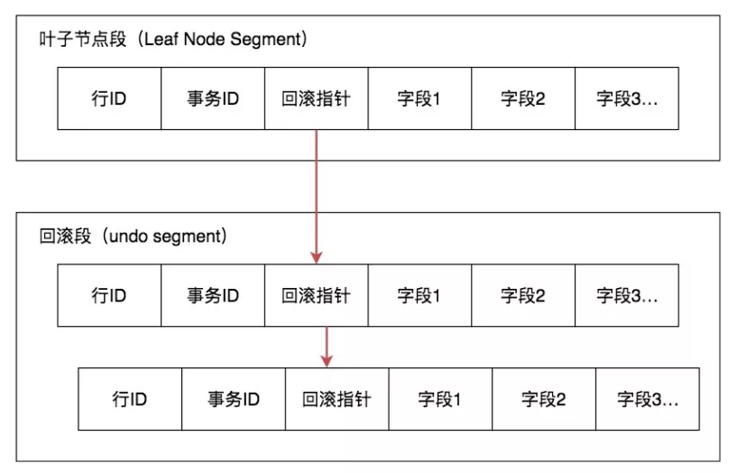

## 1. MVCC是什么

MVCC: Multiversion Concurrency Control，翻译为**多版本并发控制**，其目标就是为了**提高数据库在高并发场景下的性能**

**【原理】：**

简单来说就是保存数据的历史版本，通过比较版本号决定数据是否显示出来。读取数据的时候不需要加锁可以保证事务的隔离效果。

**MVCC最大的优势：读不加锁，读写不冲突。在读多写少的场景下极大的增加了系统的并发性能**

- 行级锁的变种，减少加锁带来的开销（类比CAS）

- 适用于读已提交、可重复读两个事务场景，解决不可重复读和幻读问题，MVCC 机制取代行锁，降低系统开销

## 2. MVCC解决什么问题

1. **读写之间阻塞的问题**。通过 MVCC 可以让读写互相不阻塞，读不相互阻塞，写不阻塞读，这样可以提升数据并发处理能力。
2. **降低了死锁的概率**。这个是因为 MVCC 采用了乐观锁的方式，读取数据时，不需要加锁，写操作，只需要锁定必要的行。
3. **解决了一致性读的问题**。当我们朝向某个数据库在时间点的快照是，只能看到这个时间点之前事务提交更新的结果，不能看到时间点之后事务提交的更新结果

### 什么是快照读

快照读，读取的是**快照数据**，不加锁的简单 Select 都属于快照读.

```sql
SELECT * FROM player WHERE ...
```

### 什么是当前读

当前读就是读的是**最新数据**,而不是历史的数据，加锁的 SELECT，或者对数据进行增删改都会进行当前读。

```sql
SELECT * FROM player LOCK IN SHARE MODE;
SELECT FROM player FOR UPDATE;

INSERT INTO player values ...

DELETE FROM player WHERE ...

UPDATE player SET ...
```

##  3. InnoDB 的 MVCC实现

**事务版本号 + 行记录中的隐藏列  + Undo Log**

### 事务版本号

每开启一个日志，都会从数据库中获得一个事务ID（也称为事务版本号），这个事务 ID 是自增的，通过 ID 大小，可以判断事务的时间顺序。

### 行记录的隐藏列


1. `row_id` ：隐藏的行 ID ，用来生成默认的聚集索引。如果创建数据表时没指定聚集索引，这时 InnoDB 就会用这个隐藏 ID 来创建聚集索引
2. `trx_id`：数据事务 ID ，每次处理加一
3. `roll_ptr`：回滚指针，指向这个记录的 Undo Log 信息

### Undo Log

InnoDB 将行记录快照保存在 Undo Log 里



数据行通过快照记录都通过链表的结构的串联了起来，每个快照都保存了 trx_id 事务ID，如果要找到历史快照，就可以通过遍历回滚指针的方式进行查找


------------------

【参考文章】[MVCC机制总结](https://seven.geekfun.club/article/16)