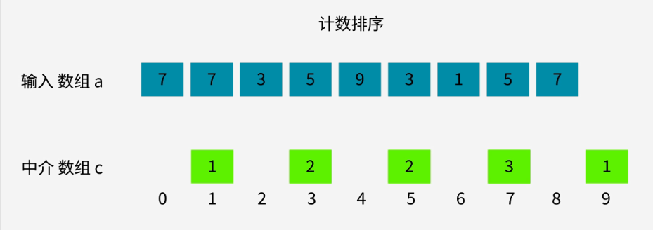
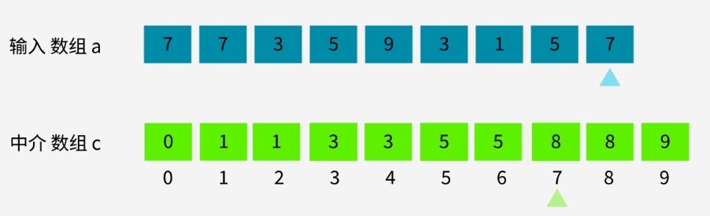
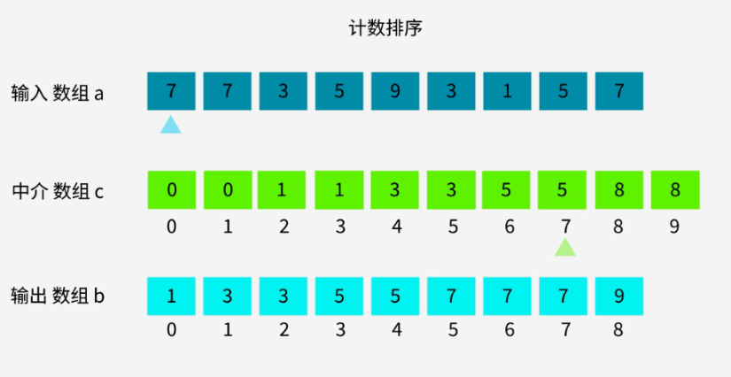
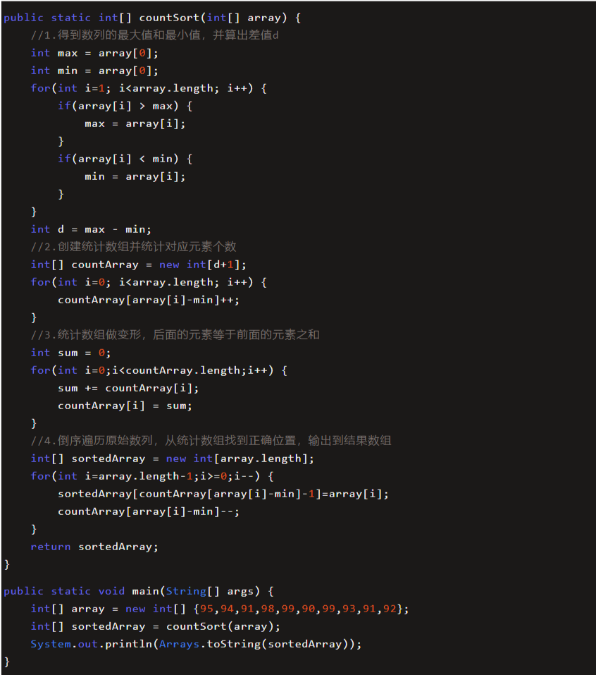

### 1. 排序思想










<video src="i-计数排序.assets/动画 什么是计数排序？.mp4"></video>

### 2. 代码逻辑

**不稳定排序**

```java
/**
 * 不稳定排序
 * @param arr
 * @return
 */
public static int[] sort(int[] arr) {
    // 得到数列的最大值和最小值，并算出差值
    int min = arr[0], max = arr[arr.length - 1];
    for (int i = 0; i < arr.length; i++) {
        if(arr[i] > max)
            max = arr[i];
        if (arr[i] < min) {
            min = arr[i];
        }
    }
    int[] count = new int[max - min + 1];
    for (int i = 0; i < arr.length; i++) {
        count[arr[i] - min]++;
    }
    int[] result = new int[arr.length];
    for (int i = 0, j = 0; i < count.length; i++) {
        while (count[i]-- > 0) {
            result[j++] = i;
        }
    }
    return result;
}
```

**稳定排序**

```java
/**
 * 稳定排序
 * @param arr
 * @return
 */
public static int[] sort_stable(int[] arr) {
    // 1.得到数列的最大值和最小值
    int min = arr[0], max = arr[arr.length - 1];
    for (int i = 0; i < arr.length; i++) {
        if(arr[i] > max)
            max = arr[i];
        if (arr[i] < min) {
            min = arr[i];
        }
    }
    // 2.创建统计数组并统计对应元素个数
    int[] count = new int[max - min + 1];
    for (int i = 0; i < arr.length; i++) {
        count[arr[i] - min]++;
    }
    // 3.统计数组做变形，后面的元素等于前面的元素之和
    int sum = 0;
    for (int i = 0; i < count.length; i++) {
        sum += count[i];
        count[i] = sum;
    }
    // 4.倒序遍历原始数列，从统计数组找到正确位置，输出到结果数组
    int[] result = new int[arr.length];
    for (int i = arr.length - 1; i > 0; i--) {
        result[count[arr[i] - min] - 1] = arr[i];
        count[arr[i] - min]--;
    }
    return result;
}
```


### 3. 复杂度

**原始数列的规模是N，最大最小整数的差值是M，你说说计数排序的时间复杂度和空间复杂度是多少？**

【时间复杂度】

- 代码第1,2,4步都涉及到遍历原始数列，运算量都是**N**；

- 第3步遍历统计数列，运算量是**M**；
- 所以总体运算量是 **3N+M**，去掉系数，时间复杂度是`0(N+M)`

【空间复杂度】

- 不考虑结果数组，只考虑统计数组大小的话，空间复杂度是`O(M)`


### 4. 适用范围

**1.当数列最大最小值差距过大时，并不适用计数排序**

比如给定20个随机整数，范围在0到1亿之间，这时候如果使用计数排序，需要创建长度1亿的数组。不但严重浪费空间，而且时间复杂度也随之升高

需求 A，为一组给定的手机号排序：

18914021920

13223132981

13566632981

13660891039

13361323035

........

........

按照计数排序的思路，我们要根据手机号的取值范围，创建一个空数组。

11 位手机号有多少种组合？恐怕要建立一个大得不可想象的数组，才能装下所有可能出现的 11 位手机号！

<hr>

**2.当数列元素不是整数，并不适用计数排序**

如果数列中的元素都是小数，比如25.213，或是0.00000001这样子，则无法创建对应的统计数组。这样显然无法进行计数排序。

需求 B，为一组英文单词排序：

banana

apple

orange

peach

cherry

........

........

计数排序适合的场景是对整数做排序，如果遇到英文单词，就无能为力了