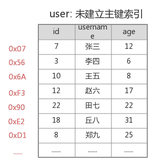
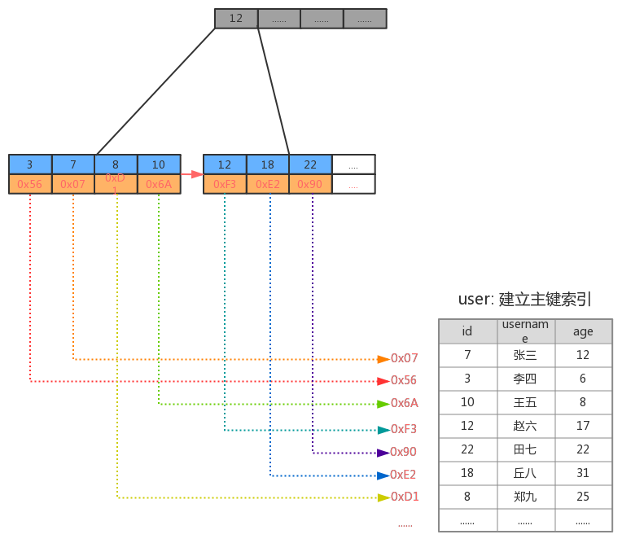

## 1. 红黑树与B树的区别

1. (B-树，即为B树。因为B树的原英文名称为B-tree，而国内很多人喜欢把B-tree译作B-树，其实，这是个非常不好的直译，很容易让人产生误解。如人们可能会以为B-树是一种树，而B树又是一种一种树。而事实上是，B-tree就是指的B树。特此说明。)
2. B树又叫平衡多路查找树。B树是为了磁盘或其它存储设备而设计的一种多叉（下面你会看到，相对于二叉，B树每个内结点有多个分支，即多叉）平衡查找树。与红黑树很相似，但在降低磁盘I/0操作方面要更好一些。许多数据库系统都一般使用B树或者B树的各种变形结构，如下文即将要介绍的B+树，B*树来存储信息。
3. 红黑树与B树的区别在于，B树的结点可以有许多子女，从几个到几千个。那为什么又说B树与红黑树很相似呢?因为与红黑树一样，一棵含n个结点的 B树的高度也为O（lgn） ，但可能比一棵红黑树的高度小许多，应为它的分支因子比较大。所以， B树可以在O（logn）时间内，实现各种如插入（insert），删除（delete）等动态集合操作

----------------------

## 2. B+树

B+树是对B树的一种变形树，它与B树的差异在于：

1. 非叶结点仅具有–索引作用，也就是说，**非叶子结点只存储key，不存储value**；
2. 树的所有叶结点构成一个**有序链表**，可以按照key排序的次序遍历全部数据。

### 2.1 B+树存储数据

若参数M选择为5，那么每个结点最多包含4个键值对，我们以5阶B+树为例，看看B+树的数据存储。

### 2.2 B+ 树的优点

1. 由于B+树在**非叶子结点上不包含真正的数据**，**只当做索引使用**，因此在内存相同的情况下，能够存放更多的
	`key`

2. **B+树的叶子结点都是相连的**，因此对整棵树的遍历只需要一次线性遍历叶子结点即可。而且由于数据顺序
	排列并且相连，所以便于区间查找和搜索。而B树则需要进行每一层的递归遍历

### 2.3 B树的优点

由于B树的每一个节点都包含key和value，因此我们根据key查找value时，只需要找到key所在的位置，就能找到value，但B+树只有叶子结点存储数据，索引每一次查找，都必须一次一次，一直找到树的最大深度处，也就是叶子结点的深度，才能找到value。

----------------------

## 3. B+树在数据库中的应用

在操作数据库时，我们为了提高查询效率，可以基于某张表的某个字段建立索引，就可以提高查询效率，那其实这
个索引就是B+树这种数据结构实现的。

### 3.1 未建立主键索引查询

执行`select * from user where id=18 `,需要从第一条数据开始，一直查询到第6条，发现id=18，此时才能查询出目标结果，共需要比较6次；

### 3.2 建立主键索引查询

执行`select * from user where id = 18` ，如果有了索引，由于B+树的叶子结点形成了一个有序链表，所以我们只需要找到id为12的叶子结点：

- `18 > 12`，在`12`节点的右孩子
- 遍历右孩子链表，根据`key=18`，找到其地址即可

按照遍历链表的方式顺序往后查即可，共查询了3次，效率非常高。

**在区间查询时，效率体现的更加明显**