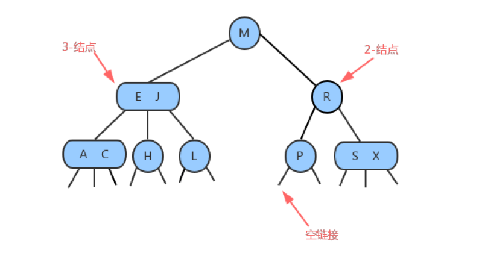
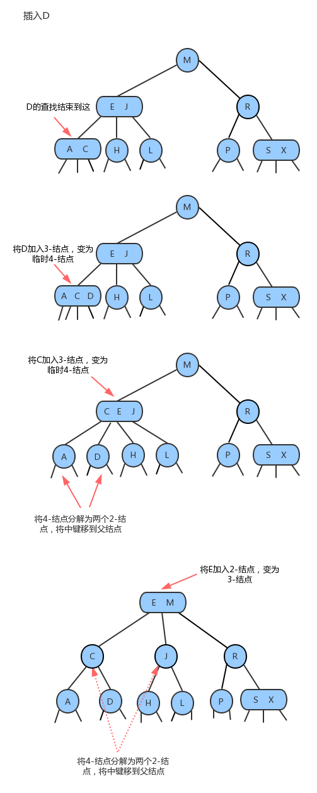
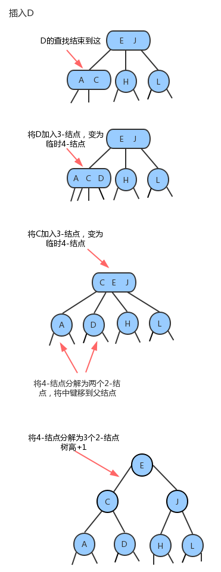

## 1. 平衡树简介

之前我们学习过二叉查找树，发现它的查询效率比单纯的链表和数组的查询效率要高很多，大部分情况下，确实是这样的，但不幸的是，在最坏情况下，二叉查找树的性能还是很糟糕。

例如我们依次往二叉查找树中插入9,8,7,6,5,4,3,2,1这9个数据，那么最终构造出来的树是长得下面这个样子：

我们会发现，如果我们要查找1这个元素，查找的效率依旧会很低。效率低的原因在于这个树并不平衡，全部是向
左边分支，如果我们有一种方法，能够不受插入数据的影响，让生成的树都像完全二叉树那样，那么即使在最坏情
况下，查找的效率依旧会很好。

### 1.1 平衡树定义

[平衡二叉树](https://baike.sogou.com/lemma/ShowInnerLink.htm?lemmaId=7498523&ss_c=ssc.citiao.link)（BalancedBinaryTree）具有以下性质：

它是一棵空树或它的左右两个子树的高度差的[绝对值](https://baike.sogou.com/lemma/ShowInnerLink.htm?lemmaId=844985&ss_c=ssc.citiao.link)不超过`1`，并且左右两个子树都是一棵平衡二叉树(AVL)

### 1.2 平衡树分类

- AVL树：[自平衡二叉查找树](https://zh.wikipedia.org/wiki/自平衡二叉查找树)，最坏复杂度都是`O(log n)`
- [红黑树](https://zh.wikipedia.org/wiki/红黑树) 
- 2-3树

### 1.3 红黑树和AVL树简介

#### 平衡二叉树（AVL树）

平衡二叉树又称为AVL树，是一种特殊的**二叉排序树**。其左右子树都是平衡二叉树，且左右子树高度之差的绝对值不超过1。将二叉树上结点的左子树深度减去右子树深度的值称为平衡因子`BF`，那么平衡二叉树上的所有结点的平衡因子只可能是`-1`、`0`和`1`。只要二叉树上有一个结点的平衡因子的绝对值大于`1`，则该二叉树就是不平衡的。

**【应用】**

- 搜索操作较多的情况下，二叉查找树实现
- 由于要保持严格平衡，插入、删除操作较为耗时

#### 红黑树

红黑树是一种二叉查找树，但在每个节点增加一个存储位表示节点的颜色，可以是红或黑（非红即黑）。通过对任何一条从根到叶子的路径上各个==节点着色==的方式的限制，**红黑树确保没有一条路径会比其它路径长出两倍**，因此，红黑树是一种弱平衡二叉树，相对于要求严格的AVL树来说，它的旋转次数少，所以对于，通常使用红黑树。

**【应用】**

- 搜索，插入，删除操作较多的情况下

#### 小结

红黑树和AVL树类似，都是在进行插入和删除操作时通过特定操作保持二叉查找树的平衡，从而获得较高的查找性能。
红黑树和AVL树的区别在于它使用颜色来标识结点的高度，它所追求的是局部平衡而不是AVL树中的非常严格的平衡。

红黑树是牺牲了严格的高度平衡的优越条件为代价红黑树能够以O(log2 n)的时间复杂度进行搜索、插入、删除操作。
此外，由于它的设计，任何不平衡都会在三次旋转之内解决。
当然，还有一些更好的，但实现起来更复杂的数据结构能够做到一步旋转之内达到平衡，但红黑树能够给我们一个比较“便宜”的解决方案。

红黑树的算法时间复杂度和AVL相同，但统计性能比AVL树更高.

### 1.4 AVL树 vs 红黑树

| 平衡二叉树类型 | 平衡度 | 调整频率 | 适用场景                        |
| -------------- | ------ | -------- | ------------------------------- |
| AVL树          | 高     | 高       | 查询多，增/删少。Windows NT内核 |
| 红黑树         | 低     | 低       | 增/删频繁。C++的STL             |

- AVL树是**严格**的平衡二叉搜索树，平衡条件必须满足所有节点的左右子树高度差不超过1。
- 红黑树是一种**弱**平衡二叉搜索树（红黑树确保没有一条路径比其它路径长出两倍，平衡因子为`<=2`），在相同的节点情况下，AVL树的高度低于红黑树。

------------------------

## 2. 2-3查找树

### 2-3查找树的定义

**2-结点**：含有一个键(及其对应的值)和两条链，左链接指向2-3树中的键都小于该结点，右链接指向的2-3树中的键都大于该结点

**3-结点**：含有两个键(及其对应的值)和三条链，左链接指向的2-3树中的键都小于该结点，中链接指向的2-3树中的键都位于该结点的两个键之间，右链接指向的2-3树中的键都大于该结点

### 查找

要判断一个键是否在树中：

- 先将它和**其根结点中的键**比较。如果它和其中任意一个相等，查找命中；
- 否则我们就根据比较的结果找到指向相应区间的连接，并在其指向的子树中递归地继续查找。
- 如果这个是空链接，查找未命中。

### 插入

#### 向2-结点中插入新键

往2-3树中插入元素和往二叉查找树中插入元素一样，首先要进行查找，然后将节点挂到未找到的节点上。2-3树之
所以能够保证在最差的情况下的效率的原因在于其插入之后仍然能够保持平衡状态。如果查找后未找到的节点是一
个2-结点，那么很容易，我们只需要将新的元素放到这个2-结点里面使其变成一个3-结点即可。但是如果查找的节
点结束于一个3-结点，那么可能有点麻烦。

#### 向一棵只含有一个3-结点的树中插入新键

假设2-3树只包含一个3-结点，这个结点有两个键，没有空间来插入第三个键了，最自然的方式是我们假设这个结
点能存放三个元素，暂时使其变成一个4-结点，同时他包含四条链接。然后，我们将这个4-结点的中间元素提升，
左边的键作为其左子结点，右边的键作为其右子结点。插入完成，变为平衡2-3查找树，树的高度从0变为1。

#### 向一个父结点为2-结点的3-结点中插入新键

和上面的情况一样一样，我们也可以将新的元素插入到3-结点中，使其成为一个临时的4-结点，然后，将该结点中
的中间元素提升到父结点即2-结点中，使其父结点成为一个3-结点，然后将左右结点分别挂在这个3-结点的恰当位
置。

#### 向一个父结点为3-结点的3-结点中插入新键

当我们插入的结点是3-结点的时候，我们将该结点拆分，中间元素提升至父结点，但是此时父结点是一个3-结点，
插入之后，父结点变成了4-结点，然后继续将中间元素提升至其父结点，直至遇到一个父结点是2-结点，然后将其
变为3-结点，不需要继续进行拆分。

#### 分解根结点

当插入结点到根结点的路径上全部是3-结点的时候，最终我们的根结点会编程一个临时的4-结点，此时，就需要将
根结点拆分为两个2-结点，树的高度加1。

### 2-3树的性质

一棵完全平衡的2-3树具有以下性质：

- 任意空链接到根结点的路径长度都是相等的
- `4-`结点变换为3-结点时，树的高度不会发生变化，只有当根结点是临时的4-结点，分解根结点时，树高+1
- `2-3`树与普通二叉查找树最大的区别在于，普通的二叉查找树是自顶向下生长，而2-3树是自底向上生长

----------------------------

## 3. 红黑树

红链接：将两个`2-`结点连接起来构成一个`3-`结点； 

黑链接：则是2-3树中的普通链接

### 3.1 红黑树的定义

红黑树是含有红黑链接并满足下列条件的二叉查找树：
1. 红链接均为左链接；
2. 没有任何一个结点同时和两条红链接相连；
3. 该树是完美黑色平衡的，即任意空链接到根结点的路径上的黑链接数量相同；

### 3.2 红黑树结点API

因为每个结点都只会有一条指向自己的链接（从它的父结点指向它），我们可以在之前的Node结点中添加一个布
尔类型的变量color来表示链接的颜色。如果指向它的链接是红色的，那么该变量的值为true，如果链接是黑色
的，那么该变量的值为false。

### 3.3 性质

1. 每个节点非红即黑

2. 根节点是黑的;

3. 每个叶节点（叶节点即树尾端NULL指针或NULL节点）都是黑的;

4. 如果一个节点是红色的，则它的子节点必须是黑色的。

5. 对于任意节点而言，其到叶子点树NULL指针的每条路径都包含相同数目的黑节点;

**【区别】：**

AVL 树是高度平衡的，频繁的插入和删除，会引起频繁的rebalance，导致效率下降；红黑树不是高度平衡的，算是一种折中，插入最多两次旋转，删除最多三次旋转。