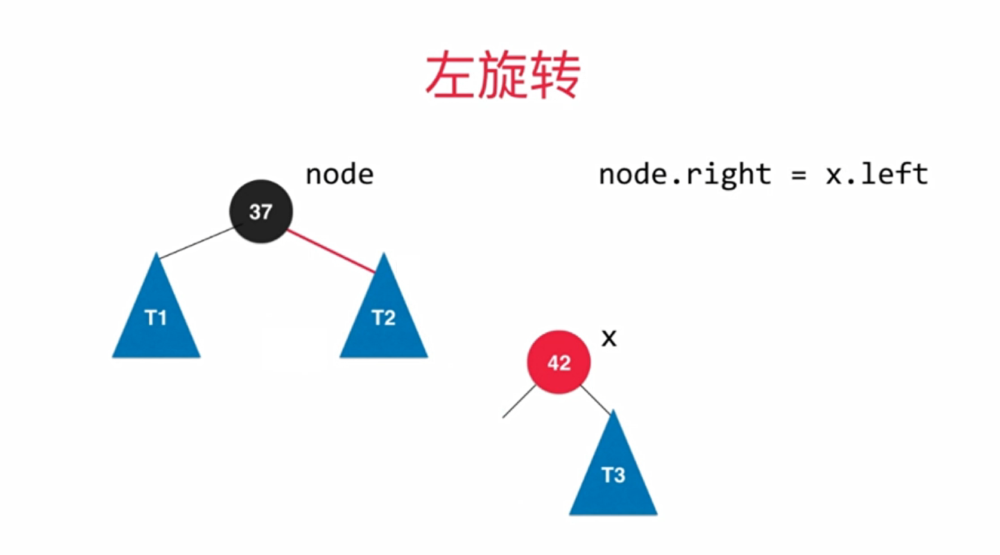
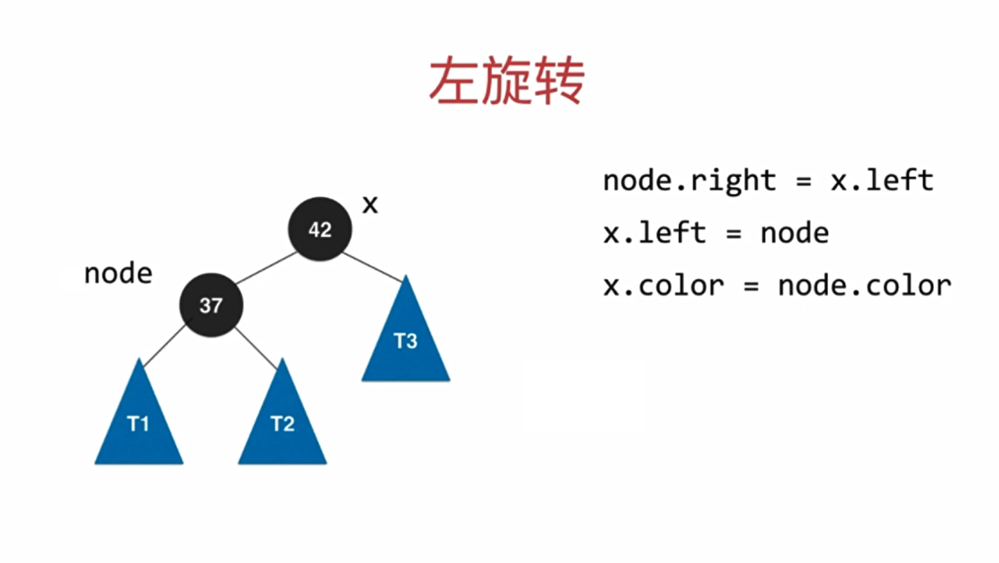
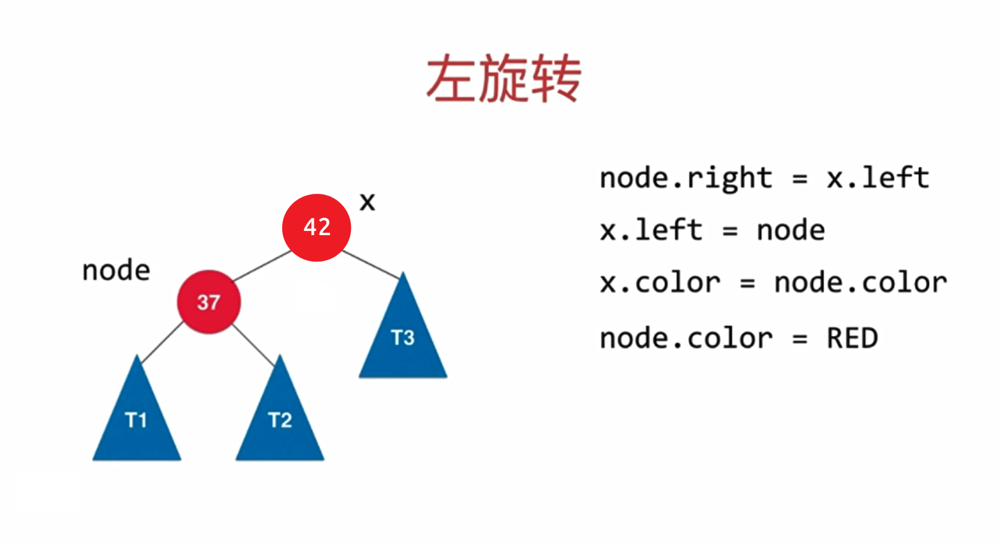

## 1. 平衡树简介

之前我们学习过二叉查找树，发现它的查询效率比单纯的链表和数组的查询效率要高很多，大部分情况下，确实是这样的，但在最坏情况下，二叉查找树可能会退化为链表：

我们会发现，如果我们要查找`1`这个元素，查找的效率依旧会很低。效率低的原因在于这个**树不平衡**，全部是向
左边分支。如果我们有一种方法，能够不受插入数据的影响，让生成的树都像完全二叉树那样，那么即使在最坏情
况下，查找的效率依旧会很好。

### 1.1 平衡树定义

[平衡二叉树](https://baike.sogou.com/lemma/ShowInnerLink.htm?lemmaId=7498523&ss_c=ssc.citiao.link)（BalancedBinaryTree）具有以下性质：

它是一棵空树或它的左右两个子树的高度差的[绝对值](https://baike.sogou.com/lemma/ShowInnerLink.htm?lemmaId=844985&ss_c=ssc.citiao.link)不超过`1`，并且左右两个子树都是一棵平衡二叉树(AVL)

### 1.2 平衡树分类

- AVL树：[自平衡二叉查找树](https://zh.wikipedia.org/wiki/自平衡二叉查找树)，最坏复杂度都是`O(log n)`
- [红黑树](https://zh.wikipedia.org/wiki/红黑树) 
- 2-3树

### 1.3 红黑树和AVL树简介

#### 平衡二叉树（AVL树）

平衡二叉树又称为AVL树，是一种特殊的**二叉排序树**。其左右子树都是平衡二叉树，且左右子树高度之差的绝对值不超过`1`。将二叉树上结点的左子树深度减去右子树深度的值称为平衡因子`BF`，那么平衡二叉树上的所有结点的平衡因子只可能是`-1`、`0`和`1`。只要二叉树上有一个结点的平衡因子的绝对值大于`1`，则该二叉树就是不平衡的。

**【应用】**

- 搜索操作较多的情况下，二叉查找树实现
- 由于要保持严格平衡，插入、删除操作较为耗时

#### 红黑树

红黑树是一种**二叉查找树**，但在每个节点增加一个存储位表示节点的颜色，可以是红或黑（非红即黑）。通过对任何一条从根到叶子的路径上各个==节点着色==的方式的限制，**红黑树确保没有一条路径会比其它路径长出两倍**，因此，红黑树是一种弱平衡二叉树，相对于要求严格的AVL树来说，它的旋转次数少。

**【应用】**

- 搜索，插入，删除操作较多的情况下

#### 小结

- 红黑树和AVL树类似，都是在进行插入和删除时通过特定操作**保持二叉查找树的平衡**，从而获得较高的查找性能

- 红黑树和AVL树的区别在于它使用颜色来标识结点的高度，是局部平衡而不是AVL树中的非常严格的平衡

- 红黑树对于任何不平衡都会在==三次== 旋转之内解决

- 红黑树的算法时间复杂度和AVL相同，但统计性能比AVL树更高

### 1.4 AVL树 vs 红黑树

**平衡性：**左右子树高度之差的绝对值不超过`1`

| 平衡二叉树类型 | 平衡度 | 调整频率 | 适用场景                        |
| -------------- | ------ | -------- | ------------------------------- |
| AVL树          | 高     | 高       | 查询多，增/删少。Windows NT内核 |
| 红黑树         | 低     | 低       | 增/删频繁。C++的STL             |

- AVL树是**严格**的平衡二叉搜索树，平衡条件必须满足所有节点的左右子树高度差不超过`1`
- 红黑树是一种**弱**平衡二叉搜索树（红黑树确保没有一条路径比其它路径长出两倍，平衡因子为`<=2`），在相同的节点情况下，AVL树的高度低于红黑树

------------------------

## 2. 2-3查找树

### 2-3查找树的定义

**2-3查找树是一种绝对平衡的树，任意叶子节点到根节点路径一定相同**

**2-结点**：含有一个键(及其对应的值)和两条链，左链接指向2-3树中的键都小于该结点，右链接指向的2-3树中的键都大于该结点

**3-结点**：含有两个键(及其对应的值)和三条链，左链接指向的2-3树中的键都小于该结点，中链接指向的2-3树中的键都位于该结点的两个键之间，右链接指向的2-3树中的键都大于该结点

### 查找

要判断一个键是否在树中：

- 先将它和**其根结点中的键**比较。如果它和其中任意一个相等，查找命中；
- 否则就根据比较的结果找到指向相应区间的连接，并在其指向的子树中递归地继续查找
- 如果这个是空链接，查找未命中

### 插入

#### 向2-结点中插入新键

往2-3树中插入元素【关键步骤是节点融合】：

- 首先要进行查找，然后将节点挂到未找到的节点上。2-3树之所以能够保证在最差的情况下的效率的原因在于其**插入之后仍然能够保持平衡状态**。

- 如果查找后未找到的节点是一个2-结点，那么很容易，我们只需要将新的元素放到这个2-结点里面使其变成一个3-结点即可。

#### 向一棵只含有一个3-结点的树中插入新键

- 假设2-3树只包含一个3-结点，这个结点有两个键，没有空间来插入第三个键了，最自然的方式是我们假设这个结
	点能存放三个元素，暂时使其变成一个4-结点，同时他包含四条链接。

- 然后，我们将这个4-结点的中间元素提升，左边的键作为其左子结点，右边的键作为其右子结点。

- 插入完成，变为平衡2-3查找树，树的高度从0变为1。

#### 向一个父结点为2-结点的3-结点中插入新键

- 和上面的情况一样一样，我们也可以将新的元素插入到3-结点中，使其成为一个临时的4-结点
- 然后，将该结点中的中间元素提升到父结点即2-结点中，使其父结点成为一个3-结点
- 然后将左右结点分别挂在这个3-结点的恰当位置。

**【情况一：插入到3-节点中间】**

**【情况二：插入到3-节点两侧】**

- `12`节点自动融合，保证绝对平衡

#### 向一个父结点为3-结点的3-结点中插入新键

- 当我们插入的结点是3-结点的时候，我们将该结点拆分，中间元素提升至父结点，但是此时父结点是一个3-结点，插入之后，父结点变成了4-结点
- 然后继续将中间元素提升至其父结点，直至遇到一个父结点是2-结点
- 然后将其变为3-结点，不需要继续进行拆分。

#### 分解根结点

- 当插入结点到根结点的路径上全部是3-结点的时候，最终我们的根结点会变成一个临时的4-结点
- 此时，就需要将根结点拆分为两个2-结点，树的高度加1

### 插入总结

给定根节点为`42`，依次向二叉树中插入[37、18、12、11、6、5]

- 如果是二叉查找树，则会退化为链表
- 2-3查找树，依然保持严格平衡

原因就是节点向上插入，自动向叶子节点融合，分裂，来维持绝对平衡。

### 2-3树的性质

一棵完全平衡的2-3树具有以下性质：

- **绝对平衡**：任意叶子节点到根结点的路径长度都是相等的
- `4-`结点变换为3-结点时，树的高度不会发生变化；只有当**根结点是临时的4-结点**，分解根结点时，树高`+1`
- `2-3`树与普通二叉查找树最大的区别在于，普通的二叉查找树是自顶向下生长，而2-3树是自底向上生长

----------------------------

## 3. 红黑树与2-3树的等价

红链接：红边相连的两个节点为一个`3-`节点，即将两个`2-`结点连接起来构成一个`3-`结点； 

黑链接：普通节点，则是2-3树中的普通链接

### 节点等价

### 3- 节点转为红节点

**【演变过程】**

1. 红色连接边模拟 3- 节点，表示 b-c 是一起的节点
2. 将模拟的 3- 节点还原为树形
3. 由于边是指针存放的节点地址，无法表示红色边为 3- 节点的状态，且父节点和孩子节点只有一条边相连，故将孩子节点变为红色
4. 红节点 表示当前节点和其父亲节点是存放在一起的，二者为一体构成 3- 节点

**红节点**：当前节点和其**父节点**共同构成`3-`节点

**黑节点**：二叉树中普通节点，`2-3`树中的`2-`节点

-----------------

## 4. 红黑树

### 4.1 红黑树的定义

红黑树是含有红黑链接，并满足下列条件的二叉查找树：

- 【首先】必须满足是一棵二叉查找树(BST)

- 【其次】要确保没有一条路径会比其他路径长出两倍

1. 每一个结点要么为**红色**，要么为**黑色**；
2. 根节点为**黑色**；
3. **红色节点**不允许**同时**相连(`4-`节点不允许存在，树中不存在两个相邻的红色结点)；
4. 每个叶子结点都是**黑色**的空结点（NIL结点）
5. **黑色平衡**，即任意**空连接NIL**到根结点的路径上的**黑连接数**相同；

> 红黑树要确保没有一条路径会比其他路径长出**两倍**，是自平衡的二叉树

### 4.2 红黑树的性质

1. 每个节点非红即黑

2. 根节点是黑的;

3. 每个叶节点都是黑的;
4. **红色节点只能出现在左侧**（红色节点只能作为黑色节点的==左孩子==，同理黑色节点只能作为黑色节点的右孩子）
5. 如果一个节点是红色的，则它的子节点必须是黑色的（不能同时和两个红链接相连）
6. **黑色平衡**，即任意**空链接**到根结点的路径上的**黑链接数**相同；但不是严格意义上的平衡二叉树

**【区别】：**

- AVL 树是高度平衡的，频繁的插入和删除，会引起频繁的rebalance，导致效率下降；

- 红黑树不是高度平衡的，算是一种折中，**插入最多两次旋转**，**删除最多三次旋转**。

- 

### 4.3 颜色翻转

> 颜色翻转为插入、删除操作的一个子过程。将其放入到插入的环境中，结合 **2-3树** 来讲解

当一个结点的左子结点和右子结点的color都为RED时，也就是出现了临时的4-结点，此时只需要把左子结点和右子
结点的颜色变为BLACK，同时让当前结点的颜色变为RED即可

此时，该结构对应 **2-3树** 的 **4-** 节点，要进行变色；即对应 **2-3树** 的节点分裂，全部变为**黑色**

然后，节点向上融合，变为**红色**

 

 

### 4.4 平衡化

**平衡化只是保持红黑树的平衡状态，并不满足红黑树的性质**

**平衡化完之后，可能还需要颜色翻转**

#### 左旋

**1. 左旋：**红节点出现在了右侧 ；

**2. 左旋过程：**

1. 让`S`的左子结点变为`E`的右子结点：`S.right = E.left;`
2. 让`E`成为`S`的左子结点：`S.left = E;`
3. 让h的color属性变为x的color属性值：x.color=h.color;
4. 让h的color属性变为RED：h.color=true;

**开始左旋**

**第一步：断开连接**

**第二步：子树转移**

**第三步：节点相连**

**第四步：两次变色**

`x`变为和`node`相同的颜色

`node`变为红色，保证`node`一定为红色

- **x节点的颜色一定是与<u>开始</u>时node节点的颜色保持一致**

- **如果开始node为红色，则x变色后也是红色**
- **node还需要变为红色，node一定为红色**

> **如果开始node为红色，则经历两次变色后，出现两个红色节点相连**

**此时，将x节点返回，在上一层子树做变色处理，满足红黑树的特性**

 

 

#### 右旋

**右旋：**两个红节点同时相连(4-节点不允许存在)；

**第一步：断开连接**

**第二步：子树转移**

**第三步：节点相连**

**第四步：两次变色**

到此，右旋完成！

> 但是，此时并不符合我们 **2-3树** 的定义，因为此时是一个 **4-** 节点的结构，需要进行颜色翻转

最终为

 

 

## 5. 红黑树节点添加

**永远添加的是红色节点**

### 添加总结

**1. 找到插入位置并插入**

判断待插入的节点`c`和当前兄弟节点`a`和父亲节点`b`的大小关系：

- `c > b > a`：变色即可
- `c < a < b`：右旋 + 变色
- `a < c < b `：左旋 + 右旋 + 变色

**2. 回溯向上维护**

插入完成后，可能当前局部的树是满足红黑树的定义和性质的；但是放到整个树中又有歧义，需要**回溯继续进行调整**

------------------

### 2- 节点添加元素

#### 添加在黑节点左侧——直接添加

#### 添加在黑节点右侧——左旋

> 如上两种操作对应的是**2-3查找树**中，向 **2-** 节点添加元素

### 3- 节点添加元素

#### 添加在黑节点右侧——颜色转换

此时，形成 **4-** 节点，需要两次变色处理

#### 添加在红节点左侧——右旋

#### 添加在红节点右侧

-----------------

## 6. 红黑树性能总结

### 复杂度

- 最大高度`2 (lon n)`
- 添加、删除、查找均为`O(lon n)`
- 不会退化为链表，由`2-3`性质保证

### 综合

对于完全随机的数据，普通的二分搜索树很好用！

- 缺点：极端情况退化成链表（或者高度不平衡）

对于查询较多的使用情况，AVL树很好用！

红黑树牺牲了平衡性（`2(log n)`的高度）

**统计性能更优**（综合增删改查所有的操作）

------------

## 7. 红黑树代码实现

### API设计

**节点类**

### 代码

-------------------

**【参考文章】**

1. [红黑树到底为什么红黑啊?](https://www.jianshu.com/p/07526a2f235d)
2. [清晰理解红黑树的演变---红黑的含义](https://blog.csdn.net/chen_zhang_yu/article/details/52415077)
3. [为什么要有红黑树？什么是红黑树？画了20张图，看完这篇你就明白了](https://www.lagou.com/lgeduarticle/93400.html)
4. [红黑树系列文章](https://mp.weixin.qq.com/mp/appmsgalbum?__biz=MzA4NDE4MzY2MA==&action=getalbum&album_id=1338152221988585473&subscene=159&subscene=126&scenenote=https%3A%2F%2Fmp.weixin.qq.com%2Fs%3F__biz%3DMzA4NDE4MzY2MA%3D%3D%26mid%3D2647521575%26idx%3D1%26sn%3D844d6bcdf8cdce683d7d837d4933c788%26chksm%3D87d24624b0a5cf32a119334268184987b6f254de7edfd35ae19c88999789ff70e24a5881bf68%26scene%3D126%26sessionid%3D1597460700%26key%3Daabb5ee173354e5d9c4bc041aab2c756b409e02cab7208a527c2827d4511790aeaa2fdff85e57e707694fbb1dd7131c1dc33ccb49f45cbeacefc81ad338d41f69992e6a07a3da687daf5498c577b78a6111642165c13cdd7bc753fb46abe3038d27580f960bdabdb4cfded7b27b93b32a0532f8ec0d776eb6e64f0ea23ecb82f%26ascene%3D1%26uin%3DMTE1Mjk1NTAwNQ%253D%253D%26devicetype%3DWindows%2B10%2Bx64%26version%3D62090538%26lang%3Dzh_CN%26exportkey%3DA1zRdJZKefQ6v8NAu7skwRw%253D%26pass_ticket%3DE1bDKh3gnVKNt6zWC4ruHy3OLOJo3rmKSyhVKtG5HS80qUl5HKDNr%252BC4uGH61v0R#wechat_redirect)