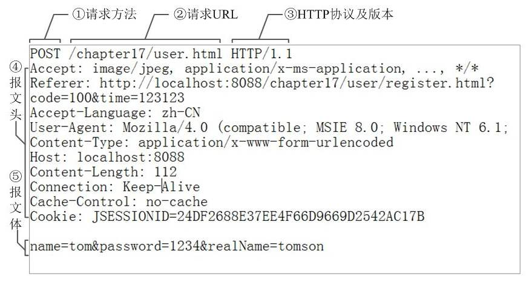
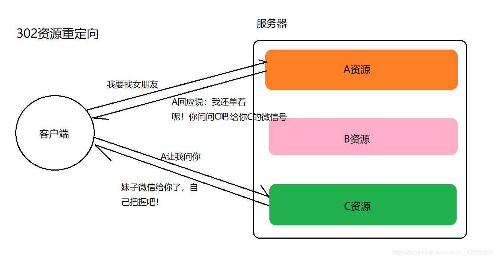
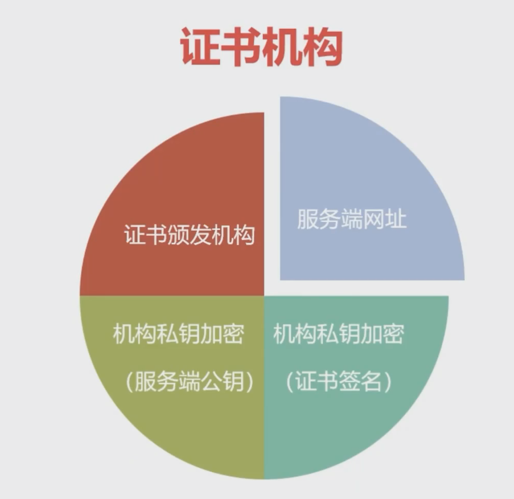
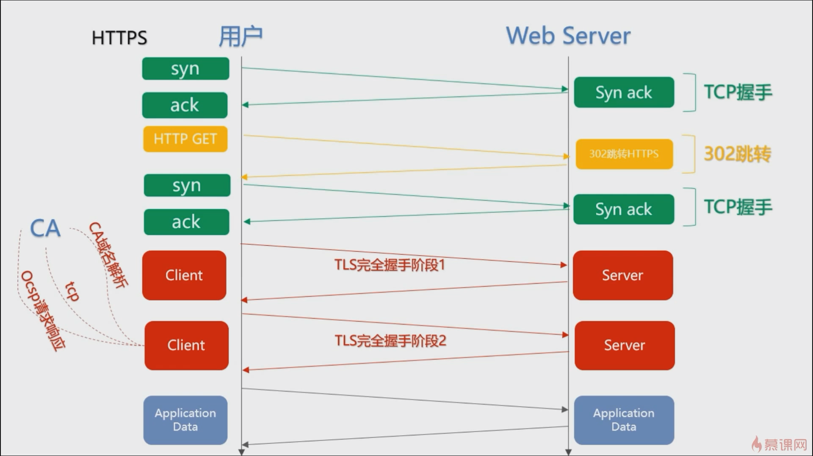

## HTTP简介

**HTTP-超文本传输协议**，通过Web服务器来传输 超文本信息HTML，它是一个**应用层协议**

### HTTP协议特点

**1. 客户端 / 服务器模式**

- 客户端发出请求，服务器来响应请求

**2. 无状态**

- 每次连接只处理一个请求，每个请求都是独立的。服务器处理完客户端的请求后并收到应答后，就断开连接

### URI & URL

- **URI** ： 统一资源**标识符**，对Web上资源的标识
- **URL** ：统一资源**定位符**，<u>资源的请求地址</u> 【地址】
- **URN** ：统一资源**名称**，唯一的标识信息 【姓名】

### HTTP报文

**请求消息数据格式**

- 请求行

- 请求头

- 请求空行

- 请求体

 

## 请求和响应

### HTTP请求方法剖析

**1. GET**

- HTTP默认请求方式，请求已被URI识别的资源

**2. POST**

- 提交表单数据，大小无限制。

**3. PUT**

- 传送资源（创建用POST，更新用PUT）

**4. HEAD**

- 只请求报文头，用于测试网络连接

**5. DELETE**

- 删除资源

**6. OPTIONS**

**7. TRACE**

**8. CONNECT**

### HTTP响应状态码

**HTTP状态码分类**

HTTP状态码共分为5种类型：

| 分类 |                    分类描述                    |
| :--: | :--------------------------------------------: |
| 1xx  |                 服务器转换协议                 |
| 2xx  |                    请求成功                    |
| 3xx  |                     重定向                     |
| 4xx  |       客户端错误，请求路径没有对应的资源       |
| 5xx  | 服务器错误，服务器在处理请求的过程中发生了错误 |

代表：

- 301：永久重定向
- 302：临时重定向

 

- 403：请求页面的访问被禁止

- 404（请求路径没有对应的资源）
- 405：请求方式没有对应的`doXxx`方法

 

- 500：服务器内部错误，服务器在处理请求的过程中发生了错误
- 502： 请求未完成，无效的响应
- 503：由于超载或系统维护，服务器暂时的无法处理客户端的请求

 

## 会话机制 [状态管理]

###  Cookie

**Cookie是服务器给客户端颁发的一个`通行证`，用来标识客户端的状态。**

Cookie是一小段的文本信息，当浏览器向服务器请求数据时，会携带自己的Cookie一同提交给服务器。服务器检查该Cookie，辨别用户状态。

- 首次连接，服务器会通过`set-cookie`为客户端颁发

- Cookie可以被服务器修改
- Cookie失效时间较长，可以设为永久有效

### Session

**Session是服务端来记录客户端状态的机制，保存在服务器上**

客户端访问服务器时，服务端把该客户端`SessionID`（唯一的）记录在服务器上

- 第一次访问，新创建`SessionID`

- 再次访问只需检查该客户端对相应的`SessionID`即可

**如果Cookie禁用，则采用URL重写**

- 【方式一】将SessionID附加到URL后缀
- 【方式二】以查询`SessionID`的字符串形式附加到URL中
- 【方式三】将SessionID隐藏在表单中提交

**为了防止服务器内存溢出，Session会超时失效**

- 长时间不使用该Session，会超时失效
- 程序调用`HttpSession.invaliddate()`，Session自动失效

### 二者对比

存放位置不同

安全性（隐私策略）不同

- Cookie是客户端的信息，存在敏感信息泄露的风险，需加密（用户名密码等不要放入Cookie，或者要加密）
- Session对客户端是透明的

失效时间不同

 

## HTTP身份验证

### SSL认证

SSL客户端认证是借助`HTTPS`的客户端证书完成认证的方式。凭借客户端证书认证，服务器可以确认访问是否来自自己认证过的客户端。

导入证书和维护认证的方式相对繁琐，多数网站采用**基于表单的认证**

### 表单认证

通过Cookie和Session会话方式来认证

 

 

 

## HTTPS

HTTP传输采用的是明文的方式，不够安全。**HTTPS**是在HTTP的基础上增加了安全认证。可以理解为套了SSL壳子的HTTP

**HTTP保证了数据的安全性和完整性**

**加密算法**

- 对称加密（加密和解密使用相同的秘钥，但秘钥肯能会被截获）
- 非对称加密 （结合证书加密）

### HTTPS特点

#### 1. 内容加密

- 对称内容加密

- 非对称密钥交换

#### 2. 数字证书身份认证

> 引入证书进行身份认证

- 服务器将生成的 CA证书 传给客户端
- 客户端收到证书，解密证书签名。然后根据证书规则，验证证书的真伪
- 真证书。解密服务器公钥`key1`，非对称生成新`key2`，再用服务器端`key1`加密发给服务端新的CA证书

#### 3. 数据完整性

网络传输过程中需要经过很多中间节点，虽然数据无法被解密，但可能被篡改，那如何校验数据的完整性呢？通过校验数字签名，流程见下图：

数字签名校验

首先来了解下[哈希算法](https://link.jianshu.com?t=https://zh.wikipedia.org/wiki/散列函數)，哈希算法能够将任意长度的字符串转化为固定长度的字符串，该过程不可逆，可用来作数据完整性校验。

**服务器在发送报文之前做了3件的事：**

- 用哈希算法对报文提取定长摘要
- 用私钥对摘要进行加密，作为数字签名
- 将数字签名附加到报文末尾发送给客户端

**客户端接收到报文后：**

- 用公钥对服务器的数字签名进行解密
- 用同样的算法重新计算出报文的数字签名
- 比较解密后的签名与自己计算的签名是否一致，如果不一致，说明数据被篡改过。

同样，客户端发送数据时，通过公钥加密报文摘要，服务器用私钥解密，用同样的方法校验数据的完整性。

## HTTPS通信的过程

HTTPS通信过程

1. 客户端将自己支持的加密算法发送给服务器，请求服务器证书；
2. 服务器选取一组加密算法，并将证书返回给客户端；
3. 客户端校验证书合法性，生成随机对称密钥，用公钥加密后发送给服务器；
4. 服务器用私钥解密出对称密钥，返回一个响应，HTTPS连接建立完成；
5. 随后双方通过这个对称密钥进行安全的数据通信。 

> https://www.jianshu.com/p/fb6035dbaf8b

### HTTPS使用成本

- 证书费用以及更新维护

- HTTPS降低用户访问速度

HTTPS通信全过程：

