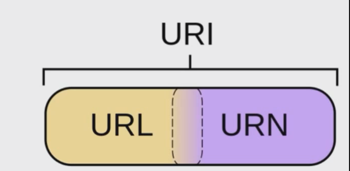
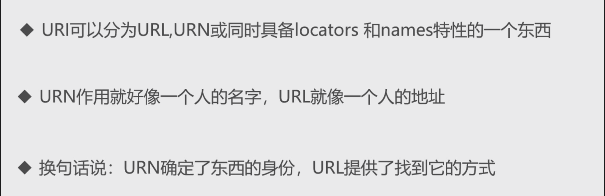
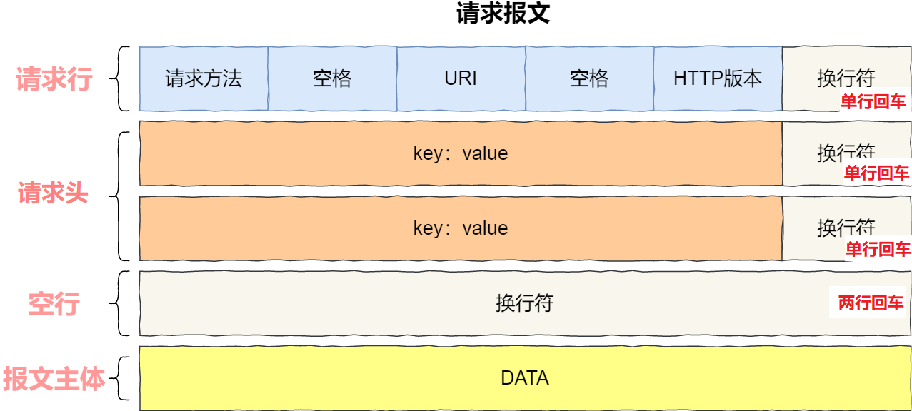
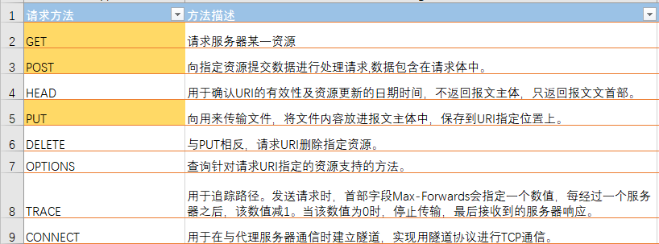
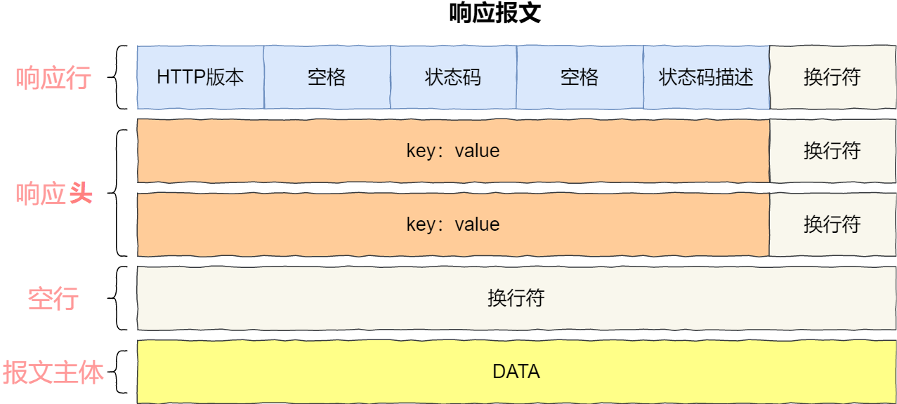
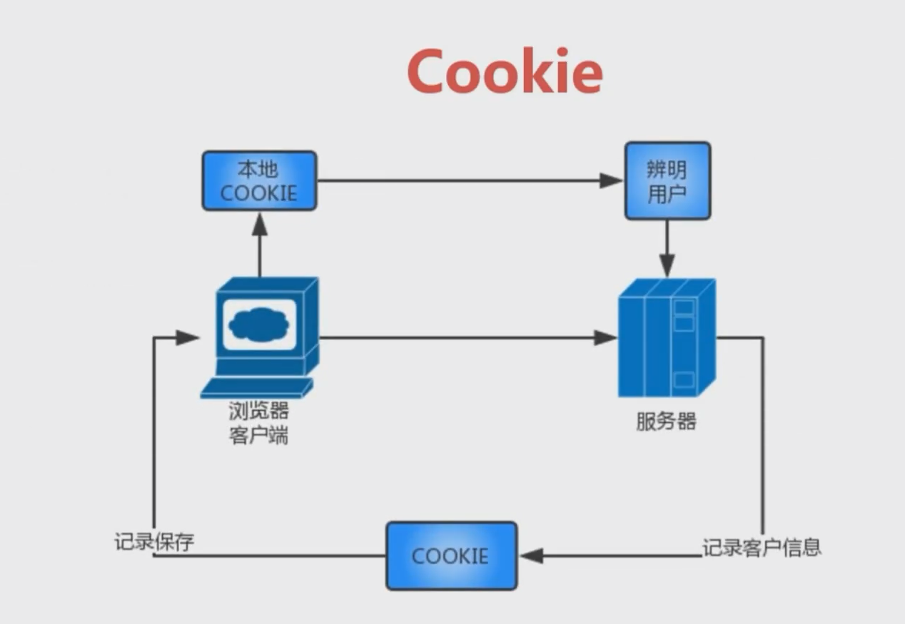
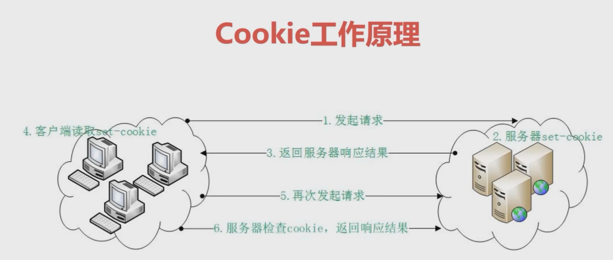
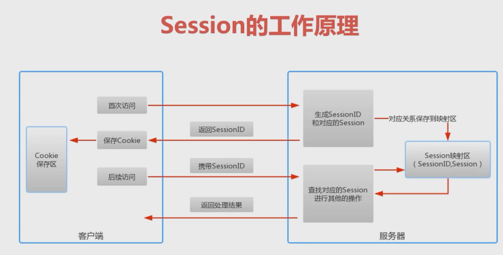
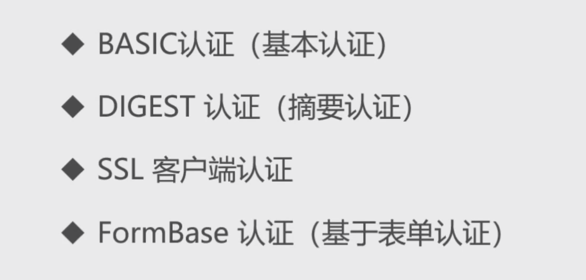

## HTTP简介

**HTTP-超文本传输协议**，通过Web服务器来传输 超文本信息HTML，它是一个**应用层协议**

### HTTP协议特点

**1. 客户端 / 服务器模式**

- 客户端发出请求，服务器来响应请求

**2. 无状态**

- 每次连接只处理一个请求，每个请求都是独立的。服务器处理完客户端的请求后并收到应答后，就断开连接

### URI & URL





- **URI** ： 统一资源**标识符**，对Web上资源的标识
- **URL** ：统一资源**定位符**，<u>资源的请求地址</u> 【地址】
- **URN** ：统一资源**名称**，唯一的标识信息 【姓名】

------------------

## 请求报文

**请求消息数据格式**

- 请求行

- 请求头

- 请求空行

- 请求体



```http
GET / HTTP/1.1                 //请求方法为GET，HTTP协议为1.1
Host: www.baidu.com            //URL为www.baidu.com
User-Agent: Mozilla/5.0        //用户代理，也就是浏览器了，显示了浏览器的详细信息
Accept: text/html,application/xhtml+xml,application/xml;      //服务器能够发送的文件类型text/html
Accept-Language: zh-cn,zh;              //服务器能够发送的语言 zh-cn为中文
Accept-Encoding: gzip, deflate         //服务器能够发送的编码格式为gzip，编码格式不符合浏览器会解释不了
Cookie: BAIDUID=AF6C346B14E94898933E5F858C63F889:FG=1;
//cookie，服务器存储在客户端的信息，每次请求都会将服务器保存在客户端的cookie一并发送上服务器。
Connection: keep-alive      //连接，keep-alive保持状态
Cache-Control: max-age=0    //随报文传送缓存指示    cache-control：max-age>0 时 直接从游览器缓存中-提取           //max-age<=0 时 向server 发送http 请求确认 ,该资源是否有修改 有的话 返回200 ,无的话 返回304.
```

### HTTP请求方法




**1. GET**：HTTP默认请求方式，请求已被URI识别的资源

**2. POST**：提交表单数据，大小无限制。

**3. PUT**：传送资源（创建用POST，更新用PUT）

**4. HEAD**：只请求报文头，用于测试网络连接

**5. DELETE**：删除资源

<br>

## 响应报文

- 响应行
- 响应体
- 响应空行
- 响应体



```http
HTTP/1.1 200 OK                         //HTTP版本 1.1    状态码200
Server: nginx                           //服务器应用程序软件的名称和版本
Date: Sun, 17 May 2020 17:04:29 GMT     //响应的时间日期
Content-Type: text/html; charset=UTF-8  //响应类型为HTML文本，编码类型为utf-8
Connection: keep-alive                  //状态为保持连接
Content-Encoding: gzip                  //对主体执行的编码方式为gzip
Set-Cookie: H_PS_PSSID=2097_1464_2133_1944_1788; path=/; domain=.baidu.com    //设置cookie，path,domain都是cookie的信息(作用范围等等)
```


### HTTP响应状态码

**HTTP状态码共分为5种类型**

| 分类 |                    分类描述                    |
| :--: | :--------------------------------------------: |
| 1xx  |                 服务器转换协议                 |
| 2xx  |                    请求成功                    |
| 3xx  |                     重定向                     |
| 4xx  |       客户端错误，请求路径没有对应的资源       |
| 5xx  | 服务器错误，服务器在处理请求的过程中发生了错误 |

**1xx代表：**

- 101：协议升级，如HTTP协议升级到WebSocket协议

**2xx代表：**

- 200正常处理，请求成功

**3xx代表：**

- 301：永久重定向。本地请求的资源以及不存在，使用新的URI再次访问
- 302：临时重定向。所请求的资源暂时还在，但是目前需要用另一个URI访问

>301 和 302 通过在字段Location中表明需要跳转的URI。两者最大的不同在于一个是临时改变，一个是永久改变。举个例子，有时候需要将网站全部升级为HTTPS，这种永久性改变就需要配置永久的"301"。有时候晚上更新系统，系统暂时不可用，可以配置"302"临时访问，此时不会做缓存优化，第二天还会访问原来的地址。

**4xx代表：**

- 403：请求页面的访问被禁止
- 404（请求路径没有对应的资源）
- 405：请求方式没有对应的`doXxx`方法
- 408：请求超时，服务器等待了过长的时间
- 409：多个请求发生了冲突，可以理解为多线程并发时的竞态

**5xx代表：**

- 500：服务器内部错误，服务器在处理请求的过程中发生了错误
- 502： 请求未完成，无效的响应
- 503：由于超载或系统维护，服务器暂时的无法处理客户端的请求

<br>

## 会话机制 [状态管理]

###  Cookie

**Cookie是服务器给客户端颁发的一个`通行证`，用来标识客户端的状态。**

Cookie是一小段的文本信息，当浏览器向服务器请求数据时，会携带自己的Cookie一同提交给服务器。服务器检查该Cookie，辨别用户状态。






- 首次连接，服务器会通过`set-cookie`为客户端颁发

- Cookie可以被服务器修改
- Cookie失效时间较长，可以设为永久有效

### Session

**Session是服务端来记录客户端状态的机制，保存在服务器上**



客户端访问服务器时，服务端把该客户端`SessionID`（唯一的）记录在服务器上

- 第一次访问，新创建`SessionID`

- 再次访问只需检查该客户端对相应的`SessionID`即可

**如果Cookie禁用，则采用URL重写**

- 【方式一】将SessionID附加到URL后缀
- 【方式二】以查询`SessionID`的字符串形式附加到URL中
- 【方式三】将SessionID隐藏在表单中提交

**为了防止服务器内存溢出，Session会超时失效**

- 长时间不使用该Session，会超时失效
- 程序调用`HttpSession.invaliddate()`，Session自动失效


### 二者对比

存放位置不同

安全性（隐私策略）不同

- Cookie是客户端的信息，存在敏感信息泄露的风险，需加密（用户名密码等不要放入Cookie，或者要加密）
- Session对客户端是透明的

失效时间不同

<br>

<hr>

<br>

## 【版本差别】

**不同版本的区别**

- http1.0 到http1.1的主要区别，就是从无连接到**长连接**

- http2.0对比1.X版本主要区别就是**多路复用**

### HTTP-1.0

**无状态**：服务器不跟踪不记录请求过的状态（可借助Cookie和Session）

**无连接**：浏览器每次请求都需要建立TCP连接

- 无法复用连接，每次发送请求，需要重新建立连接
- 队头阻塞：前一个请求响应到达之后下一个请求才能发送，如果前一个阻塞，后面的请求也给阻塞

### HTTP-1.1

**长连接**：新增Connection字段，可以设置`keep-alive`值保持连接不断开

**管道化**：基于上面长连接的基础，管道化可以不等第一个请求响应继续发送后面的请求，但响应的顺序还是按照请求的顺序返回

**缓存处理**：新增字段`cache-control`。当浏览器请求资源时，先看是否有缓存的资源，如果有缓存，直接取，不会再发请求，如果没有缓存，则发送请求

**断点传输**：在上传/下载资源时，如果资源过大，将其分割为多个部分，分别上传/下载，如果遇到网络故障，可以从已经上传/下载好的地方继续请求，不用从头开始，提高效率。

在 Header 里两个参数实现的，客户端发请求时对应的是 Range 服务器端响应时对应的是 Content-Range

### HTTP-2.0

**二进制分帧**：HTTP/2 将请求和响应数据分割为更小的帧，并且它们采用二进制编码

**多路复用**：在共享TCP链接的基础上同时发送请求和响应

**头部压缩：** 减少冗余数据，降低开销

**服务器推送**：服务器可以额外的向客户端推送资源，而无需客户端明确的请求

#### I. 二进制传输:

HTTP/2 将请求和响应数据分割为更小的帧，并且它们采用二进制编码。

它把TCP协议的部分特性挪到了应用层，把原来的"Header+Body"的消息"打散"为数个小片的二进制"帧"(Frame),用"HEADERS"帧存放头数据、"DATA"帧存放实体数据。HTP/2数据分帧后"Header+Body"的报文结构就完全消失了，协议看到的只是一个个的"碎片"。

HTTP/2 中，同域名下所有通信都在单个连接上完成，该连接可以承载任意数量的双向数据流。每个数据流都以消息的形式发送，而消息又由一个或多个帧组成。多个帧之间可以乱序发送，根据帧首部的流标识可以重新组装。

#### II. Header 压缩

HTTP/2并没有使用传统的压缩算法，而是开发了专门的"HPACK”算法，在客户端和服务器两端建立“字典”，用索引号表示重复的字符串，还采用哈夫曼编码来压缩整数和字符串，可以达到50%~90%的高压缩率。

具体来说:

在客户端和服务器端使用“首部表”来跟踪和存储之前发送的键-值对，对于相同的数据，不再通过每次请求和响应发送；

首部表在HTTP/2的连接存续期内始终存在，由客户端和服务器共同渐进地更新；

每个新的首部键-值对要么被追加到当前表的末尾，要么替换表中之前的值。

例如下图中的两个请求， 请求一发送了所有的头部字段，第二个请求则只需要发送差异数据，这样可以减少冗余数据，降低开销。


#### III. 多路复用

在 HTTP/2 中引入了多路复用的技术。多路复用很好的解决了浏览器限制同一个域名下的请求数量的问题，同时也更容易实现全速传输，毕竟新开一个 TCP 连接都需要慢慢提升传输速度。

#### IV. Server Push-服务器推送

HTTP2还在一定程度上改变了传统的“请求-应答”工作模式，服务器不再是完全被动地响应请求，也可以新建“流”主动向客户端发送消息。比如，在浏览器刚请求HTML的时候就提前把可能会用到的JS、CSS文件发给客户端，减少等待的延迟，这被称为"服务器推送"（ Server Push，也叫 Cache push）。


<br>

<hr>

<br>

## HTTP身份验证



### SSL认证

SSL客户端认证是借助`HTTPS`的客户端证书完成认证的方式。凭借客户端证书认证，服务器可以确认访问是否来自自己认证过的客户端。

导入证书和维护认证的方式相对繁琐，多数网站采用**基于表单的认证**

### 表单认证

通过Cookie和Session会话方式来认证

