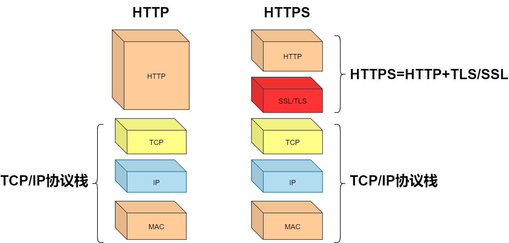
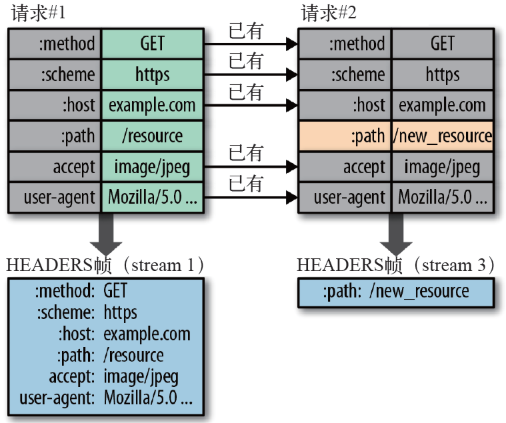
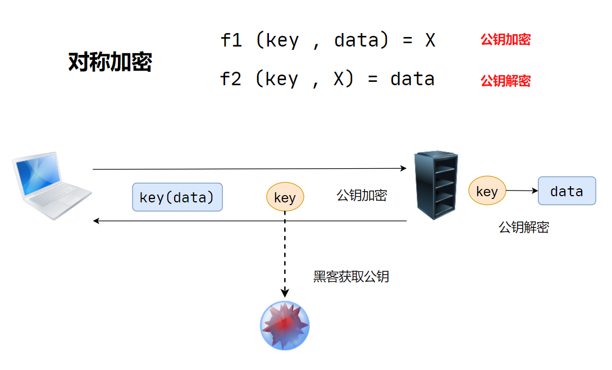
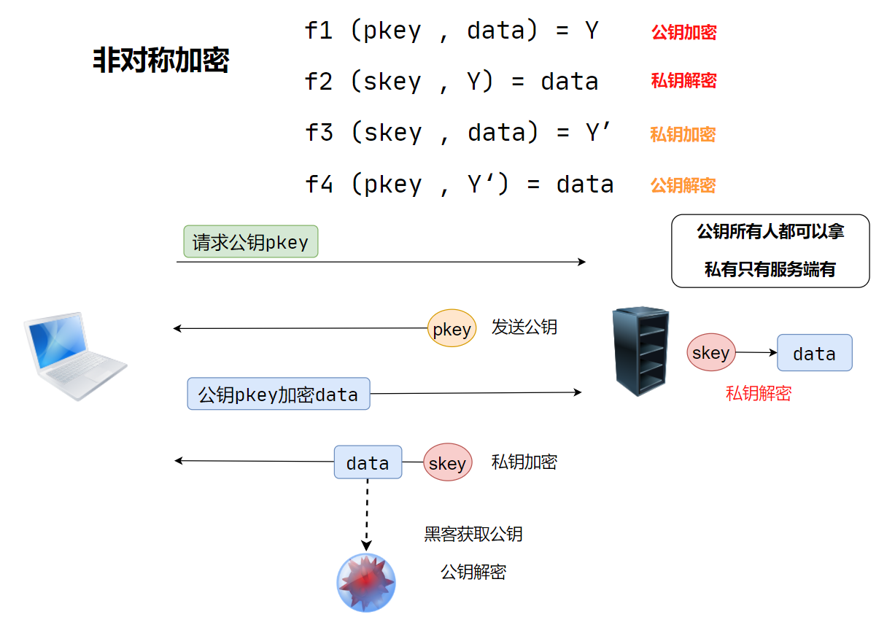

## 一. HTTPS特点

**HTTPS = HTTP + SSL/TSL**

TSL：

### 1. 内容加密

- 对称内容加密

- 非对称密钥交换

### 2. 数字证书身份认证

> 引入证书进行身份认证

- 服务器将生成的 CA证书 传给客户端
- 客户端收到证书，解密证书签名。然后根据证书规则，验证证书的真伪
- 真证书。解密服务器公钥`key1`，非对称生成新`key2`，再用服务器端`key1`加密发给服务端新的CA证书

### 3. 数据完整性

网络传输过程中需要经过很多中间节点，虽然数据无法被解密，但可能被篡改，那如何校验数据的完整性呢？通过校验数字签名，流程见下图：

数字签名校验

首先来了解下[哈希算法](https://link.jianshu.com?t=https://zh.wikipedia.org/wiki/散列函數)，哈希算法能够将任意长度的字符串转化为固定长度的字符串，该过程不可逆，可用来作数据完整性校验。

**服务器在发送报文之前做了3件的事：**

- 用哈希算法对报文提取定长摘要
- 用私钥对摘要进行加密，作为数字签名
- 将数字签名附加到报文末尾发送给客户端

**客户端接收到报文后：**

- 用公钥对服务器的数字签名进行解密
- 用同样的算法重新计算出报文的数字签名
- 比较解密后的签名与自己计算的签名是否一致，如果不一致，说明数据被篡改过。

同样，客户端发送数据时，通过公钥加密报文摘要，服务器用私钥解密，用同样的方法校验数据的完整性。

 

## 二. 版本差别

**不同版本的区别**

- http1.0 到http1.1的主要区别，就是从无连接到**长连接**

- http2.0对比1.X版本主要区别就是**多路复用**

### HTTP-1.0

**无状态**：服务器不跟踪不记录请求过的状态（可借助Cookie和Session）

**无连接**：浏览器每次请求都需要建立tcp连接

- 无法复用连接，每次发送请求，需要重新建立连接
- 队头阻塞：前一个请求响应到达之后下一个请求才能发送，如果前一个阻塞，后面的请求也给阻塞

### HTTP-1.1

**长连接**：新增Connection字段，可以设置`keep-alive`值保持连接不断开

**管道化**：基于上面长连接的基础，管道化可以不等第一个请求响应继续发送后面的请求，但响应的顺序还是按照请求的顺序返回

**缓存处理**：新增字段`cache-control`。当浏览器请求资源时，先看是否有缓存的资源，如果有缓存，直接取，不会再发请求，如果没有缓存，则发送请求

**断点传输**：在上传/下载资源时，如果资源过大，将其分割为多个部分，分别上传/下载，如果遇到网络故障，可以从已经上传/下载好的地方继续请求，不用从头开始，提高效率。

在 Header 里两个参数实现的，客户端发请求时对应的是 Range 服务器端响应时对应的是 Content-Range

### HTTP-2.0

**二进制分帧**：HTTP/2 将请求和响应数据分割为更小的帧，并且它们采用二进制编码

**多路复用**：在共享TCP链接的基础上同时发送请求和响应

**头部压缩：** 减少冗余数据，降低开销

**服务器推送**：服务器可以额外的向客户端推送资源，而无需客户端明确的请求

#### I. 二进制传输:

HTTP/2 将请求和响应数据分割为更小的帧，并且它们采用二进制编码。

它把TCP协议的部分特性挪到了应用层，把原来的"Header+Body"的消息"打散"为数个小片的二进制"帧"(Frame),用"HEADERS"帧存放头数据、"DATA"帧存放实体数据。HTP/2数据分帧后"Header+Body"的报文结构就完全消失了，协议看到的只是一个个的"碎片"。

HTTP/2 中，同域名下所有通信都在单个连接上完成，该连接可以承载任意数量的双向数据流。每个数据流都以消息的形式发送，而消息又由一个或多个帧组成。多个帧之间可以乱序发送，根据帧首部的流标识可以重新组装。

#### II. Header 压缩

HTTP/2并没有使用传统的压缩算法，而是开发了专门的"HPACK”算法，在客户端和服务器两端建立“字典”，用索引号表示重复的字符串，还采用哈夫曼编码来压缩整数和字符串，可以达到50%~90%的高压缩率。

具体来说:

在客户端和服务器端使用“首部表”来跟踪和存储之前发送的键-值对，对于相同的数据，不再通过每次请求和响应发送；

首部表在HTTP/2的连接存续期内始终存在，由客户端和服务器共同渐进地更新；

每个新的首部键-值对要么被追加到当前表的末尾，要么替换表中之前的值。

例如下图中的两个请求， 请求一发送了所有的头部字段，第二个请求则只需要发送差异数据，这样可以减少冗余数据，降低开销。

#### III. 多路复用

在 HTTP/2 中引入了多路复用的技术。多路复用很好的解决了浏览器限制同一个域名下的请求数量的问题，同时也接更容易实现全速传输，毕竟新开一个 TCP 连接都需要慢慢提升传输速度。

#### IV. Server Push

HTTP2还在一定程度上改变了传统的“请求-应答”工作模式，服务器不再是完全被动地响应请求，也可以新建“流”主动向客户端发送消息。比如，在浏览器刚请求HTML的时候就提前把可能会用到的JS、CSS文件发给客户端，减少等待的延迟，这被称为"服务器推送"（ Server Push，也叫 Cache push）。

 

--------------------

## 三. 加密算法

### 对称加密

**对称：** 加密和解密使用同一个秘钥`key`

【客户端】：`key`对称加密后的data

【服务器】：利用公钥`key`对data解密

**黑客获取公钥，客户端请求时不安全**

### 非对称加密

**非对称：** 公钥`pkey`，私钥`skey`

【客户端】：向服务器请求`pkey`

【服务器】：给客户端发送`pkey`

【客户端】：向服务器发送数据，`pkey`加密

【服务器】：接收到客户端的数据，`skey`解密；并且通过`skey`先客户端发送数据

**黑客获取公钥，公钥可以解私钥；服务端向客户端发送时不安全**

 

----------------

## 四. 对称 + 非对称 + 引入CA证书

### CA证书

**CA证书**：权威官方机构颁发的秘钥证书，写死在操作系统中，每一个客户端会有不同的`key`

CA 证书内一般会包含以下内容：

- 证书的颁发机构、版本
- 证书的使用者
- 证书的公钥
- 证书的有效时间
- 证书的数字签名 Hash 值和签名 Hash 算法

【验证CA证书是否合法】

CA 证书中的 Hash 值，其实是用证书的私钥进行加密后的值（证书的私钥不在 CA 证书中）。然后客户端得到证书后，利用证书中的公钥去解密该 Hash 值，得到 Hash-a ；然后再利用证书内的签名 Hash 算法去生成一个 Hash-b 。最后比较 Hash-a 和 Hash-b 这两个的值。如果相等，那么证明了该证书是对的，服务端是可以被信任的；如果不相等，那么就说明该证书是错误的，可能被篡改了，浏览器会给出相关提示，无法建立起 HTTPS 连接。除此之外，还会校验 CA 证书的有效时间和域名匹配等。

### 详解HTTPS加密

1. 客户端先获取公钥`pkey`
2. 【客户端】：用哈希算法对报文提取定长摘要`num`，用公钥加密生成`Y`上传服务端
3. 【服务器】：用私钥`skey`解密`Y`，获取到`num`。协商完成，`num`作为对称加密的`key`

先用非对称加密获取到公钥，然后生成**对话密钥**进行对称加密传输

 

----------------------

接下来我们就来详细讲一下 HTTPS 中的 SSL 握手建立过程

**假设现在有客户端 A 和服务器 B** ：

客户端 A 访问服务器 B ，比如我们用浏览器打开一个网页 https://www.baidu.com ，这时，浏览器就是客户端 A ，百度的服务器就是服务器 B 了。

1. 首先，客户端 A 生成一个随机数`num1`，把随机数`num1` 、自己支持的 SSL 版本号以及加密算法等这些信息告诉服务器 B 
2. 服务器 B 知道这些信息后，然后确认一下双方的加密算法，然后服务端也生成一个随机数 `num2` ，并将随机数 `num2` 和 **CA** 证书一同返回给客户端 A 。
3. 客户端 A 得到 CA 证书后，会去校验该 CA 证书的有效性。校验通过后，客户端生成一个随机数`num3` ，然后用证书中的公钥加密随机数 `num3` 并传输给服务端 B 
4. 服务端 B 得到加密后的随机数`num3`，然后利用私钥进行解密，得到真正的随机数`num3`
5. 最后，客户端 A 和服务端 B 都有随机数`num1`、随机数`num2`、随机数`num3`，然后双方利用这三个随机数生成一个对话密钥。之后传输内容就是利用对话密钥来进行加解密了。这时就是利用了对称加密，一般用的都是 AES 算法。
6. 客户端 A 通知服务端 B ，指明后面的通讯用对话密钥来完成，同时通知服务器 B 客户端 A 的握手过程结束。
7. 服务端 B 通知客户端 A，指明后面的通讯用对话密钥来完成，同时通知客户端 A 服务器 B 的握手过程结束。
8. SSL 的握手部分结束，SSL 安全通道的数据通讯开始，客户端 A 和服务器 B 开始使用相同的对话密钥进行数据通讯

----------------------

到此，SSL 握手过程就讲完了。我们简单地来讲：

1. 客户端和服务端建立 SSL 握手，客户端通过 CA 证书来确认服务端的身份；
2. 互相传递三个随机数，之后通过这随机数来生成一个密钥；
3. 互相确认密钥，然后握手结束；
4. 数据通讯开始，都使用同一个对话密钥来加解密；

**HTTPS 加密原理的过程中把对称加密和非对称加密都利用了起来：**

- 利用了非对称加密安全性高的特点
- 又利用了对称加密速度快，效率高的好处

-------------

## 五. HTTPS通信的过程

HTTPS通信过程

1. 客户端将自己支持的加密算法发送给服务器，请求服务器证书；
2. 服务器选取一组加密算法，并将证书返回给客户端；
3. 客户端校验证书合法性，生成随机对称密钥，用公钥加密后发送给服务器；
4. 服务器用私钥解密出对称密钥，返回一个响应，HTTPS连接建立完成；
5. 随后双方通过这个对称密钥进行安全的数据通信。 

> https://www.jianshu.com/p/fb6035dbaf8b

### HTTPS使用成本

- 证书费用以及更新维护

- HTTPS降低用户访问速度

HTTPS通信全过程：

