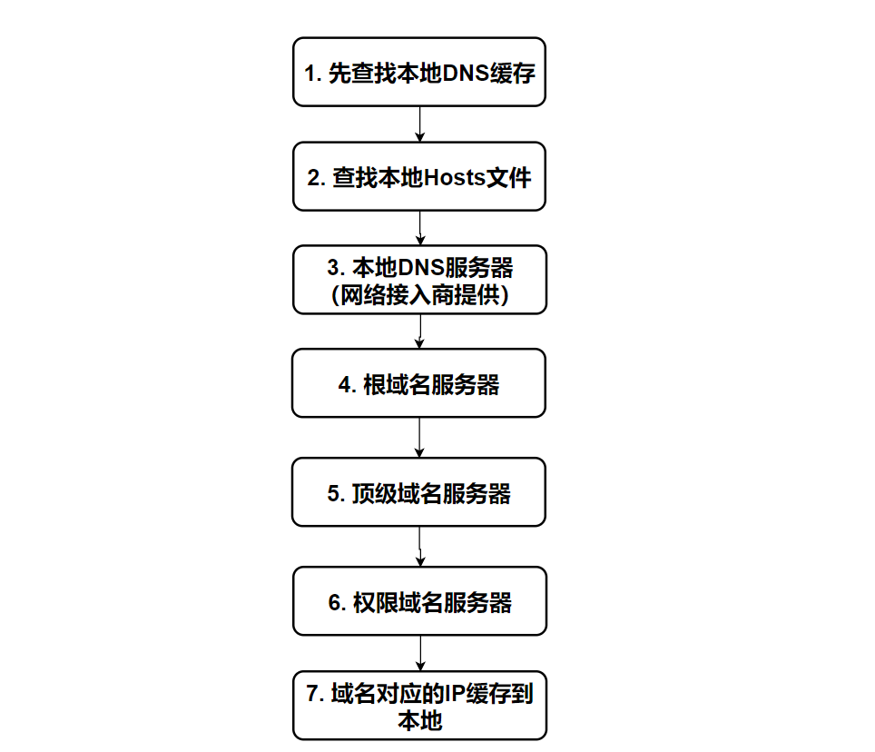
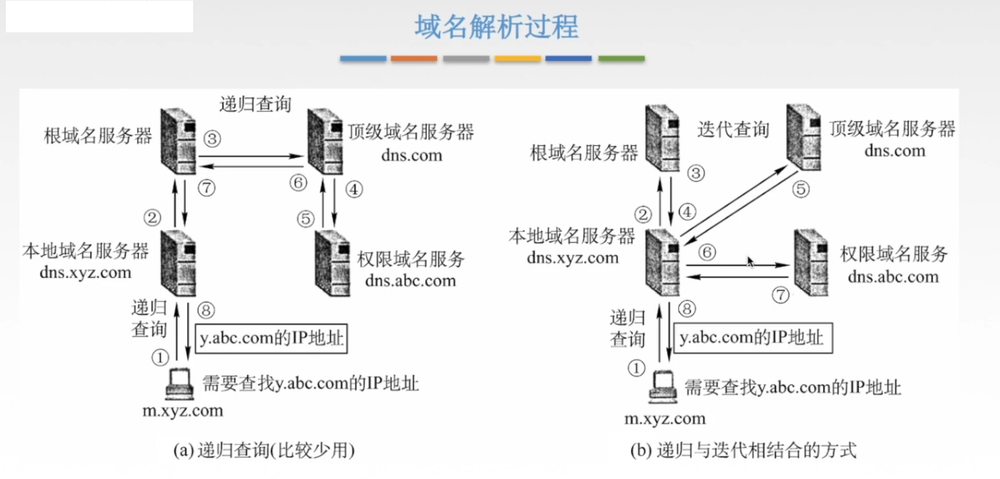

## 概念

**域名解析**：将域名解析为 IP 地址

DNS在进行域名解析时使用的是**UDP协议**，在区域传输时使用的是TCP

**【DNS服务器功能】**

1. 域名-映射-`IP`地址
2. 域名-映射-域名
3. 域名-映射-`URL`

-------------------------------------------------------------------

**本地域名服务器：**

当一个主机发出DNS査询请求时，首先会发给本地域名服务器，到本地缓存中查看该域名是否存在

**根域名服务器** ：确定顶级域名服务器的范围

**顶级域名服务器**：com、cn、net、org、edu等 

**权限域名的服务器**

## DNS域名解析过程

以访问 www.163.com 这个域名为例，来看一看当你访问 www.163.com 时，会发生哪些事：

1. 先查找本地浏览器的 DNS 缓存[chrome://net-internals/#dns]，有则返回，没有则进入下一步
2. 查看本地 **hosts **文件有没有相应的映射记录，有则返回，没有则进入下一步
3. 向本地 DNS 服务器（一般都是网络接入服务器商提供，比如中国电信，中国移动）发送请求进行查询，本地DNS服务器收到请求后，会先查下自己的缓存记录，如果查到了直接返回就结束了，如果没有查到，本地DNS服务器就会向 **DNS根域名服务器**发起查询请求
4. 根域名服务器收到请求后，发现是个` .com` 的域名，递归向下查找`.com`顶级域名服务器
7. `.com` 顶级域名服务器接收到请求后，看到这是 `163.com` 的域名，又向 `.163.com` 这个**权威域名服务器**发起请求
8. `163.com `**权威域名服务器**接收到请求后，确认了是自己管理的域名，马把 www.163.com 的ip告诉了 本地DNS服务器
9. 本地DNS服务器接收到回信后，将IP地址返回给本机，并做缓存，同时反馈给客户端

总结起来就是三句话：

1. 从"根域名服务器"查到"顶级域名服务器"的NS记录和A记录（IP地址）
2. 从"顶级域名服务器"查到"权限域名服务器"的NS记录和A记录（IP地址）
3. 从"权限域名服务器"查出"主机名"的IP地址

-----------------------

## 查询方式

**递归查询：** 一路查下去中间不返回，得到最终结果才返回信息（浏览器到本地DNS服务器的过程）

**迭代查询：** DNS服务器会向客户机提供-其他能查询请求的DNS服务器。当客户机发起查询请求时，DNS服务器并不是立即回复查询结果，而是告诉客户机能查询该域名的DNS服务器。客户机再重新向新的DNS服务器发起请求，**循环查询直到返回结果为止**

