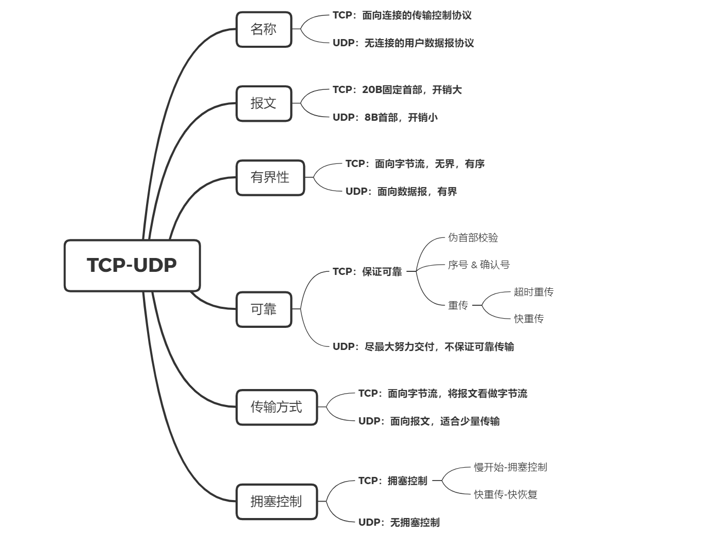
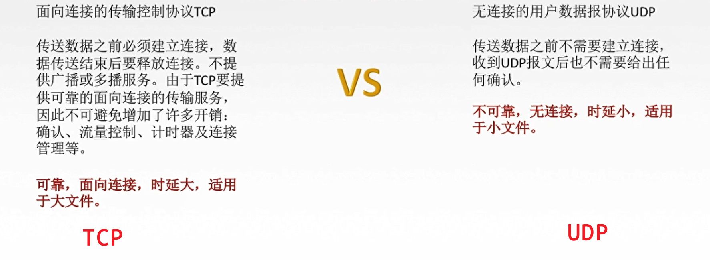
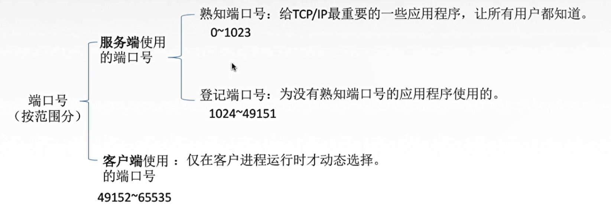

## 1. 传输层简介

**传输层功能：**

- **提供进程与进程之间的逻辑通信**

- 复用和分用服务

- 传输层对接收到的<u>报文</u>进行**差错检验**

> 传输层检查来自应用层的数据部分（即传输层的报文段），网络层检验IP数据报的首部，不用检查数据部分

 

## 2. TCP和UDP的区别

 

### TCP协议

**TCP协议：面向连接的传输控制协议**

- 传输数据前必须建立连接，数据传输结束后要释放连接

- 不提供广播或多播服务

- 可靠地面向连接传输服务机制：**确认应答、流量控制、计时器、连接管理**

**可靠，面向连接，时延大，适用于大文件**

### UDP协议

**UDP协议：无连接的用户数据报协议**

- 传输数据不需要建立连接

- 接收到UDP报文后不需要给出确认

**不可靠，无连接，时延小，适用于小文件**

## 3. 传输层的寻址与端口

**复用**：应用层所有的应用进程都可以通过传输层再传输到网络层

**分用**：传输层从网络层收到数据后交付<u>指明的应用进程</u>

**端口号**：是传输层的SAP（服务访问点），<u>标识主机中的应用进程</u>

**端口号只有本机意义，在因特网中不同计算机的相同端口是没有联系的**。
端口号长度为16bit，能表示2^16^ = 65536个不同的端口号。

> 我在**21**岁发现一个漂亮的姑凉，追了两年，**23**岁和她正式谈恋爱，两年之后**25**岁时分手互删好友。过了二十年我**53**岁想起她，给我的初恋打电话，我**80**岁暮年之时和她说还有再见一面！跟人的故事，类目！

**套接字Socket**：主机`IP`地址 + 端口号组合而成

**套接字唯一标识了网络中的一个主机和它上面的一个进程（端点）**

> 主机上一个具体的进程

### 点对点与端到端这两个概念

点到点是**主机到主机**之间的通信

端到端是**进程到进程**之zhi间的通信

同一台计算机同时可以和很多台计算机通信，使用IP对不同的计算机加以区分。（点到点

一台计算机上的一个程序（如qq）和很多其他计算机上的程序通信，需要使用IP+端口才能唯一的表示一个会话。如你用QQ同时和a、b、c三个用户通信，就是用三个用户连接的IP和端口号来区分的。

**端到端通信**

端到端通信是针对传输层来说的，它是一个网络连接，指的是在数据传输之前，在发送端与接收端之间（忽略中间有多少设备）为数据的传输建立一条链路，链路建立以后，发送端就可以发送数据，知道数据发送完毕，接收端确认接收成功。 也就是说在数据传输之前，先为数据的传输开辟一条通道，然后在进行传输。从发送端发出数据到接收端接收完毕。

**点到点通信**

点到点通信是针对数据链路层或网络层来说的，点对点是基于MAC地址和或者IP地址，是指一个设备发数据给与该这边直接连接的其他设备，这台设备又在合适的时候将数据传递给与它相连的下一个设备，通过一台一台直接相连的设备把数据传递到接收端。