## 概要

TCP 基本认识

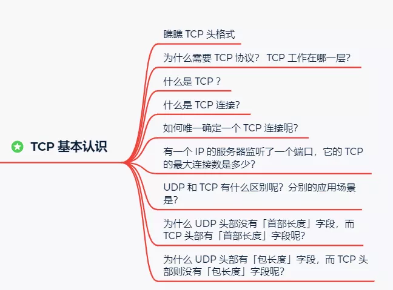

TCP 连接建立

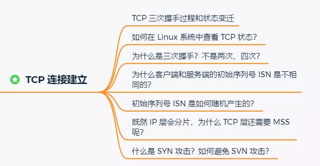

TCP 连接断开

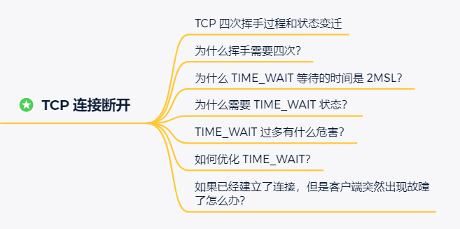

> [TCP-传输控制协议](https://zh.wikipedia.org/wiki/传输控制协议)

## 1. TCP协议的认识

> 什么是 TCP 连接？

我们来看看 RFC 793 是如何定义「连接」的：

*Connections:* 

*The reliability and flow control mechanisms described above require that TCPs initialize and maintain certain status information for each data stream.*  

*The combination of this information, including sockets, sequence numbers, and window sizes, is called a connection.*

简单来说就是，**用于保证可靠性和流量控制维护的某些状态信息，这些信息的组合，包括Socket、序列号和窗口大小称为连接。**

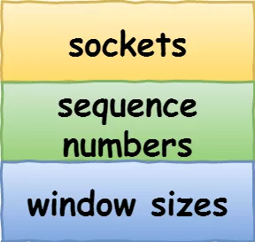

所以我们可以知道，建立一个 TCP 连接是需要客户端与服务器端达成上述三个信息的共识。

- **Socket**：由 IP 地址和端口号组成
- **序列号**：用来解决乱序问题等
- **窗口大小**：用来做流量控制

> 如何唯一确定一个 TCP 连接呢？

TCP 四元组可以唯一的确定一个连接，四元组包括如下：

- 源地址
- 源端口
- 目的地址
- 目的端口

TCP 四元组

源地址和目的地址的字段（32位）是在 IP 头部中，作用是通过 IP 协议发送报文给对方主机。

源端口和目的端口的字段（16位）是在 TCP 头部中，作用是告诉 TCP 协议应该把报文发给哪个进程。

 

## 2. TCP协议特点

1. **面向连接**（虚连接）
2. **点对点传输**。每一条TCP连接只能有两个端点，无法进行广播或多播
3. **可靠有序，不丢不重**。TCP提供可靠的交付服务。无差错，不丢失，不重复，按序到达
4. **全双工通信**
5. **面向字节流**

 

TCP 是**面向连接的、可靠的、基于字节流**的传输层通信协议。

- **面向连接**：一定是「一对一」才能连接，不能像 UDP 协议 可以一个主机同时向多个主机发送消息，也就是一对多是无法做到的；
- **可靠的**：无论的网络链路中出现了怎样的链路变化，TCP 都可以保证一个报文一定能够到达接收端；
- **字节流**：消息是「没有边界」的，所以无论我们消息有多大都可以进行传输。并且消息是「有序的」，当「前一个」消息没有收到的时候，即使它先收到了后面的字节已经收到，那么也不能扔给应用层去处理，同时对「重复」的报文会自动丢弃
- **全双工通信**：发送方和接收方可以同时发送数据，接收数据。协议两端都设有发送缓存，接收缓存

----------------------

## 3. TCP报文首部格式

`20B`的**固定首部** + 选项字段，**4B对齐**方式

【源端口】：发送方端口，`16位`

【目的端口】：接收方端口，`16位`

【序号】：<u>本报文段</u>所发送的数据-的第一个字节的序号

【确认号】：期望收到下一个报文段数据的第一个字节的序号

【数据偏移】：TCP首部长度，最大长度为(2^4^ - 1) * 4B = `60B`，固定首部`20B` + 可变头部`40B`。由于首部长度不固定，所以数据起始位置不固定

【<mark>六个控制位</mark>】

- 紧急位`URG`：<u>发送方紧急处理位</u>。`URG=1`表示此段报文有紧急数据，要立即发送出去，不用在缓存队列中排队，配合<u>紧急指针</u>**插队优先处理**

- 确认位`ACK`：`ACK=1`，确认号有效

- 推送位`PSH`：<u>接收方紧急处理位</u>。`PSH=1`时，接收方尽快向应用进程交付此段报文，不必等缓存队列填满

- 复位`RST`：`RST=1`时，表示TCP与主机的连接**出现严重差错**，必须释放连接再重新建立

- 同步位`SYN`：`SYN=1`，表明一个连接 **请求/连接**接收报文

- 终止位`FIN`：`FIN=1`，表明发送方数据已发完，要求释放连接

【窗口】：<u>接收方接收窗口的大小</u>，即现在允许发送方发送的数据量，根据接收方的窗口大小，设置发送方的发送缓存

【检验和】：**检验首部 + 数据**，检验时要加上`12B`伪首部「伪IP数据报首部」；第四个字段为协议字段，TCP为`6`，UDP为`17`

【紧急指针】：`URG=1`时才有意义，指出本报文段中紧急数据的位置

【选项】：最大报文段长度MSS、窗口扩大、时间戳、选择确认

【填充】：填充0保证4字节对齐

### 序号&确认号

**序号：**<u>本报文段</u>所发送的数据-的第一个字节的序号

**确认号**：确认上一次发送的成功收到。期望收到下一个报文段数据的第一个字节的序号

 

序号的初始值是在建立连接后，**随机生成的**

### URG&PSH

- 紧急位`URG`：<u>发送方紧急处理位</u>。`URG=1`表示此段报文有紧急数据，要立即发送出去，不用在缓存队列中排队，配合<u>紧急指针</u>**插队优先处理**

- 推送位`PSH`：<u>接收方紧急处理位</u>。`PSH=1`时，接收方尽快向应用进程交付此段报文，不必等缓存队列填满

## 4. TCP握手挥手中seq和ack的值

### 建立连接阶段

**seq-序号：seq是数据包本身的序号**

- **ack-确认号：ack是期望对方继续发送的那个数据包的序列号**

> [TCP三次握手机制中的seq和ack的值](https://www.jianshu.com/p/5dae584f795a)

seq是序列号，这是为了连接以后传送数据用的

ack是对收到的数据包的确认，值是等待接收的数据包的序列号

三次握手

**【握手阶段】**

1. 在第一次消息发送中，A随机选取一个序列号作为自己的初始序号发送给B；
2. 第二次消息B使用ack对A的数据包进行确认，因为已经收到了序列号为`x`的数据包，准备接收序列号为 `x+1` 的包，所以 `ack=x+1`，同时B告诉A自己的初始序列号，就是`seq=y`；<u>服务器端为该TCP连接分配缓存和变量</u>
3. 第三条消息A告诉B收到了B的确认消息并准备建立连接，A自己此条消息的序列号是`x+1`，所以 `seq=x+1`，而 `ack=y+1` 是表示A正准备接收B序列号为 `y+1` 的数据包；<u>客户端为该TCP连接分配缓存和变量</u>

### 断开连接阶段

四次挥手

**【挥手阶段】**

1. 现在，A主动发送请求`FIN=1`表示要断开连接了，A随机选取一个序列号作为自己的初始序号发送给B；
2. B使用ack对A的数据包进行确认，因为已经收到了序列号为`u`的数据包，准备接收序列号为 `u+1` 的包，所以 `ack=u+1`，同时B告诉A自己的初始序列号，就是`seq=v`；<u>客户到服务器这个方向的连接就成了一一半关闭状态</u>
3. 由于B可能还与他客户端同时在通信，不可能立即回复A。第三条消息B告诉A可以数据已传输完，我收到了你的请求`ACK=1`，现在可以断开连接了，即`FIN`。B自己此条消息的序列号是`w`，所以 `seq=w`，而 `ack`仍然为上一条的值`ack=u+1`，因为这段时间A处于半关闭状态，并没有在发送数据 。<u>服务端对A也处于半关闭状态</u>
4. 客户端A回送`ACK=1`，由于要断开连接不再发送数据了，`seq=u+1`（序号为上次B回复A的ack），`ack=w+1`。B收到后，客户端与服务器连接彻底关闭

### 初始序列号ISN的初始化

> 为什么客户端和服务端的初始序列号 ISN 是不相同的？

因为网络中的报文**会延迟、会复制重发、也有可能丢失**，这样会造成的不同连接之间产生互相影响，所以为了避免互相影响，客户端和服务端的初始序列号是随机且不同的。

ISN是不能硬编码的，不然会出问题的——比如：如果连接建好后始终用1来做ISN，如果client发了30个segment过去，但是网络断了，于是 client重连，又用了1做ISN，但是之前连接的那些包到了，于是就被当成了新连接的包，此时，client的Sequence Number 可能是3，而Server端认为client端的这个号是30了。全乱了。[RFC793](https://link.zhihu.com/?target=http%3A//tools.ietf.org/html/rfc793)中说，ISN会和一个假的时钟绑在一起，这个时钟会在每4微秒对ISN做加一操作，直到超过2^32，又从0开始。这样，一个ISN的周期大约是4.55个小时。因为，我们假设我们的TCP Segment在网络上的存活时间不会超过MSL（Maximum Segment Lifetime ），所以，只要MSL的值小于4.55小时，那么，我们就不会重用到ISN。

这样做可以防止ISN重用，另外出于安全考虑，也不应该对ISN硬编码。

## 5. 【三次握手即原因】

TCP 是面向连接的协议，所以使用 TCP 前必须先建立连接，而**建立连接是通过三次握手而进行的。**

TCP 三次握手

- 一开始，客户端和服务端都处于 `CLOSED` 状态。先是服务端主动监听某个端口，处于 `LISTEN` 状态

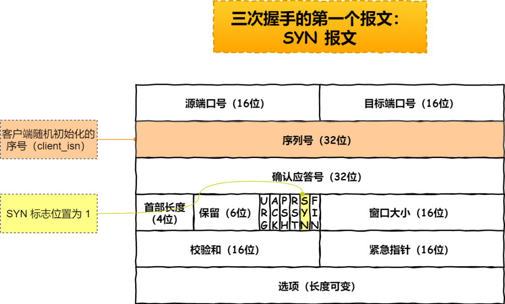

第一个报文—— SYN 报文

- 客户端会随机初始化序号（`client_isn`），将此序号置于 TCP 首部的「序号」字段中，同时把 `SYN` 标志位置为 `1` ，表示 `SYN` 报文。接着把第一个 SYN 报文发送给服务端，表示向服务端发起连接，该报文不包含应用层数据，之后客户端处于 `SYN-SENT` 状态。

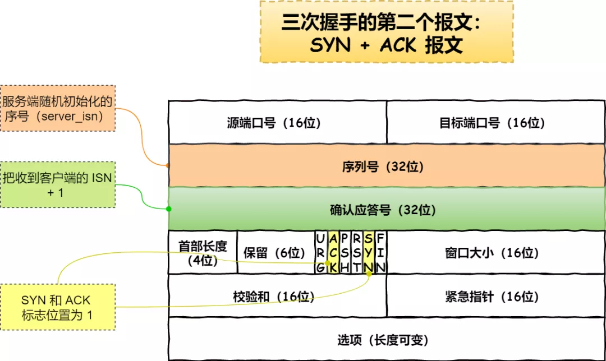

第二个报文 —— SYN + ACK 报文

- 服务端收到客户端的 `SYN` 报文后，首先服务端也随机初始化自己的序号（`server_isn`），将此序号填入 TCP 首部的「序号」字段中，其次把 TCP 首部的「确认应答号」字段填入 `client_isn + 1`, 接着把 `SYN` 和 `ACK` 标志位置为 `1`。最后把该报文发给客户端，该报文也不包含应用层数据，之后服务端处于 `SYN-RCVD` 状态。
- 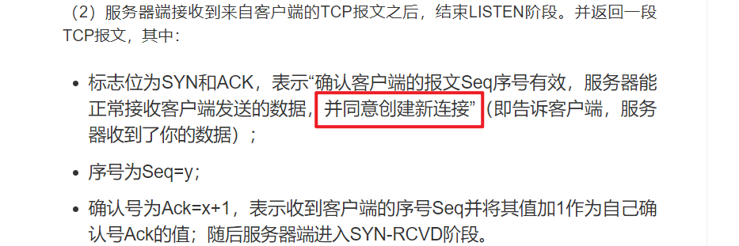

第三个报文 —— ACK 报文

- 客户端收到服务端报文后，还要向服务端回应最后一个应答报文，首先该应答报文 TCP 首部 `ACK` 标志位置为 `1` ，其次「确认应答号」字段填入 `server_isn + 1` ，最后把报文发送给服务端，这次报文可以携带客户到服务器的数据，之后客户端处于 `ESTABLISHED` 状态。
- 服务器收到客户端的应答报文后，也进入 `ESTABLISHED` 状态。

从上面的过程可以发现**第三次握手是可以携带数据的，前两次握手是不可以携带数据的**，这也是面试常问的题。

一旦完成三次握手，双方都处于 `ESTABLISHED` 状态，此致连接就已建立完成，客户端和服务端就可以相互发送数据了。

> 如何在 Linux 系统中查看 TCP 状态？

TCP 的连接状态查看，在 Linux 可以通过 `netstat -napt` 命令查看。

TCP 连接状态查看

### 为什么是三次

所以，重要的是**为什么三次握手才可以初始化Socket、序列号和窗口大小并建立 TCP 连接。**

以下原因：

- 三次握手才可以**阻止历史重复连接-的-初始化**（主要原因）
- 三次握手才可以**同步双方的初始序列号**
- 三次握手才可以**避免资源浪费**

#### 原因一：避免历史连接

我们来看看 RFC 793 指出的 TCP 连接使用三次握手的**首要原因**：

*The principle reason for the three-way handshake is to prevent old duplicate connection initiations from causing confusion.*

简单来说，三次握手的**首要原因是为了防止旧的重复连接初始化造成混乱。**

网络环境是错综复杂的，往往并不是如我们期望的一样，先发送的数据包，就先到达目标主机，反而它很骚，可能会由于网络拥堵等乱七八糟的原因，会使得旧的数据包，先到达目标主机，那么这种情况下 TCP 三次握手是如何避免的呢？

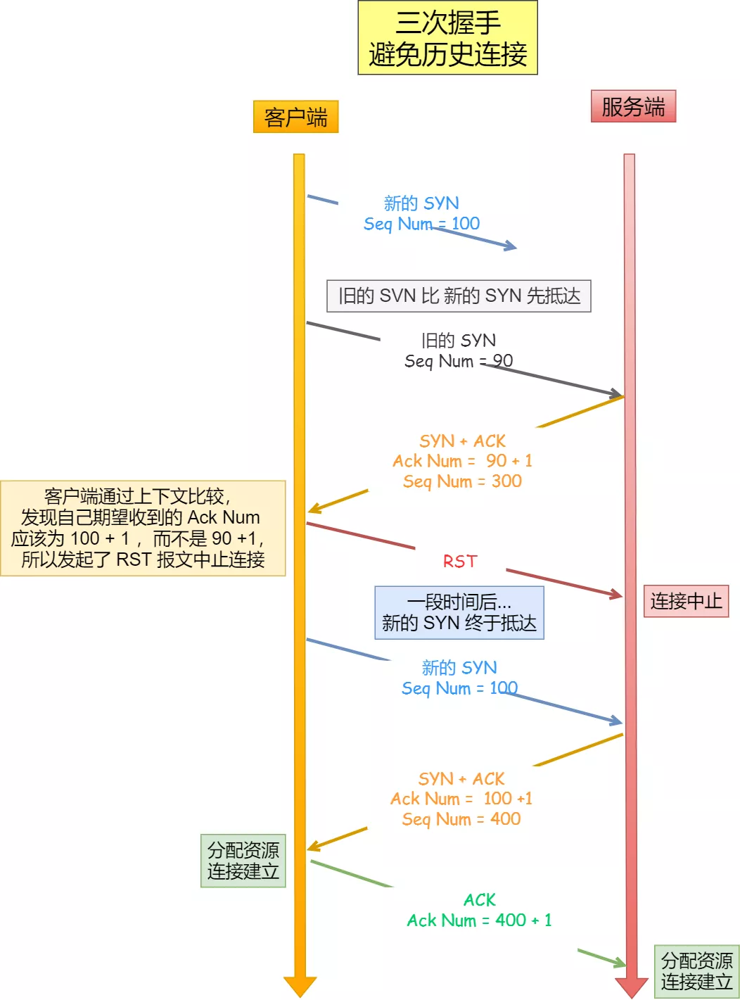

三次握手避免历史连接

客户端连续发送多次 SYN 建立连接的报文，在网络拥堵等情况下：

- 一个「旧 SYN 报文」比「最新的 SYN 」 报文早到达了服务端；
- 那么此时服务端就会回一个 `SYN + ACK` 报文给客户端；
- 客户端收到后可以根据自身的上下文，判断这是一个历史连接（序列号过期或超时），那么客户端就会发送 `RST` 报文给服务端，表示中止这一次连接。

如果是两次握手连接，就不能判断当前连接是否是历史连接，三次握手则可以在客户端（发送方）准备发送第三次报文时，客户端因有足够的上下文来判断当前连接是否是历史连接：

- 如果是历史连接（序列号过期或超时），则第三次握手发送的报文是 `RST` 报文，以此中止历史连接；
- 如果不是历史连接，则第三次发送的报文是 `ACK` 报文，通信双方就会成功建立连接；

所以， TCP 使用三次握手建立连接的最主要原因是**防止历史连接初始化了连接。**

#### 原因二：同步双方初始序列号

TCP 协议的通信双方， 都必须维护一个「序列号」， 序列号是可靠传输的一个关键因素，它的作用：

- 接收方可以去除重复的数据；
- 接收方可以根据数据包的序列号按序接收；
- 可以标识发送出去的数据包中， 哪些是已经被对方收到的；

可见，序列号在 TCP 连接中占据着非常重要的作用，所以当客户端发送携带「初始序列号」的 `SYN` 报文的时候，需要服务端回一个 `ACK` 应答报文，表示客户端的 SYN 报文已被服务端成功接收，那当服务端发送「初始序列号」给客户端的时候，依然也要得到客户端的应答回应，**这样一来一回，才能确保双方的初始序列号能被可靠的同步。**

**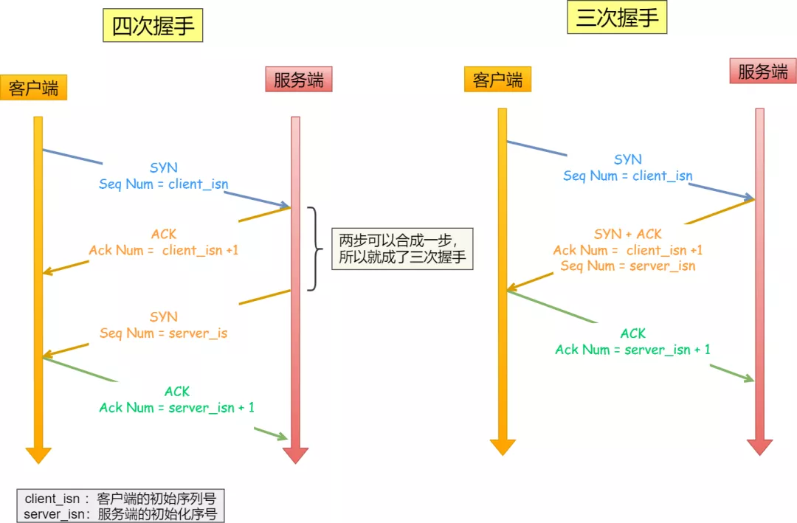**

四次握手与三次握手

四次握手其实也能够可靠的同步双方的初始化序号，但由于**第二步和第三步可以优化成一步**，所以就成了「三次握手」。

而两次握手只保证了一方的初始序列号能被对方成功接收，没办法保证双方的初始序列号都能被确认接收。

#### 原因三：避免资源浪费

如果只有「两次握手」，当客户端的 `SYN` 请求连接在网络中阻塞，客户端没有接收到 `ACK` 报文，就会重新发送 `SYN` ，由于没有第三次握手，服务器不清楚客户端是否收到了自己发送的建立连接的 `ACK` 确认信号，所以每收到一个 `SYN` 就只能先主动建立一个连接，这会造成什么情况呢？

如果客户端的 `SYN` 阻塞了，重复发送多次 `SYN` 报文，那么服务器在收到请求后就会**建立多个冗余的无效链接，造成不必要的资源浪费。**

**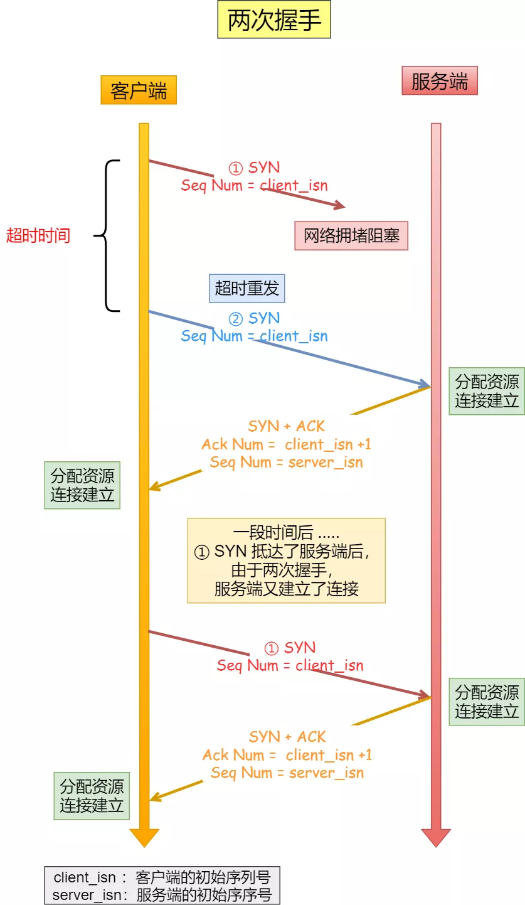**

两次握手会造成资源浪费

即两次握手会造成消息滞留情况下，服务器重复接受无用的连接请求 `SYN` 报文，而造成重复分配资源。

*小结*

TCP 建立连接时，通过三次握手**能防止历史连接的建立，能减少双方不必要的资源开销，能帮助双方同步初始化序列号**。序列号能够保证数据包不重复、不丢弃和按序传输。

不使用「两次握手」和「四次握手」的原因：

- 「两次握手」：无法防止历史连接的建立，会造成双方资源的浪费，也无法可靠的同步双方序列号；
- 「四次握手」：三次握手就已经理论上最少可靠连接建立，所以不需要使用更多的通信次数。

### 为什么不是两次

### 为什么不是四次

### SYN洪泛攻击

> https://zh.wikipedia.org/wiki/SYN_flood

TCP 连接建立是需要三次握手，假设攻击者短时间伪造不同 IP 地址的 `SYN` 报文，服务端每接收到一个 `SYN` 报文，就进入`SYN_RCVD` 状态，但服务端发送出去的 `ACK + SYN` 报文，无法得到未知 IP 主机的 `ACK` 应答，久而久之就会**占满服务端的 SYN 接收队列（未连接队列）**，消耗服务器资源，使得服务器不能为正常用户服务。

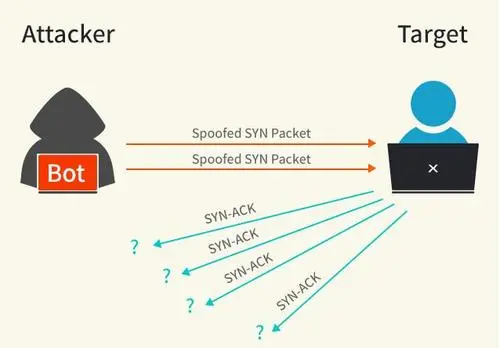

SYN 攻击

SYN Flood是当前最流行的[DoS](https://baike.baidu.com/item/DoS)（拒绝服务攻击）与[DDoS](https://baike.baidu.com/item/DDoS)（Distributed Denial Of Service[分布式拒绝服务攻击](https://baike.baidu.com/item/分布式拒绝服务攻击)）的方式之一。

**【解决方式】**

1. **缩短SYN Timeout时间**
2. **设置SYN Cookie**
3. **SYN flood可以用DCN防火墙来拦截**

<u>第一种是缩短SYN Timeout时间</u>

由于SYN Flood攻击的效果取决于服务器上保持的SYN半[连接数](https://baike.sogou.com/lemma/ShowInnerLink.htm?lemmaId=72259415&ss_c=ssc.citiao.link)，这个值=SYN攻击的频度 x SYN Timeout，所以通过缩短从接收到SYN报文到确定这个报文无效并丢弃该连接的时间，例如设置为20秒以下（过低的SYN Timeout设置可能会影响客户的正常访问），可以成倍的降低服务器的负荷。

<u>第二种方法是设置SYN Cookie</u>

就是给每一个请求连接的IP地址分配一个Cookie，如果短时间内连续受到某个IP的重复SYN报文，就认定是受到了攻击，以后从这个IP地址来的包会被丢弃。 

 可是上述的两种方法只能对付比较原始的SYN Flood攻击

<u>SYN flood可以用DCN防火墙来拦截</u>，在DCN防火墙受到攻击的时候会提示有IP试图连接你的端口等报警

## 6. 【四次挥手】

> https://baijiahao.baidu.com/s?id=1654225744653405133&wfr=spider&for=pc

客户端主动关闭连接 —— TCP 四次挥手

- 客户端打算关闭连接，此时会发送一个 TCP 首部 `FIN` 标志位被置为 `1` 的报文，也即 `FIN` 报文，之后客户端进入 `FIN_WAIT_1` 状态。
- 服务端收到该报文后，就向客户端发送 `ACK` 应答报文，接着服务端进入 `CLOSED_WAIT` 状态。
- 客户端收到服务端的 `ACK` 应答报文后，之后进入 `FIN_WAIT_2` 状态。
- 等待服务端处理完数据后，也向客户端发送 `FIN` 报文，之后服务端进入 `LAST_ACK` 状态。
- 客户端收到服务端的 `FIN` 报文后，回一个 `ACK` 应答报文，之后进入 `TIME_WAIT` 状态
- 服务器收到了 `ACK` 应答报文后，就进入了 `CLOSE` 状态，至此服务端已经完成连接的关闭。
- 客户端在经过 `2MSL` 一段时间后，自动进入 `CLOSE` 状态，至此客户端也完成连接的关闭。

你可以看到，每个方向都需要**一个 FIN 和一个 ACK**，因此通常被称为**四次挥手**。

这里一点需要注意是：**主动关闭连接的，才有 TIME_WAIT 状态。**

### 为什么是四次

再来回顾下四次挥手双方发 `FIN` 包的过程，就能理解为什么需要四次了。

- 关闭连接时，客户端向服务端发送 `FIN` 时，仅仅表示客户端不再发送数据了但是还能接收数据。
- 服务器收到客户端的 `FIN` 报文时，先回一个 `ACK` 应答报文，而服务端可能还有数据需要处理和发送，等服务端不再发送数据时，才发送 `FIN` 报文给客户端来表示同意现在关闭连接。

从上面过程可知，服务端通常需要等待完成数据的发送和处理，所以服务端的 `ACK` 和 `FIN` 一般都会分开发送，从而比三次握手导致多了一次。

### 为什么不是三次

**四次才能确保数据能够完成传输。**

关闭连接时，当服务器收到客户端的FIN报文通知时，它仅仅表示客户端没有数据发送给服务器了；但未必服务器所有的数据都全部发送给对方了

服务器不会关闭SOCKET，可能还需要发送一些数据给客户端之后，所以第二次只发送`ACK`确认报文，第三次再发送`FIN`报文给对方来表示同意现在可以关闭连接了

所以它`ACK`报文和`FIN`报文多数情况下都是分开发送的。

**挥手的时候为什么是分开的时候发送呢?**

因为当Server端收到Client端的SYN连接请求报文后，可以直接发送SYN+ACK报文。其中ACK报文是用来应答的，SYN报文是用来同步的。

但是关闭连接时，当Server端收到FIN报文时，很可能并不会立即关闭 SOCKET，所以只能先回复一个ACK报文，告诉Client端，"你发的FIN报文我收到了"。只有等到我Server端所有的报文都发送完了，我才能发送FIN报文，因此不能一起发送。

如果服务器段将ACK(第二次挥手)和FIN(第三次挥手)合并成一块发过去的话，这就意味着一方关闭，另一方也要被迫关闭，若此时有服务器继续**单向的发送片段**给客户端的需求则无法实现。

故需要四步**挥手**。

### 为什么 TIME_WAIT 等待的时间是 2MSL

`MSL` 是 Maximum Segment Lifetime，**报文最大生存时间**，它是任何报文在网络上存在的最长时间，超过这个时间报文将被丢弃。

Client发送完第四次消息后，并不知道Server是否接收到了这次的消息，因为是可靠传输，但是挥手只是4次，它需要默默等待Server接收到消息后才下线。（🤔PS：真实负责的好男人呀！）

如果报文丢失了或者Server接收到错误的报文：

- Server重复第三次挥手过程，让Client再重新发送一次

TIME_WAIT 等待 2 倍的 MSL，比较合理的解释是：

网络中可能存在来自发送方的数据包，当这些发送方的数据包被接收方处理后又会向对方发送响应，所以**一来一回需要等待 2 倍的时间**。

比如，如果被动关闭方没有收到断开连接的最后的 ACK 报文，就会触发超时重发 Fin 报文，另一方接收到 FIN 后，会重发 ACK 给被动关闭方， 一来一去正好 2 个 MSL。

`2MSL` 的时间是从**客户端接收到 FIN 后发送 ACK 开始计时的**。如果在 TIME-WAIT 时间内，因为客户端的 ACK 没有传输到服务端，客户端又接收到了服务端重发的 FIN 报文，那么 **2MSL 时间将重新计时**。

**等待2MSL是为了确认服务器能够收到第四次挥手消息**
