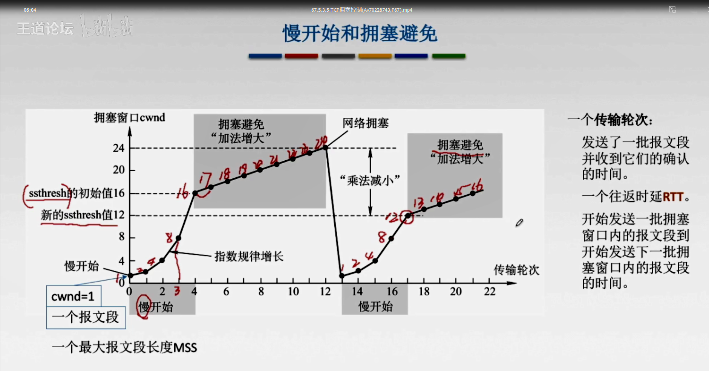
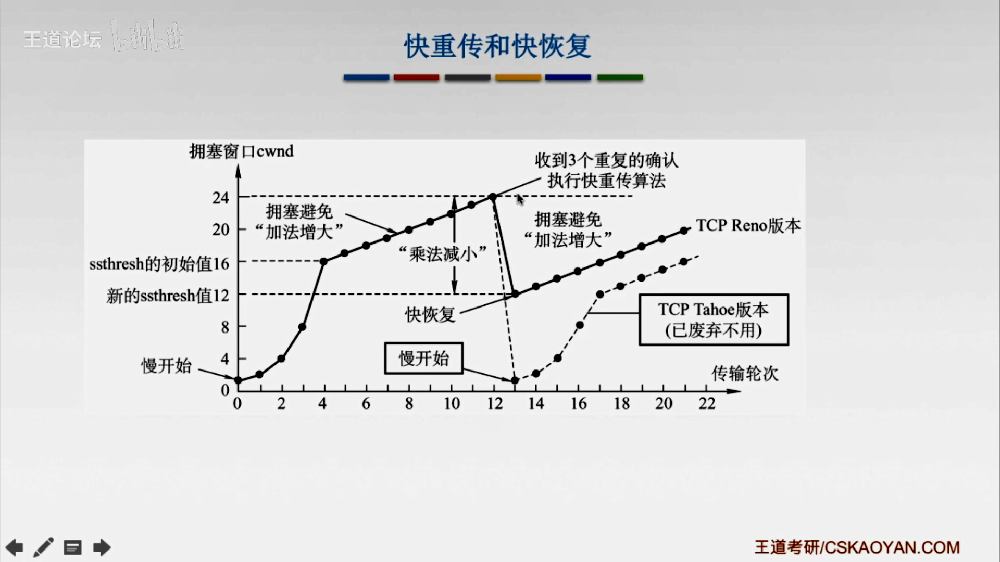
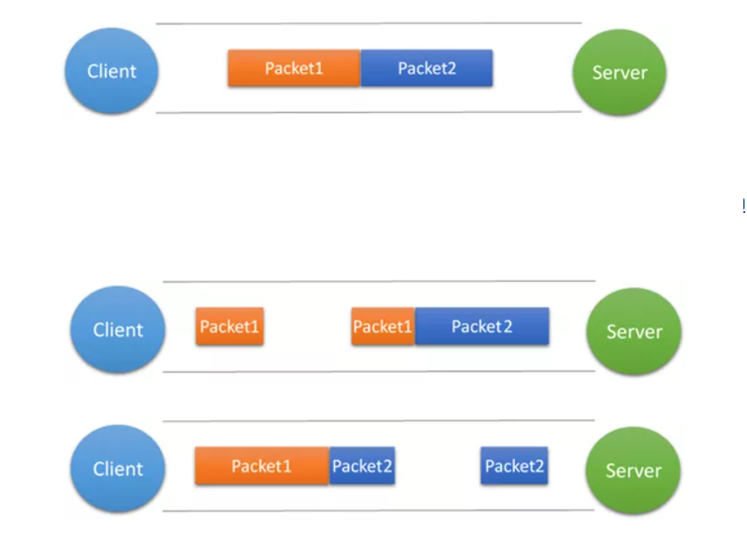

## 1. 可靠传输

**可靠：** 接收方进程从缓存区读出的字节流 与 发送方保持一致

 **TCP实现可靠传输的机制：**

**1. 伪首部二进制反码求和**

**2. 确认应答机制**

**3. 重传机制**

### 重传机制

#### 超时重传

 发送方在规定时间内，没有收到接收方的确认`ACK`，重传已发送的报文

重传机制的其中一个方式，就是在发送数据时，设定一个**定时器**，当超过指定的时间后，没有收到对方的 `ACK` 确认应答报文，就会重发该数据

TCP 会在以下两种情况发生超时重传：

- 数据包丢失
- 确认应答丢失

**重传时间**

 TCP采用**自适应算法**，动态改变重传时间RTTs（加权平均往返时间）

> `RTT`（Round-Trip Time 往返时延）

#### 快速重

**快速重传**：重传冗余确认，解决了超时时间的问题

快速重传的工作方式是当收到三个相同的 `ACK` 报文时，会在定时器过期之前，重传丢失的报文段。

快速重传机制

在上图，发送方发出了 1，2，3，4，5 份数据：

- 第一份 Seq1 先送到了，于是就 Ack 回 2；
- 结果 Seq2 因为某些原因没收到，Seq3 到达了，于是还是 Ack 回 2；
- 后面的 Seq4 和 Seq5 都到了，但还是 Ack 回 2，因为 Seq2 还是没有收到；
- **发送端收到了三个 Ack = 2 的确认，知道了 Seq2 还没有收到，就会在定时器过期之前，重传丢失的 Seq2**
- 最后，接收到收到了 Seq2，此时因为 Seq3，Seq4，Seq5 都收到了，于是 Ack 回 6 

 

## 2. 滑动窗口

较高的发送速度  与  较低的接收能力 不匹配，引入流量控制的窗口概念

**【接收窗口-rwnd】**： **接收方** 告知发送方自己的接收容量，反映接收方容量

**【拥塞窗口-cwnd】**： **发送方** 根据网络拥塞程度设置的窗口值，反映网络当前容量

发送窗口：`Min (rwnd ， cwnd)`

### 停等协议

**停等协议：发送方每发送一个数据帧，都要等待接收方确认之后，才会继续发送下一帧**

发送效率太低，为了提高信道利用率，一次发送多个帧，采用**流水线技术**

 **流水线技术对停等协议的改善**

1. 增加序号范围（为了标识具体哪一帧到达）
2. 发送方要缓存多个分组（帧丢失要重发）

**缓存多个分组的累计确认协议**

- GBN-后退N帧协议
- SR-选择重传协议

**发送窗口和接收窗口个数区别**

- 停等协议：`1`个发送窗口，`1`个接收窗口
- GBN-后退N帧：`n`个发送窗口，`1`个接收窗口
- SR-选择重传：`n`个发送窗口，`n`个接收窗口

### GBN-后退N帧协议

GBN定时器过期之后，发送方会重传未被确认的-最小序号之后的**所有**数据段

重传**已发未确认**之后的所有帧，浪费严重

### SR-选择重传协议

SR协议用的是窗口长度N来限制流水线中-未完成的、未被确认的分组，以接收确认的不会丢弃

-------------------

**重传**   对于丢失分组 `n`：

- 在GBN中，发送方会重传n及n以后的数据包；
- 在SR中，只会重传n

**缓存**   对于乱序达到的分组：

- 在GBN中，接受段端会直接丢弃；
- 在SR中，会把它们缓存下来

**定时器** 在GBN中一个连接只会设置`一个`定时器，在SR中会为每个分组设置定时器。

----------------------

## 3. 流量控制

**TCP 可以让「发送方」根据「接收方」的实际接收能力控制发送的数据量，这就是所谓的流量控制**

流量控制： 让**发送方**发慢点，使接收方来得及接收，避免丢包

流量控制实现的方式：**滑动窗口机制**

> TCP并不是停等协议。发送方连续发送若干报文段，接收方进行**累计确认**

### 潜在死锁

**接收方给发送方反馈的窗口数据丢失了，发送方则一直处于等待状态**

- 发送发：等待接收方的窗口信息反馈
- 接收方：等待发送方发送数据

TCP 是如何解决窗口关闭时，潜在的死锁现象呢？

TCP为每一个连接设置有**持续计数器**，计数器超时，发送**零窗口的探测报文**

若发送方没有收到  接收方  发来的窗口大小信息，为了避免双方都陷入死锁状况，会设置**持续计数器**

如果持续计时器超时，就会发送**窗口探测 ( Window probe ) 报文**

- 如果接收窗口仍然为 0，那么收到这个报文的一方就会重新启动持续计时器；
- 如果接收窗口不是 0，那么死锁的局面就可以被打破了

 

## 4. 拥塞控制

**出现拥塞的条件** ：

**拥塞控制** ： 防止过多的数据注入到网络中，协调网络中的主机的发送速率

### 拥塞控制和流量控制的区别

### 拥塞控制的四种算法

****

#### 慢开始—拥塞避免

- **慢开始**：开始以指数级增大拥塞窗口**cwnd**，收到了确认之后窗口大小翻倍（2、4、8、16）
- 到达**门限值ssthresh**后，执行**拥塞避免算法**，线性增大（16、17、18）
-  达到阈值`top`之后，检测出了`网络拥塞`；**拥塞窗口cwnd立即降为1，继续执行慢开始算法**
- 新的**门限值ssthresh**=`top / 2`

 

#### 快重传—快恢复

**收到3个重复的确认，执行快重传算法**

【快恢复】：发生了拥塞，不再降到初始值，而是从**新的门限值ssthresh**开始，执行**拥塞避免**算法

## 【粘包问题】

发送端为了将多个数据报高效的的发给接收端，于是采用了优化算法（**Nagle算法**），将多次间隔较小、数据量较小的数据，合并成一个数据量大的数据块，然后进行封包。那么这样一来，接收端就必须使用高效科学的拆包机制来分辨这些数据。

### Q1：什么是TCP粘包问题？

发送方发送的若干包数据到达接收方时粘成了一包。因为TCP是面向字节流的传输，将数据包看做一连串字节序列

从接收缓冲区来看，后一包数据的头紧接着前一包数据的尾，出现粘包的原因是多方面的，可能是来自发送方，也可能是来自接收方。

### Q2：造成TCP粘包的原因

**发送方原因**

TCP默认使用Nagle算法（主要作用：减少网络中报文段的数量），而Nagle算法主要做两件事：

1. 只有上一个分组得到确认，才会发送下一个分组
2. 收集多个小分组，在一个确认到来时一起发送

Nagle算法造成了发送方可能会出现粘包问题

**接收方原因**

TCP接收到数据包时，并不会马上交到应用层进行处理，或者说应用层并不会立即处理。

实际上，TCP将接收到的数据包保存在接收缓存里，然后应用程序主动从缓存读取收到的分组。这样一来，如果TCP接收数据包到缓存的速度**大于**应用程序从缓存中读取数据包的速度，多个包就会被缓存，应用程序就有可能读取到多个首尾相接粘到一起的包。

### Q3：什么时候需要处理粘包现象？

1. 如果发送的多组数据本来就是同一块数据的不同部分，比如说一个文件被分成多个部分发送，这时当然不需要处理粘包现象
2. 如果多个分组毫不相干，甚至是并列关系，那么这个时候就一定要处理粘包现象了

### Q4：如何处理粘包现象？

**（1）发送方**

对于发送方造成的粘包问题，可以通过关闭Nagle算法来解决，使用`TCP_NODELAY`选项来关闭算法。

**（2）接收方**

接收方没有办法来处理粘包现象，只能将问题交给应用层来处理。

【应用层】

1. **格式化数据**：每条数据有固定的格式（开始符，结束符），但是选择开始符和结束符时一定要确保每条数据的内部不包含开始符和结束符。
2. **发送长度**：发送每条数据时，将数据的长度一并发送，例如规定数据的前4位是数据的长度，应用层在处理时可以根据长度来判断每个分组的开始和结束位置。

### Q5：UDP会不会产生粘包问题呢？

TCP为了保证**可靠传输并减少额外的开销**（每次发包都要验证），采用了**面向字节流**的传输，将数据包看做**一连串的无结构的字节流**，是无保护消息边界

> 保护消息边界：传输协议把数据当做一条独立的消息在网上传输，接收端一次只能接受一条独立的消息

UDP则是面向消息传输的，是有保护消息边界的，接收方一次只接受一条独立的信息，所以不存在粘包问题。

举个例子：有三个数据包，大小分别为2k、4k、6k，如果采用UDP发送的话，不管接受方的接收缓存有多大，我们必须要进行至少三次以上的发送才能把数据包发送完，但是使用TCP协议发送的话，我们只需要接受方的接收缓存有12k的大小，就可以一次把这3个数据包全部发送完毕。